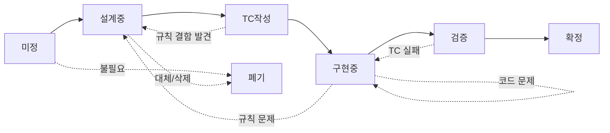

# ⚙️ 운영 규칙

> Chronicle 위키의 문서 작성 규칙, 버전 관리, 세션 운영 규칙.  
> **모든 기획 문서는 이 규칙을 따른다.**  
> 아트/UI 문서는 [05_UI/운영규칙_아트.md](../05_UI/운영규칙_아트.md)를 병행 참조.

---

## Part 1. 문서 작성 규칙

### 절대 규칙

| # | 규칙 |
|---|------|
| 1 | 줄글로 규칙을 설명하지 않는다. 모든 규칙은 구조화된 필드에 들어간다. |
| 2 | 시각 자료 없는 메카닉 문서는 **미완성**이다. |
| 3 | TC 없는 메카닉 문서는 **미완성**이다. |
| 4 | "미정"인 항목은 **왜 미정인지, 결정에 뭐가 필요한지**를 반드시 쓴다. |

### 메카닉 페이지 템플릿

모든 메카닉 페이지는 아래 구조를 따른다.

#### ① 한 줄 요약 `필수`

이 메카닉이 뭔지, 왜 존재하는지를 1~2문장으로. 이것만 읽어도 전체 맥락을 파악할 수 있어야 한다.

#### ② 규칙 정의 `필수`

| 필드 | 설명 |
|------|------|
| **조건** | 언제 발동하는가. 어떤 상태에서 사용 가능한가. |
| **대상** | 누가 / 무엇이 이 행동의 주체인가. |
| **행동** | 구체적으로 무엇이 일어나는가. |
| **결과** | 행동 후 게임 상태가 어떻게 변하는가. |
| **제한** | 횟수 제한, 불가 조건, 예외 사항. |
| **비용** | 이 행동의 대가. 없으면 "없음"으로 명시. |
| **우선순위** | 같은 타이밍에 다른 메카닉과 충돌 시 처리 순서. (해당 시) |

> 각 필드는 한 문장~두 문장. 줄글 금지. 필드에 안 들어가면 규칙이 불명확하다는 뜻.

#### ③ 시각 자료 `필수`

**기준: 이 메카닉을 처음 보는 사람이 5분 안에 흐름을 이해할 수 있어야 한다.**

- **상태 변화 다이어그램**: 입력 → 결과가 시각적으로 보여야 한다.
- **판정 플로우차트**: 조건 분기가 한 눈에 보여야 한다. (Mermaid 사용)
- 메카닉 유형에 따라 추가 시각 자료 가능.
- 비교 데이터(병종, 확률 등)는 테이블로 정리한다.

> Mermaid를 주력으로 쓴다. GitHub에서 바로 렌더링되고, 누구나 읽을 수 있다.

#### ④ 플레이어 피드백 (UI/UX) `필수`

- 성공 시: 플레이어가 뭘 보는가.
- 실패/거부 시: 왜 안 되는지 어떻게 알 수 있는가.

> 프로토 단계에서는 와이어프레임 수준. 완성도보다 정보 전달이 중요.

#### ⑤ 테스트 케이스 `필수`

각 메카닉 페이지에는 TC 요약만 포함. 상세 TC는 [06_TC/](../06_TC/)에서 통합 관리.

> TC 링크 형식: `→ 상세: [06_TC/전투_TC.md#CONV-001](../06_TC/전투_TC.md#conv-001)`

#### ⑥ 설계 근거 `필수`

"왜 이 값인가? 왜 이렇게 작동하는가?" — Q&A 형식.  
시뮬 데이터가 있으면 참조 명시.  
폐기된 대안도 여기에 기록한다.

#### ⑦ 의존성 `해당 시`

- `← NEEDS`: 이 메카닉이 참조하는 다른 문서
- `→ AFFECTS`: 이 메카닉이 영향을 주는 다른 문서
- `↔ RELATED`: 상호 참조 관계

위키 내 상대 링크로 연결.

#### ⑧ 미확정 사항 `해당 시`

미확정 항목을 명시한다. 각 항목에 **현재 상태**와 **결정에 필요한 것**을 적는다.

#### ⑨ 변경 이력 `필수`

| 버전 | 날짜 | 변경 내용 | 사유 |
|------|------|-----------|------|
| 1.0 | 2026-02-23 | 최초 작성 | — |

---

## Part 2. 버전 관리 규칙

### 상태 흐름

### 각 상태의 정의

| 상태 | 의미 | 전이 조건 |
|------|------|-----------|
| **미정** | 존재는 알지만 내용이 결정되지 않음 | 왜 미정인지, 결정에 뭐가 필요한지 명시 |
| **설계중** | 규칙을 논의/작성 중 | 핵심 규칙 정의 + 시각 자료 + 피드백 목업 완성. 남은 미확정이 TC 작성을 막지 않을 것. |
| **TC작성** | 규칙 확정. TC를 작성하여 엣지 케이스 검증 중 | TC 테이블 완성. OPEN 항목 없음 |
| **구현중** | Claude Code에서 코드로 구현 중 | 기획서 확정 항목만 구현. 임의 해석 금지 |
| **검증** | 구현 완료. TC 실행하여 통과 여부 확인 중 | 모든 TC PASS |
| **확정** | 규칙 + TC + 구현 + 검증 모두 완료 | 이후 변경 시 새 버전 발행 |
| **폐기** | 시스템이 삭제되었거나 다른 시스템으로 대체됨 | DOCS/ARCHIVE/로 이동. 폐기 사유 기록. |

### 역행 규칙

- 상태는 역행할 수 있다. TC 작성 중 규칙 결함 발견 → "설계중"으로 복귀.
- 역행 시 **변경 이력에 반드시 사유를 기록**한다.

### "확정" 이후 변경

- 확정된 메카닉을 변경하면 버전을 올린다 (1.0 → 1.1).
- 규칙의 근본이 바뀌면 메이저 버전을 올린다 (1.x → 2.0).
- 변경된 메카닉은 "설계중"으로 복귀. 관련 TC도 재검증 대상.

### 버전 넘버링

| 유형 | 기준 | 예시 |
|------|------|------|
| **Major (x.0)** | 규칙의 근본 변경. 기존 TC 대부분 재작성 필요. | 보병 전환이 무료 → 유료로 변경 |
| **Minor (1.x)** | 세부 조건 추가/수정. 기존 TC에 추가만 필요. | 전투 중 전환 불가 조건 추가 |

---

## Part 3. 세션 운영 규칙

### 세션 시작 프로토콜

모든 Claude 세션은 다음으로 시작한다:

1. **오늘 작업할 메카닉의 위키 페이지를 Claude에게 공유** (또는 Claude가 직접 읽음)
2. **현재 상태와 미결 사항을 확인**
3. **이번 세션의 목표를 명시**

> 이것만으로 맥락 유실 문제의 대부분이 해결된다.

### 세션 유형

| 유형 | 도구 | 산출물 |
|------|------|--------|
| **설계 세션** | Claude (claude.ai) | 규칙 확정 + 시각 자료 + TC → 위키에 커밋 |
| **구현 세션** | Claude Code | 코드 구현 + TC 자동화 → game 레포에 커밋 |
| **리뷰 세션** | 혼자 | 위키 읽기 → 의문점/안건 메모 → 다음 세션 준비 |

### 위키 갱신 규칙

- 설계 세션 결과는 **해당 세션 내에서 위키에 커밋**한다.
- 커밋 메시지 형식: `[카테고리] 내용 (상태)`
  - 예: `[전투/행동] 보병 전환 규칙 정의 완료 (설계중→TC작성)`
  - 예: `[코어] 코어 루프 비용 구조 초안 (미정→설계중)`

---

*문서 버전: 2.0 · 2026-02-27 · 템플릿 9단 확정(⑧미확정 추가), 시각 자료 기준 강화, 폐기 상태 추가*
