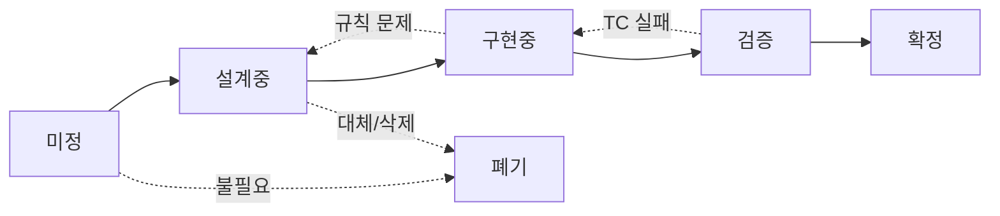

# ⚙️ 운영 규칙

> Chronicle 위키의 문서 작성 규칙, 버전 관리, 세션 운영 규칙.  
> **모든 기획 문서는 이 규칙을 따른다.**  
> 아트/UI 문서는 [05_UI/운영규칙_아트.md](../05_UI/운영규칙_아트.md)를 병행 참조.

---

## Part 1. 문서 작성 규칙

### 절대 규칙

| # | 규칙 |
|---|------|
| 1 | 줄글로 규칙을 설명하지 않는다. 모든 규칙은 구조화된 필드에 들어간다. |
| 2 | 시각 자료는 규칙 이해에 필요한 경우에 포함한다. 기획 단계에서는 선택, 구현 직전에는 필수. |
| 3 | TC는 기획 단계에서 작성하지 않는다. 구현 직전에 작성하며 06_TC/에서 별도 관리. |
| 4 | "미정"인 항목은 **왜 미정인지, 결정에 뭐가 필요한지**를 반드시 쓴다. |
| 5 | 내용이 없는 섹션은 생략한다. 빈 스텁을 만들지 않는다. |

### 메카닉 페이지 템플릿

모든 메카닉 페이지는 아래 구조를 따른다. **문서는 2단계로 작성한다.**

- **기획 단계 (설계중):** 필수 섹션만 작성. 빠르게 결정하고 넘긴다.
- **구현 직전 (설계중 → 구현중 전이 시):** 나머지 섹션을 채운다.

> **전환 기준:** 문서 상태가 "설계중 → 구현중"으로 바뀔 때 생략된 섹션을 채운다.

| 섹션 | 기획 단계 | 구현 직전 | 비고 |
|------|----------|----------|------|
| ① 한 줄 요약 | 필수 | 필수 | |
| ② 규칙 정의 | 필수 | 필수 | |
| ③ 시각 자료 | 선택 | 필수 | |
| ④ 플레이어 피드백 | 씬 스펙만 필수 | 필수 | 메카닉 문서는 기획 단계에서 생략 가능 |
| ⑤ TC | 생략 | 필수 | |
| ⑥ 설계 근거 | 필수 | 필수 | |
| ⑦ 의존성 | 필수 (ID만) | 필수 (설명 포함) | 기획 단계에서는 ID 나열만. 설명 생략 |
| ⑧ 미확정 | 필수 | 필수 | |
| ⑨ 변경 이력 | 생략 | 필수 | 기획 단계에서는 git log로 대체 |

#### ① 한 줄 요약 `기획 필수`

이 메카닉이 뭔지, 왜 존재하는지를 1~2문장으로. 이것만 읽어도 전체 맥락을 파악할 수 있어야 한다.

#### ② 규칙 정의 `기획 필수`

| 필드 | 설명 |
|------|------|
| **조건** | 언제 발동하는가. 어떤 상태에서 사용 가능한가. |
| **대상** | 누가 / 무엇이 이 행동의 주체인가. |
| **행동** | 구체적으로 무엇이 일어나는가. |
| **결과** | 행동 후 게임 상태가 어떻게 변하는가. |
| **제한** | 횟수 제한, 불가 조건, 예외 사항. |
| **비용** | 이 행동의 대가. 없으면 "없음"으로 명시. |
| **우선순위** | 같은 타이밍에 다른 메카닉과 충돌 시 처리 순서. (해당 시) |

> 각 필드는 한 문장~두 문장. 줄글 금지. 필드에 안 들어가면 규칙이 불명확하다는 뜻.

#### ③ 시각 자료 `기획 선택 · 구현 필수`

**기준: 이 메카닉을 처음 보는 사람이 5분 안에 흐름을 이해할 수 있어야 한다.**

- 기획 단계에서는 있으면 좋고 없어도 된다.
- 구현 직전에는 반드시 포함한다.

- **상태 변화 다이어그램**: 입력 → 결과가 시각적으로 보여야 한다.
- **판정 플로우차트**: 조건 분기가 한 눈에 보여야 한다. (Mermaid 사용)
- 메카닉 유형에 따라 추가 시각 자료 가능.
- 비교 데이터(병종, 확률 등)는 테이블로 정리한다.

> Mermaid를 주력으로 쓴다. GitHub에서 바로 렌더링되고, 누구나 읽을 수 있다.

#### ④ 플레이어 피드백 (UI/UX) `씬 스펙: 기획 필수 · 메카닉: 구현 필수`

- 씬 스펙 문서(로비, 편성, 스테이지씬, 전투씬)에서는 "플레이어가 뭘 보는가"가 규칙 자체이므로 기획 단계부터 필수.
- 순수 메카닉 문서(전투구조, 다이스규칙 등)에서는 구현 직전에 채운다.

#### ⑤ 테스트 케이스 `기획 생략 · 구현 필수`

기획 단계에서는 작성하지 않는다. 구현 직전에 채운다.

#### ⑥ 설계 근거 `기획 필수`

"왜 이 값인가? 왜 이렇게 작동하는가?" — Q&A 형식.  
시뮬 데이터가 있으면 참조 명시.  
폐기된 대안도 여기에 기록한다.

#### ⑦ 의존성 `기획 필수 (ID만) · 구현 필수 (설명 포함)`

- 기획 단계: `← NEEDS`, `→ AFFECTS` ID만 나열. 설명 생략.
- 구현 직전: 각 의존성에 구체적 설명 추가.

#### ⑧ 미확정 사항 `기획 필수`

미확정 항목을 명시한다. 각 항목에 **현재 상태**와 **결정에 필요한 것**을 적는다.

#### ⑨ 변경 이력 `기획 생략 · 구현 필수`

기획 단계에서는 git log로 대체한다. 구현 직전에 문서 내 변경 이력을 작성한다.

| 버전 | 날짜 | 변경 내용 | 사유 |
|------|------|-----------|------|
| 1.0 | 2026-02-23 | 최초 작성 | — |

---

## Part 2. 버전 관리 규칙

### 상태 흐름

### 각 상태의 정의

| 상태 | 의미 | 전이 조건 |
|------|------|-----------|
| **미정** | 존재는 알지만 내용이 결정되지 않음 | 왜 미정인지, 결정에 뭐가 필요한지 명시 |
| **설계중** | 규칙을 논의/작성 중 | 핵심 규칙 정의 완성. 구현에 필요한 정보가 충분할 것. |
| **구현중** | Claude Code에서 코드로 구현 중 | 기획서 확정 항목만 구현. 임의 해석 금지 |
| **검증** | 구현 완료. TC 실행하여 통과 여부 확인 중 | 모든 TC PASS |
| **확정** | 규칙 + 구현 + 검증 모두 완료 | 이후 변경 시 새 버전 발행 |
| **폐기** | 시스템이 삭제되었거나 다른 시스템으로 대체됨 | DOCS/ARCHIVE/로 이동. 폐기 사유 기록. |

### 역행 규칙

- 상태는 역행할 수 있다. TC 작성 중 규칙 결함 발견 → "설계중"으로 복귀.
- 역행 시 **변경 이력에 반드시 사유를 기록**한다.

### "확정" 이후 변경

- 확정된 메카닉을 변경하면 버전을 올린다 (1.0 → 1.1).
- 규칙의 근본이 바뀌면 메이저 버전을 올린다 (1.x → 2.0).
- 변경된 메카닉은 "설계중"으로 복귀. 관련 TC도 재검증 대상.

### 버전 넘버링

| 유형 | 기준 | 예시 |
|------|------|------|
| **Major (x.0)** | 규칙의 근본 변경. 기존 TC 대부분 재작성 필요. | 보병 전환이 무료 → 유료로 변경 |
| **Minor (1.x)** | 세부 조건 추가/수정. 기존 TC에 추가만 필요. | 전투 중 전환 불가 조건 추가 |

---

## Part 3. 세션 운영 규칙

### 세션 시작 프로토콜

모든 Claude 세션은 다음으로 시작한다:

1. **CLAUDE.md를 읽고 절대 규칙을 숙지한다.**
2. **오늘 작업할 메카닉의 위키 페이지를 읽는다.** (기억에 의존하지 않는다)
3. **현재 상태와 미결 사항을 확인한다.**
4. **이번 세션의 목표와 유형(기획/문서화/구현)을 명시한다.**

### 세션 유형

| 유형 | 도구 | 산출물 |
|------|------|--------|
| **기획 세션** | Claude (claude.ai) | 결정 사항 정리, 목업, 진단. **커밋 안 함.** |
| **문서화 세션** | Claude (claude.ai) | 기획 세션 결정 → 위키 반영 + 커밋 |
| **구현 세션** | Claude Code | 코드 구현 + TC 자동화 → game 레포에 커밋 |
| **리뷰 세션** | 혼자 | 위키 읽기 → 의문점/안건 메모 → 다음 세션 준비 |

> **기획 세션과 문서화 세션을 분리한다.** 기획 흐름 중에 커밋/정합성/README 갱신으로 끊기지 않기 위함.

### 위키 갱신 규칙

- 기획 세션에서는 커밋하지 않는다. 결정만 한다.
- 문서화 세션에서 기획 결정을 위키에 일괄 반영하고 커밋한다.
- 커밋 메시지 형식: `[카테고리] 내용 (상태)`
  - 예: `[전투/행동] 리롤 규칙 정의 완료`
  - 예: `[코어] 코어 루프 비용 구조 초안 (미정→설계중)`

---

*문서 버전: 3.0 · 2026-02-28 · 2단계 문서 체계(기획/구현 분리), 기획·문서화 세션 분리, 절대규칙 ⑤번 갱신*
