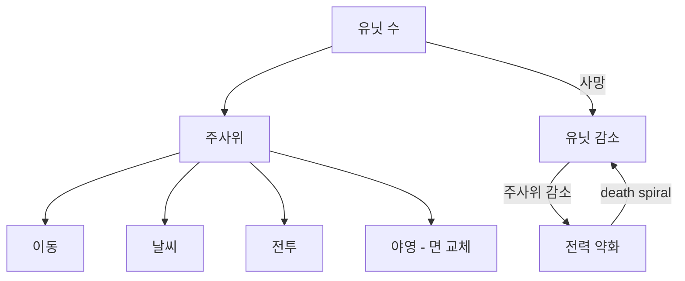

# CORE-002: 코어 루프 (Core Loop)

> **상태:** 🔄 설계중 · **버전:** 0.1 · **ID:** CORE-002 · **수정일:** 2026-02-25

---

## ① 한 줄 요약

브리핑에서 정보를 읽고, 스테이지에서 판단하고, 야영에서 대가를 관리한다. 주사위가 게임 문법 — 이동, 날씨, 전투, 야영 전부 주사위로 통일. 유닛 사망 = 주사위 감소 = 전력 약화.

---

## ② 규칙 정의

### 런(Run) 구조

| 필드 | 내용 |
|------|------|
| **1런** | 복수 스테이지의 연속. 스테이지 사이에 야영 |
| **1스테이지** | 3일 = 6턴. 낮/밤 교대 |
| **런 종료** | 최종 스테이지 클리어(승리) 또는 테오도라 사망(게임 오버) |

### 스테이지 흐름

| 단계 | 이름 | 플레이어 행동 | 산출물 |
|------|------|-------------|--------|
| ❶ | 브리핑 | 읽기 (판단 재료 수집) | 적 예상 배치, 날씨, 지형 정보 |
| ❷ | 스테이지 본체 | 6턴 동안 행군+전투 | 생존 유닛, 전투 결과, 서사 분기 |
| ❸ | 야영 | 택 1 선택 | 면 교체 / 부상 회복 / 병종 추가 |

### 턴 구조 (1턴 = 낮 또는 밤)

| 순서 | 행동 | 자동/수동 | 상세 |
|------|------|----------|------|
| 1 | 이동 주사위 굴림 | 자동 | 유닛 수만큼 주사위. 이동력 결정 |
| 2 | 경로 선택 | **수동** | 이동 가능 경로 중 택 1 |
| 3 | 시야/신호 확인 | 자동 | 시야 내 적 표시, 안개 밖 소리 단서 |
| 4 | 전투 진입 or 회피 판단 | **수동** | 적 발견 시: 싸울 것인가, 우회할 것인가 |
| 5 | 전투 페이즈 | 혼합 | → [COMBAT-STRUCT-001](../../02_전투/구조/전투구조.md) |
| 6 | AI 부대 이동/행동 | 자동 | 적 + NPC 정규군 이동 처리 |

### 낮/밤 규칙

| 항목 | 낮 (홀수 턴) | 밤 (짝수 턴) |
|------|-------------|-------------|
| **시야** | 기본 시야 | 시야 축소 |
| **적 주사위** | 보임 | 안 보임 ("?" 처리) |
| **선제 페이즈** | 정상 (궁병 교전) | 스킵 |
| **행군 정보** | 지형+적 위치 보임 | 소리 단서만 |

### 날씨

| 필드 | 내용 |
|------|------|
| **결정** | 매일(2턴) 시작 시 날씨 주사위 |
| **효과** | 시야, 이동력, 전투 조건에 영향 |
| **브리핑** | 3일치 날씨 예보 제공 (정확도 미확정) |

> 날씨 상세 규칙은 [03_스테이지/날씨.md](../../03_스테이지/날씨.md) 참조.

### 야영 (스테이지 간)

| 필드 | 내용 |
|------|------|
| **조건** | 스테이지 종료 후, 다음 스테이지 시작 전 |
| **행동** | 3가지 중 택 1 |
| **선택지** | ① 면 교체 도박 · ② 부상 회복 · ③ 병종 추가 |
| **제한** | 1회만 선택 가능. 되돌리기 불가 |

| 선택지 | 효과 | 리스크 |
|--------|------|--------|
| **면 교체 도박** | 유닛 1개의 다이스 면 재구성 | 더 나빠질 수 있음 (도박) |
| **부상 회복** | 부상(✕) 면 복구 | 없음 (안전하지만 기회비용) |
| **병종 추가** | 새 유닛 영입 (징집) | 약한 유닛이 올 수 있음 |

---

## ③ 시각 자료

### 런 전체 흐름

```
 ┌─────────┐    ┌─────────┐    ┌─────────┐
 │ 브리핑 1  │───→│ 스테이지1 │───→│  야영 1  │
 └─────────┘    │ (3일/6턴) │    │ (택 1)   │
                └─────────┘    └────┬────┘
                                     │
 ┌─────────┐    ┌─────────┐    ┌────▼────┐
 │ 브리핑 2  │───→│ 스테이지2 │───→│  야영 2  │
 └─────────┘    │ (3일/6턴) │    │ (택 1)   │
                └─────────┘    └────┬────┘
                                     │
                                    ...
                                     │
 ┌─────────┐    ┌─────────┐         │
 │ 브리핑 N  │───→│ 최종전투  │◀────────┘
 └─────────┘    └─────────┘
```

### 1스테이지 내부 구조 (3일 = 6턴)

```
Day 1
├── 턴 1 (낮)
│   ① 이동 주사위 → ② 경로 선택 → ③ 시야 확인
│   → ④ 전투 진입? → ⑤ 전투 페이즈 → ⑥ AI 이동
│
├── 턴 2 (밤)
│   ① 이동 주사위 → ② 경로 선택 → ③ 소리 단서만
│   → ④ 회피? (정보 부족) → ⑤ 전투 (적 "?") → ⑥ AI 이동
│
Day 2
├── 턴 3 (낮) ...
├── 턴 4 (밤) ...
│
Day 3
├── 턴 5 (낮) ...
└── 턴 6 (밤) ...

날씨: Day 시작 시 주사위. 2턴 동안 유지.
```

### 판단 포인트 맵 — 1턴 기준

```
┌────────────────────────────────────────────────────┐
│  맵 단계 (전투 밖)                                    │
│                                                      │
│  [판단 A] 경로 선택: 어디로 갈 것인가?                  │
│           └─ 지형, 시야 정보, 적 예상 위치 고려          │
│                                                      │
│  [판단 B] 전투 진입: 싸울 것인가, 우회할 것인가?         │
│           └─ 유닛 상태, 적 규모, 낮/밤, 지형 고려        │
│           └─ 진입하면 철수 없음                         │
│                                                      │
├────────────────────────────────────────────────────┤
│  전투 단계 (진입 시)                                   │
│                                                      │
│  [판단 C] 카드 — 어디에 쓸 것인가?                      │
│  [판단 D] 리롤 — 내 주사위? 적 주사위?                  │
│  [판단 E] 지형 전환 — 어떤 ✕를?                        │
│  [판단 F] 유닛 전환 — 보병 ⚔→🛡? 창병 🛡→⚔?            │
│                                                      │
│  → 상세: COMBAT-STRUCT-001                            │
├────────────────────────────────────────────────────┤
│  야영 단계 (스테이지 종료 후)                            │
│                                                      │
│  [판단 G] 야영 선택: 도박 / 회복 / 영입?                │
│           └─ 현재 부대 상태에 따라 최적해가 다름          │
└────────────────────────────────────────────────────┘
```

### 주사위 통일 원칙



---

## ④ 플레이어 피드백 (UI/UX)

| 상황 | 피드백 |
|------|--------|
| **브리핑** | 전장 지도 + 적 정보 + 날씨 예보. 스크롤 가능. "출발" 버튼으로 스테이지 시작 |
| **턴 시작** | 낮/밤 표시 + 날씨 표시 + 이동 주사위 결과 |
| **경로 선택** | 이동 가능 경로 하이라이트. 탭하여 선택 |
| **적 발견** | 시야 안: 적 유닛 표시. 안개 밖: 소리 아이콘 (방향+강도) |
| **전투 진입 확인** | "전투에 진입합니다. 철수 불가." 확인 다이얼로그 |
| **야영** | 3개 선택지 카드 표시. 각 카드에 효과/리스크 명시 |

---

## ⑤ 테스트 케이스

> TC 미작성. 코어 루프 확정 후 [06_TC/](../../06_TC/)에서 통합 관리 예정.

예상 TC 항목:
- 6턴 스테이지 낮/밤 교대 정상 동작
- 날씨 주사위가 Day 단위로 굴려지는지
- 전투 진입 후 철수 불가 확인
- 야영 택 1 제한 확인
- 유닛 사망 → 다음 스테이지 주사위 수 감소 확인
- 테오도라 사망 → 게임 오버 트리거

---

## ⑥ 설계 근거

| 질문 | 답변 | 분류 |
|------|------|------|
| 왜 1스테이지 = 3일(6턴)인가? | 낮/밤 3사이클이면 날씨 변화 + 전투 2~3회 + 이동 판단이 들어감. 너무 짧으면 판단이 부족, 너무 길면 늘어짐 | 템포 |
| 왜 주사위가 게임 문법인가? | 유닛 수=주사위 수 연결이 퍼마데스의 무게를 만든다. 유닛 죽으면 할 수 있는 게 줄어듦이 물리적으로 느껴짐 | 핵심 메카닉 |
| 왜 야영이 택 1인가? | 자원이 넘치면 "서자니까"가 깨진다. 면 교체/회복/영입 중 하나만 — 항상 뭔가를 포기해야 한다 | "서자니까" |
| 왜 전투 밖에서 전투를 피할 수 있는가? | 전투 진입하면 철수 없음. 대신 맵 단계에서 정보를 읽고 불리한 전투를 피할 수 있다. 판단의 무게가 전투 밖에도 있어야 한다 | 판단 분산 |
| 왜 이동도 주사위인가? | 이동이 확정적이면 최적 경로가 정해져서 판단이 아니라 계산이 됨. 이동 주사위로 불확실성을 넣으면 경로 선택이 진짜 판단이 된다 | 불확실성 |

---

## ⑦ 의존성

| 방향 | ID | 이름 | 관계 |
|------|----|------|------|
| ← NEEDS | CORE-001 | 게임 개요 | "서자니까" 원칙이 루프 설계의 근거 |
| → AFFECTS | COMBAT-STRUCT-001 | 전투 구조 | 턴 구조 안에 전투 페이즈가 삽입됨 |
| → AFFECTS | STAGE-001 | 맵 이동 | 이동 주사위 + 경로 선택 |
| → AFFECTS | STAGE-002 | 시야/정보 | 낮/밤에 따른 정보량 차이 |
| → AFFECTS | STAGE-003 | 날씨 | 날씨 주사위 타이밍 |
| → AFFECTS | 04_메타 | 메타 시스템 | 야영 선택이 런 간 성장의 기반 |

---

## ⑧ 미확정 사항

| 항목 | 현재 상태 | 필요한 결정 |
|------|----------|------------|
| **스테이지 수** | 미정 | 1런에 몇 스테이지? 고정? 가변? |
| **브리핑 정보량** | 미정 | 어디까지 알려주는가? 정확도는? |
| **날씨 예보 정확도** | 미정 | 100% 정확? 확률적? "서자니까" 원칙상 부정확해야 하나? |
| **야영 면 교체 확률** | 미정 | 면 교체 도박의 기대값. 프로토에서 조정 |
| **야영 징집 풀** | 미정 | 어떤 유닛이 영입 가능한가? T1만? T2도? |
| **턴 상한** | 미정 | 6턴 안에 목표 달성 못 하면? 실패? 연장? |
| **이동 주사위 상세** | 미정 | 몇 개? 면 구성? 지형 영향? → [03_스테이지/맵이동.md](../../03_스테이지/맵이동.md) |

---

## ⑨ 변경 이력

| 버전 | 날짜 | 변경 내용 | 사유 |
|------|------|-----------|------|
| 0.1 | 2026-02-25 | 최초 작성. 런 구조, 턴 구조, 야영, 주사위 통일 원칙 | 01_코어 폴더 구축 |
