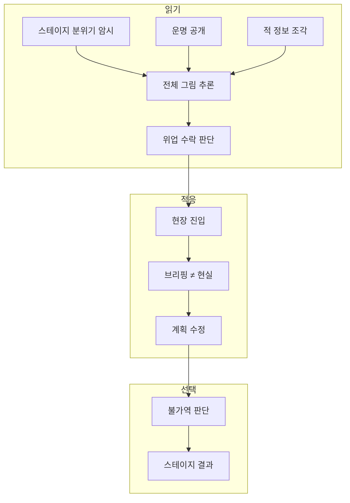

# CORE-001: 핵심 경험 목표

> **상태:** 🔄 설계중 · **버전:** 0.5 · **ID:** CORE-001 · **수정일:** 2026-02-28

---

## ① 한 줄 요약

명령은 명료하다. 하지만 하급 지휘관에게 주어진 정보는 부족하고 현장은 이미 달라져 있다. 변하는 흐름을 읽고, 유추하고, 스스로 판단한다.

> ⚠️ 스테이지 세 박자(읽기→적응→선택)는 진행 구조 문서로 이관 예정.

---

## ② 규칙 정의

### 스테이지 코어 루프 — 세 박자

| 박자 | 이름 | 정의 |
|------|------|------|
| ① | 읽기 | 브리핑(전술회의)에서 스테이지 분위기 암시, 운명 공개, 위업 수락을 하고 이번 구간을 추론한다. |
| ② | 적응 | 스테이지 진행 중 브리핑과 다른 현실에 직면한다. 계획을 실시간으로 수정한다. |
| ③ | 선택 | 스테이지 안에서 불가역적인 판단을 내린다. 되돌릴 수 없고, 이 스테이지의 결과를 가른다. |

### 세 박자 규칙

| 필드 | 내용 |
|------|------|
| **단위** | 스테이지. 런 단위가 아님. |
| **순서** | 읽기 → 적응 → 선택. 매 스테이지 반복. |
| **전투와의 관계** | 전투 7단계는 전투 안의 문법. 세 박자는 스테이지의 문법. 전투는 ②적응과 ③선택 안에서 발생. |
| **런 구조** | 세 박자 사이클이 누적된 결과가 런. |

### ③ 선택의 두 층위

| 층위 | 형태 | 예시 |
|------|------|------|
| 작은 선택 | 매 전투에서 버프·리롤을 소모하는 판단 | 이번에 면 확정 버프를 쓰면 다음 전투엔 빈손 |
| 큰 선택 | 스테이지 중반 상황 전환에 대한 대응 | 미정 — 명령 변경 등 구체 메커니즘 설계 필요 |

---

## ③ 시각 자료

### 세 박자 흐름

### 판단 구조

---

## ④ 플레이어 피드백 (UI/UX)

> 미정. 코어 루프 메커니즘 확정 후 작성.

---

## ⑤ 테스트 케이스

> 미작성.

---

## ⑥ 설계 근거

**Q. 왜 이 순서인가?**
중세 현장 지휘관의 실제 판단 흐름을 따른다. 작전 명령을 받고(읽기), 현장에 도착하면 명령의 전제가 틀어져 있고(적응), 제한된 정보 안에서 돌이킬 수 없는 결정을 내린다(선택).

**Q. 런 단위가 아니라 스테이지 단위인 이유는?**
매 스테이지가 독립된 "읽기→적응→선택" 사이클을 가져야 스테이지마다 고유한 판단이 생긴다.

**Q. "큰 선택"이 미정인 이유는?**
명령 변경 방향이 유력하나, 지배 전략(매번 유연책이 정답) 문제를 해결할 구체 메커니즘이 필요. 코어 루프 세션에서 후속 설계.

### 레퍼런스

| 게임 | 참고 요소 | Chronicle 적용 |
|------|----------|-----------------|
| Darkest Dungeon | 준비 단계 트레이드오프 | 브리핑에서 위업 수락 (리스크-리워드 판단) |
| Baldur's Gate 3 | 전투 전 배치가 결과를 지배 | 브리핑에서 배치 + 접근 방향 |
| Baldur's Gate 3 | 휴식 자원관리 (반면교사: 페널티 부족) | 운명 달성 결산 — 보상 조건 부여로 무비용 회복 방지 |
| Banner Saga | 행군 자원 소모 + 톤 | 서자부대 행군 느낌 |

---

## ⑦ 의존성

| 방향 | ID | 이름 | 관계 |
|------|----|------|------|
| → AFFECTS | STAGE-DECK-001 | 덱빌딩 | ① 읽기(브리핑)에서 판단 + ②적응 ③선택이 유물 재료 축적 |
| → AFFECTS | STAGE-FEAT | 위업 | ① 읽기에서의 리스크-리워드 판단 |
| → AFFECTS | COMBAT-STRUCT-001 | 전투 구조 | ②적응 ③선택 안에서 전투 발생 |
| → AFFECTS | META-* | 운명 달성/성장 | 사이클 사이의 결산 단계 |

---

## ⑧ 미확정 사항

| 항목 | 현재 상태 | 결정에 필요한 것 |
|------|-----------|-----------------|
| 큰 선택 구체 메커니즘 | 미정 — 명령 변경 방향 유력 | 지배 전략 문제 해결할 메커니즘 설계 |
| 플레이어 피드백 (UI/UX) | 미정 | 코어 루프 메커니즘 확정 후 |

---

## ⑨ 변경 이력

| 버전 | 날짜 | 변경 내용 | 사유 |
|------|------|-----------|------|
| 0.1 | 2026-02-25 | 코어 판타지 정의, 스테이지 세 박자 구조 초안 | 코어 설계 세션 |
| 0.2 | 2026-02-25 | 문서명 변경 (코어판타지 → 핵심경험목표). 세 박자는 진행구조로 이관 예정. | 코어 문서 구조 정비 |
| 0.3 | 2026-02-27 | ① 읽기 재정의: 맵 반쪽 공개 → 전술회의(막사). 보급 참조 → 덱빌딩(STAGE-DECK-001) 참조. 작은 선택 예시 토큰 기준으로 변경. | 덱빌딩 구조 설계 세션 |
| 0.4 | 2026-02-28 | 보급/야영 잔재 제거. ① 읽기 "경량 보급" → "위업 수락". mermaid 2개 보급 참조 교체. DD/BG3 레퍼런스 테이블 현행 체계 반영. | 위키 정합성 감사 — 토큰·보급·야영 폐기 반영 |
| 0.5 | 2026-02-28 | ⑧ 미확정 사항 전용 섹션 추가 (큰 선택, UI/UX). 변경이력 ⑧→⑨. | 운영규칙 템플릿 정합 |
