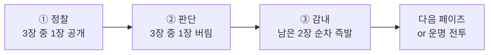
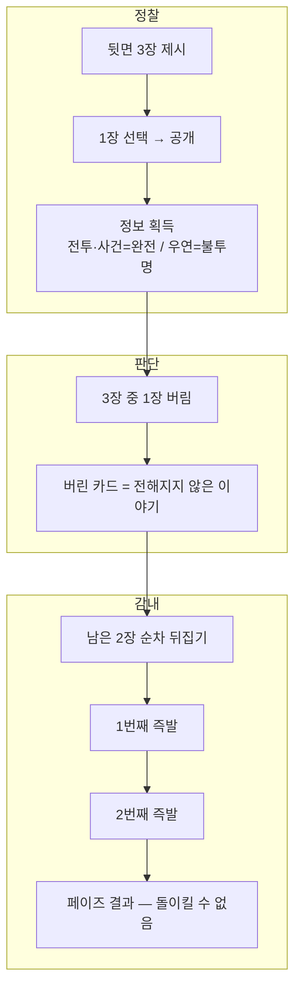

# CORE-001: 핵심 경험 목표

> **상태:** 🔄 설계중 · **버전:** 0.9 · **ID:** CORE-001 · **수정일:** 2026-03-10

---

## ⓪ 엘리베이터 피치

> **유저 피치 (30초)**
> 뒷면 카드 3장이 놓인다. 1장을 뒤집어 정체를 확인한다. 그리고 1장을 버린다. 남은 2장을 겪는다. 나온 전투에서 주사위를 굴리고, 칼과 방패가 부딪힌다. 뚫리면 죽는다. 죽으면 안 돌아온다.

> **한 줄 태그라인**
> 서자 기사의 부대를 이끌고 9장의 운명을 넘겨라.

> **Steam 피치**
> 야바위식 정찰 + 다이스 전투 로그라이크. 1장만 볼 수 있다. 나머지는 모른 채 겪는다.

---

## ① 한 줄 요약 (설계 원칙)

명령은 명료하다. 하지만 하급 지휘관에게 주어진 정보는 부족하고 현장은 이미 달라져 있다. 1장의 정찰이 유일한 정보. 나머지는 모른 채 감내한다.

---

## ② 규칙 정의

### 페이즈 코어 루프 — 세 박자

| 박자 | 이름 | 정의 |
|------|------|------|
| ① | 정찰 | 뒷면 3장이 제시된다. 1장을 골라 뒤집는다. 정체를 확인한다. 뭘 열어볼지가 첫 판단. |
| ② | 판단 | 정찰 정보로 3장 중 1장을 버린다. 공개한 카드를 버릴 수도, 미지의 카드를 버릴 수도. 아는 위험을 감수할지, 모르는 것에 걸지. |
| ③ | 감내 | 남은 2장을 순차로 겪는다. 뒤집으면 즉발. 선택 없음. 돌이킬 수 없다. |

### 세 박자 규칙

| 필드 | 내용 |
|------|------|
| **단위** | 페이즈. Stage당 3회 반복. |
| **순서** | 정찰 → 판단 → 감내. 매 페이즈 반복. |
| **전투와의 관계** | 전투 7스텝은 전투 안의 문법. 세 박자는 페이즈의 문법. 전투는 ③감내 안에서 발생. |
| **런 구조** | 세 박자 사이클 27회(9 Stage × 3페이즈)가 1런. |

### 정찰 정보 비대칭

| 카드 유형 | 정찰 시 정보 |
|-----------|-------------|
| **전투 카드** | 완전 공개 — 태그, 적 구성, 보상 전부 보임 |
| **사건 카드** | 완전 공개 — 효과 태그 전부 보임 |
| **우연 카드** | **"우연 카드"만 표시.** 우연-전투인지 우연-이벤트인지, 좋은지 나쁜지 모름 |

### 감내의 두 층위

| 층위 | 형태 | 예시 |
|------|------|------|
| 작은 감내 | 매 전투에서 대형 선택(산개/밀집)과 지휘(리롤)를 소모하는 판단 | 민병을 밀집하면 전원 ⚔ 또는 전원 ✕. 리롤을 밀집 복구에 쓰면 Named ✕는 그대로 |
| 큰 감내 | 미지의 카드를 뒤집어 나온 결과를 받아들이는 것 | 전투를 피하려 사건을 남겼는데 미지 카드가 우연-전투. 강제 전투 진입 |

---

## ③ 시각 자료

### 세 박자 흐름

### 판단 구조

---

## ④ 설계 근거

**Q. 왜 정찰-판단-감내인가?**
정찰(1장만 볼 수 있다) → 판단(그 정보로 1장을 버린다) → 감내(나머지를 겪는다). 판단이 점점 통제를 잃는 구조. 정찰에서는 정보를 얻고, 판단에서는 선택하고, 감내에서는 버틸 수밖에 없다.

**Q. 왜 정찰 대상 선택에 근거가 없는가?**
3장이 전부 같은 뒷면. 뭘 열지의 근거가 0이다. 이것이 야바위의 긴장이다. 근거 없는 선택에서 시작해서 정보 1장을 얻고 그걸로 판단하는 것이 게임. 간략한데 심오하다.

**Q. 왜 뒤집으면 분기 없이 즉발인가?**
카드 레벨 판단(정찰-판단)과 전투 레벨 판단(대형/리롤/방진)을 완전 분리. 분기까지 있으면 판단이 분산된다.

**Q. 왜 2장을 자동 순차 뒤집기인가?**
미지 카드의 순서를 플레이어가 정하는 것은 정보 없는 판단. 의미 없는 선택을 판단으로 포장하지 않는다.

**Q. 전투 회피가 가능한가?**
가능하다. 정찰로 전투를 보고 버리면 된다. 하지만 대가가 있다: ① 전투 후 보상 포기 ② 팩 내 전투 비율이 ~50%이므로 미지 2장에도 전투가 높은 확률로 있다 ③ 우연-전투는 뒤집어야 알 수 있으므로 회피 불가. 적극적 플레이가 안정적이고, 회피 플레이가 불안정하다.

### 레퍼런스

| 게임 | 참고 요소 | Chronicle 적용 |
|------|----------|-----------------|
| Darkest Dungeon | 준비 단계 트레이드오프 | 정찰에서 리스크-리워드 정보 확인 |
| Slay the Spire | 맵 노드 선택 | 정찰-판단으로 경로 결정 |
| Baldur's Gate 3 | 전투 전 배치가 결과를 지배 | 정찰 판단이 전투 조건을 결정 |
| Banner Saga | 행군 자원 소모 + 톤 | 서자부대 행군 느낌 |

---

## ⑤ 미확정 사항

| 항목 | 현재 상태 | 결정에 필요한 것 |
|------|-----------|--------------------|
| 플레이어 피드백 (UI/UX) | 미정 | 코어 루프 프로토타입 후 |

---

## ⑥ 변경 이력

| 버전 | 날짜 | 변경 내용 | 사유 |
|------|------|-----------|------|
| 0.1 | 2026-02-25 | 코어 판타지 정의, 막 세 박자 구조 초안 | 코어 설계 세션 |
| 0.2~0.6 | 2026-02-25~28 | 세 박자 반복 정제. 보급/야영/유물 잔재 제거. | 다수 세션 |
| 0.7 | 2026-03-08 | **세 박자 전면 재정의.** 붙잡기/뒤집기/감내. | 정합성 체크 |
| 0.8 | 2026-03-08 | **⓪ 엘리베이터 피치 신설.** | 유저 커뮤니케이션 축 보완 |
| 0.9 | 2026-03-10 | **세 박자 전면 재설계.** 붙잡기/뒤집기/감내 → **정찰/판단/감내.** ① 정찰: 3장 중 1장 공개(전투·사건=완전정보, 우연=불투명). ② 판단: 3장 중 1장 버림(공개 카드 포함). ③ 감내: 남은 2장 순차 즉발(분기 없음). 태그라인 6→9장. 피치 교체. 큰 감내 확정. | 배경 전면 재설계 세션 — 정찰 루프 도입 |
