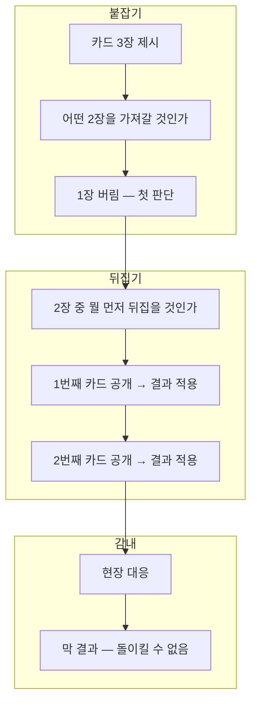

# CORE-001: 핵심 경험 목표

> **상태:** 🔄 설계중 · **버전:** 0.7 · **ID:** CORE-001 · **수정일:** 2026-03-08

---

## ① 한 줄 요약

명령은 명료하다. 하지만 하급 지휘관에게 주어진 정보는 부족하고 현장은 이미 달라져 있다. 변하는 흐름을 읽고, 유추하고, 스스로 판단한다.

> ⚠️ 막 세 박자(붙잡기→뒤집기→감내)는 진행 구조 문서로 이관 예정.

---

## ② 규칙 정의

### 막 코어 루프 — 세 박자

| 박자 | 이름 | 정의 |
|------|------|------|
| ① | 붙잡기 | 이번 막에 뒤집을 카드 3장이 제시된다. 그 중 2장을 고른다. 뭘 버리고 뭘 가져갈지가 첫 번째 판단. |
| ② | 뒤집기 | 붙잡은 2장을 순서대로 선택해서 뒤집는다. 어떤 걸 먼저 뒤집느냐가 두 번째 판단. |
| ③ | 감내 | 뒤집은 카드의 결과에 따라 현장에서 대응한다. 돌이킬 수 없는 결과를 감내한다. |

### 세 박자 규칙

| 필드 | 내용 |
|------|------|
| **단위** | 막. 런 단위가 아님. |
| **순서** | 붙잡기 → 뒤집기 → 감내. 매 막 반복. |
| **전투와의 관계** | 전투 7스텝은 전투 안의 문법. 세 박자는 막의 문법. 전투는 ②뒤집기와 ③감내 안에서 발생. |
| **런 구조** | 세 박자 사이클이 누적된 결과가 런. |

### ③ 감내의 두 층위

| 층위 | 형태 | 예시 |
|------|------|------|
| 작은 감내 | 매 전투에서 지휘(리롤)를 소모하는 판단 | 이번에 리롤을 적 ★ 끊기에 쓰면 내 ✕는 그대로 |
| 큰 감내 | 뒤집은 카드가 가져온 상황을 받아들이는 것 | 미정 — 분기 선택 등 구체 메커니즘 설계 필요 |

---

## ③ 시각 자료

### 세 박자 흐름

### 판단 구조

---

## ④ 설계 근거

**Q. 왜 이 순서인가?**
붙잡기(뭘 가져갈 것인가) → 뒤집기(어떤 순서로 볼 것인가) → 감내(결과를 받아들인다). 판단이 점점 통제를 잃는 구조. 처음엔 선택할 수 있고, 마지막엔 버틸 수밖에 없다.

**Q. 런 단위가 아니라 막 단위인 이유는?**
매 막이 독립된 "붙잡기→뒤집기→감내" 사이클을 가져야 막마다 고유한 판단이 생긴다.

**Q. "큰 감내"가 미정인 이유는?**
분기 선택 방향이 유력하나, 구체 메커니즘이 필요. 코어 루프 세션에서 후속 설계.

### 레퍼런스

| 게임 | 참고 요소 | Chronicle 적용 |
|------|----------|-----------------|
| Darkest Dungeon | 준비 단계 트레이드오프 | 붙잡기에서 카드 선택 (리스크-리워드 판단) |
| Baldur's Gate 3 | 전투 전 배치가 결과를 지배 | 붙잡기에서 카드 조합이 막 결과를 좌우 |
| Baldur's Gate 3 | 휴식 자원관리 (반면교사: 페널티 부족) | 운명 달성 결산 — 보상 조건 부여로 무비용 회복 방지 |
| Banner Saga | 행군 자원 소모 + 톤 | 서자부대 행군 느낌 |

---

## ⑤ 미확정 사항

| 항목 | 현재 상태 | 결정에 필요한 것 |
|------|-----------|-----------------|
| 큰 감내 구체 메커니즘 | 미정 — 분기 선택 방향 유력 | 구체 메커니즘 설계 |
| 플레이어 피드백 (UI/UX) | 미정 | 코어 루프 메커니즘 확정 후 |

---

## ⑥ 변경 이력

| 버전 | 날짜 | 변경 내용 | 사유 |
|------|------|-----------|------|
| 0.1 | 2026-02-25 | 코어 판타지 정의, 막 세 박자 구조 초안 | 코어 설계 세션 |
| 0.2 | 2026-02-25 | 문서명 변경 (코어판타지 → 핵심경험목표). 세 박자는 진행구조로 이관 예정. | 코어 문서 구조 정비 |
| 0.3 | 2026-02-27 | ① 읽기 재정의: 맵 반쪽 공개 → 전술회의(막사). 보급 참조 → 덱빌딩(STAGE-DECK-001) 참조. 작은 선택 예시 토큰 기준으로 변경. | 덱빌딩 구조 설계 세션 |
| 0.4 | 2026-02-28 | 보급/야영 잔재 제거. ① 읽기 "경량 보급" → "위업 수락". mermaid 2개 보급 참조 교체. DD/BG3 레퍼런스 테이블 현행 체계 반영. | 위키 정합성 감사 — 토큰·보급·야영 폐기 반영 |
| 0.5 | 2026-02-28 | ⑧ 미확정 사항 전용 섹션 추가 (큰 선택, UI/UX). 변경이력 ⑧→⑨. | 운영규칙 템플릿 정합 |
| 0.6 | 2026-02-28 | 의존성 STAGE-DECK-001 "유물 재료 축적" → "분기 효과로 부대 변화". | 시리즈-Chapter-Stage 구조 정합 — 유물 폐기 반영 |
| 0.7 | 2026-03-08 | **세 박자 전면 재정의.** 읽기/적응/선택 → 붙잡기/뒤집기/감내. 위업 폐기 반영. 카드 3장→2장 선택 구조. mermaid 2개 교체. 레퍼런스 위업→붙잡기. | 정합성 체크 — 위업 폐기 + 코어 루프 갱신 |
