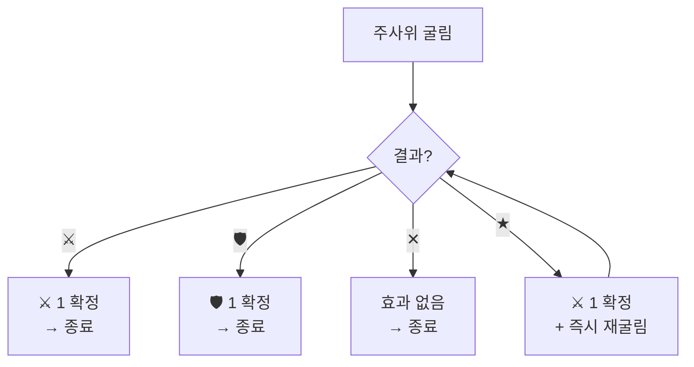
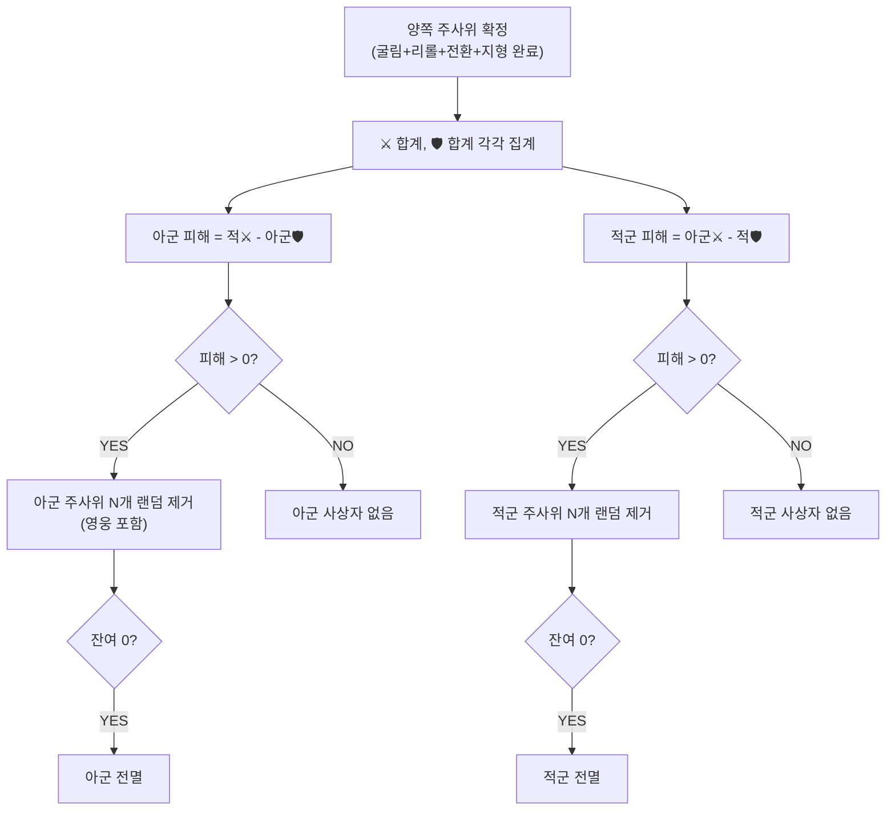

# COMBAT-DICE-001: 다이스 규칙 (Dice Rules)

> **상태:** 🔄 설계중 · **버전:** 0.5 · **ID:** COMBAT-DICE-001 · **수정일:** 2026-02-26

---

## ① 한 줄 요약

모든 전투 판정의 기반. 4종 면으로 구성된 주사위를 굴려 칼-방패 상쇄로 피해를 결정하며, ★ 체이닝이 폭발적 전과를 만든다.

---

## ② 규칙 정의

### 2-1. 주사위 면 종류

| 면 | 기호 | 효과 | 비고 |
|---|------|------|------|
| 칼 (Sword) | ⚔ | 피해 1 | 상대 🛡 1개와 상쇄 |
| 방패 (Shield) | 🛡 | 방어 1 | 상대 ⚔ 1개와 상쇄. 초과 방패는 소멸 (이월 없음) |
| 대성공 (Critical) | ★ | 칼 1 확정 + 해당 주사위 즉시 재굴림 | 체이닝 참조 |
| 실패 (Blank) | ✕ | 효과 없음 | 지형으로 전환 가능 |

### 2-2. 전체 주사위 면 구성 일람

#### 전투 주사위 — T1

| 유닛 | 1면 | 2면 | 3면 | 4면 | 5면 | 6면 | ⚔ 비율 | 🛡 비율 | ✕ 비율 |
|------|-----|-----|-----|-----|-----|-----|--------|--------|--------|
| 민병대 | ⚔ | ⚔ | 🛡 | ✕ | ✕ | ✕ | 33% | 17% | 50% |
| 보병대 | ⚔ | ⚔ | 🛡 | 🛡 | ✕ | ✕ | 33% | 33% | 33% |
| 창병대 | 🛡 | 🛡 | 🛡 | 🛡 | ✕ | ✕ | 0% | 67% | 33% |
| 궁병대 | ⚔ | ⚔ | ⚔ | ⚔ | ✕ | ✕ | 67% | 0% | 33% |

#### 전투 주사위 — Named (Nameless 거울 + ★)

| 유닛 | 1면 | 2면 | 3면 | 4면 | 5면 | 6면 | Nameless 대응 |
|------|-----|-----|-----|-----|-----|-----|---------|
| 용병대 | ⚔ | ★ | 🛡 | ✕ | ✕ | ✕ | 민병대 |
| 기병대 | ⚔ | ★ | 🛡 | 🛡 | ✕ | ✕ | 보병대 |
| 기사단 | ★ | 🛡 | 🛡 | 🛡 | ✕ | ✕ | 창병대 |
| 석궁병대 | ⚔ | ⚔ | ⚔ | ★ | ✕ | ✕ | 궁병대 |

#### 전투 주사위 — 영웅

| 유닛 | 1면 | 2면 | 3면 | 4면 | 5면 | 6면 | 취급 |
|------|-----|-----|-----|-----|-----|-----|------|
| 테오도라 | ⚔ | 🛡 | 🛡 | ★ | ✕ | ✕ | 창병 |
| 앰버 | ⚔ | ⚔ | ⚔ | ★ | ✕ | ✕ | 궁병 |

#### 특수 주사위

| 주사위 | 1면 | 2면 | 3면 | 4면 | 5면 | 6면 | 용도 |
|--------|-----|-----|-----|-----|-----|-----|------|
| 날씨 주사위 | 맑음 | 맑음 | 맑음 | 안개 | 비 | 눈 | 매일(2턴) 시작 시 굴림. 날씨 효과 재설계 필요 (STAGE-WEATHER 참조) |

> ⚠️ **이동 주사위 삭제 (2026-02-26).** 이동 시스템 삭제로 이동 주사위(1,1,2,2,3,3) 폐기. → [DOCS/ARCHIVE/맵이동.md](../../DOCS/ARCHIVE/맵이동.md) 참조.
>
> ⚠️ **날씨 주사위 효과 재설계 필요.** 스테이지 턴 단위 낮/밤 교대는 유효 (전투 내 교대 없음). 안개/비/눈 효과는 그리드 기반이라 무효화. STAGE-WEATHER v0.2 참조.

### 2-3. ★ 재굴림 (Critical Chaining)

| 필드 | 내용 |
|------|------|
| **조건** | 굴림 결과가 ★ |
| **대상** | ★이 나온 해당 주사위 1개 |
| **행동** | ⚔ 1을 확정 → 해당 주사위 즉시 재굴림 |
| **결과** | 재굴림이 ★ → ⚔ 1 추가 확정 + 또 재굴림. ⚔ → ⚔ 1 추가. 🛡 → 🛡 1 추가. ✕ → 없음 |
| **제한** | 체이닝 횟수 제한 없음 (무한) |
| **비용** | 없음 |
| **오버킬** | 적 전멸 후에도 체이닝은 계속 굴린다. 초과 피해는 흘려보냄 |

### 2-4. 전투 판정

| 필드 | 내용 |
|------|------|
| **조건** | 양측 주사위가 모두 굴려지고, 리롤/전환/지형 등 모든 수정이 끝난 후 |
| **행동** | 양쪽 동시 판정 |
| **피해 공식** | `피해 = 상대 ⚔ 합계 - 내 🛡 합계` |
| **피해 < 0** | 0으로 처리. 초과 방패는 소멸 (저장/이월 없음) |
| **피해 > 0** | 뚫린 수만큼 주사위(=병사) 제거 |
| **사상자 선택** | 랜덤. 플레이어 선택 불가. 영웅도 동일 풀에 포함 |
| **양쪽 동시 전멸** | 양쪽 모두 전멸 처리. 패배 (테오도라 대 소멸) |
| **피해 0 vs 0** | 사상자 없음. 다음 라운드 속행 |

### 2-5. 예외 및 엣지 케이스

| 상황 | 처리 |
|------|------|
| 양쪽 모두 ⚔ 0 | 피해 0 vs 0. 사상자 없음 |
| 🛡이 상대 ⚔보다 많음 | 초과 🛡 소멸. 피해 0 |
| ★ 체이닝 중 적이 전멸 | 체이닝은 계속 굴림. 오버킬은 흘려보냄 |
| ★ 재굴림 결과가 🛡 | 🛡 1 추가. 체이닝 종료 |
| 사상자 수 > 잔여 주사위 수 | 잔여 전부 제거 (전멸). 초과분 흘려보냄 |
| 영웅만 남은 상태에서 피해 | 영웅이 사상자 대상. 부상 규칙 적용 (COMBAT-JUDGE-001 참조) |
| 체이닝으로 발생한 🛡 | 해당 라운드 방어에 즉시 합산 |
| 동시 전멸 시 승패 | 패배 처리 (테오도라 대 소멸) |

---

## ③ 시각 자료

### 전투 주사위 면 시각화

```
T1 민병대                T1 보병대                T1 창병대                T1 궁병대
┌───┬───┬───┐            ┌───┬───┬───┐            ┌───┬───┬───┐            ┌───┬───┬───┐
│ ⚔ │ ⚔ │ 🛡│            │ ⚔ │ ⚔ │ 🛡│            │ 🛡│ 🛡│ 🛡│            │ ⚔ │ ⚔ │ ⚔ │
├───┼───┼───┤            ├───┼───┼───┤            ├───┼───┼───┤            ├───┼───┼───┤
│ ✕ │ ✕ │ ✕ │            │ 🛡│ ✕ │ ✕ │            │ 🛡│ ✕ │ ✕ │            │ ⚔ │ ✕ │ ✕ │
└───┴───┴───┘            └───┴───┴───┘            └───┴───┴───┘            └───┴───┴───┘
 ⚔33% 🛡17% ✕50%         ⚔33% 🛡33% ✕33%         ⚔0%  🛡67% ✕33%         ⚔67% 🛡0%  ✕33%

Named 용병대              Named 기병대              Named 기사단              Named 석궁병대
┌───┬───┬───┐            ┌───┬───┬───┐            ┌───┬───┬───┐            ┌───┬───┬───┐
│ ⚔ │ ★ │ 🛡│            │ ⚔ │ ★ │ 🛡│            │ ★ │ 🛡│ 🛡│            │ ⚔ │ ⚔ │ ⚔ │
├───┼───┼───┤            ├───┼───┼───┤            ├───┼───┼───┤            ├───┼───┼───┤
│ ✕ │ ✕ │ ✕ │            │ 🛡│ ✕ │ ✕ │            │ 🛡│ ✕ │ ✕ │            │ ★ │ ✕ │ ✕ │
└───┴───┴───┘            └───┴───┴───┘            └───┴───┴───┘            └───┴───┴───┘

영웅 테오도라             영웅 앰버
┌───┬───┬───┐            ┌───┬───┬───┐
│ ⚔ │ 🛡│ 🛡│            │ ⚔ │ ⚔ │ ⚔ │
├───┼───┼───┤            ├───┼───┼───┤
│ ★ │ ✕ │ ✕ │            │ ★ │ ✕ │ ✕ │
└───┴───┴───┘            └───┴───┴───┘
 창병 취급                 궁병 취급
```

### 특수 주사위 시각화

```
날씨 주사위 (효과 재설계 필요)
┌────┬────┬────┐
│ 맑 │ 맑 │ 맑 │
├────┼────┼────┤
│안개│ 비 │ 눈 │
└────┴────┴────┘
 맑음:50% 특수:각17%
 2턴 지속
```

> 이동 주사위 시각화 삭제. → [DOCS/ARCHIVE/맵이동.md](../../DOCS/ARCHIVE/맵이동.md)

### ★ 체이닝 플로우



### 전투 판정 플로우



### 전투 판정 예시

```
[예시 1: 기본 상쇄]
아군 4주사위: ⚔⚔🛡✕  →  ⚔×2  🛡×1
적군 4주사위: ⚔🛡🛡✕  →  ⚔×1  🛡×2

아군 피해 = 적⚔(1) - 아군🛡(1) = 0  →  사상자 0
적군 피해 = 아군⚔(2) - 적🛡(2) = 0  →  사상자 0

[예시 2: ★ 체이닝]
아군 4주사위: ⚔⚔★✕
  → ★ 발동: ⚔ 1 확정 + 재굴림
  → 재굴림 결과: ⚔
  → 최종: ⚔×3  🛡×0
적군 4주사위: ⚔🛡🛡✕  →  ⚔×1  🛡×2

아군 피해 = 적⚔(1) - 아군🛡(0) = 1  →  아군 1명 랜덤 제거
적군 피해 = 아군⚔(3) - 적🛡(2) = 1  →  적군 1명 랜덤 제거

[예시 3: 오버킬]
아군 2주사위: ★★
  → ★₁: ⚔ 확정 + 재굴림 → ⚔  →  칼 2
  → ★₂: ⚔ 확정 + 재굴림 → ★ → ⚔ 확정 + 재굴림 → ✕  →  칼 2
  → 최종: ⚔×4  🛡×0
적군 1주사위: ⚔  →  ⚔×1  🛡×0

아군 피해 = 적⚔(1) - 아군🛡(0) = 1  →  아군 1명 제거
적군 피해 = 아군⚔(4) - 적🛡(0) = 4  →  적 1명 제거 (잔여 1). 초과 3 흘려보냄

[예시 4: 🛡 초과]
아군: 🛡🛡🛡🛡  →  ⚔×0  🛡×4
적군: ⚔✕✕✕    →  ⚔×1  🛡×0

아군 피해 = 적⚔(1) - 아군🛡(4) = -3 → 0 처리. 사상자 없음. 초과 🛡 소멸.
적군 피해 = 아군⚔(0) - 적🛡(0) = 0  →  사상자 없음
```

---

## ④ 플레이어 피드백 (UI/UX)

| 상황 | 피드백 |
|------|--------|
| **굴림** | 모든 주사위 동시 굴림 연출 |
| **★ 발생** | 해당 주사위 강조 + 체이닝 재굴림 애니메이션 반복. 연쇄 횟수 표시 |
| **판정** | ⚔와 🛡 1:1 상쇄 시각화 (짝지어 소멸) → 잔여 ⚔ = 피해 |
| **사상자** | 제거 대상 주사위(=병사) 랜덤 선택 하이라이트 → 제거 연출 |
| **피해 0** | "BLOCK" 또는 "NO DAMAGE" 표시 |
| **오버킬** | 전멸 표시 후 초과분 흘러가는 연출 |
| **밤** | 적 주사위 개별 결과 "?" 처리. 최종 피해 수치만 공개 |
| **날씨** | 턴 시작 시 날씨 주사위 굴림 연출. 결과에 따른 오버레이 전환 (재설계 후) |

---

## ⑤ 테스트 케이스

> TC 미작성. [06_TC/전투_TC.md](../../06_TC/전투_TC.md)에서 통합 관리 예정.

---

## ⑥ 설계 근거

| 질문 | 답변 | 근거 |
|------|------|------|
| 왜 4종 면인가? | 공격-방어-행운-빈손의 최소 전술 공간. 병종별 면 비율만 달라도 역할 분리 성립. | 전투 문법 통일 원칙 |
| 왜 ★ 체이닝이 무한인가? | "대박" 감정. 2연속 ★ ≈ 6.25%, 3연속 ≈ 1.5%. 제한 시 이 감정 소멸. | 주사위 게임 핵심 |
| 왜 사상자가 랜덤인가? | 선택제 → 최하 유닛 우선 제거로 최적해 수렴. 랜덤 → 영웅 사망 가능 → 긴장 유지. | v4 시뮬 검증 |
| 왜 초과 🛡이 소멸하는가? | 방패 저장 허용 시 창병이 방어→축적→무적 루프 발생. | 밸런스 |
| 왜 오버킬을 흘려보내는가? | 초과 데미지가 파급되면 체이닝 가치가 과도. 전투 단위 격리 원칙. | 설계 원칙 |
| 왜 철수 주사위를 삭제했나? | 별도 철수 메카닉이 복잡도를 과도하게 야기. 전투 회피는 맵 단계(시야, 소리, 정찰, 행군)에서 한다. 전투 진입 = 끝까지 싸운다. | 복잡도 축소 (v0.4) |

---

## ⑦ 의존성

| 방향 | ID | 이름 | 관계 |
|------|----|------|------|
| → AFFECTS | COMBAT-STRUCT-001 | 전투 구조 | 모든 페이즈에서 이 규칙으로 굴림 |
| → AFFECTS | COMBAT-UNIT-T1 | Nameless 병종 | Nameless 면 구성이 이 4종으로 정의됨 |
| → AFFECTS | COMBAT-UNIT-HERO | Named 인물 | 테오도라/앰버 면 구성 |
| → AFFECTS | COMBAT-ACT-002 | 리롤 | 굴림 결과 재굴림 |
| → AFFECTS | COMBAT-JUDGE-001 | 부상/사망 | 전투 판정 결과 |
| → AFFECTS | STAGE-TERRAIN | 지형 | ✕ → ⚔/🛡 전환 |
| → AFFECTS | STAGE-WEATHER | 날씨 | 날씨 주사위. 낮/밤 교대 |

---

## ⑧ 변경 이력

| 버전 | 날짜 | 변경 내용 | 사유 |
|------|------|-----------|------|
| 0.1 | 2026-02-25 | COMBAT_SYSTEM 정본에서 이관. 규칙 정의 + 시각 자료. | 위키 구축 |
| 0.2 | 2026-02-25 | 전체 주사위 일람 추가, 예외 처리 테이블 추가, 판정 플로우차트 추가, 설계 근거 구조화, 예시 보강. | 기획서 품질 보완 |
| 0.3 | 2026-02-25 | 철수 주사위: 도주 측 랜덤→선택으로 정본 수정. ★ 체이닝 철수 유효 명시. 주사위 면 시각화 다이어그램 추가, 철수 예시 3개, 병종별 철수 안전도 추가. | 정본 수정 + 누락 보완 |
| 0.4 | 2026-02-25 | **철수 주사위 섹션 전체 삭제.** 철수 관련 엣지 케이스, 시각 자료, 예시, UI/UX, 설계 근거, 의존성 모두 제거. 전투 진입 = 끝까지 싸운다. 의존성에서 "부상/사망/철수" → "부상/사망"으로 변경. | 철수 삭제 결정 (전투구조 v0.3 연동) |
| 0.5 | 2026-02-26 | **이동 주사위 삭제.** 이동 시스템 삭제로 폐기. 날씨 주사위 효과 "재설계 필요" 마킹. STAGE-MAP 의존성 제거. | 스테이지 구조 설계 세션 |
