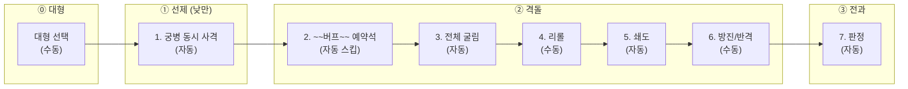

# COMBAT-STRUCT-001: 전투 구조 (Battle Structure)

> **상태:** 🔄 설계중 · **버전:** 1.9 · **ID:** COMBAT-STRUCT-001 · **수정일:** 2026-03-09

---

## ① 한 줄 요약

전투 = 대형 선택 + 라운드 반복. 매 라운드 대형 선택(산개/밀집) 후 7스텝 실행. 플레이어가 보는 건 4페이즈(대형/선제/격돌/전과), 엔진이 처리하는 건 7스텝. 낮/밤은 페이즈에서 상속(계절이 패턴 결정) — 전투 내 교대 없음, 끝까지 유지. 5라운드부터 결사 돌입. 8라운드 상한. 철수 없음.

---

## ② 규칙 정의

### 라운드 구조

| 필드 | 내용 |
|------|------|
| **전투** | 라운드 반복. 종료 조건 충족 또는 8라운드 상한까지 |
| **1라운드** | 대형 선택 + 전투 페이즈(7스텝). 4페이즈(플레이어 체감) |
| **낮/밤** | 페이즈에서 상속(계절이 패턴 결정). 전투 내 교대 없음. 밤 전투면 끝까지 밤. → [META-BACKDROP 배경](../../04_메타/배경.md) 계절 참조 |
| **라운드 상한** | 8라운드. 상한 도달 시 패배 |
| **결사** | 5라운드부터 양측 모든 🛡를 ⚔로 판정 |

> **"턴"은 막 전용 용어.** 전투에서는 "라운드"만 사용한다.

### 4페이즈 (플레이어가 보는 것)

| 페이즈 | 이름 | 유저 설명 | 낮 | 밤 |
|--------|------|----------|----|----|
| ⓪ | 대형 | 병종별로 산개(개별)할지 밀집(일제)할지 정한다 | O | O |
| ① | 선제 | 궁병이 먼저 쏜다. 양쪽 동시. 밤에는 없다 | O | 통째로 스킵 |
| ② | 격돌 | 주사위를 굴리고, 조정하고, 기병이 돌격한다 | O | O |
| ③ | 전과 | 칼과 방패가 부딪힌다. 뚫리면 죽는다 | O | O |

### 대형 선택 (COMBAT-FORMATION)

매 라운드 7스텝 전에 실행. 지휘관(플레이어)이 병종별 대형을 결정한다.

| 대형 | 카드 상태 | 굴림 방식 | 면 기준 |
|------|----------|----------|--------|
| **산개** | 앞면 | 각 유닛 개별 d10 굴림 | 현재면 (교관/연마 등 반영) |
| **밀집** | 뒷면 | 병종 전체 d10 한 번 = 일제 굴림 | **초기면** (구성면 변환 무시) |
| **수비** | — | **굴림 없음.** 유닛마다 ⚔ or 🛡 직접 선택 | **초기면** (선택 풀 = 초기면의 ⚔/🛡. ✕ 선택 불가) |

#### 대형 선택 규칙

| 규칙 | 내용 |
|------|------|
| **대상** | 테오도라 부대 Nameless만. Named는 항상 산개(선택 불가) |
| **적/동료** | 항상 산개. 밀집 불가 |
| **단위** | 병종별. 같은 병종 NL 전체가 산개 또는 밀집 |
| **부분 밀집** | 불가. 같은 병종 내에서 일부만 밀집 불가 |
| **밀집 조건** | 해당 병종 2기 이상 |
| **타이밍** | 매 라운드 7스텝 전. 라운드마다 변경 가능 |
| **[우세] 임시 유닛** | 밀집 불가 |
| **[회유] 합류 NL** | 밀집 가능 (아군 영구 합류) |

#### 밀집 상세

| 규칙 | 내용 |
|------|------|
| **일제 굴림** | 밀집 병종 전체가 d10 한 번. 전원 동일 결과 |
| **초기면 기준** | 교관/연마/사기진작/사기저하 등 구성면 변환 무시. 병종 초기면으로 판정 |
| **선제+격돌 별도** | 궁병 밀집 시 선제에서 일제 굴림 1회 + 격돌에서 일제 굴림 1회. 굴림마다 별도 |
| **일제 리롤** | 밀집 전체 = 리롤 1회 대상. 밀집 리롤 시 전원 결과 동시 변경 (초기면 기준) |
| **패시브** | 산개/밀집 무관 발동. 밀집 보병도 방진 가능, 밀집 기병도 쇄도 발동 |
| **방진/반격** | 밀집 시 전원 동일 전환. 부분 전환 불가 |
| **추종자 면 변환** | 밀집 시 미적용 (초기면이므로). 교관/종자/사제 효과 무시 |
| **추종자 전투 효과** | 밀집에서도 발동. 방패병/장궁병/장창병/중보병/정찰병 정상 |
| **[난전]** | 밀집 선택 가능. 패시브만 무력화 |
| **용병 유격 (DLC 3)** | 밀집 시 격돌이 아니라 **선제 페이즈에서 전투.** 밤/[난전]=산개 고정. [역습] R1 산개 고정. → [병종](../유닛/병종.md) 용병 참조 |

> **서사:** "이름 없는 병사들이 대열을 좁혀 한 몸으로 움직인다 — 함께 이기거나, 함께 쓰러지거나."
> **설계 근거:** 산개 = 안정(분산), 밀집 = 도박(집중). 리롤 1회로 밀집 전체를 뒤집을 수 있어 리롤 효율이 극대화되지만, 실패 시 해당 병종 전력 전멸. "얼마나 묶을 것인가"가 매 라운드 지휘 판단.

#### 수비 대형 (공성전)

공성 태그/장소가 전투 진입 시 공성전을 지정하면, 한쪽 진영에 수비 대형이 강제된다. 상대 진영(공성측)은 산개/밀집 기존 규칙 그대로.

| 규칙 | 내용 |
|------|------|
| **정의** | 유닛마다 자기 **초기면**에 존재하는 ⚔/🛡 중 하나를 직접 선택. ✕ 선택 불가. 굴림 없음 |
| **면 기준** | **초기면.** 현재면 아님. 교관/종자/사제/연마 등 구성면 변환 무관 |
| **출력** | 유닛 1기 = ⚔ 1개 또는 🛡 1개 확정 |
| **트리거** | 태그/장소가 전투 진입 시 공성전 지정 + 공성/수비 진영 배정 |
| **적/동료** | **수비 강제.** 선택 없음 (AI 배분) |
| **테오도라 부대** | 매 라운드 **수비 or 정상(산개/밀집) 선택.** 부대 단위(병종별 혼재 불가). **정상 전환 후 수비 복귀 불가** |
| **정보 공개** | 낮 = 수비측 선택 공개. 밤 = "?" 처리 (기존 규칙 준용) |

> **서사:** "성벽 위에서는 모두가 같다. 훈련받지 못한 민병도 돌을 던질 수 있고, 이름 있는 기사도 기적을 만들 수는 없다. 성문을 열면 돌아갈 수 없다."
> **설계 근거:** 산개 = 안정, 밀집 = 도박, **수비 = 확정.** ✕가 제거되어 모든 유닛이 확정 기여하지만, ★ 체이닝/리롤/교관 강화면을 전부 포기한다. "얼마나 칼을 내밀고 얼마나 방패를 세울 것인가"가 수비의 게임. "언제 성문을 열 것인가"가 불가역 판단.

##### 병종별 수비 선택 풀

| 병종 | 초기면 | 선택 가능 | 비고 |
|------|--------|----------|------|
| 민병 | ⚔3🛡2✕5 | ⚔ or 🛡 | ✕50% 제거. 수비 최대 수혜 |
| 보병 | ⚔3🛡3✕4 | ⚔ or 🛡 | + 방진(⚔→🛡 전환) |
| 창병 | 🛡6✕4 | **🛡 only** | ⚔ 없음. 반격(🛡→⚔)으로만 공격 |
| 궁병 | ⚔6✕4 | **⚔ only** | 🛡 없음. 낮=선제 ⚔ 확정, 밤=격돌 ⚔ 확정 |
| 기병 | ⚔4🛡2✕4 | ⚔ or 🛡 | + 쇄도 별도 발동 |
| 용병 | ⚔2🛡4✕4 | ⚔ or 🛡 | 격돌 참여 (산개와 동일 페이즈) |

> Named도 동일: 초기면의 ⚔/🛡만 선택 가능. ★은 선택지에 없음. 체이닝 없음.

##### 수비 7스텝 통과

| 스텝 | 수비측 처리 |
|------|-----------|
| ⓪ 대형 | 유닛마다 ⚔/🛡 선택 (초기면 풀 한정) |
| ① 선제 | 궁병 ⚔ 확정. 🛡 선택 불가. 밤이면 격돌 합류(⚔ 확정) |
| ③ 전체 굴림 | **수비측 굴림 없음.** ⓪ 선택이 결과 |
| ④ 리롤 | **수비측 리롤 불가.** 공성측만 가능. 공성측도 수비측 "주사위"를 리롤 지목 불가(굴린 적 없음) |
| ⑤ 쇄도 | **양측 정상 발동.** 공성측 쇄도 → 수비측 ⚔/🛡 ✕화 가능. 수비측 쇄도 → 공성측 유효면 ✕화 |
| ⑥ 방진/반격 | **가능.** ⚔ 선택 보병이 방진(⚔→🛡), 🛡 강제 창병이 반격(🛡→⚔). 공성측 결과를 본 후 조정 |
| ⑦ 전과 | 양측 동시 판정 (기존 규칙) |

##### 수비 트레이드오프

| 얻는 것 | 잃는 것 |
|---------|---------|
| ✕ 제거. 모든 유닛 확정 기여 | ★ 체이닝 (Named 폭발력 포기) |
| ⚔/🛡 배분을 직접 결정 | 리롤 에이전시 포기 |
| 면 구성 나쁜 유닛(민병)도 동등 기여 | 교관/종자/사제 강화면 무의미 (초기면 기준) |
| 부상 Named: 부상 페널티 없음 (초기면 기준) | 고결한 불발, 현명한 가치 0 |
| **특성 보정값 적용** (용맹한/굳건한/대담한/은밀한/신중한/예리한) | — |

##### 수비 엣지 케이스

| 상황 | 처리 |
|------|------|
| 수비 + [난전] | 수비 유지 (대형은 패시브 아님). 방진/반격 무력화, 특성/추종자 전투 효과 무력화. **⚔/🛡 면 선택만 남음** |
| 수비 + 결사(R5~) | 🛡→⚔ 판정. 🛡 선택이든 ⚔ 선택이든 전부 ⚔. **수비 배분 소멸. R4까지가 수비의 시한부** |
| 수비 + 결사 + 방진 | 결사 중 방진 무력화. 기존 규칙 동일 |
| 수비 Named 부상 | 수비 중 부상 페널티 없음 (초기면 기준). 전환 후 부상 복귀 |
| 수비 Named 선제 피격 | 랜덤 히트 대상 포함. 부상되지만 수비 출력 영향 없음 |
| 수비 + 고결한 | **불발.** 굴림 없으니 발동 조건 미충족 |
| 수비 + 현명한 | 리롤 대상 없으므로 **가치 0** |
| 수비 + 용맹한 | **적용.** ⚔ 선택 시 ⚔+1 = 2개 기여. 🛡 선택 시 보정 없음 |
| 수비 + 굳건한 | **적용.** 🛡 선택 시 🛡+1 = 2개 기여. ⚔ 선택 시 보정 없음 |
| 수비 + 대담한 | **적용 (낮만).** ⚔ 선택 시 ⚔+2 = 3개 기여. 밤 불발 |
| 수비 + 은밀한 | **적용 (밤만).** ⚔ 선택 시 ⚔+2 = 3개 기여. 낮 불발 |
| 수비 + 신중한 | **적용 (낮만).** 🛡 선택 시 선제 🛡+1. 밤 불발 |
| 수비 + 예리한 | **적용 (낮만, 궁병).** 선제 ⚔+1. 수비 궁병은 ⚔ only이므로 선제 ⚔ 확정+보정 |
| 수비 + 쇄도 피격 후 방진/반격 | 쇄도(스텝5)가 먼저 → ✕화된 유닛은 스텝6 전환 대상 없음. **쇄도가 수비측 에이전시 감소** |
| 수비 보병 ⚔ 선택 → 방진 vs 처음부터 🛡 선택 | 결과 동일하지만 **방진 🛡만 중보병 이월 대상.** ⚔→방진→🛡이 이월 트리거 유일 경로 |
| 테오도라 부대 수비→정상 전환 | 전환 라운드부터 산개/밀집 선택. Named는 항상 산개 복귀. **수비 복귀 불가** |
| 양측 수비(테오도라 수비 + 적 수비) | 양측 면 확정 대결. 변수 = 쇄도 랜덤 + 사상자 누적. 테오도라 "성문 열기" 판단이 유일한 전략 전환점 |
| [결투] + 수비 | 결투 먼저 처리 → 생존자 본 전투(수비) 참여. 기존 규칙 순차 적용 |
| [봉쇄] + 수비(아군) | 수비 궁병 ⚔ 확정 일방 선제 매 라운드 |

### 7스텝 (엔진이 처리하는 것)

| 페이즈 | 스텝 | 처리 내용 | 자동/수동 | 밤 처리 |
|--------|------|----------|----------|---------|
| ① 선제 | 1 | 궁병 동시 사격 — 전원 랜덤 타겟. 사상자 동시 적용. 죽은 궁병도 사격 (화살은 날아감) | 자동 | 스킵 |
| ② 격돌 | 2 | 전체 굴림 — 전부 굴림. ★ 체이닝 완전 해소 후 진행. 동시 판정 | 자동 | O |
| | 3 | 지휘(리롤) — 기본 1회 (내 or 적 주사위 1개). [현명한] 보유 시 +1. **킵 리롤 합산** | **수동** | O |
| | 4 | 쇄도 — 쇄도 보유자 수만큼 적 유효면(⚔/🛡/★)에서 랜덤 선택 → ✕로 변경. ✕는 선택 대상 아님. → 아래 쇄도 규칙 참조 | 자동 | O |
| | 5 | 방진/반격 — 보병 ⚔→🛡, 창병 🛡→⚔. 자기 결과만 전환. **결사 중 무력화** | **수동** | O |
| | 6 | **색 매칭 판정 + 킵 사용/저장** — 색×면 일치 카운트(자동) → 킵 생산(자동) → 즉시 사용 or 킵 선택(**수동**). → [COMBAT-COLOR-KEEP 색 매칭·킵](색매칭킵.md) 참조 | **수동** | O |
| ③ 전과 | 7 | 양측 동시 판정. 피해 = 상대⚔ - 내🛡. 뚫린 수만큼 랜덤 제거. 초과 🛡 소멸. **결사 중 🛡→⚔ 판정. 킵 칼/방패 합산** | 자동 | O |

> **수동 4개:** 대형 선택(⓪), 지휘(3), 방진/반격(5), 킵 사용 여부(6)
> **자동 4개:** 궁병 사격(1), 전체 굴림(2), 쇄도(4), 전과(7). 스텝6 매칭 카운트도 자동

### 결사 규칙 (5라운드~)

| 필드 | 내용 |
|------|------|
| **발동** | 5라운드부터 전투 종료까지 양측 적용 |
| **효과** | 모든 🛡를 ⚔로 판정. 면 자체는 변하지 않음, 판정만 변경 |
| **방진/반격** | 무력화. 방진(⚔→🛡)은 🛡가 다시 ⚔가 되어 무의미. 반격(🛡→⚔)은 이미 ⚔라 전환할 것 없음 |
| **★ 체이닝** | 재굴림에서 🛡 나와도 ⚔ 판정. ✕만 아니면 전부 공격 |
| **쇄도** | 정상 작동. 적 ⚔(원래🛡 포함)를 ✕로 바꾸면 적 공격 감소 — 결사에서 쇄도 가치 상승 |
| **리롤** | 정상 작동. 결사에서 유일한 능동적 개입 수단 |
| **예고** | 4라운드 종료 시 "다음 라운드부터 결사" 경고 |

> **결사의 본질:** 방패가 사라진다. 양측 전부 공격만. 주사위 수가 많은 쪽이 이긴다. 소수인 테오도라 대에게 불리 — "5라운드 안에 끝내라"는 압박.
>
> **서사:** "더 이상 방패 뒤에 숨을 수 없다. 칼을 들어라."

### 기병 쇄도 규칙 (스텝 5)

> **쇄도 상세 규칙은 [병종](../유닛/병종.md) 참조.**
> 요약: 쇄도 보유자 수만큼 적 유효면(⚔/🛡/★) 랜덤 → ✕. ✕ 선택 안 함(헛발 없음).

### 유닛 전환 규칙 (스텝 6)

> **전환 상세 규칙은 [병종](../유닛/병종.md) 참조.**
> 요약: 보병 방진(⚔→🛡), 창병 반격(🛡→⚔). 기사는 패시브 의존. 결사 중 무력화.
> 전환 대상: 자기 결과만. ★ 체이닝 결과 전환 가능.

### ~~카드락 규칙~~ (폐기)

> **카드락 시스템 폐기 (2026-03-08).** A풀 카드락 3종 폐기에 따라 카드락 부여 경로 소멸. 시스템 자체 삭제. 쇄도/리롤/전환에서 카드락 관련 제약도 삭제.

### 낮/밤 차이

| 항목 | 낮 | 밤 |
|------|----|----|
| **① 선제 페이즈** | 정상 진행 | 통째로 스킵 (궁병 격돌 합류) |
| **상대 주사위 결과** | 보임 | 안 보임 ("?" 처리) |
| **방진/반격** | 결과 보고 대응 가능 | 감으로 판단 |
| **리롤 (스텝 4)** | 내/적 자유 선택 (정보 기반) | 내 주사위만 안전 (적은 도박) |
| **기병 쇄도 (스텝 5)** | 자동 처리. 결과 보임 | 자동 처리. 결과 안 보임 |
| **영웅 선제 피격** | 랜덤 히트에 포함 | 리스크 없음 (선제 스킵) |
| **전투 내 교대** | 없음. 끝까지 낮 | 없음. 끝까지 밤 |

> **밤 전투 경고 (UI):** "밤 전투 — 선제 없음, 적 정보 불완전, 궁병 선제 공격 무력화"

### 선제 페이즈 상세 (스텝 1)

| 필드 | 내용 |
|------|------|
| **조건** | 낮에만 발동. 밤에는 ① 페이즈 자체가 스킵 |
| **사격 방식** | 양측 동시 사격 |
| **타겟** | 전원 랜덤 타겟 |
| **죽은 궁병** | 사격함 (화살은 날아감). 사상자 동시 적용 |
| **카드/리롤** | 없음. 선제에서는 카드도 리롤도 사용 불가 |
| **밤 궁병** | 격돌 페이즈에 합류 (주사위 추가) |
| **영웅 피격** | Named 전원 랜덤 히트 대상. 1히트=부상(유효면 랜덤→✕, ★ 포함), 2히트=사망 |
| **테오도라 사망** | 게임 오버 |

> **추종자 선제 분기** (→ [META-FOLLOWER 추종자](../../04_메타/추종자.md) 참조):
> - **장궁병 보유 시:** "양측 동시 사격"이 "아군 선사격 → 적 후사격"으로 변경. 아군 궁병 보유 수만큼 ⚔ 1발 단위 타겟 선택. 사망 적 궁병 ⚔ 무효화.
> - **방패병 보유 시:** 선제 🛡 +1. 적 ⚔/★ 1발 차감. 선제 전용(격돌/전과 이월 안 됨). ★ 체이닝 첫 ⚔만 차단.
> - **장궁병 미보유 시:** 기존 규칙 그대로.

### 전투 종료 조건

| 조건 | 결과 |
|------|------|
| **적 전멸** | 승리 |
| **테오도라 대 전멸** | 패배 |
| **테오도라 사망** | 게임 오버 |
| **양측 동시 전멸** | 패배 처리 |
| **8라운드 상한** | 패배. "전선을 돌파하지 못했다" |

> **철수 없음.** 전투에 진입하면 끝까지 싸운다.

---

## ③ 시각 자료

### 플레이어 체감 흐름 (4페이즈)

```
┌─────────────────────────────────────────────────┐
│ ⓪ 대형 — 수동                                     │
│   병종별 산개(개별) / 밀집(일제) 결정                 │
├─────────────────────────────────────────────────┤
│ ① 선제 (낮만) — 자동                               │
│   양측 궁병 동시 사격 → 사상자 적용                   │
│   밤이면 이 박스 자체가 사라짐                        │
├─────────────────────────────────────────────────┤
│ ② 격돌                                           │
│   전체 굴린다 → 리롤? → 기병 쇄도 (자동) → 방진? 반격? │
├─────────────────────────────────────────────────┤
│ ③ 전과                                           │
│   칼과 방패 상쇄 → 뚫리면 죽는다                     │
│   (결사 중: 방패 없음. 전부 칼)                       │
└─────────────────────────────────────────────────┘
         ↓ 다음 라운드 or 전투 종료
```

### 엔진 처리 흐름 (7스텝)



### 라운드 진행 다이어그램

```
낮 전투 (전 라운드 낮 유지)
├── R1: 대형→선제→격돌→전과
├── R2: 대형→선제→격돌→전과
├── R3: 대형→선제→격돌→전과
├── R4: 대형→선제→격돌→전과 ← "다음 라운드부터 결사" 경고
├── R5: 대형→선제→격돌→전과 ← 결사 돌입. 🛡→⚔ 판정
├── R6: 대형→선제→격돌→전과 ← 결사 계속
├── R7: 대형→선제→격돌→전과 ← 결사 계속
└── R8: 대형→선제→격돌→전과 ← 상한. 종료 안 되면 패배

밤 전투 (전 라운드 밤 유지)
├── R1: 대형→(선제 스킵)→격돌→전과
├── R2: 대형→(선제 스킵)→격돌→전과
├── R3: 대형→(선제 스킵)→격돌→전과
├── R4: 대형→(선제 스킵)→격돌→전과 ← 결사 경고
├── R5~R8: 동일 (결사 + 선제 없음)
```

### 플레이어 판단 포인트 맵

```
라운드 1개 기준 — 플레이어가 실제로 뭘 하는가:

  ⓪ 대형
     └─ [판단 ⓪] 대형: 병종별 산개? 밀집? (NL 2기+ 병종만)

  ① 선제
     └─ 없음 (자동 처리, 관전만)

  ② 격돌
     └─ [자동] ~~버프~~ 예약석 (스킵)
     └─ [판단 A] 리롤: 내 주사위? 적 주사위? 밀집 묶음? 안 함?
     └─ [자동] 쇄도: 적 유효면 무작위 ✕화 (관전)
     └─ [판단 B] 방진/반격: 보병 ⚔→🛡? 창병 🛡→⚔? 안 함?
                 (결사 중: 무력화. 판단 B 사라짐)

  ③ 전과
     └─ 없음 (자동 판정, 관전만)

  R1~R4: 판단 3개 (⓪+A+B)
  R5~R8: 판단 2개 (⓪+A). 결사로 B 무력화
```

### 유닛 전환 / 기병 쇄도 흐름도

> 전환 및 쇄도 상세 흐름도는 [병종](../유닛/병종.md) 참조.

---

### 엣지 케이스

| 상황 | 처리 |
|------|------|
| **밤에 궁병 0인 경우** | 선제 스킵은 동일. 격돌에서도 궁병 주사위 0개 |
| **선제에서 적 전멸** | 전투 즉시 종료 |
| **선제에서 양측 궁병 동시 전멸** | 사상자 동시 적용 후, 격돌에서 궁병 없이 진행 |
| **선제에서 테오도라 피격** | 1히트=부상(유효면 랜덤→✕), 2히트=사망=게임오버 |
| **격돌에서 양측 동시 전멸** | 패배 처리 |
| **★ 체이닝 + 결사** | 재굴림에서 🛡 나와도 ⚔ 판정. ✕만 아니면 전부 공격 |
| **★ 체이닝 결과 + 쇄도** | 쇄도가 ★ 적중 → **해당 ★ 파생 전부 소멸** (⚔ + 재굴림 결과). 연쇄 ★은 하위 트리 소멸. 쇄도가 ⚔/🛡 적중 → 해당 면 1개만 ✕ |
| **밤에 리롤로 적 주사위 선택** | "?"이므로 도박 |
| **밤에 쇄도** | 자동 처리. 무작위 선택이므로 문제 없음 |
| **결사 + 방진** | 무력화. ⚔→🛡 해도 🛡→⚔ 판정 |
| **결사 + 반격** | 무력화. 🛡가 이미 ⚔ 판정이라 전환할 것 없음 |
| **결사 + 쇄도** | 정상 작동. 적 ⚔(원래🛡)→✕ = 적 공격 감소 |
| **결사 + 리롤** | 정상 작동. 결사에서 유일한 능동적 개입 |
| **8라운드에도 양측 생존** | 패배 처리 |

---

## ④ 설계 근거

| 질문 | 답변 | 분류 |
|------|------|------|
| 왜 전투에 "턴"이 없는가? | 낮/밤이 전투 내에서 교대하지 않으므로 라운드를 턴으로 묶을 이유가 없다. "턴"은 막 전용 용어. | 구조 단순화 |
| 왜 낮/밤이 전투 내에서 안 바뀌는가? | 전투는 하나의 페이즈 안에서 벌어지는 사건. 페이즈의 낮/밤이 끝까지 유지된다. 계절이 페이즈별 낮/밤 패턴을 결정. | 시간 일관성 |
| 왜 결사인가? | 방어가 사라지면 순수 화력전. 소수인 테오도라 대에게 불리 — "5라운드 안에 끝내라"는 압박. | 교착 방지 |
| 왜 5라운드부터인가? | R1~R4는 전술 전투(방진/반격/리롤 연쇄). R5~는 결사(순수 화력). 4라운드면 충분한 전술 공간. | 리듬 설계 |
| 왜 8라운드 상한인가? | 결사 진입 후 3~4라운드면 대부분 끝남. 8이면 넉넉한 안전장치. | 안전장치 |
| 왜 쇄도가 "기병 수"가 아닌가? | 기사가 쇄도 패시브를 가질 수 있으므로 "쇄도 보유자 수"로 일반화. | 기사 병종 도입 |
| 왜 선제에서 카드/리롤을 뺐나? | 선제는 "화살 교환" 순간. 개입 없는 순수 동시 교환이 직관적. | 선제 단순화 |
| 왜 유닛 전환이 일방향인가? | 퍼마데스 환경에서 방패가 공격보다 귀함. 양방향이면 클래스 정체성 희석. | 클래스 정체성 |
| 왜 쇄도가 ✕를 제외하나? | 기병 돌격이 빗나가는 건 판타지에 안 맞음. 확정 파괴. | 확정 파괴 |
| 왜 철수를 삭제했나? | 전투 카드가 뒤집히면 회피 불가, 조건 선택만 가능. | 복잡도 축소 |
| 왜 4페이즈 / 7스텝 이중 구조인가? | 플레이어 체감은 단순(4), 엔진 처리는 정확(7). | UI/로직 분리 |

---

## ⑤ 미확정 사항

| 항목 | 현재 상태 | 필요한 결정 |
|------|----------|------------|
| **밤 리롤 — 적 주사위 선택 UI** | 미정 | "?" 상태에서 어떻게 선택하게 할 것인가 |
| **자동 스텝 연출 속도** | 미정 | 빠르게? 스킵 가능? 설정? |
| **결사 연출** | 방향만 확정 | 구체적 시각 연출 설계 |

> ~~턴 상한~~: 라운드 상한 8 + 결사(R5~)로 확정.

---

## ⑥ 변경 이력

| 버전 | 날짜 | 변경 내용 | 사유 |
|------|------|-----------|------|
| 0.1 | 2026-02-25 | COMBAT_SYSTEM 정본에서 이관. 10페이즈 + 낮밤. | 위키 구축 |
| 0.2 | 2026-02-25 | 3페이즈/10스텝 이중 구조로 정본 수정. | UI/엔진 레이어 분리 |
| 0.3 | 2026-02-25 | **10스텝→7스텝.** 선제 단순화. 유닛 전환 일방향. 카드락 추가. 철수 삭제. | 복잡도 축소 |
| 0.4 | 2026-02-27 | 낮/밤 교대 삭제 → 스테이지 턴 상속. 스텝2 버프. | 덱빌딩 구조 설계 세션 |
| 0.5 | 2026-02-27 | 유닛 전환 테이블 Named 체계 정합. | Named 체계 도입 |
| 0.6~1.0 | 2026-02-28 | 토큰→버프, 의존성 정리, 승급 폐기. | 다수 세션 |
| 1.1 | 2026-03-01 | **스텝5 교란→쇄도 교체.** 기병 추가. 지형 폐기. | d10 전환 + 기병 추가 |
| 1.2 | 2026-03-02 | **페이즈 명칭 확정.** 본전투→격돌, 사상자→전과. 쇄도 ✕ 제외. Named 궁병 타겟 제거. | 패시브 확정 세션 |
| 1.4 | 2026-03-04 | **업적 시스템 카드락 정합.** ① 스텝2 버프에서 카드락 분리 → 업적 시스템(A풀)에서 전투 진입 시 자동 적용. ② 카드락 정의 명확화: 굴리기 전 주사위 1개 결과 확정, 면 구성 무관, 선제 불가. | 업적 시스템 설계 세션 |
| 1.3 | 2026-03-02 | **전투 턴 제거 + 결사 + 기사 병종.** ① 전투 "턴" 레이어 제거 → 라운드 반복. ② 낮/밤 전투 내 교대 없음 명확화. ③ 결사(R5~): 🛡→⚔ 판정, 방진/반격 무력화. ④ 라운드 상한 8. ⑤ 쇄도 카운트: 기병 수→쇄도 보유자 수. ⑥ "턴"은 스테이지 전용, 전투는 "라운드". | 기사 병종 + 결사 + 구조 정합 세션 |
| 1.5 | 2026-03-08 | **추종자 선제 분기 추가.** ① 장궁병 보유 시 선제 순서 변경(동시→선후 사격). ② 방패병 선제 🛡 메카닉 명시. ③ 선제 엣지 케이스(장궁병+태그 조합) 추가. | 추종자+전투 구조 통합 기획 세션 |
| 1.6 | 2026-03-08 | **카드락 시스템 폐기.** A풀 카드락 3종 폐기에 따라 카드락 시스템 전체 삭제. 7스텝 전 스텝에서 카드락 참조 제거. 엣지케이스/설계근거 카드락 항목 삭제. | 정합성 체크 |
| 1.7 | 2026-03-08 | **대형 선택(COMBAT-FORMATION) 신설.** ① 매 라운드 7스텝 전 NL 병종별 산개/밀집 선택. ② 산개=앞면(개별 굴림, 현재면), 밀집=뒷면(일제 굴림, 초기면). ③ Named/적/동료는 항상 산개. 테오도라 부대 NL만 대형 선택 가능. ④ 밀집 조건: 같은 병종 2기+. ⑤ 일제 리롤: 밀집 전체=리롤 1회 대상. ⑥ 패시브 산개/밀집 무관 발동. 추종자 면 변환 밀집 시 미적용. ⑦ 3페이즈→4페이즈(대형/선제/격돌/전과). | 전투 에이전시 확장 세션 |
| 1.8 | 2026-03-09 | **낮/밤 상속 규칙 변경.** "막에서 상속" → "페이즈에서 상속(계절이 패턴 결정)". 규칙 자체(선제 발동, 적 정보 등)는 불변. 배경.md 계절 참조 추가. | 계절 전면 개편 기획 세션 |
| 1.9 | 2026-03-09 | **수비 대형(공성전) 신설.** ① 대형 3번째 옵션: 수비. 유닛마다 초기면의 ⚔/🛡 중 하나 직접 선택, ✕ 불가, 굴림 없음. ② 공성 태그/장소가 트리거. 수비측 강제, 공성측 산개/밀집 유지. ③ 테오도라 부대만 매 라운드 수비↔정상 선택 가능 (부대 단위, 정상 전환 후 수비 복귀 불가). ④ Named도 수비 강제 (★ 없음, 체이닝 없음). ⑤ 리롤 불가, 방진/반격 가능, 쇄도 양측 정상. ⑥ 정보 공개: 낮=공개, 밤="?". ⑦ 고결한 불발, 현명한 가치 0. ⑧ 엣지 케이스 60건 충돌 0건. | 공성전 기획 세션 |
| 2.0 | 2026-04-08 | **7스텝 재구성 + 색 매칭·킵 통합.** ① 예약석(구 스텝2) 삭제. ② 스텝 재번호: 선제(1)→전체굴림(2)→리롤(3)→쇄도(4)→방진반격(5)→색매칭(6)→전과(7). ③ 스텝3 리롤에 킵 리롤 합산. ④ 스텝6 색 매칭 판정 신설(수동). ⑤ 스텝7 전과에 킵 칼/방패 합산. ⑥ 수동 3→4개(킵 사용 여부 추가). → [COMBAT-COLOR-KEEP 색 매칭·킵](색매칭킵.md) 참조 | 색 매칭·킵 기획 세션 |
