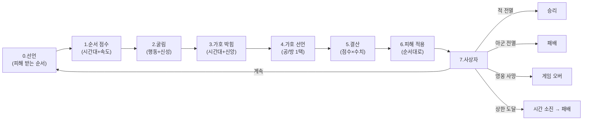

# COMBAT-STRUCT-001: 전투 구조

> 상태: 결정정합 (5-9 코어 + 5 패러미터 박힘) · 의존: @COMBAT-DICE-001, @COMBAT-UNIT-CARD, @COMBAT-JUDGE-001

> 5-9 5 패러미터 박힘 (이번 마디):
> - 라운드 결산 7단계로 정정 (순서·선언 자리 박힘)
> - 순서 시스템 = 시간대 보정 + 인물 속도 (행동·신성 무관)
> - 동점 처리 = 같은 진영 자연 결로 동시 행동 (3단 우선순위 폐기)
> - 피해 받는 순서 = 매 라운드 시작 선언 (전열 → 후열)
> - 결 a (트로이 결) = 적 사망 시 적 결산 무화
> - 가호 결산 = 신성력 곱셈치 (옛 결 = 인물 공·방 정정)
> 상세: `DOCS/DESIGN/LOG/2026-05-09_전투4.0_5패러미터_박힘.md`

## 정의

전투 = 라운드 반복. 행동 자동 + 신성 가호로 인간의 결과 신의 결이 합주. 영웅·재앙은 가호 1택으로 응대 자리 박힘. 무리·인간은 운만으로 굴러감. 매 라운드 시작 = 피해 받는 순서 선언. 순서 = 시간대 + 속도.

## 규칙

### 라운드 결산 (7단계)

```yaml
1_선언:       플레이어 = 피해 받는 순서 선언 (전열 → 후열)
              매 라운드 시작 (다른 결 가능)
              → 적 공격 시 선언 1번부터 hp 깎임

2_순서_점수:  각 인물 순서 점수 계산
              순서 점수 = 시간대 보정 + 인물 속도
              행동·신성 무관 (라운드 시작 시 정해짐)

3_굴림:       모두 행동 주사위 굴림. 영웅·재앙은 신성 주사위도 굴림.
              별 면 굴려지면 신성 주사위 재굴림 (무한). 별 면도 가호 박힘.

4_가호_박힘:  신성 면이 *현재 페이즈 시간대 일치 + 자기 신앙 일치* 시 박힘.
              반대 시간대 = 실패 (그저 무. 호메로스 결).
              별 면 = 무조건 가호.

5_가호_선언:  영웅·재앙 = 박힌 가호를 *공 또는 방* 1택. 동시 선언 (정보 비대칭).

6_결산:       각 인물 결산:
                공격 점수 = 칼 면 × 공격력 + (가호를 공으로 끌었을 시: 가호 수 × 신성력)
                방어 점수 = 방패 면 × 방어력 + (가호를 방으로 끌었을 시: 가호 수 × 신성력)
                실패 면 = 무

7_피해:       순서 점수 큰 쪽부터 행동
              피해 = max(0, 자기 공격 - 상대 방어)
              hp 깎임 = 상대 선언 1번부터
              앞 인물 hp 0 = 다음 인물 노출
              적 사망 시 = 적 결산 무화 (트로이 결, 결 a)
              동점 = 같은 진영 자연 결로 동시 행동
```

### 순서 점수 결산

```yaml
순서 점수 = 시간대 보정 + 인물 속도

시간대 보정:
  지상 인물 + 낮 페이즈 = +2
  지상 인물 + 밤 페이즈 = 0
  미궁 인물 + 낮 페이즈 = 0
  미궁 인물 + 밤 페이즈 = +2
  경계 인물 = +1 (낮·밤 무관)

동점 처리:
  같은 점수 = 같은 진영 (자연 결로) = 동시 행동
  → 시간대 보정이 같으면 같은 진영
  → 자연 결로 분리되니 3단 우선순위 X

결의 결:
  순서 = 템포 결 (누가 먼저 휘두름)
  결산 = 결의 결 (휘두름이 박힘)
  → 두 결 분리 = "느린 거인 / 빠른 자객" 결 살아남
```

### 피해 받는 순서

```yaml
선언:    매 라운드 시작
적용:    적 공격 시 = 선언 1번부터 hp 깎임
노출:    앞 인물 hp 0 = 다음 인물 노출

판단 자리:
  매 라운드 = "이번 라운드 누구를 앞에 둘지"
  강한 영웅 앞 = 트로이 결 (헥토르가 앞에 섬)
  약한 인물 앞 = 희생 결
  → 본인이 짚으신 "유저 선언이 의미 있어야"의 자연 자리

근거:
  순서 = 행동 순서 (시간대 + 속도)
  선언 = 피해 받는 순서 (별개 결)
  → 두 결이 분리됨. 행동 빠른 자가 반드시 앞은 아님.
```

### 가호 결산 정정 (5 패러미터 마디)

```yaml
옛 결 (5-9 코어): 가호 1개 = 인물 공·방 수치
새 결 (5 패러미터): 가호 1개 = *신성력*만큼

자리:
  공·방 수치 = 인간의 결 (행동 결산)
  신성력 = 신의 결 (가호 결산)
  → 두 결산이 *완전 분리*
  → 본인 박은 신화 결 깊이 정합
```

### 종료 조건

```yaml
승리:        적 전멸
패배:        아군 전멸
게임 오버:   테오도라 사망 (영웅 사망)
시간 소진:   라운드 상한 도달 시 양측 생존 → 아군 패배 (잠정)
```

### 라운드 상한

```yaml
값: 8 (5-5 결 잠정. 시뮬 후 확정)
종료 처리: 양측 생존 → 아군 패배
근거: 결사(R5+) 폐기로 지연 동기 없어짐. 시간 소진 = 작전 실패.
```

### 환경 표현 모델

```yaml
모델: 외부 모디파이어 (@COMBAT-DICE-001)
환경 (장소·날씨): 카드 효과·정찰 조건으로만 적용.
페이즈 시간대 (낮/밤): 신성 주사위 가호 박힘 조건 + 시간대 보정. @META-BOOK-001 페이즈 진행 결.
```

### 폐기 항목

```yaml
- 산개/밀집 (대형):       4-26 폐기
- 격자/좌우익/열:         4-12 시도, 4-26 폐기
- 심볼 해상도 순서:       4-12 시도
- 공격 대상 지정:         4-12 시도, 5-9 명시 폐기 (sRPG 결 안 감)
- 색 매칭:                4-08 시도, 4-26 폐기
- 일제 굴림:              밀집 폐기 연쇄
- 결사 (R5+):             5-5 폐기 (라운드 상한이 흡수)
- 방진 패시브:            5-5 폐기 (산개/밀집 의존)
- 시너지:                 5-5 폐기 (현 단계)
- 8 특성 시스템:          5-7 폐기 (전투 효과 — 다른 세션)
- 추종자 시스템:          5-7 폐기 (전투 종료 보상 — 다른 세션)
- 태그 시스템:            5-7 폐기 (사건 태그 — 다른 세션)
- 7스텝 라운드 (5-5):     5-9 폐기 (5-9 코어 정정)
- 면 = 시간대 (5-8):      5-9 정정 (행동 면과 신성 면 분리)
- 행동 = 카드락 (5-8):    5-9 정정 (행동 = 자동. 카드 = 페이즈 결)
- 매칭 점수 결 (5-8):     5-9 정정 (신성 주사위 풀 비율로 흡수)
- 다이몬 결 (5-9 시도):   5-9 폐기 (시너지·공유 효과 결 — 영영 안 박힐 수도)
- 행동 카드 / 모드 선언 / 비중 배분 (5-9 시도): 5-9 폐기 (sRPG·격투 결로 가지 않음)
- 3단 우선순위 (5-9 코어): 5-9 5패러미터 마디 폐기 (자연 결로 흡수)
- 가호 = 인물 공·방 수치 (5-9 코어): 5-9 5패러미터 마디 정정 (신성력으로)
- 행동 결과 종속 속도 (5-9 시도): 5-9 5패러미터 마디 정정 (속도 별도 패러미터)
```

## 시각



## TODO

- TODO(시뮬): 라운드 상한 8 검증 (시뮬 후 조정)
- TODO(시스템): 운명 페이즈 시간대 (낮/밤 둘 중)
- TODO(시스템): 가호 = 공/방 1택만 vs 분배 가능 (가호 N개를 K공/N-K방으로 나눔)
- TODO(시스템): 갈래 7 (덕목 우선) — 운명 전투 시 어느 영웅이 덕목 받을지 선언 자리
