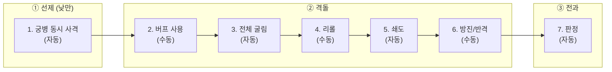

# COMBAT-STRUCT-001: 전투 구조 (Battle Structure)

> **상태:** 🔄 설계중 · **버전:** 1.2 · **ID:** COMBAT-STRUCT-001 · **수정일:** 2026-03-02

---

## ① 한 줄 요약

1턴 = 2라운드. 플레이어가 보는 건 3페이즈(선제/격돌/전과), 엔진이 처리하는 건 7스텝. 낮/밤은 스테이지 턴에서 상속 — 전투 내 교대 없음. 철수 없음 — 전투 진입 = 전투 종료까지.

---

## ② 규칙 정의

### 턴-라운드 구조

| 필드 | 내용 |
|------|------|
| **1턴** | 2라운드로 구성 |
| **1라운드** | 3페이즈 (플레이어 체감) = 7스텝 (엔진 처리) |
| **낮/밤** | 스테이지 턴에서 상속. 전투 내 교대 없음. |

### 3페이즈 (플레이어가 보는 것)

| 페이즈 | 이름 | 유저 설명 | 낮 | 밤 |
|--------|------|----------|----|----|
| ① | 선제 | 궁병이 먼저 쏜다. 양쪽 동시. 밤에는 없다 | O | 통째로 스킵 |
| ② | 격돌 | 주사위를 굴리고, 조정하고, 기병이 돌격한다 | O | O |
| ③ | 전과 | 칼과 방패가 부딪힌다. 뚫리면 죽는다 | O | O |

### 7스텝 (엔진이 처리하는 것)

| 페이즈 | 스텝 | 처리 내용 | 자동/수동 | 밤 처리 |
|--------|------|----------|----------|---------| 
| ① 선제 | 1 | 궁병 동시 사격 — 전원 랜덤 타겟. 사상자 동시 적용. 죽은 궁병도 사격 (화살은 날아감) | 자동 | 스킵 |
| ② 격돌 | 2 | 버프 사용 — 사건 카드 분기에서 획득한 전투 버프 소모. 면 확정(카드락), 리롤 추가 등. 버프 없으면 자동 스킵. → [STAGE-CARD-002](../../03_스테이지/스테이지카드규칙.md) 참조 | **수동** | O |
| | 3 | 전체 굴림 — 카드락 제외 나머지 전부 굴림. ★ 체이닝 완전 해소 후 진행. 동시 판정 | 자동 | O |
| | 4 | 리롤 — 기본 1회 (내 or 적 주사위 1개). 리롤 추가 버프 보유 시 추가 가능. 카드락 다이스 리롤 불가 | **수동** | O |
| | 5 | 쇄도 — 기병 수만큼 적 유효면(⚔/🛡/★)에서 랜덤 선택 → ✕로 변경. 카드락 관통. ✕는 선택 대상 아님. → 아래 쇄도 규칙 참조 | 자동 | O |
| | 6 | 방진/반격 — 보병 ⚔→🛡, 창병 🛡→⚔. 자기 결과만 전환. 카드락 다이스 전환 불가 | **수동** | O |
| ③ 전과 | 7 | 양측 동시 판정. 피해 = 상대⚔ - 내🛡. 뚫린 수만큼 랜덤 제거. 초과 🛡 소멸 | 자동 | O |

> **수동 3개:** 버프(2), 리롤(4), 방진/반격(6)
> **자동 4개:** 궁병 사격(1), 전체 굴림(3), 쇄도(5), 전과(7)

### 기병 쇄도 규칙 (스텝 5)

| 필드 | 내용 |
|------|------|
| **조건** | 아군 기병 1기 이상 생존 + 쇄도 패시브 보유 |
| **타이밍** | 스텝5 (리롤 후, 방진/반격 전) |
| **행동** | 적 주사위 중 ⚔/🛡/★에서만 기병 수만큼 랜덤 선택 → ✕로 변경 |
| **대상** | ⚔, 🛡, ★에서만 선택. ✕는 선택 대상이 아님 (헛발 없음) |
| **카드락** | 관통. 적 카드락 주사위도 ✕화 가능 |
| **체이닝 산물** | ★ 체이닝으로 이미 확정된 ⚔/🛡는 유지. 체이닝 완료 후 남은 최종 면만 ✕화 대상 |
| **밤** | 자동 처리. 적 주사위를 볼 필요 없음 (무작위) |
| **기병 0명** | 스텝5 자동 스킵 |
| **패시브 미획득** | 스텝5 자동 스킵 (쇄도 불가) |

> **카드락 관통:** 쇄도는 적 카드락 주사위도 ✕화할 수 있다. 적의 카드 확정을 기병 돌격이 무력화하는 설계.

### 유닛 전환 규칙 (스텝 6)

| 병종 | 전환 방향 | 패시브 | 설명 |
|------|-----------|--------|------|
| 민병 | 없음 | — | 기본 유닛 |
| 보병 | ⚔→🛡 | 방진 | 칼을 거두고 방패를 세운다 |
| 창병 | 🛡→⚔ | 반격 | 방패 뒤에서 창을 내민다 |
| 궁병 | 없음 | — | 원거리 전문 |
| 기병 | 없음 | — | 쇄도는 스텝5에서 별도 처리 |
| 영웅 (테오도라) | 🛡→⚔ | 반격 (창병 계열) | 창병 계열 |

> **Named = 같은 병종 + 고유명.** Nameless와 Named 모두 같은 전환 규칙 적용.
> **패시브는 등급 무관.** 전환 방향(⚔→🛡, 🛡→⚔)은 해당 패시브(방진, 반격)를 획득해야 사용 가능.

> **전환 대상:** 굴림 결과(면이 아닌 결과). 각 유닛은 자기 결과만 전환.
> **★ 체이닝 결과:** 전환 가능. 보병은 체이닝으로 생성된 ⚔를 🛡로, 창병/테오도라는 체이닝으로 생성된 🛡를 ⚔로 전환할 수 있다.
> **카드락 다이스:** 전환 불가. 리롤도 불가. 카드가 확정한 결과는 완전 잠금.

### 카드락 규칙

| 상황 | 처리 |
|------|------|
| 카드 확정 다이스 → 리롤 | **불가** |
| 카드 확정 다이스 → 유닛 전환 | **불가** |
| 카드 확정 다이스 → 기병 쇄도 (적 카드) | **가능.** 쇄도는 카드락을 관통 |
| 공격 카드 → 창병에 사용 | 유효. ⚔ 확정 + 잠금. 비효율적이나 절박한 상황에서 선택 가능 |
| 수비 카드 → 궁병에 사용 | 유효. 🛡 확정 + 잠금. 궁병이 방어하는 유일한 방법 |
| [돌격] 2pt (⚔⚔ 확정) → 보병 | 전환 불가. 카드 가치 보전 |

### 낮/밤 차이

| 항목 | 낮 (홀수 턴) | 밤 (짝수 턴) |
|------|-------------|-------------|
| **① 선제 페이즈** | 정상 진행 | 통째로 스킵 (궁병 격돌 합류) |
| **상대 주사위 결과** | 보임 | 안 보임 ("?" 처리) |
| **방진/반격** | 결과 보고 대응 가능 | 감으로 판단 |
| **리롤 (스텝 4)** | 내/적 자유 선택 (정보 기반) | 내 주사위만 안전 (적은 도박) |
| **기병 쇄도 (스텝 5)** | 자동 처리. 결과 보임 | 자동 처리. 결과 안 보임 (무작위라 문제 없음) |
| **영웅 선제 피격** | 랜덤 히트에 포함 | 리스크 없음 (선제 스킵) |

### 선제 페이즈 상세 (스텝 1)

| 필드 | 내용 |
|------|------|
| **조건** | 낮(홀수 턴)에만 발동. 밤에는 ① 페이즈 자체가 스킵 |
| **사격 방식** | 양측 동시 사격 |
| **타겟** | 전원 랜덤 타겟. Named/Nameless 구분 없이 적 전체 풀에서 랜덤 |
| **죽은 궁병** | 사격함 (화살은 날아감). 사상자 동시 적용 |
| **카드/리롤** | 없음. 선제에서는 카드도 리롤도 사용 불가 |
| **밤 궁병** | 격돌 페이즈에 합류 (주사위 추가) |
| **영웅 피격** | Named 전원 랜덤 히트 대상. 1히트=부상(면→✕), 2히트=사망 |
| **테오도라 사망** | 게임 오버 |

### 전투 종료 조건

| 조건 | 결과 |
|------|------|
| **적 전멸** | 승리. 전투 종료 |
| **테오도라 대 전멸** | 패배. 전투 종료 |
| **테오도라 사망** | 게임 오버 |
| **양측 동시 전멸** | 패배 처리 (테오도라 대가 소멸했으므로) |
| **턴 상한** | 미확정 — 무한 교착 방지용 턴 리밋 필요 여부 검토 중 |

> **철수 없음.** 전투 카드가 뒤집히면 분기 양쪽 다 전투 — 조건만 다르다. 전투에 진입하면 끝까지 싸운다.

---

## ③ 시각 자료

### 플레이어 체감 흐름 (3페이즈)

```
┌─────────────────────────────────────────────────┐
│ ① 선제 (낮만) — 자동                               │
│   양측 궁병 동시 사격 → 사상자 적용                   │
│   밤이면 이 박스 자체가 사라짐                        │
├─────────────────────────────────────────────────┤
│ ② 격돌                                           │
│   버프 쓴다 → 전체 굴린다 → 리롤?                    │
│   → 기병 쇄도 (자동) → 방진? 반격?                   │
├─────────────────────────────────────────────────┤
│ ③ 전과                                           │
│   칼과 방패 상쇄 → 뚫리면 죽는다                     │
└─────────────────────────────────────────────────┘
         ↓ 다음 라운드 or 전투 종료
```

### 엔진 처리 흐름 (7스텝)



### 턴 구조 다이어그램

```
턴 1 (낮)
├── 라운드 1
│   ├── ① 선제: [1]  (동시 사격, 자동)
│   ├── ② 격돌: [2→3→4→5→6]
│   └── ③ 전과: [7]
└── 라운드 2
    ├── ① 선제: [1]
    ├── ② 격돌: [2→3→4→5→6]
    └── ③ 전과: [7]

턴 2 (밤)
├── 라운드 3
│   ├── ① 선제: ──스킵──  (궁병 → 격돌 합류)
│   ├── ② 격돌: [2→3→4→5→6]  (적 결과 "?" 처리)
│   └── ③ 전과: [7]
└── 라운드 4
    ├── ① 선제: ──스킵──
    ├── ② 격돌: [2→3→4→5→6]
    └── ③ 전과: [7]

턴 3 (낮) ...
```

### 플레이어 판단 포인트 맵

```
라운드 1개 기준 — 플레이어가 실제로 뭘 하는가:

  ① 선제
     └─ 없음 (자동 처리, 관전만)

  ② 격돌
     └─ [판단 A] 버프: 면 확정? 리롤 추가? 사용 안 함?
     └─ [판단 B] 리롤: 내 주사위? 적 주사위? 안 함?
     └─ [자동] 기병 쇄도: 적 유효면 무작위 ✕화 (관전)
     └─ [판단 C] 방진/반격: 보병 ⚔→🛡? 창병 🛡→⚔? 안 함?

  ③ 전과
     └─ 없음 (자동 판정, 관전만)

  낮: 판단 3개 (A~C) + 선제 관전 + 쇄도 관전
  밤: 판단 3개 (A~C) — 정보 부족으로 더 어려움
```

### 유닛 전환 흐름도

```
스텝 6: 방진/반격 (패시브 보유 시에만 가능)

  보병 (Nameless/Named):  굴림 결과 ⚔ ──→ 🛡로 전환 가능  (방진 패시브)
  창병 (Nameless/Named):  굴림 결과 🛡 ──→ ⚔로 전환 가능  (반격 패시브)
  테오도라:               굴림 결과 🛡 ──→ ⚔로 전환 가능  (창병 계열)
  민병:                   전환 없음
  궁병:                   전환 없음
  기병:                   전환 없음 (쇄도는 스텝5에서 별도 처리)

  제외 대상:
  ├── 카드락 다이스 → 전환 불가
  ├── ★ 결과 자체 → 전환 불가 (체이닝 결과물은 가능)
  └── ✕ 결과 → 전환할 것이 없음
```

### 기병 쇄도 흐름도

```
스텝 5: 쇄도 (패시브 보유 시에만 가능)

  기병 생존 수 = N
  적 주사위 중 ⚔/🛡/★에서만 무작위 N개 선택
  ├── 선택된 것이 ⚔ → ✕로 변경 (적 공격력 감소)
  ├── 선택된 것이 🛡 → ✕로 변경 (적 방어력 감소)
  ├── 선택된 것이 ★ 최종면 → ✕로 변경 (체이닝 산물은 유지)
  └── 선택된 것이 카드락 → ✕로 변경 (적 카드 확정 무력화)

  ✕는 선택 대상이 아님 → 헛발 없음
```

---

### 엣지 케이스

| 상황 | 처리 |
|------|------|
| **밤에 궁병 0인 경우** | 선제 스킵은 동일. 격돌에서도 궁병 주사위 0개이므로 영향 없음 |
| **선제에서 적 전멸** | 전투 즉시 종료. 격돌 페이즈 진행하지 않음 |
| **선제에서 양측 궁병 동시 전멸** | 사상자 동시 적용 후, 격돌에서 궁병 없이 진행 |
| **선제에서 테오도라 피격** | 1히트=부상(면 1개→✕), 2히트=사망=게임오버 |
| **밤 공격 시 영웅 리스크** | 없음. 선제 자체가 스킵이므로 랜덤 히트 없음 |
| **격돌에서 양측 동시 전멸** | 패배 처리 (테오도라 대 소멸) |
| **방진/반격 시 보병/창병 0** | 스텝 6 해당 유닛 스킵. 다른 유닛 전환은 정상 진행 |
| **카드락 + 유닛 전환** | 카드로 확정된 다이스는 전환 불가. 카드 가치 보전 |
| **카드락 + 기병 쇄도** | 적 카드락 다이스도 쇄도 대상. 쇄도가 카드락 관통 |
| **★ 체이닝 결과 + 전환** | ★ 자체는 전환 불가. ★에서 생성된 ⚔ 1개는 전환 가능 |
| **★ 체이닝 결과 + 쇄도** | 체이닝 산물(이미 확정된 ⚔/🛡)은 유지. 최종 면만 ✕화 대상 |
| **밤에 리롤로 적 주사위 선택** | 적 결과가 "?"이므로 어떤 주사위인지 모른 채 리롤. 도박 |
| **밤에 기병 쇄도** | 자동 처리. 적 주사위 안 봐도 무작위 선택이므로 문제 없음 |
| **버프 없는 라운드** | 스텝 2 자동 스킵. 3으로 직행 |
| **기병 0명인 라운드** | 스텝 5 자동 스킵. 6으로 직행 |
| **1라운드에서 전투 종료 시 2라운드** | 진행하지 않음. 턴 즉시 종료 |

---

## ④ 플레이어 피드백 (UI/UX)

| 상황 | 피드백 |
|------|--------|
| **페이즈 전환** | 화면에 현재 페이즈 이름 표시: "선제" / "격돌" / "전과" |
| **낮/밤 전환** | 턴 시작 시 낮/밤 오버레이. 밤이면 화면 톤 다운 |
| **밤 — 적 주사위** | 개별 결과 "?" 처리. 전과(스텝 7)에서만 최종 피해 공개 |
| **① 스킵 (밤)** | 선제 페이즈 자체가 표시되지 않음. ② 격돌부터 시작 |
| **① 선제 (낮)** | 자동 연출. 양측 궁병 동시 사격 → 사상자 표시. 플레이어 입력 없음 |
| **⑤ 기병 쇄도** | 적 주사위 중 변경 대상 하이라이트 → ✕화 연출. 플레이어 입력 없음 |
| **자동 스텝 연출** | 자동 스텝(1, 3, 5, 7)은 연출로 흘러감. 플레이어 입력 대기 없음 |
| **수동 스텝 대기** | 버프(2), 리롤(4), 방진/반격(6) 시 입력 대기 |
| **유닛 전환 미리보기** | 전환 결과 미리보기 → 확정 구조. 되돌리기 가능 (확정 전까지) |
| **전투 종료** | 승리/패배 오버레이 + 사상자 요약 |
| **밤 전투 개시** | "밤에 공격하면 선제 없음, 적 정보 불완전" 툴팁 |

---

## ⑤ 테스트 케이스

> TC 미작성. [06_TC/전투_TC.md](../../06_TC/전투_TC.md)에서 통합 관리 예정.

---

## ⑥ 설계 근거

| 질문 | 답변 | 분류 |
|------|------|------|
| 왜 10스텝에서 7스텝으로 줄였나? | 선제 리롤/카드/사상자를 1스텝(동시 사격)으로 통합. 창병 반격 삭제. 게임 스케일 대비 전투 페이즈가 과도했음. | 복잡도 축소 |
| 왜 선제에서 카드/리롤을 뺐나? | 선제는 "화살 교환" 순간. 개입 없는 순수 동시 교환이 직관적. | 선제 단순화 |
| 왜 유닛 전환이 일방향인가? | 퍼마데스 환경에서 방패가 공격보다 귀함. 보병은 수비로, 창병은 공격으로만 유연성 부여. 양방향이면 클래스 정체성 희석. | 클래스 정체성 |
| 왜 기병 쇄도가 스텝5인가? | 리롤(스텝4) 후, 방진/반격(스텝6) 전. 쇄도로 적 🛡가 줄면 보병의 ⚔→🛡 전환 판단이 달라짐. 쇄도가 전환 판단에 영향을 주는 순서. | 판단 흐름 |
| 왜 쇄도가 카드락을 관통하나? | 적의 계획(카드 확정)을 기병 돌격이 무력화하는 판타지. 아군 카드락은 보호(전환/리롤 불가), 적 카드락만 쇄도에 뚫림. | 비대칭 설계 |
| 왜 쇄도가 ✕를 제외하나? | 기병 돌격이 빗나가는 건 판타지에 안 맞음. 적 진형의 유효 전력을 확정적으로 붕괴시키는 것이 쇄도의 본질. | 확정 파괴 |
| 왜 지형 전환을 삭제했나? | 기병 쇄도 도입으로 스텝5 역할 교체. ✕→⚔/🛡 전환(지형)보다 적 면 ✕화(쇄도)가 전투 판단에 기여하는 무게감이 큼. | 복잡도 교환 |
| 왜 카드락이 유닛 전환/리롤을 차단하나? | 카드로 확정한 결과를 뒤집으면 카드 비용이 무의미해짐. 확정은 확정. | 카드 가치 보전 |
| 왜 철수를 삭제했나? | 현행 카드 덱에서 전투 카드가 뒤집히면 분기 양쪽 다 전투 — 회피 불가, 조건 선택만 가능. 전투에 들어갔으면 책임진다. | 복잡도 축소 |
| 왜 3페이즈 / 7스텝 이중 구조인가? | 플레이어 체감은 단순하게(3), 엔진 처리는 정확하게(7). UI 레이어와 로직 레이어 분리. | 구조 설계 |
| 왜 페이즈 명칭을 선제/격돌/전과로 했나? | 전투 서사 흐름. 선제 사격 → 부딪힌다 → 결과가 나온다. 유저가 직관적으로 이해하는 전투의 3막 구조. | 유저 체감 |

---

## ⑦ 의존성

| 방향 | ID | 이름 | 관계 |
|------|----|------|------|
| ← NEEDS | COMBAT-DICE-001 | 다이스 규칙 | 모든 굴림(스텝 1, 3)이 이 규칙을 따름 |
| ← NEEDS | STAGE-CARD-002 | 스테이지카드규칙 | 스텝2 버프 소모, 스텝4 리롤 추가 버프 |
| → AFFECTS | COMBAT-ACT-002 | 리롤 | 스텝 4 타이밍 정의. 카드락 다이스 리롤 불가 |
| → AFFECTS | COMBAT-UNIT-T1 | Nameless 병종 | 궁병 선제(스텝 1), 기병 쇄도(스텝 5), 보병/창병 전환(스텝 6) |
| → AFFECTS | COMBAT-JUDGE-001 | 부상/사망 | 스텝 1 사상자, 스텝 7 전과 |
| ← NEEDS | COMBAT-UNIT-HERO | Named 인물 | 테오도라 전환(스텝 6) |

---

## ⑧ 미확정 사항

| 항목 | 현재 상태 | 필요한 결정 |
|------|----------|------------|
| **턴 상한** | 없음 | 무한 교착 방지용 턴 리밋 필요? 몇 턴? |
| **밤 리롤 — 적 주사위 선택 UI** | 미정 | "?" 상태에서 어떻게 선택하게 할 것인가 |
| **자동 스텝 연출 속도** | 미정 | 빠르게? 스킵 가능? 설정? |

---

## ⑨ 변경 이력

| 버전 | 날짜 | 변경 내용 | 사유 |
|------|------|-----------|------|
| 0.1 | 2026-02-25 | COMBAT_SYSTEM 정본에서 이관. 10페이즈 + 낮밤. | 위키 구축 |
| 0.2 | 2026-02-25 | 3페이즈/10스텝 이중 구조로 정본 수정. | UI/엔진 레이어 분리 |
| 0.3 | 2026-02-25 | **10스텝→7스텝.** 선제 단순화. 창병 반격 삭제. 유닛 전환 일방향. 카드락 규칙 추가. 철수 삭제. | 복잡도 축소 + 상업적 검증 |
| 0.4 | 2026-02-27 | 낮/밤 교대 삭제 → 스테이지 턴 상속. 스텝2 작전카드→토큰→버프. | 덱빌딩 구조 설계 세션 |
| 0.5 | 2026-02-27 | 유닛 전환 테이블 Named 체계 정합. | Named 체계 도입 |
| 0.6 | 2026-02-28 | 토큰→버프 전환. | 토큰 체계 전면 폐기 |
| 0.7 | 2026-02-28 | 의존성 ID 정리. | 위키 정합성 감사 |
| 0.8 | 2026-02-28 | 섹션 번호 정렬. | 운영규칙 템플릿 정합 |
| 0.9 | 2026-02-28 | 폐기 시스템 잔재 교체. ★ 체이닝 결과 전환 양방향 명시. | 위키 논리 검증 |
| 1.0 | 2026-02-28 | 승급 폐기 반영. | 시리즈-Chapter-Stage 구조 정합 |
| 1.1 | 2026-03-01 | **스텝5 지형→교란 교체.** ① 지형 전환(스텝5) 삭제 → 기병 교란 도입. ② Named 대응표 폐기 → 같은 병종 + 고유명. ③ 기병 교란: 기병 수만큼 적 주사위 무작위 ✕화, 카드락/★ 포함. ④ STAGE-TERRAIN 의존성 삭제. ⑤ 수동 4→3개, 자동 3→4개. | d10 전환 + 기병 추가 + 지형 폐기 기획 세션 |
| 1.2 | 2026-03-02 | **페이즈 명칭 + 쇄도 규칙 확정.** ① 페이즈 명칭: 본전투→격돌, 대응→(격돌에 통합), 사상자 계산→전과. ② 교란→쇄도. 전열 교대→방진. ③ 쇄도: ✕ 제외 선택(헛발 없음), 체이닝 산물 유지. ④ Named 궁병 타겟 지정 제거(전원 랜덤). ⑤ 유저 뷰/엔진 뷰 분리 강화. | Nameless 패시브 확정 + 전투 페이즈 명칭 세션 |
