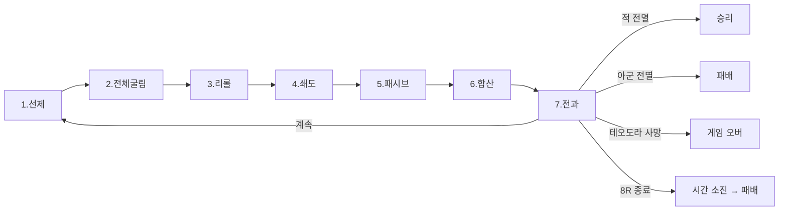

# COMBAT-STRUCT-001: 전투 구조

> 상태: **재설계 진행중 (5-8)** · 의존: @COMBAT-DICE-001, @COMBAT-UNIT-CARD, @COMBAT-JUDGE-001

> ⚠️ 5-8 큰 정정 예정:
> - 면 = 행동 표현 → 면 = 계산기 (행동 종속 X)
> - 행동 = 카드락 (매 라운드 시작 선언)
> - 7스텝 라운드 → 시간대 매칭 점수 결로 정정 (★ 보정 폐기, 매칭 점수 도입)
> - 패시브 시스템 (병종 1:1) → 직업/종족 행동 풀로 흡수
> - 등급 4종 (영웅/인간/재앙/무리)
> - 본문은 5-5 결 그대로. 다음 세션에서 전면 재작성 예정.
> 상세: `DOCS/DESIGN/LOG/2026-05-08_전투4.0_재설계_시작.md`

## 정의

전투 = 7스텝 라운드 반복. 4종 면(⚔🛡✕★) 주사위 + 카드별 공/방 스칼라로 피해 결정. 카드 1장 = 주사위 1개 = 유닛 1기.

## 규칙

### 7스텝 라운드

```yaml
1_선제:     궁병 패시브 — ⚔ 1발 사전 굴림
2_전체굴림: 아군·적 모든 카드 동시 굴림
3_리롤:     라운드당 1회 무료. 자기 주사위 1개. 재리롤 불가 (@COMBAT-ACT-002)
4_쇄도:     기병 패시브 — ★ 발생 시 ⚔ +1
5_패시브:   보병 굳건(🛡합+1) / 창병 반격(피해 받으면 ⚔ 추가)
6_합산:     ⚔합(★보정 후) × atk - 🛡합 × def = 피해 (max 0)
7_전과:     피해 적용. 사상자 처리 (@COMBAT-JUDGE-001)
```

### 종료 조건

```yaml
승리:        적 전멸
패배:        아군 전멸
게임_오버:   테오도라 사망 (@COMBAT-UNIT-HERO)
시간_소진:   8라운드 종료 시 양측 생존 → 아군 패배
```

### 라운드 상한

```yaml
값: 8
종료_처리: 양측 생존 → 아군 패배
근거: 결사(R5+) 폐기로 지연 동기 없어짐. 시간 소진 = 작전 실패.
```

### 패시브 시스템 (병종 1:1)

```yaml
민병: 없음
보병: 굳건 — 라운드 시작 시 🛡합 +1
창병: 반격 — 피해 받으면 ⚔ 1발 추가 굴림 (라운드당 1회)
궁병: 선제 — 라운드 시작 전 ⚔ 1발 사전 굴림
기병: 쇄도 — ★ 발생 시 추가 ⚔ +1
용병: 자유선택 — 위 4개 중 1개 (전투 시작 시 선언)
```

### 환경 표현 모델

```yaml
모델: 외부 모디파이어 (@COMBAT-DICE-001)
공/방_고유값_불변: 환경(낮/밤·날씨·장소)은 카드 효과·정찰 조건으로만 적용
```

### 전투 종료

```yaml
on_end:
  named_부상_회복: current 면 복원 (@COMBAT-JUDGE-001)
  운명_보상:       TODO(시스템) — 옛 추종자 자리 폐기 (다른 세션)
  사건_태그:       TODO(시스템) — 옛 태그 시스템 폐기 (다른 세션)
```

### 폐기 항목

```yaml
- 산개/밀집 (대형):       4-26
- 격자/좌우익/열:         4-12 시도, 4-26 폐기
- 심볼 해상도 순서:       4-12 시도
- 공격 대상 지정:         4-12 시도
- 색 매칭:                4-08 시도, 4-26 폐기
- 일제 굴림:              밀집 폐기 연쇄
- 결사 (R5+):             5-5 폐기 (라운드 상한이 흡수)
- 방진 패시브:            5-5 폐기 (산개/밀집 의존)
- 시너지:                 5-5 폐기 (현 단계)
- 8 특성 시스템 (전투 효과): 5-7 폐기 (특성 재설계 — 다른 세션)
- 추종자 시스템 (전투 종료 보상): 5-7 폐기 (다른 세션)
- 태그 시스템 (사건 태그):  5-7 폐기 (다른 세션)
```

## 시각


