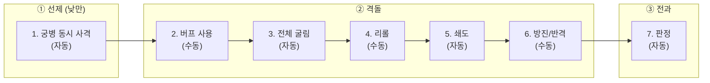

# COMBAT-STRUCT-001: 전투 구조 (Battle Structure)

> **상태:** 🔄 설계중 · **버전:** 1.3 · **ID:** COMBAT-STRUCT-001 · **수정일:** 2026-03-02

---

## ① 한 줄 요약

전투 = 라운드 반복. 플레이어가 보는 건 3페이즈(선제/격돌/전과), 엔진이 처리하는 건 7스텝. 낮/밤은 스테이지 턴에서 상속 — 전투 내 교대 없음, 끝까지 유지. 5라운드부터 결사 돌입. 8라운드 상한. 철수 없음.

---

## ② 규칙 정의

### 라운드 구조

| 필드 | 내용 |
|------|------|
| **전투** | 라운드 반복. 종료 조건 충족 또는 8라운드 상한까지 |
| **1라운드** | 3페이즈 (플레이어 체감) = 7스텝 (엔진 처리) |
| **낮/밤** | 스테이지 턴에서 상속. 전투 내 교대 없음. 밤 전투면 끝까지 밤 |
| **라운드 상한** | 8라운드. 상한 도달 시 패배 |
| **결사** | 5라운드부터 양측 모든 🛡를 ⚔로 판정 |

> **"턴"은 스테이지 전용 용어.** 전투에서는 "라운드"만 사용한다.

### 3페이즈 (플레이어가 보는 것)

| 페이즈 | 이름 | 유저 설명 | 낮 | 밤 |
|--------|------|----------|----|----|
| ① | 선제 | 궁병이 먼저 쏜다. 양쪽 동시. 밤에는 없다 | O | 통째로 스킵 |
| ② | 격돌 | 주사위를 굴리고, 조정하고, 기병이 돌격한다 | O | O |
| ③ | 전과 | 칼과 방패가 부딪힌다. 뚫리면 죽는다 | O | O |

### 7스텝 (엔진이 처리하는 것)

| 페이즈 | 스텝 | 처리 내용 | 자동/수동 | 밤 처리 |
|--------|------|----------|----------|---------|
| ① 선제 | 1 | 궁병 동시 사격 — 전원 랜덤 타겟. 사상자 동시 적용. 죽은 궁병도 사격 (화살은 날아감) | 자동 | 스킵 |
| ② 격돌 | 2 | 버프 사용 — 사건 카드 분기에서 획득한 전투 버프 소모. 면 확정(카드락), 리롤 추가 등. 버프 없으면 자동 스킵. → [STAGE-CARD-002](../../03_스테이지/스테이지카드규칙.md) 참조 | **수동** | O |
| | 3 | 전체 굴림 — 카드락 제외 나머지 전부 굴림. ★ 체이닝 완전 해소 후 진행. 동시 판정 | 자동 | O |
| | 4 | 리롤 — 기본 1회 (내 or 적 주사위 1개). 리롤 추가 버프 보유 시 추가 가능. 카드락 다이스 리롤 불가 | **수동** | O |
| | 5 | 쇄도 — 쇄도 보유자 수만큼 적 유효면(⚔/🛡/★)에서 랜덤 선택 → ✕로 변경. 카드락 관통. ✕는 선택 대상 아님. → 아래 쇄도 규칙 참조 | 자동 | O |
| | 6 | 방진/반격 — 보병 ⚔→🛡, 창병 🛡→⚔. 자기 결과만 전환. 카드락 다이스 전환 불가. **결사 중 무력화** | **수동** | O |
| ③ 전과 | 7 | 양측 동시 판정. 피해 = 상대⚔ - 내🛡. 뚫린 수만큼 랜덤 제거. 초과 🛡 소멸. **결사 중 🛡→⚔ 판정** | 자동 | O |

> **수동 3개:** 버프(2), 리롤(4), 방진/반격(6)
> **자동 4개:** 궁병 사격(1), 전체 굴림(3), 쇄도(5), 전과(7)

### 결사 규칙 (5라운드~)

| 필드 | 내용 |
|------|------|
| **발동** | 5라운드부터 전투 종료까지 양측 적용 |
| **효과** | 모든 🛡를 ⚔로 판정. 면 자체는 변하지 않음, 판정만 변경 |
| **카드락** | 카드락 🛡도 ⚔로 판정. 결사가 모든 것을 덮어씀 |
| **방진/반격** | 무력화. 방진(⚔→🛡)은 🛡가 다시 ⚔가 되어 무의미. 반격(🛡→⚔)은 이미 ⚔라 전환할 것 없음 |
| **★ 체이닝** | 재굴림에서 🛡 나와도 ⚔ 판정. ✕만 아니면 전부 공격 |
| **쇄도** | 정상 작동. 적 ⚔(원래🛡 포함)를 ✕로 바꾸면 적 공격 감소 — 결사에서 쇄도 가치 상승 |
| **리롤** | 정상 작동. 결사에서 유일한 능동적 개입 수단 |
| **예고** | 4라운드 종료 시 "다음 라운드부터 결사" 경고 |

> **결사의 본질:** 방패가 사라진다. 양측 전부 공격만. 주사위 수가 많은 쪽이 이긴다. 소수인 테오도라 대에게 불리 — "5라운드 안에 끝내라"는 압박.
>
> **서사:** "더 이상 방패 뒤에 숨을 수 없다. 칼을 들어라."

### 기병 쇄도 규칙 (스텝 5)

| 필드 | 내용 |
|------|------|
| **조건** | 아군 쇄도 보유자 1기 이상 생존 |
| **타이밍** | 스텝5 (리롤 후, 방진/반격 전) |
| **행동** | 적 주사위 중 ⚔/🛡/★에서만 쇄도 보유자 수만큼 랜덤 선택 → ✕로 변경 |
| **대상** | ⚔, 🛡, ★에서만 선택. ✕는 선택 대상이 아님 (헛발 없음) |
| **카드락** | 관통. 적 카드락 주사위도 ✕화 가능 |
| **체이닝 산물** | ★ 체이닝으로 이미 확정된 ⚔/🛡는 유지. 체이닝 완료 후 남은 최종 면만 ✕화 대상 |
| **밤** | 자동 처리. 적 주사위를 볼 필요 없음 (무작위) |
| **쇄도 보유자 0명** | 스텝5 자동 스킵 |

> **쇄도 보유자:** 쇄도 패시브를 가진 모든 유닛. 기병 + 쇄도가 걸린 기사 모두 카운트에 포함.
> **카드락 관통:** 쇄도는 적 카드락 주사위도 ✕화할 수 있다.

### 유닛 전환 규칙 (스텝 6)

| 병종 | 전환 방향 | 패시브 | 결사 중 |
|------|-----------|--------|---------|
| 민병 | 없음 | — | — |
| 보병 | ⚔→🛡 | 방진 | 무력화 (🛡→⚔ 판정) |
| 창병 | 🛡→⚔ | 반격 | 무력화 (이미 ⚔ 판정) |
| 궁병 | 없음 | — | — |
| 기병 | 없음 | — | — |
| 기사 | 패시브 의존 | 방진/반격/쇄도 중 1 | 방진/반격 시 무력화 |

> **전환 대상:** 굴림 결과. 각 유닛은 자기 결과만 전환.
> **★ 체이닝 결과:** 전환 가능.
> **카드락 다이스:** 전환 불가. 리롤도 불가. 카드가 확정한 결과는 완전 잠금.

### 카드락 규칙

| 상황 | 처리 |
|------|------|
| 카드 확정 다이스 → 리롤 | **불가** |
| 카드 확정 다이스 → 유닛 전환 | **불가** |
| 카드 확정 다이스 → 쇄도 (적 카드) | **가능.** 쇄도는 카드락을 관통 |
| 카드 확정 🛡 → 결사 | **⚔로 판정.** 결사가 모든 것을 덮어씀 |

### 낮/밤 차이

| 항목 | 낮 | 밤 |
|------|----|----|
| **① 선제 페이즈** | 정상 진행 | 통째로 스킵 (궁병 격돌 합류) |
| **상대 주사위 결과** | 보임 | 안 보임 ("?" 처리) |
| **방진/반격** | 결과 보고 대응 가능 | 감으로 판단 |
| **리롤 (스텝 4)** | 내/적 자유 선택 (정보 기반) | 내 주사위만 안전 (적은 도박) |
| **기병 쇄도 (스텝 5)** | 자동 처리. 결과 보임 | 자동 처리. 결과 안 보임 |
| **영웅 선제 피격** | 랜덤 히트에 포함 | 리스크 없음 (선제 스킵) |
| **전투 내 교대** | 없음. 끝까지 낮 | 없음. 끝까지 밤 |

> **밤 전투 경고 (UI):** "밤 전투 — 선제 없음, 적 정보 불완전, 궁병 선제 공격 무력화"

### 선제 페이즈 상세 (스텝 1)

| 필드 | 내용 |
|------|------|
| **조건** | 낮에만 발동. 밤에는 ① 페이즈 자체가 스킵 |
| **사격 방식** | 양측 동시 사격 |
| **타겟** | 전원 랜덤 타겟 |
| **죽은 궁병** | 사격함 (화살은 날아감). 사상자 동시 적용 |
| **카드/리롤** | 없음. 선제에서는 카드도 리롤도 사용 불가 |
| **밤 궁병** | 격돌 페이즈에 합류 (주사위 추가) |
| **영웅 피격** | Named 전원 랜덤 히트 대상. 1히트=부상(유효면 랜덤→✕, ★ 포함), 2히트=사망 |
| **테오도라 사망** | 게임 오버 |

### 전투 종료 조건

| 조건 | 결과 |
|------|------|
| **적 전멸** | 승리 |
| **테오도라 대 전멸** | 패배 |
| **테오도라 사망** | 게임 오버 |
| **양측 동시 전멸** | 패배 처리 |
| **8라운드 상한** | 패배. "전선을 돌파하지 못했다" |

> **철수 없음.** 전투에 진입하면 끝까지 싸운다.

---

## ③ 시각 자료

### 플레이어 체감 흐름 (3페이즈)

```
┌─────────────────────────────────────────────────┐
│ ① 선제 (낮만) — 자동                               │
│   양측 궁병 동시 사격 → 사상자 적용                   │
│   밤이면 이 박스 자체가 사라짐                        │
├─────────────────────────────────────────────────┤
│ ② 격돌                                           │
│   버프 쓴다 → 전체 굴린다 → 리롤?                    │
│   → 기병 쇄도 (자동) → 방진? 반격?                   │
├─────────────────────────────────────────────────┤
│ ③ 전과                                           │
│   칼과 방패 상쇄 → 뚫리면 죽는다                     │
│   (결사 중: 방패 없음. 전부 칼)                       │
└─────────────────────────────────────────────────┘
         ↓ 다음 라운드 or 전투 종료
```

### 엔진 처리 흐름 (7스텝)



### 라운드 진행 다이어그램

```
낮 전투 (전 라운드 낮 유지)
├── R1: 선제→격돌→전과
├── R2: 선제→격돌→전과
├── R3: 선제→격돌→전과
├── R4: 선제→격돌→전과 ← "다음 라운드부터 결사" 경고
├── R5: 선제→격돌→전과 ← 결사 돌입. 🛡→⚔ 판정
├── R6: 선제→격돌→전과 ← 결사 계속
├── R7: 선제→격돌→전과 ← 결사 계속
└── R8: 선제→격돌→전과 ← 상한. 종료 안 되면 패배

밤 전투 (전 라운드 밤 유지)
├── R1: (선제 스킵)→격돌→전과
├── R2: (선제 스킵)→격돌→전과
├── R3: (선제 스킵)→격돌→전과
├── R4: (선제 스킵)→격돌→전과 ← 결사 경고
├── R5~R8: 동일 (결사 + 선제 없음)
```

### 플레이어 판단 포인트 맵

```
라운드 1개 기준 — 플레이어가 실제로 뭘 하는가:

  ① 선제
     └─ 없음 (자동 처리, 관전만)

  ② 격돌
     └─ [판단 A] 버프: 면 확정? 리롤 추가? 사용 안 함?
     └─ [판단 B] 리롤: 내 주사위? 적 주사위? 안 함?
     └─ [자동] 쇄도: 적 유효면 무작위 ✕화 (관전)
     └─ [판단 C] 방진/반격: 보병 ⚔→🛡? 창병 🛡→⚔? 안 함?
                 (결사 중: 무력화. 판단 C 사라짐)

  ③ 전과
     └─ 없음 (자동 판정, 관전만)

  R1~R4: 판단 3개 (A~C)
  R5~R8: 판단 2개 (A~B). 결사로 C 무력화
```

### 유닛 전환 흐름도

```
스텝 6: 방진/반격 (패시브 보유 시에만 가능)

  보병 (Nameless/Named):  굴림 결과 ⚔ ──→ 🛡로 전환 가능  (방진 패시브)
  창병 (Nameless/Named):  굴림 결과 🛡 ──→ ⚔로 전환 가능  (반격 패시브)
  기사 (패시브 의존):     방진이면 ⚔→🛡, 반격이면 🛡→⚔
  민병:                   전환 없음
  궁병:                   전환 없음
  기병:                   전환 없음 (쇄도는 스텝5에서 별도 처리)

  결사 중 (R5~):
  ├── 방진 무력화: 🛡→⚔ 판정이므로 ⚔→🛡 무의미
  ├── 반격 무력화: 🛡가 이미 ⚔ 판정이므로 전환할 것 없음
  └── 리롤만 유일한 개입 수단

  제외 대상:
  ├── 카드락 다이스 → 전환 불가
  ├── ★ 결과 자체 → 전환 불가 (체이닝 결과물은 가능)
  └── ✕ 결과 → 전환할 것이 없음
```

### 기병 쇄도 흐름도

```
스텝 5: 쇄도 (패시브 보유 시에만 가능)

  쇄도 보유자 수 = N (기병 + 쇄도 기사)
  적 주사위 중 ⚔/🛡/★에서만 무작위 N개 선택
  ├── 선택된 것이 ⚔ → ✕로 변경
  ├── 선택된 것이 🛡 → ✕로 변경
  ├── 선택된 것이 ★ 최종면 → ✕로 변경 (체이닝 산물 유지)
  └── 선택된 것이 카드락 → ✕로 변경

  ✕는 선택 대상이 아님 → 헛발 없음
```

---

### 엣지 케이스

| 상황 | 처리 |
|------|------|
| **밤에 궁병 0인 경우** | 선제 스킵은 동일. 격돌에서도 궁병 주사위 0개 |
| **선제에서 적 전멸** | 전투 즉시 종료 |
| **선제에서 양측 궁병 동시 전멸** | 사상자 동시 적용 후, 격돌에서 궁병 없이 진행 |
| **선제에서 테오도라 피격** | 1히트=부상(유효면 랜덤→✕), 2히트=사망=게임오버 |
| **격돌에서 양측 동시 전멸** | 패배 처리 |
| **카드락 + 유닛 전환** | 카드로 확정된 다이스는 전환 불가 |
| **카드락 + 쇄도** | 적 카드락 다이스도 쇄도 대상. 쇄도가 카드락 관통 |
| **카드락 🛡 + 결사** | ⚔로 판정. 결사가 모든 것을 덮어씀 |
| **★ 체이닝 + 결사** | 재굴림에서 🛡 나와도 ⚔ 판정. ✕만 아니면 전부 공격 |
| **★ 체이닝 결과 + 쇄도** | 체이닝 산물 유지. 최종 면만 ✕화 대상 |
| **밤에 리롤로 적 주사위 선택** | "?"이므로 도박 |
| **밤에 쇄도** | 자동 처리. 무작위 선택이므로 문제 없음 |
| **결사 + 방진** | 무력화. ⚔→🛡 해도 🛡→⚔ 판정 |
| **결사 + 반격** | 무력화. 🛡가 이미 ⚔ 판정이라 전환할 것 없음 |
| **결사 + 쇄도** | 정상 작동. 적 ⚔(원래🛡)→✕ = 적 공격 감소 |
| **결사 + 리롤** | 정상 작동. 결사에서 유일한 능동적 개입 |
| **8라운드에도 양측 생존** | 패배 처리 |

---

## ④ 플레이어 피드백 (UI/UX)

| 상황 | 피드백 |
|------|--------|
| **페이즈 전환** | 화면에 현재 페이즈 이름 표시: "선제" / "격돌" / "전과" |
| **낮/밤** | 전투 시작 시 낮/밤 오버레이. 밤이면 화면 톤 다운 |
| **밤 전투 경고** | "밤 전투 — 선제 없음, 적 정보 불완전, 궁병 선제 공격 무력화" |
| **밤 — 적 주사위** | "?" 처리. 전과(스텝7)에서만 최종 피해 공개 |
| **① 스킵 (밤)** | 선제 페이즈 미표시. ② 격돌부터 시작 |
| **① 선제 (낮)** | 자동 연출. 양측 궁병 동시 사격 → 사상자 표시 |
| **⑤ 쇄도** | 적 주사위 ✕화 연출. 변경 대상 하이라이트 |
| **R4 종료** | **"다음 라운드부터 결사 — 방패가 칼이 된다" 경고** |
| **R5~ 결사** | UI 톤 변경. 🛡 아이콘이 ⚔로 변환되는 연출. "결사" 표시 상시 |
| **결사 중 방진/반격** | "결사: 방진 무력화" / "결사: 반격 무력화" 표시 |
| **R8 상한** | "전선을 돌파하지 못했다" → 패배 |
| **유닛 전환 미리보기** | 전환 결과 미리보기 → 확정. 되돌리기 가능 |
| **전투 종료** | 승리/패배 오버레이 + 사상자 요약 |

---

## ⑤ 테스트 케이스

> TC 미작성. [06_TC/전투_TC.md](../../06_TC/전투_TC.md)에서 통합 관리 예정.

---

## ⑥ 설계 근거

| 질문 | 답변 | 분류 |
|------|------|------|
| 왜 전투에 "턴"이 없는가? | 낮/밤이 전투 내에서 교대하지 않으므로 라운드를 턴으로 묶을 이유가 없다. "턴"은 스테이지 전용 용어. | 구조 단순화 |
| 왜 낮/밤이 전투 내에서 안 바뀌는가? | 전투는 스테이지 1턴 안에서 벌어지는 사건. 턴이 바뀌지 않았으니 낮/밤도 안 바뀐다. | 시간 일관성 |
| 왜 결사인가? | 방어가 사라지면 순수 화력전. 소수인 테오도라 대에게 불리 — "5라운드 안에 끝내라"는 압박. | 교착 방지 |
| 왜 5라운드부터인가? | R1~R4는 전술 전투(방진/반격/리롤 연쇄). R5~는 결사(순수 화력). 4라운드면 충분한 전술 공간. | 리듬 설계 |
| 왜 8라운드 상한인가? | 결사 진입 후 3~4라운드면 대부분 끝남. 8이면 넉넉한 안전장치. | 안전장치 |
| 왜 결사에서 카드락 🛡도 ⚔인가? | 결사는 판정 레이어 규칙. 면이 아니라 판정을 덮어쓴다. 카드 가치는 R1~R4에서 이미 발휘. | 규칙 일관성 |
| 왜 쇄도가 "기병 수"가 아닌가? | 기사가 쇄도 패시브를 가질 수 있으므로 "쇄도 보유자 수"로 일반화. | 기사 병종 도입 |
| 왜 선제에서 카드/리롤을 뺐나? | 선제는 "화살 교환" 순간. 개입 없는 순수 동시 교환이 직관적. | 선제 단순화 |
| 왜 유닛 전환이 일방향인가? | 퍼마데스 환경에서 방패가 공격보다 귀함. 양방향이면 클래스 정체성 희석. | 클래스 정체성 |
| 왜 쇄도가 카드락을 관통하나? | 적의 카드 확정을 기병 돌격이 무력화하는 판타지. | 비대칭 설계 |
| 왜 쇄도가 ✕를 제외하나? | 기병 돌격이 빗나가는 건 판타지에 안 맞음. 확정 파괴. | 확정 파괴 |
| 왜 철수를 삭제했나? | 전투 카드가 뒤집히면 회피 불가, 조건 선택만 가능. | 복잡도 축소 |
| 왜 3페이즈 / 7스텝 이중 구조인가? | 플레이어 체감은 단순(3), 엔진 처리는 정확(7). | UI/로직 분리 |

---

## ⑦ 의존성

| 방향 | ID | 이름 | 관계 |
|------|----|------|------|
| ← NEEDS | COMBAT-DICE-001 | 다이스 규칙 | 모든 굴림(스텝 1, 3)이 이 규칙을 따름 |
| ← NEEDS | STAGE-CARD-002 | 스테이지카드규칙 | 스텝2 버프 소모, 스텝4 리롤 추가 버프 |
| → AFFECTS | COMBAT-ACT-002 | 리롤 | 스텝 4 타이밍 정의. 카드락 리롤 불가 |
| → AFFECTS | COMBAT-UNIT-T1 | Nameless 병종 | 궁병 선제, 쇄도, 방진/반격 |
| → AFFECTS | COMBAT-JUDGE-001 | 부상/사망 | 스텝 1 사상자, 스텝 7 전과 |
| ← NEEDS | COMBAT-UNIT-HERO | Named 인물 | 기사 전환, 테오도라 사망=게임오버 |
| ← NEEDS | STAGE-SEASON | 계절 | 가을: 밤 선제 허용 |

---

## ⑧ 미확정 사항

| 항목 | 현재 상태 | 필요한 결정 |
|------|----------|------------|
| **밤 리롤 — 적 주사위 선택 UI** | 미정 | "?" 상태에서 어떻게 선택하게 할 것인가 |
| **자동 스텝 연출 속도** | 미정 | 빠르게? 스킵 가능? 설정? |
| **결사 연출** | 방향만 확정 | 구체적 시각 연출 설계 |

> ~~턴 상한~~: 라운드 상한 8 + 결사(R5~)로 확정.

---

## ⑨ 변경 이력

| 버전 | 날짜 | 변경 내용 | 사유 |
|------|------|-----------|------|
| 0.1 | 2026-02-25 | COMBAT_SYSTEM 정본에서 이관. 10페이즈 + 낮밤. | 위키 구축 |
| 0.2 | 2026-02-25 | 3페이즈/10스텝 이중 구조로 정본 수정. | UI/엔진 레이어 분리 |
| 0.3 | 2026-02-25 | **10스텝→7스텝.** 선제 단순화. 유닛 전환 일방향. 카드락 추가. 철수 삭제. | 복잡도 축소 |
| 0.4 | 2026-02-27 | 낮/밤 교대 삭제 → 스테이지 턴 상속. 스텝2 버프. | 덱빌딩 구조 설계 세션 |
| 0.5 | 2026-02-27 | 유닛 전환 테이블 Named 체계 정합. | Named 체계 도입 |
| 0.6~1.0 | 2026-02-28 | 토큰→버프, 의존성 정리, 승급 폐기. | 다수 세션 |
| 1.1 | 2026-03-01 | **스텝5 교란→쇄도 교체.** 기병 추가. 지형 폐기. | d10 전환 + 기병 추가 |
| 1.2 | 2026-03-02 | **페이즈 명칭 확정.** 본전투→격돌, 사상자→전과. 쇄도 ✕ 제외. Named 궁병 타겟 제거. | 패시브 확정 세션 |
| 1.3 | 2026-03-02 | **전투 턴 제거 + 결사 + 기사 병종.** ① 전투 "턴" 레이어 제거 → 라운드 반복. ② 낮/밤 전투 내 교대 없음 명확화. ③ 결사(R5~): 🛡→⚔ 판정, 방진/반격 무력화. ④ 라운드 상한 8. ⑤ 쇄도 카운트: 기병 수→쇄도 보유자 수. ⑥ "턴"은 스테이지 전용, 전투는 "라운드". | 기사 병종 + 결사 + 구조 정합 세션 |
