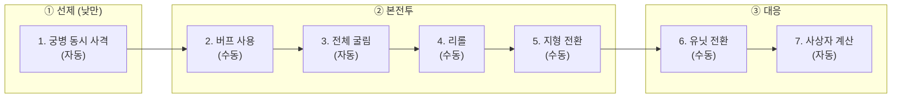

# COMBAT-STRUCT-001: 전투 구조 (Battle Structure)

> **상태:** 🔄 설계중 · **버전:** 0.7 · **ID:** COMBAT-STRUCT-001 · **수정일:** 2026-02-28

---

## ① 한 줄 요약

1턴 = 2라운드. 플레이어가 보는 건 3페이즈, 엔진이 처리하는 건 7스텝. 낮/밤은 스테이지 턴에서 상속 — 전투 내 교대 없음. 철수 없음 — 전투 진입 = 전투 종료까지.

---

## ② 규칙 정의

### 턴-라운드 구조

| 필드 | 내용 |
|------|------|
| **1턴** | 2라운드로 구성 |
| **1라운드** | 3페이즈 (플레이어 체감) = 7스텝 (엔진 처리) |
| **낮/밤** | 스테이지 턴에서 상속. 전투 내 교대 없음. (v0.4 변경) |

### 3페이즈 (플레이어가 보는 것)

| 페이즈 | 이름 | 플레이어 행동 | 낮 | 밤 |
|--------|------|-------------|----|----|
| ① | 선제 | 없음 (자동 처리) | O | 통째로 스킵 |
| ② | 본전투 | 버프 사용, 리롤, 지형 선택 | O | O |
| ③ | 대응 | 유닛 전환 | O (정보 기반) | O (감으로) |

### 7스텝 (엔진이 처리하는 것)

| 페이즈 | 스텝 | 처리 내용 | 자동/수동 | 밤 처리 |
|--------|------|----------|----------|---------|
| ① 선제 | 1 | 궁병 동시 사격 — 앰버 타겟 지정, 나머지 적 전체 풀에서 랜덤. 사상자 동시 적용. 죽은 궁병도 사격 (화살은 날아감) | 자동 | 스킵 |
| ② 본전투 | 2 | 버프 사용 — 카드 분기에서 획득한 전투 버프 소모. 면 확정, 선제 등 버프 종류에 따라 효과 적용. 버프 없으면 자동 스킵. → [STAGE-CARD-002](../../03_스테이지/스테이지카드규칙.md) 참조 | **수동** | O |
| | 3 | 전체 굴림 — 카드락 제외 나머지 전부 굴림, 동시 판정 | 자동 | O |
| | 4 | 리롤 — 기본 리롤 1회 (내 or 적 주사위 1개). 리롤 추가 버프 보유 시 추가 리롤. 카드락 다이스 리롤 불가. → [STAGE-CARD-002](../../03_스테이지/스테이지카드규칙.md) 참조 | **수동** | O |
| | 5 | 지형 전환 — ✕ 결과 1개를 지형 효과로 전환. 매 라운드 가능 | **수동** | O |
| ③ 대응 | 6 | 유닛 전환 — 일방향 전환 (아래 표 참조). 카드락 다이스 전환 불가 | **수동** | O |
| | 7 | 사상자 계산 — 본 라운드 최종 결과 적용 | 자동 | O |

> **수동 4개:** 버프(2), 리롤(4), 지형 선택(5), 유닛 전환(6)
> **자동 3개:** 궁병 사격(1), 전체 굴림(3), 사상자 계산(7)

### 유닛 전환 규칙 (스텝 6)

| 유닛 계열 | Nameless | Named | 전환 방향 | 설명 |
|-----------|----------|-------|-----------|------|
| 민병 | 민병 | 용병 | 없음 | 기본 유닛 |
| 보병 | 보병 | 기병 | ⚔→🛡 | 필요 시 거북이 가능 |
| 창병 | 창병 | 기사 | 🛡→⚔ | 필요 시 펀치 가능 |
| 궁병 | 궁병 | 석궁병 | 없음 | 원거리 전문 |
| 영웅 | — | 테오도라 / 기사 | 🛡→⚔ (★ 잠금) | 창병 계열 |
| 영웅 | — | 앰버 / 궁병 | 없음 | 궁병 계열 |

> **Named = 승급 시 T2 병종명 획득.** Nameless 보병이 승급하면 Named 기병이 된다.
> **패시브는 등급 무관.** Nameless와 Named 모두 같은 패시브를 획득·보유할 수 있다. 전환 방향(⚔→🛡, 🛡→⚔)은 해당 패시브(전열 교대, 반격)를 획득해야 사용 가능.

> **전환 대상:** 굴림 결과(면이 아닌 결과). 각 유닛은 자기 결과만 전환.
> **★ 체이닝 결과:** 전환 가능. ★에서 생성된 ⚔ 1개는 🛡로 교환할 수 있다.
> **카드락 다이스:** 전환 불가. 리롤도 불가. 카드가 확정한 결과는 완전 잠금.

### 카드락 규칙

| 상황 | 처리 |
|------|------|
| 카드 확정 다이스 → 리롤 | **불가** |
| 카드 확정 다이스 → 유닛 전환 | **불가** |
| 카드 확정 다이스 → 지형 전환 | **불가** (✕가 아니므로 해당 없음) |
| 공격 카드 → 창병에 사용 | 유효. ⚔ 확정 + 잠금. 비효율적이나 절박한 상황에서 선택 가능 |
| 수비 카드 → 궁병에 사용 | 유효. 🛡 확정 + 잠금. 궁병이 방어하는 유일한 방법 |
| [돌격] 2pt (⚔⚔ 확정) → 보병 | 전환 불가. 카드 가치 보전 |

### 낮/밤 차이

| 항목 | 낮 (홀수 턴) | 밤 (짝수 턴) |
|------|-------------|-------------|
| **① 선제 페이즈** | 정상 진행 | 통째로 스킵 (궁병 본전투 합류) |
| **상대 주사위 결과** | 보임 | 안 보임 ("?" 처리) |
| **유닛 전환 ③** | 결과 보고 대응 가능 | 감으로 판단 |
| **리롤 (스텝 4)** | 내/적 자유 선택 (정보 기반) | 내 주사위만 안전 (적은 도박) |
| **앰버 타겟 지정** | 발동 (선제에서 사살 대상 지정) | 발동 안 함 (선제 자체 스킵) |
| **영웅 선제 피격** | 랜덤 히트에 포함 | 리스크 없음 (선제 스킵) |

### 선제 페이즈 상세 (스텝 1)

| 필드 | 내용 |
|------|------|
| **조건** | 낮(홀수 턴)에만 발동. 밤에는 ① 페이즈 자체가 스킵 |
| **사격 방식** | 양측 동시 사격. "궁병 많은 쪽 먼저" 규칙 삭제 |
| **앰버 타겟** | 앰버만 사살 대상 지정 가능 (적 전체 풀에서 선택) |
| **일반 궁병** | 적 전체 풀에서 랜덤 타겟 (궁병만이 아닌 전체) |
| **죽은 궁병** | 사격함 (화살은 날아감). 사상자 동시 적용 |
| **카드/리롤** | 없음. 선제에서는 카드도 리롤도 사용 불가 |
| **밤 궁병** | 본전투 페이즈에 합류 (주사위 추가) |
| **영웅 피격** | 테오도라/앰버 랜덤 히트 대상. 1히트=부상(면→✕), 2히트=사망 |
| **테오도라 사망** | 게임 오버 |

### 전투 종료 조건

| 조건 | 결과 |
|------|------|
| **적 전멸** | 승리. 전투 종료 |
| **테오도라 대 전멸** | 패배. 전투 종료 |
| **테오도라 사망** | 게임 오버 |
| **양측 동시 전멸** | 패배 처리 (테오도라 대가 소멸했으므로) |
| **턴 상한** | 미확정 — 무한 교착 방지용 턴 리밋 필요 여부 검토 중 |

> **철수 없음.** 맵 단계에서 시야/소리/정찰/행군으로 불리한 전투를 회피한다. 전투에 진입하면 끝까지 싸운다.

---

## ③ 시각 자료

### 플레이어 체감 흐름 (3페이즈)

```
┌─────────────────────────────────────────────────┐
│ ① 선제 (낮만) — 자동                               │
│   양측 궁병 동시 사격 → 사상자 적용                   │
│   밤이면 이 박스 자체가 사라짐                        │
├─────────────────────────────────────────────────┤
│ ② 본전투                                          │
│   버프 쓴다 → 전체 굴린다 → 리롤? → 지형 전환?       │
├─────────────────────────────────────────────────┤
│ ③ 대응                                            │
│   유닛 전환 (일방향) → 사상자 확정                    │
└─────────────────────────────────────────────────┘
         ↓ 다음 라운드 or 전투 종료
```

### 엔진 처리 흐름 (7스텝)



### 턴 구조 다이어그램

```
턴 1 (낮)
├── 라운드 1
│   ├── ① 선제: [1]  (동시 사격, 자동)
│   ├── ② 본전투: [2→3→4→5]
│   └── ③ 대응: [6→7]
└── 라운드 2
    ├── ① 선제: [1]
    ├── ② 본전투: [2→3→4→5]
    └── ③ 대응: [6→7]

턴 2 (밤)
├── 라운드 3
│   ├── ① 선제: ──스킵──  (궁병 → 본전투 합류)
│   ├── ② 본전투: [2→3→4→5]  (적 결과 "?" 처리)
│   └── ③ 대응: [6→7]
└── 라운드 4
    ├── ① 선제: ──스킵──
    ├── ② 본전투: [2→3→4→5]
    └── ③ 대응: [6→7]

턴 3 (낮) ...
```

### 플레이어 판단 포인트 맵

```
라운드 1개 기준 — 플레이어가 실제로 뭘 하는가:

  ① 선제
     └─ 없음 (자동 처리, 관전만)

  ② 본전투
     └─ [판단 A] 버프: 면 확정? 선제? 사용 안 함?
     └─ [판단 B] 리롤: 내 주사위? 적 주사위? 안 함?
     └─ [판단 C] 지형: 어떤 ✕를 전환할까? 안 함?

  ③ 대응
     └─ [판단 D] 유닛 전환: 보병 ⚔→🛡? 창병 🛡→⚔? 안 함?

  낮: 판단 4개 (A~D) + 선제 관전
  밤: 판단 4개 (A~D) — 정보 부족으로 더 어려움
```

### 유닛 전환 흐름도

```
스텝 6: 유닛 전환 (패시브 보유 시에만 가능)

  보병/기병:  굴림 결과 ⚔ ──→ 🛡로 전환 가능  (전열 교대 패시브)
  창병/기사:  굴림 결과 🛡 ──→ ⚔로 전환 가능  (반격 패시브)
  테오도라:   굴림 결과 🛡 ──→ ⚔로 전환 가능 (★ 잠금, 창병 계열)
  민병/용병:  전환 없음
  궁병/석궁:  전환 없음
  앰버:       전환 없음

  제외 대상:
  ├── 카드락 다이스 → 전환 불가
  ├── ★ 결과 자체 → 전환 불가 (체이닝 결과물은 가능)
  └── ✕ 결과 → 전환할 것이 없음 (지형 전환은 스텝 5)
```

---

## ④ 엣지 케이스

| 상황 | 처리 |
|------|------|
| **밤에 궁병 0인 경우** | 선제 스킵은 동일. 본전투에서도 궁병 주사위 0개이므로 영향 없음 |
| **선제에서 적 전멸** | 전투 즉시 종료. 본전투 페이즈 진행하지 않음 |
| **선제에서 양측 궁병 동시 전멸** | 사상자 동시 적용 후, 본전투에서 궁병 없이 진행 |
| **선제에서 앰버 ✕ 굴림** | 타겟 지정 없음, 미스. 다른 궁병은 정상 사격 |
| **선제에서 테오도라 피격** | 1히트=부상(면 1개→✕), 2히트=사망=게임오버 |
| **밤 공격 시 영웅 리스크** | 없음. 선제 자체가 스킵이므로 랜덤 히트 없음 |
| **본전투에서 양측 동시 전멸** | 패배 처리 (테오도라 대 소멸) |
| **유닛 전환 시 보병/창병 0** | 스텝 6 해당 유닛 스킵. 다른 유닛 전환은 정상 진행 |
| **카드락 + 유닛 전환** | 카드로 확정된 다이스는 전환 불가. 카드 가치 보전 |
| **★ 체이닝 결과 + 전환** | ★ 자체는 전환 불가. ★에서 생성된 ⚔ 1개는 전환 가능 |
| **밤에 리롤로 적 주사위 선택** | 적 결과가 "?"이므로 어떤 주사위인지 모른 채 리롤. 도박 |
| **버프 없는 라운드** | 스텝 2 자동 스킵. 3으로 직행 |
| **지형 효과 없는 전장** | 스텝 5 자동 스킵. 6으로 직행 |
| **1라운드에서 전투 종료 시 2라운드** | 진행하지 않음. 턴 즉시 종료 |
| **부상 ✕ vs 빈칸 ✕ 지형 전환** | 둘 다 전환 가능. 지형이 부상을 치유하는 효과 (의도된 설계) |

---

## ⑤ 플레이어 피드백 (UI/UX)

| 상황 | 피드백 |
|------|--------|
| **페이즈 전환** | 화면에 현재 페이즈 이름 표시: "선제" / "본전투" / "대응" |
| **낮/밤 전환** | 턴 시작 시 낮/밤 오버레이. 밤이면 화면 톤 다운 |
| **밤 — 적 주사위** | 개별 결과 "?" 처리. 최종 피해 결산(스텝 7)만 공개 |
| **① 스킵 (밤)** | 선제 페이즈 자체가 표시되지 않음. ② 본전투부터 시작 |
| **① 선제 (낮)** | 자동 연출. 양측 궁병 동시 사격 → 사상자 표시. 플레이어 입력 없음 |
| **자동 스텝 연출** | 자동 스텝(1, 3, 7)은 연출로 흘러감. 플레이어 입력 대기 없음 |
| **수동 스텝 대기** | 카드(2), 리롤(4), 지형(5), 유닛 전환(6) 시 입력 대기 |
| **유닛 전환 미리보기** | 전환 결과 미리보기 → 확정 구조. 되돌리기 가능 (확정 전까지) |
| **전투 종료** | 승리/패배 오버레이 + 사상자 요약 |
| **밤 전투 개시** | "밤에 공격하면 선제 없음, 적 정보 불완전" 툴팁 |

---

## ⑥ 테스트 케이스

> TC 미작성. [06_TC/전투_TC.md](../../06_TC/전투_TC.md)에서 통합 관리 예정.

---

## ⑦ 설계 근거

| 질문 | 답변 | 분류 |
|------|------|------|
| 왜 10스텝에서 7스텝으로 줄였나? | 선제 리롤/카드/사상자를 1스텝(동시 사격)으로 통합. 창병 반격 삭제. 게임 스케일 대비 전투 페이즈가 과도했음. | 복잡도 축소 |
| 왜 선제에서 카드/리롤을 뺐나? | 선제는 "화살 교환" 순간. 개입 없는 순수 동시 교환이 직관적. 앰버 타겟 지정만으로 충분한 전략적 가치. | 선제 단순화 |
| 왜 창병 반격을 삭제했나? | 조건부 자동 발동 규칙이 복잡도 대비 체감이 약음. Named 기사의 ★ 체이닝만으로 충분. 반격은 패시브로 흡수. | 복잡도 축소 |
| 왜 유닛 전환이 일방향인가? | 퍼마데스 환경에서 방패가 공격보다 귀함. 보병은 수비로, 창병은 공격으로만 유연성 부여. 양방향이면 클래스 정체성 희석. | 클래스 정체성 |
| 왜 지형이 리롤 뒤인가? | 지형 효과가 강하면 최후의 안전망이어야 함. 리롤 소진 후 남은 ✕에 대한 최종 구제. | 판단 순서 |
| 왜 카드락이 전환/리롤 모두 차단하나? | 카드로 확정한 결과를 뒤집으면 카드 비용이 무의미해짐. 확정은 확정. | 카드 가치 보전 |
| 왜 철수를 삭제했나? | 별도 철수 다이스/메카닉이 복잡도를 과도하게 야기. 아르멜로처럼 전투 회피는 맵 단계(시야, 소리, 정찰, 행군)에서 한다. 불리한 전장 골라서 들어갔으면 책임진다. | 복잡도 축소 |
| 왜 3페이즈 / 7스텝 이중 구조인가? | 플레이어 체감은 단순하게(3), 엔진 처리는 정확하게(7). UI 레이어와 로직 레이어 분리. | 구조 설계 |
| 레퍼런스 검증 결과는? | Slice&Dice(적 의도 선공개=낮), Tharsis(위험 다이스=✕), Dice Legacy(계급 승급=T1→T2), Dice Gambit(이동 분리=맵/전투 분리). 핵심 구조가 상업적으로 검증됨. | 외부 검증 |

---

## ⑧ 의존성

| 방향 | ID | 이름 | 관계 |
|------|----|------|------|
| ← NEEDS | COMBAT-DICE-001 | 다이스 규칙 | 모든 굴림(스텝 1, 3)이 이 규칙을 따름 |
| ← NEEDS | STAGE-CARD-002 | 스테이지카드규칙 | 스텝2 버프 소모, 스텝4 리롤 추가 버프 |
| → AFFECTS | COMBAT-ACT-002 | 리롤 | 스텝 4 타이밍 정의. 카드락 다이스 리롤 불가 |
| → AFFECTS | COMBAT-UNIT-T1 | Nameless 병종 | 궁병 선제(스텝 1), 보병/창병 전환(스텝 6) |
| → AFFECTS | COMBAT-JUDGE-001 | 부상사망 | 스텝 1 사상자, 스텝 7 사상자 계산 |
| ← NEEDS | STAGE-TERRAIN | 지형 | 스텝5 지형전환: 타일(바닥) + 지물(배치물) 체계 |
| ← NEEDS | COMBAT-UNIT-HERO | Named 인물 | 앰버 타겟 지정(스텝 1), 테오도라 전환(스텝 6) |

---

## ⑨ 미확정 사항

| 항목 | 현재 상태 | 필요한 결정 |
|------|----------|------------|
| **턴 상한** | 없음 | 무한 교착 방지용 턴 리밋 필요? 몇 턴? |
| **지형 전환 대상** | ✕→? | 지형 타입별 전환 결과 (⚔/🛡/기타). 지형 시스템 설계 시 확정 |
| **밤 리롤 — 적 주사위 선택 UI** | 미정 | "?" 상태에서 어떻게 선택하게 할 것인가 |
| **자동 스텝 연출 속도** | 미정 | 빠르게? 스킵 가능? 설정? |

---

## ⑩ 변경 이력

| 버전 | 날짜 | 변경 내용 | 사유 |
|------|------|-----------|------|
| 0.1 | 2026-02-25 | COMBAT_SYSTEM 정본에서 이관. 10페이즈 + 낮밤. | 위키 구축 |
| 0.2 | 2026-02-25 | 3페이즈/10스텝 이중 구조로 정본 수정. 엣지 케이스 10개, 전투 종료 조건, 판단 포인트 맵, 미확정 사항 분리. | UI/엔진 레이어 분리 |
| 0.3 | 2026-02-25 | **10스텝→7스텝.** 선제 단순화(동시 사격, 카드/리롤 제거). 창병 반격 삭제. 유닛 전환 일방향(보병 ⚔→🛡, 창병 🛡→⚔). 카드락 규칙 추가. 지형 전환 리롤 뒤로 이동. 철수 삭제. 레퍼런스 검증(Slice&Dice, Tharsis, Dice Legacy, Dice Gambit, Citizen Sleeper, Dicey Dungeons). | 복잡도 축소 + 상업적 검증 |
| 0.4 | 2026-02-27 | **낮/밤 교대 삭제.** 스테이지 턴 낮/밤 상속으로 변경. **스텝2 작전카드→토큰 소모로 변경.** 스텝4에 탐색 토큰 리롤 추가. STAGE-DECK-001 의존성 추가. COMBAT-ACT-003(작전카드) 의존성 삭제(폐기). | 덱빌딩 구조 설계 세션 |
| 0.5 | 2026-02-27 | **유닛 전환 테이블 Named 체계 정합.** T1/T2 → Nameless/Named로 재정의. 테오도라 전환 ⚔→🛡 → 🛡→⚔(창병 계열) 수정. 전환은 패시브 보유 시에만 가능 명시. | Named 체계 도입에 따른 전투 엔진 정합 |
| 0.6 | 2026-02-28 | **토큰→버프 전환.** 스텝2 토큰 소모 → 카드 분기 버프 소모. 스텝4 탐색 토큰 → 리롤 추가 버프. STAGE-DECK-001 의존성 → STAGE-CARD-002로 변경. | 토큰 체계 전면 폐기에 따른 전투 엔진 정합 |
| 0.7 | 2026-02-28 | **의존성 ID 정리.** COMBAT-ACT-001(폐기) 제거. COMBAT-UNIT-003/004→COMBAT-UNIT-T1 통합. COMBAT-HERO-001→COMBAT-UNIT-HERO 수정. 설계 근거 "기사(T2)" → "Named 기사", 창병 반격 "패시브로 흡수" 추가. 낮/밤 테이블 "앰버 명사수" → "앰버 타겟 지정". | 위키 정합성 감사 |
