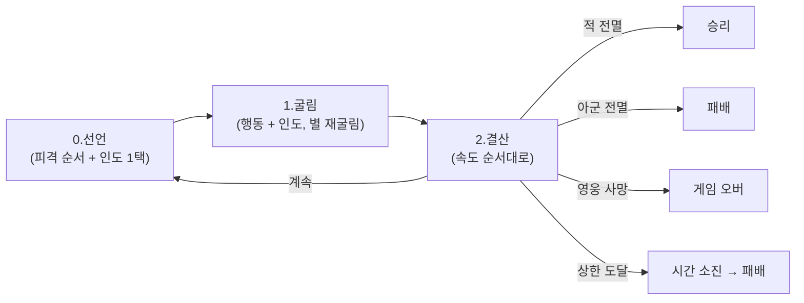

# COMBAT-STRUCT-001: 전투 구조

> 상태: 결정정합 (5-10 마디 박힘) · 의존: @COMBAT-DICE-001, @COMBAT-UNIT-CARD, @COMBAT-JUDGE-001

> 5-10 마디 박힘:
> - 라운드 결산 = 7단계 → 3단계 압축 (선언 / 굴림 / 결산)
> - 어휘 정정: "가호" → "인도" (신성 결산 어휘) / "가호" = 유물 결로 분리 (덱 빌딩/환경 레이어)
> - 인도 = 굴림 *전* 1택 선언 (공·방·속도 3축, 굴림 후 → 굴림 전 정정)
> - 진형 결 = 1열 / 2열 + 자동 진열 (전열 전멸 시 근접도 2열 닿음)
> - 사거리 결 = 5종 (근접/원거리/광역-세로/광역-가로/광역-전체)
>   광역 = 인물 카드에 박힘 (영웅·재앙 자리, 펜딩 — 필살기·패턴 결)
> - 대상 지정 = e 결 (변경 시에만, 디폴트 = 마지막 박은 결)
> - 피격 단위 = 매 라운드 변경 가능
> 상세: `DOCS/DESIGN/LOG/2026-05-10_사거리·진형·사제·인도·덕목.md`

## 정의

전투 = 라운드 반복. 행동 자동 + 인도(신성)로 인간의 결과 신의 결이 합주. 영웅·재앙은 인도 1택으로 응대 자리 박힘. 무리·인간은 운만으로 굴러감. *기본 = 방치형 자동 표면, 속 = 결의 결 깊음.*

## 규칙

### 라운드 결산 (3단계)

```yaml
0_선언:       
  ㄱ. 공격·피격 대상 박음 (변경 시에만, 매 라운드 가능)
     디폴트 = 마지막 박은 결 (자동)
     적 사망 시 = 자동 다음 적 결 박힘
  ㄴ. 인도 보정 방식 박음 (공·방·속도 3축 1택)
     영웅·재앙만 (인간·무리 = 자동, 보정 X)
  적도 동시 (시스템 자동)
  → 정보 비대칭 보존

1_굴림:       
  모두 행동 주사위 굴림. 영웅·재앙은 인도 주사위도 굴림.
  별 면 = 인도 주사위 재굴림 (무한). 별 면 = 무조건 인도 박힘.
  자기 시간대 면 = 페이즈 시간대 일치 + 자기 신앙 일치 시 박힘.
  반대 시간대 = 그저 무 (호메로스 결, 적 해코지 X).

2_결산:       
  속도 순서대로 결과 박힘.
  공격 점수 = 칼 면 × 공격력 + (인도를 공으로 끌었을 시: 인도 수 × 신성력)
  방어 점수 = 방패 면 × 방어력 + (인도를 방으로 끌었을 시: 인도 수 × 신성력)
  속도 점수 = 시간대 보정 + 인물 속도 + (인도를 속도로 끌었을 시: 인도 수 × 신성력)
  실패 면 = 무
  
  피해 = max(0, 자기 공격 - 상대 방어)
  hp 깎임 = 박은 피격 순서 1번부터
  앞 인물 hp 0 = 다음 인물 노출
  적 사망 시 = 적 결산 무화 (트로이 결, 결 a)
  동점 = 같은 진영 자연 결로 동시 행동
  
  사제 결 (특수): 방패 결산을 *대상*에게 통째로 부여
                  방패 면 × 사제 방어력 → 대상 방어 점수에 추가
                  대상 박음 = 단계 0에서 미리 (자기 또는 다른 인물)
```

### 진형 결

```yaml
2단 진형:
  1열 (전위)
  2열 (후위)

배치:
  편성 단위 (전투 시작 시 1번 박음)
  직업 결 따라:
    전사:    1열 고정
    수호자:  1열 고정
    용병:    1·2열 선택
    사냥꾼:  2열 고정
    사제:    2열 고정
  
자동 진열:
  1열 전멸 = 근접 공격이 2열도 닿음 (자연 결)
  앞 인물 hp 0 = 뒤 인물 노출
```

### 사거리 결 (5종)

```yaml
근접:           1열 → 적 1열만 (1열 전멸 시 적 2열까지)
원거리:         적 1·2열 선택 (1명만)
광역-세로:      1열 적 모두 타격
광역-가로:      1·2열 적 1명씩 (2명 타격)
광역-전체:      1·2열 적 모두 타격

직업 ↔ 사거리 (기본):
  전사:    근접
  수호자:  근접
  용병:    위치 종속 (1열 = 근접 / 2열 = 원거리)
  사냥꾼:  원거리
  사제:    공격 X (방어 결만)

광역 결:
  인물 카드에 박힘 (영웅·재앙 자리)
  결의 결: 필살기·패턴 결 (펜딩 — 다음 마디)
  무리·인간 = 기본 광역 X
```

### 대상 지정 결

```yaml
선언 단위:    매 라운드 (변경 시에만 박음)
디폴트:       마지막 박은 결
시작:         라운드 1 = 본인 박음 (시작 자리)
변경 결:      본인 결로 박음 (영웅·재앙 자리)

자동 결 자리:
  적 사망 시 = 그 적 향한 인물 = 자동 다음 적 (남은 적 중 자동)
  인간·무리 = 자동 (시스템)
  
적 (시스템 AI):
  사거리 결 안에서 자동 박음
```

### 순서 점수 결산

```yaml
순서 점수 = 시간대 보정 + 인물 속도 + 인도(속도) 결산
  → 행동·인도 = 라운드 시작 시 정해진 결 (인도 보정만 해당 라운드 결산)

시간대 보정:
  지상 인물 + 낮 페이즈 = +2
  지상 인물 + 밤 페이즈 = 0
  미궁 인물 + 낮 페이즈 = 0
  미궁 인물 + 밤 페이즈 = +2
  경계 인물 = +1 (낮·밤 무관)

동점 처리:
  같은 점수 = 같은 진영 (자연 결로) = 동시 행동
  → 시간대 보정이 같으면 같은 진영
```

### 피격 받는 순서 (트로이 결)

```yaml
선언:    매 라운드 (변경 시에만)
디폴트:  마지막 박은 결
적용:    적 공격 시 = 박은 순서 1번부터 hp 깎임
노출:    앞 인물 hp 0 = 다음 인물 노출

판단 자리:
  변경 결: "이번 라운드 누구를 앞에 둘지" (본인 결로)
  강한 영웅 앞 = 트로이 결 (헥토르가 앞에 섬)
  약한 인물 앞 = 희생 결
  부담 결: 매 라운드 *X*. 변경 시에만 = 부담 작음.
```

### 인도 결산 (5-10 박힘)

```yaml
인도 1개당 = *신성력*만큼

선언 결 (단계 0, 굴림 전):
  영웅·재앙 = 공·방·속도 3축 1택
  굴림 결과 = 결 따라옴 (결정 X)
  굴림 결과 인도 0 = 그저 무 (호메로스 결)

결산 결:
  공으로 끌었을 시: 인도 수 × 신성력 = 공격 점수에 추가
  방으로 끌었을 시: 인도 수 × 신성력 = 방어 점수에 추가
  속도로 끌었을 시: 인도 수 × 신성력 = 순서 점수에 추가 (*같은 라운드*)

자리:
  공·방·속도 = 인간의 결 (행동 결산 + 5 패러미터)
  신성력 = 신의 결 (인도 결산)
  → 두 결산이 *완전 분리*. 본인 박은 신화 결 깊이 정합.
  
플레이어 시점:
  신적 (아테나 결)
  영웅 = 자기 결로 행동 (자동)
  플레이어 = 인도의 결을 *어디로 끌지* 미리 박는 자
```

### 종료 조건

```yaml
승리:        적 전멸
패배:        아군 전멸
게임 오버:   영웅 사망 (테오도라 사망 결)
시간 소진:   라운드 상한 도달 시 양측 생존 → 아군 패배 (잠정)
```

### 라운드 상한

```yaml
값: 8 (5-5 결 잠정. 시뮬 후 확정)
종료 처리: 양측 생존 → 아군 패배
근거: 결사(R5+) 폐기로 지연 동기 없어짐. 시간 소진 = 작전 실패.
```

### 환경 표현 모델

```yaml
모델: 외부 모디파이어 (@COMBAT-DICE-001)
환경 (장소·날씨): 카드 효과·정찰 조건으로만 적용.
페이즈 시간대 (낮/밤): 인도 주사위 박힘 조건 + 시간대 보정. @META-BOOK-001 페이즈 진행 결.
```

### 폐기 항목

```yaml
- 산개/밀집 (대형):       4-26 폐기
- 격자/좌우익/열:         4-12 시도, 4-26 폐기
- 심볼 해상도 순서:       4-12 시도
- 공격 대상 지정 (sRPG):  4-12 시도, 5-9 명시 폐기
- 색 매칭:                4-08 시도, 4-26 폐기
- 일제 굴림:              밀집 폐기 연쇄
- 결사 (R5+):             5-5 폐기
- 방진 패시브:            5-5 폐기
- 시너지:                 5-5 폐기 (현 단계)
- 8 특성 시스템:          5-7 폐기
- 추종자 시스템:          5-7 폐기
- 태그 시스템:            5-7 폐기
- 7스텝 라운드 (5-5):     5-9 폐기
- 면 = 시간대 (5-8):      5-9 정정
- 행동 = 카드락 (5-8):    5-9 정정
- 매칭 점수 결 (5-8):     5-9 정정
- 다이몬 결 (5-9):        5-9 폐기
- 행동 카드 / 모드 선언:  5-9 폐기
- 3단 우선순위 (5-9):     5-9 5패러미터 폐기
- 가호 = 인물 공·방 수치 (5-9): 5-9 5패러미터 정정
- 행동 결과 종속 속도:    5-9 5패러미터 정정
- 라운드 7단계 (5-9):     5-10 압축 (3단계로)
- 가호 굴림 후 선언:      5-10 정정 (굴림 *전* 선언)
- 가호 = 공/방 1택 (5-9): 5-10 정정 (공·방·속도 3축)
- "가호" 어휘 (신성 결산): 5-10 정정 ("인도"로 / "가호" = 유물 결로 분리)
- 리롤 (5-5):              5-10 폐기 (다른 결로 부활 펜딩)
```

## 시각



## TODO

- TODO(시뮬): 라운드 상한 8 검증 (시뮬 후 조정)
- TODO(시스템): 운명 페이즈 시간대 = 적의 자리 (5-10 박힘. 디테일 펜딩)
- TODO(시스템): 광역 인물 카드 결 (필살기·패턴 결 — 다음 마디)
- TODO(시스템): 가호 (유물) 결 시스템 (덱 빌딩/환경 레이어 — 다음 마디)
- TODO(시스템): 갈래 7 (덕목 우선) — 다인 영웅 Order 진입 시 박음
- TODO(시뮬): SIM-1 — 영웅 vs 재앙 / 영웅 vs 무리 / 무리끼리 한 합씩
