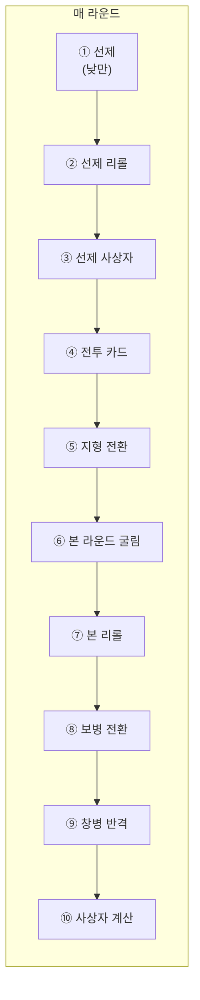

# COMBAT-STRUCT-001: 전투 구조 (Battle Structure)

> **상태:** 🔄 설계중 · **버전:** 0.1 · **ID:** COMBAT-STRUCT-001 · **수정일:** 2026-02-25

---

## ① 한 줄 요약

1턴 = 2라운드. 매 라운드 10페이즈가 순서대로 진행되며, 낮/밤에 따라 선제 페이즈와 정보 공개가 달라진다.

---

## ② 규칙 정의

### 턴-라운드 구조

| 필드 | 내용 |
|------|------|
| **1턴** | 2라운드로 구성 |
| **1라운드** | 10페이즈가 순서대로 진행 |
| **낮/밤** | 홀수 턴 = 낮, 짝수 턴 = 밤. 매 턴 교대 |

### 10페이즈 (매 라운드)

| # | 페이즈 | 내용 | 비고 |
|---|--------|------|------|
| ① | 선제 페이즈 | 궁병 사격 | **낮에만.** 밤에는 스킵 |
| ② | 선제 리롤 | 내 or 적 주사위 1개 리롤 (1회). 작전 카드 사용 가능 | |
| ③ | 선제 사상자 계산 | 선제 결과 적용 | |
| ④ | 전투 카드 사용 | 공격/수비 카드 사용 | 본 라운드 굴림 전 |
| ⑤ | 지형 전환 | 지형 효과 적용 (✕ 1개 전환) | |
| ⑥ | 본 라운드 | 나머지 전부 굴림, 동시 판정 | |
| ⑦ | 본 라운드 리롤 | 내 or 적 주사위 1개 리롤 (1회) | |
| ⑧ | 보병 전환 | 보병 칼↔방패 전환 | |
| ⑨ | 창병 반격 | 해당 라운드 아군 피해 0이면 발동 | |
| ⑩ | 사상자 계산 | 본 라운드 최종 결과 적용 | |

### 낮/밤 차이

| 항목 | 낮 (홀수 턴) | 밤 (짝수 턴) |
|------|-------------|-------------|
| 맵 시야 | 정상 | 정상 |
| 선제 페이즈 | 가능 | 불가 (궁병 본 라운드 합류) |
| 상대 주사위 결과 | 보임 | 안 보임 |
| 보병 전환 | 결과 보고 대응 | 감으로 판단 |
| 리롤 | 내/적 자유 선택 (정보 기반) | 내 주사위만 안전 (적은 도박) |
| 최종 피해 결산 | 보임 | 보임 |
| 앰버 명사수 | 발동 | 발동 안 함 |
| 창병 반격 판정 | 결산 보고 판정 (동일) | 결산 보고 판정 (동일) |

### 선제 페이즈 상세

| 필드 | 내용 |
|------|------|
| **조건** | 낮(홀수 턴)에만 발동. 밤에는 선제 없음 |
| **행동** | 궁병 많은 쪽이 먼저 사격. 궁병 수 같으면 동시 사격 |
| **결과** | 선제에서 적 궁병 사망 시 상대 선제 소멸. 사상자만큼 적 본 라운드 주사위 감소 |
| **제한** | 밤에는 궁병이 본 라운드에 합류 (주사위 하나 더) |
| **비용** | 없음. 선제에서도 작전 카드(공격/수비) 사용 가능 |

---

## ③ 시각 자료

### 라운드 흐름



### 턴 구조

```
턴 1 (낮)
├── 라운드 1: ①~⑩ (선제 O, 적 결과 보임)
└── 라운드 2: ①~⑩ (선제 O, 적 결과 보임)

턴 2 (밤)
├── 라운드 3: ④~⑩ (선제 X, 적 결과 안 보임)
└── 라운드 4: ④~⑩ (선제 X, 적 결과 안 보임)

턴 3 (낮) ...
```

---

## ④ 플레이어 피드백 (UI/UX)

| 상황 | 피드백 |
|------|--------|
| **현재 페이즈** | 화면 상단에 현재 페이즈 번호 + 이름 표시 |
| **낮/밤 전환** | 턴 시작 시 낮/밤 오버레이 전환 |
| **밤 — 적 주사위** | 적 주사위 개별 결과 "?" 처리. 최종 피해 결산만 공개 |
| **스킵된 페이즈** | 밤에 선제 페이즈 자체가 표시되지 않음 |

---

## ⑤ 테스트 케이스

> TC 미작성. [06_TC/전투_TC.md](../../06_TC/전투_TC.md)에서 통합 관리 예정.

---

## ⑥ 설계 근거

**Q. 왜 1턴 2라운드인가?**
한 번의 교전이 너무 짧으면 전술 개입의 여지가 없고, 너무 길면 지루하다. 2라운드가 "첫 라운드 결과 보고 두 번째 라운드에서 대응"하는 최소 단위.

**Q. 왜 10페이즈나 되는가?**
실제 플레이에서는 대부분 자동 진행. 플레이어가 개입하는 건 리롤(②⑦), 카드 사용(④), 보병 전환(⑧) 정도. 나머지는 시스템이 처리. 페이즈 수가 많은 건 규칙의 순서를 명시하기 위함.

**Q. 밤에 왜 적 결과를 숨기는가?**
정보 비대칭이 핵심 긴장. 낮에는 정보 기반 판단, 밤에는 불완전 정보 속 도박. 같은 메카닉이 낮/밤으로 완전히 다른 경험을 준다.

---

## ⑦ 의존성

| 방향 | ID | 이름 | 관계 |
|------|----|------|------|
| ← NEEDS | COMBAT-DICE-001 | 다이스 규칙 | 모든 굴림이 이 규칙을 따름 |
| → AFFECTS | COMBAT-ACT-001 | 보병 전환 | ⑧ 타이밍 정의 |
| → AFFECTS | COMBAT-ACT-002 | 리롤 | ②⑦ 타이밍 정의 |
| → AFFECTS | COMBAT-UNIT-003 | 궁병 | ① 선제 페이즈 |
| → AFFECTS | COMBAT-UNIT-004 | 창병 | ⑨ 반격 타이밍 |

---

## ⑧ 변경 이력

| 버전 | 날짜 | 변경 내용 | 사유 |
|------|------|-----------|------|
| 0.1 | 2026-02-25 | COMBAT_SYSTEM 정본에서 이관. 10페이즈 + 낮밤. | 위키 구축 |
