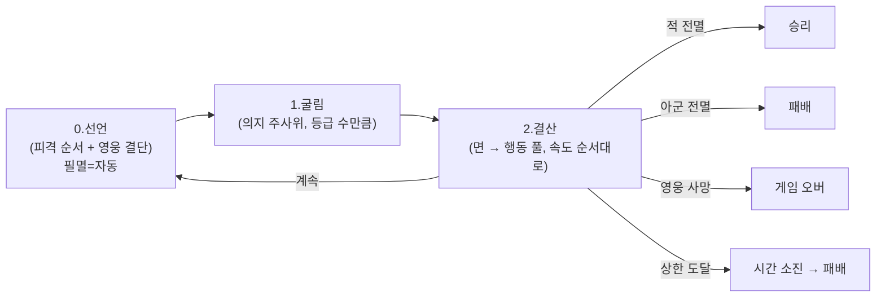

# 전투 구조

> 상태: 결정정합 (5-11+ 마디 박힘)

> 5-11+ 마디 큰 정정 (전투 4.0 → 5.0):
> - 공·방 1택 선언 → 다이시 테일즈식 (면 종류 → 행동 풀)
> - 매 라운드 행동 선택 → 작은 AI + 영웅·반신 라운드 1회 결단
> - 직업 3종 → 4종 (신관 폐기, 수호자·사제 부활)
> - 행동 5종 (격돌·사격·보호·축복·저주) + 상태 이상 결
> - 사거리 정정 (사냥꾼·사제 = 1열만)
> - 보호막 결 (영구, 모든 인물)
> - 반대 시간대 면 = 졸전 (작게 박힘)
> 상세: `DOCS/DESIGN/LOG/2026-05-11_전투5.0_다이시테일즈식·행동풀_큰정리.md`

> 5-11 마디 큰 정정:
> - 의지 + 인도 → 의지 1종으로 합침 (한 주사위만 굴림)
> - 신성력 패러미터 폐기 (3 패러미터: 공·방·속 + hp 별도) [5-11+ 정정: 능력치 어휘로]
> - 시간대 2종 (낮/밤) → 3종 (낮/경계/밤)
> - 페이즈 시간대 고정 → 라운드별 시간대 변동 (낮 → 경계 → 밤 → 경계 → ...)
> - 직업 5종 → 3종 (전사/사냥꾼/신관, 용병/사제/수호자 폐기) [5-11+ 정정: 4종]
> - 인도 1택 (공·방·속 3축) → 공/방 1택 (속도는 별도 결산) [5-11+ 정정: 행동 풀로]
> - 등급 어휘: 4단 → 3단 + 번외 (필멸/반신/신성/번외)
> - 운명 시간대 = 적의 자리 폐기 (페이즈 흐름 결로 자연 따라감)
> - "주사위가 곧 신성력이 포함된 의지 덩어리" — 등급 = 신성 결의 그릇
> 상세: `DOCS/DESIGN/LOG/2026-05-11_의지·시간대·직업_큰정리.md`

## 정의

전투 = 라운드 반복. 모든 인물 = 의지 주사위 굴림 (등급 결 수만큼). 시간대는 라운드별 변동. 자기 시간대 라운드 = 박힘 결 큼 / 반대 시간대 = 결 작음. *기본 = 방치형 자동 표면, 속 = 결의 결 깊음.*

## 규칙

### 라운드 결산 (3단계, 5-11+ 정정)

```yaml
0_선언:       
  ㄱ. 공격·피격 대상 박음 (변경 시에만, 매 라운드 가능)
     디폴트 = 마지막 박은 결 (자동)
     적 사망 시 = 자동 다음 적 결 박힘
  ㄴ. 영웅·반신 결단 (라운드당 1회) — 5-11+ 박힘:
     행동 1택 + 대상 1택
     필멸: 결단 X. 인물 카드 우선순위로 자동 (작은 AI).
  적도 동시 (시스템 자동)
  → 정보 비대칭 보존
  → 호메로스 결: 인간이 결 박고 신(굴림)이 응답

1_굴림:       
  모두 의지 주사위 굴림 (등급 결 수만큼).
  필멸 1개 / 반신 2개 / 신성 3개 / 번외 4+개.
  
  박힘 면:
    의지 면 (별):    완전 성공 (어느 시간대든 박힘)
    신성 면 (낮/밤): 자기 시간대만 성공 / 반대 시간대 = 졸전
    경계 면:          경계 인물만 자기 시간대 (경계 시간대) 성공
  
  자기 시간대:
    지상 = 낮 시간대
    미궁 = 밤 시간대
    경계 = 경계 시간대

2_결산:       
  속도 순서대로 결과 박힘.
  
  행동 풀 결 (5-11+ 박힘) — 면 종류 → 행동:
    별 면 → 직업 기본 행동 (격돌·사격·보호 등)
    자기 시간대 면 → 변형 행동 (강타·계통 특수)
    반대 시간대 라운드의 자기 시간대 면 → 졸전 (×0.5 잠정)
  
  결산식:
    격돌: 박힘 면 × 공격력 = 공격 점수 + 박힘 면 × 방어력 = 방어 점수 (양쪽)
    사격: 박힘 면 × 공격력 = 공격 점수
    수비: 박힘 면 × 방어력 = 방어 점수
    보호: 박힘 면 × 방어력 = 대상 보호 점수
    변형 결: 강타 ×1.5 / 졸전 ×0.5 (잠정)
    순서 점수 = 시간대 보정 + 인물 속도
  
  피해 = max(0, 자기 공격 - (상대 방어 + 보호막)) → hp
    보호막은 깎이지 않음 (감산식에 박히지만 영구)
  
  hp 깎임 = 박은 피격 순서 1번부터
  앞 인물 hp 0 = 다음 인물 노출
  적 사망 시 = 적 결산 무화 (트로이 결, 결 a)
  동점 = 같은 진영 자연 결로 동시 행동
```

### 시간대 결 (5-11 박힘)

```yaml
시간대 3종:
  낮 / 경계 / 밤

흐름 (라운드별 변동):
  낮 → 경계 → 밤 → 경계 → 낮 → 경계 → 밤 → ...
  → 1 라운드마다 시간대 1회 변동
  → 자기 시간대 ↔ 반대 시간대 번갈아 박힘

페이즈 시작 시간대 (R1):
  지상: 1 페이즈 = 낮 / 2 = 밤 / 3 = 낮 / 4 = 밤
  미궁: 1 페이즈 = 밤 / 2 = 낮 / 3 = 밤 / 4 = 낮
  경계: 시작 랜덤 (낮밤 또는 밤낮)

운명 페이즈:
  페이즈 흐름 자연 따라감 (옛 결 = 적의 자리 폐기)
  지상 영웅 운명 (4 페이즈, 시작 = 밤): R1 밤 → R2 경계 → R3 낮 → R4 경계
  → 운명 시작 = 반대 시간대 자연 박힘 (영웅 결 약함 자리)
```

### 진형 결 (5-11+ 정정)

```yaml
2단 진형:
  1열 (전위)
  2열 (후위)

배치 (편성 단위, 전투 시작 시 1번):
  전사:    1열 고정
  수호자:  1열 고정 (5-11+ 박힘)
  사냥꾼:  2열 고정
  사제:    2열 고정 (5-11+ 박힘)
  
자동 진열:
  1열 전멸 = 근접 공격이 2열도 닿음 (자연 결)
  앞 인물 hp 0 = 뒤 인물 노출

5-11+ 정정 자리:
  옛 결 (5-11): 신관 = 1·2열 선택 (위치 자유)
  새 결 (5-11+): 모두 위치 고정. 결정 부담 X.
```

### 사거리·행동 양식 결 (직업별, 5-11+ 정정)

```yaml
사거리 (5-11+ 정정): 모든 직업 = 1열만 공격
  옛 결 (5-11): 사냥꾼 = 1·2열 적 선택
  새 결 (5-11+): 사냥꾼·사제도 1열만. "궁수가 뭘 막는 것도 웃기잖아" (본인 박은 결)
  원거리 결 = "후열에서 1열 박는 결"

전사 (1열):
  행동 풀: 돌진 / 수비 / 측면 강타 (별 면) / 강타·야습 (자기 시간대 면)
  격돌 = 공·방 양쪽 살아남
  
수호자 (1열):
  행동 풀: 돌진 / 수호 (별 면) / 팩션 결의 변형 (자기 시간대 면)
  지상 수호자 = 수비 결 / 미궁 수호자 = 공격 결
  
사냥꾼 (2열):
  행동 풀: 사격 (별 면) / 강화 사격·저주 사격 (자기 시간대 면)
  방어 X (방어력 0, 글래스 캐논)
  
사제 (2열, 계통별):
  지상 사제: 보호 / 축복 (별 면) / 강화 (자기 시간대 면)
  미궁 사제: 사격 / 저주 (별 면) / 강화·변신 (자기 시간대 면)
  경계 사제 X (경계엔 사제 없음)

행동 5종 (편의상):
  격돌·사격·보호·축복·저주 (5-11+ 박힘)
  상태 이상 결: 모든 직업이 잠재적으로 보유 (측면 강타 결 등)

광역 결:
  행동 풀의 변형 결 안에 흡수 (별도 결 X — 5-11+ 정정)
  결의 결: 필살기·패턴 결 (펜딩 — 다음 마디)
```

### 대상 지정 결 (5-11+ 정정)

```yaml
선언 단위:    매 라운드 (변경 시에만 박음)
디폴트:       마지막 박은 결
시작:         라운드 1 = 본인 박음 (시작 자리)

영웅·반신: 라운드당 1회 결단으로 변경 가능 (5-11+ 박힘)
필멸: 인물 카드 우선순위로 자동 (작은 AI) — 박은 피격 순서 1번부터 자동
  
적 (시스템 AI):
  사거리 결 안에서 자동 박음
```

### 순서 점수 결산

```yaml
순서 점수 = 시간대 보정 + 인물 속도
  → 라운드 시작 시 정해진 결

시간대 보정 (R1 시간대 결로):
  지상 인물 + 낮 시간대 = +2
  지상 인물 + 경계 시간대 = +1
  지상 인물 + 밤 시간대 = 0
  미궁 인물 + 낮 시간대 = 0
  미궁 인물 + 경계 시간대 = +1
  미궁 인물 + 밤 시간대 = +2
  경계 인물 + 어느 시간대 = +1

  → 자기 시간대 = 큰 결 / 반대 시간대 = 작은 결
  → 경계 = 안정 결

동점 처리:
  같은 점수 = 같은 진영 (자연 결로) = 동시 행동
```

### 피격 받는 순서 (트로이 결)

```yaml
선언:    매 라운드 (변경 시에만)
디폴트:  마지막 박은 결
적용:    적 공격 시 = 박은 순서 1번부터 hp 깎임
노출:    앞 인물 hp 0 = 다음 인물 노출

판단 자리:
  변경 결: "이번 라운드 누구를 앞에 둘지" (본인 결로)
  강한 영웅 앞 = 트로이 결 (헥토르가 앞에 섬)
  약한 인물 앞 = 희생 결
  부담 결: 매 라운드 *X*. 변경 시에만 = 부담 작음.
```

### 의지 결산 (5-11+ 박힘)

```yaml
"주사위가 곧 신성력이 포함된 의지 덩어리":
  → 주사위 1종 = 인간 결 + 신 결 합주
  → 주사위 수 = 신성 결의 그릇 (등급 결)
  → 등급 = 신성 깊이 (필멸 1 / 반신 2 / 신성 3 / 번외 4+)

선언 결 (단계 0) — 다이시 테일즈식 (5-11+ 정정):
  필멸: 결단 X. 인물 카드 우선순위로 자동.
  영웅·반신: 라운드당 1회 결단 (행동 1택 + 대상 1택)
  → 굴림 → 박힌 면 보고 자동 발동

박힘 면:
  자기 시간대 라운드: 별 면 + 자기 시간대 면 = 4면 박힘 (67%)
  반대 시간대 라운드: 별 면 박힘 + 자기 시간대 면 졸전 (작게 박힘)

행동 풀 결 (5-11+ 박힘):
  별 면 → 직업 기본 행동
  자기 시간대 면 → 변형 행동
  졸전 → ×0.5 (반올림, 잠정)

결산 결:
  격돌: 박힘 면 × (공격력 + 방어력) — 양쪽 살아남
  사격: 박힘 면 × 공격력
  수비: 박힘 면 × 방어력
  보호: 박힘 면 × 방어력 → 대상 보호 점수
  변형 결: 강타 ×1.5 / 졸전 ×0.5 (잠정)
  순서: 시간대 보정 + 속도 (별도 결, 의지 결산 X)

자리:
  공·방·속 = 의지 결산 자체
  신성 결 = 별·자기 시간대 면 박힘으로 살아남
  → 인간의 결 + 신의 결의 합주가 한 굴림에 박힘.
  
플레이어 시점 (5-11+ 정정):
  신적 (아테나 결)
  필멸 인물 = 자기 결로 행동 (자동, 작은 AI)
  영웅·반신 = 라운드 1회 큰 결단 (행동 + 대상)
  플레이어 = 외부 선언만, 내부 전투는 굴림 응답 봄
  본인 박은 결: "외부 선언 단계에 하는 걸 지켜보고 결과가 나오는 걸 보지만, 그 사이에 운도 중요"
```

### 종료 조건

```yaml
승리:        적 전멸
패배:        아군 전멸
게임 오버:   영웅 사망 (테오도라 사망 결)
시간 소진:   라운드 상한 도달 시 양측 생존 → 아군 패배 (잠정)
```

### 라운드 상한

```yaml
값: 8 (5-5 결 잠정. 시뮬 후 확정)
종료 처리: 양측 생존 → 아군 패배
근거: 결사(R5+) 폐기로 지연 동기 없어짐. 시간 소진 = 작전 실패.
```

### 환경 표현 모델

```yaml
모델: 외부 모디파이어
환경 (장소·날씨): 카드 효과·정찰 조건으로만 적용.
시간대 (낮/경계/밤): 의지 주사위 박힘 조건 + 시간대 보정. 페이즈 진행 결.
```

### 폐기 항목

```yaml
- 산개/밀집 (대형):       4-26 폐기
- 격자/좌우익/열:         4-12 시도, 4-26 폐기
- 심볼 해상도 순서:       4-12 시도
- 공격 대상 지정 (sRPG):  4-12 시도, 5-9 명시 폐기
- 색 매칭:                4-08 시도, 4-26 폐기
- 일제 굴림:              밀집 폐기 연쇄
- 결사 (R5+):             5-5 폐기
- 방진 패시브:            5-5 폐기
- 시너지:                 5-5 폐기 (현 단계)
- 8 특성 시스템:          5-7 폐기
- 추종자 시스템:          5-7 폐기
- 태그 시스템:            5-7 폐기
- 7스텝 라운드 (5-5):     5-9 폐기
- 면 = 시간대 (5-8):      5-9 정정
- 행동 = 카드락 (5-8):    5-9 정정
- 매칭 점수 결 (5-8):     5-9 정정
- 다이몬 결 (5-9):        5-9 폐기
- 행동 카드 / 모드 선언:  5-9 폐기
- 3단 우선순위 (5-9):     5-9 5패러미터 폐기
- 가호 = 인물 공·방 수치 (5-9): 5-9 5패러미터 정정
- 행동 결과 종속 속도:    5-9 5패러미터 정정
- 라운드 7단계 (5-9):     5-10 압축 (3단계로)
- 가호 굴림 후 선언:      5-10 정정 (굴림 *전* 선언)
- 가호 = 공/방 1택 (5-9): 5-10 정정 (공·방·속도 3축)
- "가호" 어휘 (신성 결산): 5-10 정정 ("인도"로 / "가호" = 유물 결로 분리)
- 리롤 (5-5):              5-10 폐기 (다른 결로 부활 펜딩)
- 신성력 패러미터 (5-10): 5-11 폐기
- 인도 주사위 (5-10):     5-11 폐기 (의지 1종으로 합침)
- 직업 5종 (5-10):        5-11 정정 (3종: 전사/사냥꾼/신관)
- 사제·수호자·용병:        5-11 폐기 (신관으로 통합)
- 시간대 2종 (5-9):        5-11 정정 (3종: 낮/경계/밤)
- 페이즈 시간대 고정:      5-11 정정 (라운드별 변동)
- 운명 시간대 = 적의 자리 (5-10): 5-11 폐기 (페이즈 흐름 결)
- 인도 1택 공·방·속 (5-10): 5-11 정정 (공·방 1택, 속도 별도 결산)
- 별 재굴림 무한:          5-11 정정 (재굴림 결 펜딩)
- 사제 방패 결산 부여:     5-11 폐기 (사제 직업 폐기)
- 사거리 5종 (5-10):       5-11 정정 (직업별 행동 양식 결로)
- 직업 3종 (전사·사냥꾼·신관, 5-11):    5-11+ 정정 (4종 — 신관 폐기, 수호자·사제 부활)
- 공·방 1택 선언 (5-11):           5-11+ 정정 (다이시 테일즈식 — 면 종류 → 행동 풀)
- 매 라운드 행동 선택 (잠정):       5-11+ 정정 (작은 AI + 영웅·반신 라운드 1회 결단)
- 신관 위치 자유 (5-11):           5-11+ 정정 (모든 직업 위치 고정)
- 사냥꾼 1·2열 사거리 (5-11):      5-11+ 정정 (사냥꾼·사제 = 1열만)
- 광역 사거리 = 별도 결:            5-11+ 흡수 (행동 풀의 변형 결 안에)
- 반대 시간대 면 = 실패 (5-11):    5-11+ 정정 (졸전 — 작게 박힘)
- 실패 면 어휘 (5-11):              5-11+ 정정 (면 비율엔 본디 없음)
- 단계 2 결산 = 공격력·방어력만:   5-11+ 정정 (행동별 결산 결 — 격돌·사격·수비·보호)
- 피해 = max(0, 공-방) (5-11):     5-11+ 정정 (보호막 추가 — max(0, 공-(방+보호막)))
```

## 시각



## TODO

- TODO(시뮬): 라운드 상한 8 검증 (시뮬 후 조정)
- TODO(시스템): 페이즈 ↔ 라운드 정합 (페이즈당 라운드 수 박을 자리)
- TODO(시스템): 영웅·반신 결단 결의 결의 자리 (행동만? 행동+대상? 결단 후 면 안 박히면?)
- TODO(시스템): 변형 결 수치 검증 (강타 ×1.5 / 졸전 ×0.5 잠정)
- TODO(시스템): 영웅 등극 결 (위계 변동 시점 — 운명 전투? Order 클리어? 5-11+ 펜딩)
- TODO(시스템): 별 면 재굴림 결 (펜딩 — 5-11+에서 별 면 = 행동 트리거로 박힘, 충돌 가능)
- TODO(시스템): 가호 (유물) 결 시스템 (덱 빌딩/환경 레이어 — 다음 마디)
- TODO(시스템): 상태 이상 종류·결산 (기절·약화·둔화·중독·출혈 등)
- TODO(시스템): 보호 결산 결 (그 라운드만? 영구 보호막 부여?)
- TODO(시뮬): SIM-1 — 영웅 vs 재앙 / 영웅 vs 무리 / 무리끼리 한 합씩
- TODO(시뮬): 다이시 테일즈식 결산 검증 (변형 결, 졸전 결)
- TODO(콘텐츠): 인물 카드 작은 AI 우선순위 박는 결
