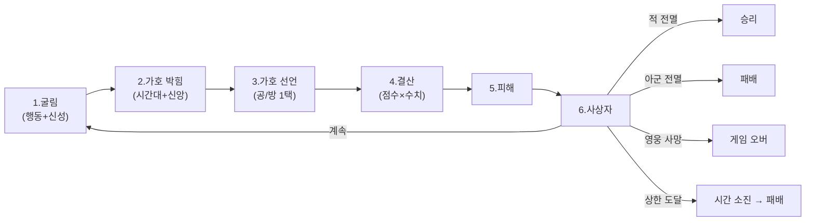

# COMBAT-STRUCT-001: 전투 구조

> 상태: 결정정합 (5-9 코어 박힘) · 의존: @COMBAT-DICE-001, @COMBAT-UNIT-CARD, @COMBAT-JUDGE-001

> 5-9 코어 박힘:
> - 행동 = 자동 (행동 카드 폐기. 카드락 5-8 결 정정)
> - 행동 주사위 (모두) + 신성 주사위 (영웅·재앙) 2종 분리
> - 가호 = 신성 면 페이즈 시간대 일치 + 자기 신앙 일치 시 박힘
> - 가호 결산 = 플레이어 1택 (공/방). 호메로스 결 (증여만, 적 해코지 X)
> - 플레이어 시점 = 신적 (아테나 결)
> 상세: `DOCS/DESIGN/LOG/2026-05-09_전투4.0_코어_박힘.md`

## 정의

전투 = 라운드 반복. 행동 자동 + 신성 가호로 인간의 결과 신의 결이 합주. 영웅·재앙은 가호 1택으로 응대 자리 박힘. 무리·인간은 운만으로 굴러감.

## 규칙

### 라운드 결산

```yaml
1_굴림:       모두 행동 주사위 굴림. 영웅·재앙은 신성 주사위도 굴림.
              별 면 굴려지면 신성 주사위 재굴림 (무한). 별 면도 가호 박힘.
              
2_가호 박힘:  신성 면이 *현재 페이즈 시간대 일치 + 자기 신앙 일치* 시 박힘.
              반대 시간대 = 실패 (그저 무. 호메로스 결).
              
3_가호 선언:  영웅·재앙 = 박힌 가호를 *공 또는 방* 1택. 동시 선언 (정보 비대칭).
              
4_결산:       
  공격 점수 = (행동 칼 면 합 × 인물 공격력) + (가호를 공으로 끌었을 시: 가호 수 × 인물 공격력)
  방어 점수 = (행동 방패 면 합 × 인물 방어력) + (가호를 방으로 끌었을 시: 가호 수 × 인물 방어력)
  실패 면 = 무
  
5_피해:       양측 공격 점수 - 상대 방어 점수 = 피해 (max 0). hp 깎임.
6_사상자:     사상자 처리 (@COMBAT-JUDGE-001).
```

### 종료 조건

```yaml
승리:        적 전멸
패배:        아군 전멸
게임 오버:   테오도라 사망 (영웅 사망)
시간 소진:   라운드 상한 도달 시 양측 생존 → 아군 패배 (잠정)
```

### 라운드 상한

```yaml
값: 8 (5-5 결 잠정. 시뮬 후 확정)
종료 처리: 양측 생존 → 아군 패배
근거: 결사(R5+) 폐기로 지연 동기 없어짐. 시간 소진 = 작전 실패.
```

### 환경 표현 모델

```yaml
모델: 외부 모디파이어 (@COMBAT-DICE-001)
환경 (장소·날씨): 카드 효과·정찰 조건으로만 적용.
페이즈 시간대 (낮/밤): 신성 주사위 가호 박힘 조건. @META-BOOK-001 페이즈 진행 결.
```

### 전투 종료

```yaml
on_end:
  영웅 부상 회복:  TODO(시스템) — 부상 단계 결 (@COMBAT-JUDGE-001)
  운명 보상:       TODO(시스템) — 옛 추종자 자리 폐기 (다른 세션)
  사건 태그:       TODO(시스템) — 옛 태그 시스템 폐기 (다른 세션)
```

### 폐기 항목

```yaml
- 산개/밀집 (대형):       4-26 폐기
- 격자/좌우익/열:         4-12 시도, 4-26 폐기
- 심볼 해상도 순서:       4-12 시도
- 공격 대상 지정:         4-12 시도, 5-9 명시 폐기 (sRPG 결 안 감)
- 색 매칭:                4-08 시도, 4-26 폐기
- 일제 굴림:              밀집 폐기 연쇄
- 결사 (R5+):             5-5 폐기 (라운드 상한이 흡수)
- 방진 패시브:            5-5 폐기 (산개/밀집 의존)
- 시너지:                 5-5 폐기 (현 단계)
- 8 특성 시스템:          5-7 폐기 (전투 효과 — 다른 세션)
- 추종자 시스템:          5-7 폐기 (전투 종료 보상 — 다른 세션)
- 태그 시스템:            5-7 폐기 (사건 태그 — 다른 세션)
- 7스텝 라운드 (5-5):     5-9 폐기 (선제/쇄도/패시브 시스템 흡수)
- 면 = 시간대 (5-8):      5-9 정정 (행동 면과 신성 면 분리)
- 행동 = 카드락 (5-8):    5-9 정정 (행동 = 자동. 카드 = 페이즈 결)
- 매칭 점수 결 (5-8):     5-9 정정 (신성 주사위 풀 비율로 흡수)
- 다이몬 결 (5-9 시도):   5-9 폐기 (시너지·공유 효과 결 — 영영 안 박힐 수도)
- 행동 카드 / 모드 선언 / 비중 배분 (5-9 시도): 5-9 폐기 (sRPG·격투 결로 가지 않음)
```

## 시각



## TODO

- TODO(시뮬): 라운드 상한 8 검증 (시뮬 후 조정)
- TODO(시스템): N대N 결산 단위 (개별 vs 팀 합산)
- TODO(시스템): 동시 선언 결 (가호 1택. 정보 비대칭 보존)
- TODO(시스템): 운명 페이즈 시간대 (낮/밤 둘 중)
