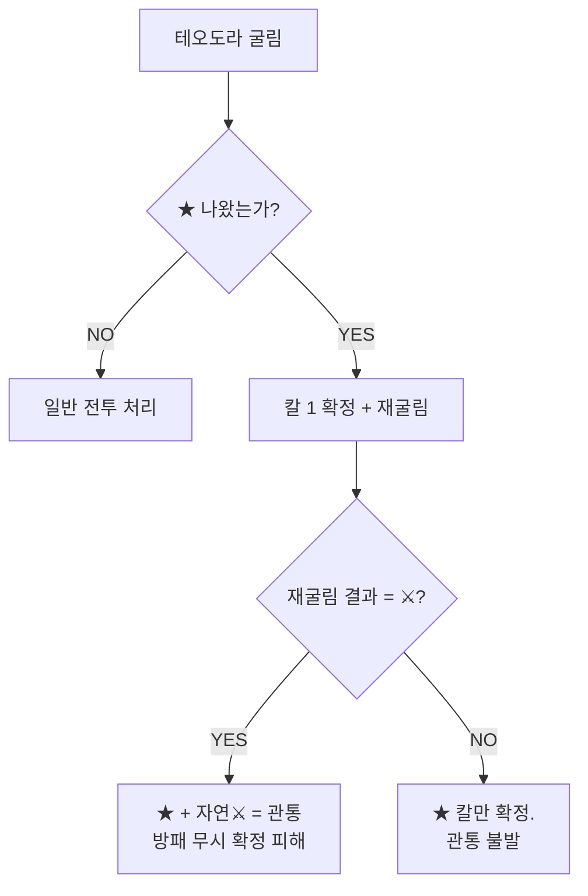

# COMBAT-UNIT-HERO: 영웅 (Heroes)

> **상태:** 🔄 설계중 · **버전:** 0.2 · **ID:** COMBAT-UNIT-HERO · **수정일:** 2026-02-25

---

## ① 한 줄 요약

테오도라(보병 취급)와 앰버(궁병 취급). 같은 주사위 문법을 따르되 고유 능력(돌파, 명사수)과 2단계 부상 체계로 핵심 자산이자 최대 리스크.

---

## ② 규칙 정의

### 테오도라 — 보병 취급

| 필드 | 내용 |
|------|------|
| **면 구성** | ⚔ 🛡 🛡 ★ ✕ ✕ |
| **참여** | 본 라운드에 굴림 |
| **전환** | ⚔→🛡 일방향 전환 (보병 계열). ★ 결과 자체는 전환 불가(잠금). ★ 체이닝 결과(⚔)는 전환 가능 |
| **돌파** | ★ + 자연 ⚔ = 관통 (방패 무시 확정 피해). 전환으로 얻은 ⚔만 일반 |
| **돌파 칼 전환** | 돌파 칼도 방패로 전환 가능 |
| **선제 피격** | 낮(홀수 턴) 선제 페이즈에서 랜덤 사상자 풀에 포함. 1히트=부상(면→✕), 2히트=사망=게임오버. 밤에는 선제 스킵이므로 리스크 없음 |
| **부상** | 뚫리면 🛡 1개 → ✕ 전환. 부상 상태에서 또 뚫리면 사망 = 게임오버 |
| **사상자 풀** | 랜덤 풀에 포함. 보호 없음 |

### 앰버 — 궁병 취급

| 필드 | 내용 |
|------|------|
| **면 구성** | ⚔ ⚔ ⚔ ⚔ ✕ ✕ |
| **참여** | 선제 페이즈에서 궁병 중 가장 먼저 굴림 |
| **명사수** | 뚫으면 적 사상자 지정 가능 (나머지 궁병은 랜덤) |
| **밤** | 선제 없으므로 명사수 발동 안 함. 본 라운드 합류 |
| **부상** | 뚫리면 ⚔ 1개 → ✕ 전환. 부상 상태에서 또 뚫리면 사망 |
| **사상자 풀** | 랜덤 풀에 포함. 보호 없음 |

---

## ③ 시각 자료

### 테오도라 돌파 판정



### 영웅 부상 체계

```
정상:   🛡🛡 (테오도라) / ⚔⚔⚔⚔ (앰버)
         ↓ 피해 1 뚫림
부상:   🛡✕ (방패→✕)  / ⚔⚔⚔✕ (칼→✕)
         ↓ 피해 1 뚫림
사망:   게임오버 (테오도라) / 영구 손실 (앰버)
```

---

## ④ 플레이어 피드백 (UI/UX)

| 상황 | 피드백 |
|------|--------|
| **돌파 발동** | ★+⚔ 동시 출현 시 관통 이펙트 |
| **명사수 발동** | 앰버 사격 → 적 유닛 선택 UI |
| **부상** | 면 변환 애니메이션 + 경고음 |
| **사망 위기** | 부상 상태 영웅에게 피해 시 강한 경고 |

---

## ⑤ 테스트 케이스

> TC 미작성.

---

## ⑥ 설계 근거

**Q. 왜 영웅이 랜덤 사상자 풀에 포함되는가?**
보호하면 리스크가 소멸. 영웅이 죽을 수 있어야 "이 전투를 해야 하나"라는 전략적 판단이 생긴다.

**Q. 왜 2단계 부상인가?**
즉사하면 너무 가혹하고, 3단계면 너무 안전하다. 2단계면 부상 후 "다음 전투 버틸 수 있나?"라는 판단이 생긴다.

---

## ⑦ 의존성

| 방향 | ID | 이름 | 관계 |
|------|----|------|------|
| ← NEEDS | COMBAT-STRUCT-001 | 전투 구조 | 선제/본라운드 타이밍 |
| ← NEEDS | COMBAT-UNIT-T1 | T1 병종 | 보병/궁병 규칙 적용 |
| → AFFECTS | STAGE-* | 스테이지 | 테오도라 사망 = 게임오버 |

---

## ⑧ 변경 이력

| 버전 | 날짜 | 변경 내용 | 사유 |
|------|------|-----------|------|
| 0.1 | 2026-02-25 | COMBAT_SYSTEM 정본에서 이관. | 위키 구축 |
| 0.2 | 2026-02-25 | 테오도라 전환 양방향→일방향(⚔→🛡). ★ 잠금 명시. 선제 피격 규칙 추가(낮 랜덤 풀 포함, 밤 리스크 없음). | 전투구조 v0.3 정합성 |
