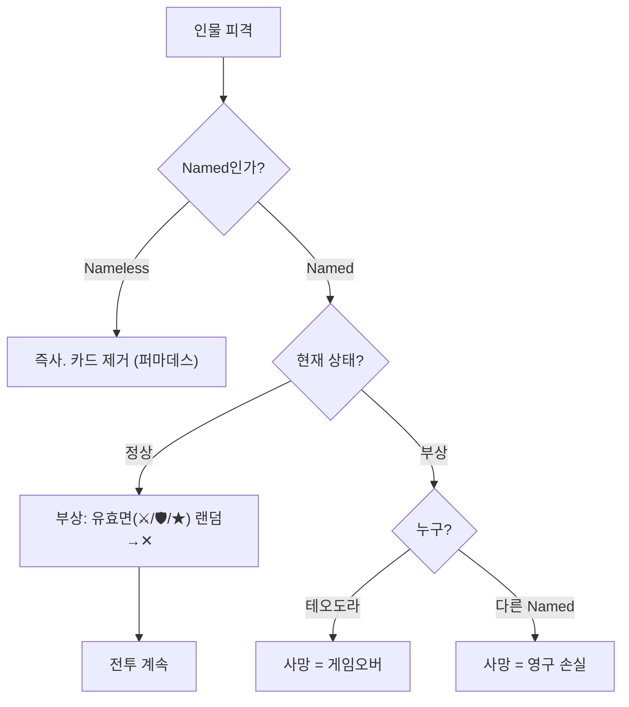
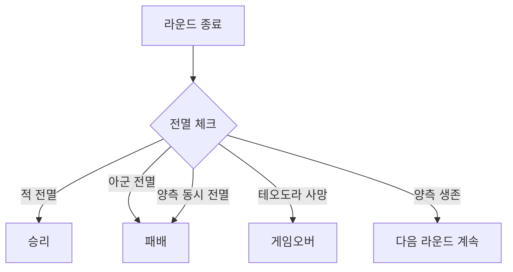

# COMBAT-JUDGE-001: 부상 / 사망 (Injury, Death)

> **상태:** 🔄 설계중 · **버전:** 1.0 · **ID:** COMBAT-JUDGE-001 · **수정일:** 2026-03-01

---

## ① 한 줄 요약

Nameless는 피격 시 즉사. Named는 2단계 부상(유효면 랜덤→✕, ★ 포함. 재피격 시 사망). 모든 손실은 영구적(퍼마데스). 철수 없음 — 전투 진입 시 끝까지 싸운다.

---

## ② 규칙 정의

### Nameless 사상자

| 필드 | 내용 |
|------|------|
| **판정** | 피해 = 상대 칼 - 내 방패. 뚫린 만큼 주사위(=병사) 제거 |
| **대상 선택** | 랜덤. 선택 불가. Named도 같은 풀에 포함 |
| **피격** | 즉사. 부상 단계 없음 |
| **영속성** | 제거된 주사위는 영구 손실 (퍼마데스) |

### Named 부상 체계

| 단계 | 테오도라 (기사) | Named 궁병 |
|------|----------------|-------------|
| 정상 | ⚔⚔🛡🛡🛡★★✕✕✕ | ⚔⚔⚔⚔★★✕✕✕✕ |
| 부상 | 유효 면 1개 → ✕ (랜덤. ★ 포함) | 유효 면 1개 → ✕ (랜덤. ★ 포함) |
| 사망 | 또 뚫리면 사망 = **게임오버** | 또 뚫리면 사망 = 영구 손실 |

> **Named = 같은 병종 + 고유명.** 구 명칭(기사/석궁병 등) 폐기.

### 부상 상세

| 필드 | 내용 |
|------|------|
| **부상 트리거** | Named가 사상자 풀에서 선택되어 피격 |
| **부상 효과** | 유효 면(⚔/🛡/★) 중 랜덤 1개 → ✕ 전환. ★도 대상. 어떤 면이 손실되었는지 카드에 표시 |
| **부상 표현** | 카드 반파 + 손실 면 취소선 (예: ~~🛡~~→✕ 또는 ~~★~~→✕) |
| **사망 트리거** | 부상 상태에서 재피격 |
| **사망 표현** | 카드 찢어짐 퇴장 애니메이션 |

> **선제 피격:** 낮 선제 페이즈에서 랜덤 히트 대상에 Named 포함. 1히트=부상, 2히트=사망.
> **밤 전투:** 선제 자체가 스킵이므로 Named 랜덤 피격 리스크 없음. 밤 공격의 전략적 이점.

### 전투 진입 / 종료

| 필드 | 내용 |
|------|------|
| **진입** | 이벤트 카드 뒤집기 → 전투 분기 선택 시 진입. 6번째 카드(운명) 뒤집기 시 운명 전투 자동 발동. (STAGE-CARD-002 참조) |
| **진입 시** | 전투 종료까지 이탈 불가 |
| **종료 — 적 전멸** | 승리. 전투 종료 |
| **종료 — 아군 전멸** | 패배. 전투 종료 |
| **종료 — 테오도라 사망** | 게임 오버 |
| **종료 — 양측 동시 전멸** | 패배 처리 (테오도라 대 소멸) |
| **철수** | **없음.** 전투 진입 = 끝까지 싸운다 |

---

## ③ 시각 자료

### Named 부상 플로우



### Named 부상 시각 표현

```
테오도라 (기사, ⚔2🛡3★2✕3):
  정상:  ⚔ ⚔ 🛡 🛡 🛡 ★ ★ ✕ ✕ ✕   [카드 온전]
           ↓ 피해 뚫림
  부상:  ⚔ ⚔ 🛡 🛡  ✕  ★ ★ ✕ ✕ ✕   [카드 반파 + 🛡 취소선]
           ↓ 피해 뚫림
  사망:  게임오버            [카드 찢어짐 퇴장]

Named 궁병:
  정상:  ⚔ ⚔ ⚔ ⚔ ★ ★ ✕ ✕ ✕ ✕   [카드 온전]
           ↓ 피해 뚫림
  부상:  ⚔ ⚔ ⚔  ✕  ★ ★ ✕ ✕ ✕ ✕   [카드 반파 + ⚔ 취소선] (★ 손실 가능)
           ↓ 피해 뚫림
  사망:  영구 손실            [카드 찢어짐 퇴장]
```

### 전투 종료 플로우



---

## ④ 설계 근거

| 질문 | 답변 |
|------|------|
| 왜 사상자가 랜덤인가? | 선택제면 최하 유닛 우선 제거로 최적해 수렴. 랜덤이면 Named 사망 가능 → 긴장 유지 |
| 왜 Named가 2단계인가? | 1히트 즉사면 너무 억울. 부상 경고로 "다음엔 죽는다" 긴장 제공 |
| 왜 Nameless는 즉사인가? | "이름 없는 자"는 기록 없이 사라진다. Named와의 생존 격차가 이름의 무게를 체감시킨다 |
| 왜 철수를 삭제했나? | 철수 메카닉(철수 다이스, 도주/추격)이 복잡도 과도. 전투 회피는 스테이지 단계에서 한다 |

---

## ⑤ 미확정 사항

| 항목 | 현재 상태 | 결정에 필요한 것 |
|------|-----------|------------------|
| ~~전투 진입 조건~~ | ✅ 해결 (v0.7) | 카드 뒤집기 → 전투 분기 / 운명 자동 발동 |
| ~~Named 부상 면 선택~~ | **랜덤 확정.** ★ 포함 유효면 중 랜덤 | — |

---

## ⑥ 변경 이력

| 버전 | 날짜 | 변경 내용 | 사유 |
|------|------|-----------|------|
| 0.1 | 2026-02-25 | COMBAT_SYSTEM 정본에서 이관. | 위키 구축 |
| — | — | v0.2~0.3은 정본 내부 버전 (이관 전 수정). 위키 이력에 미포함. | — |
| 0.4 | 2026-02-25 | 철수 섹션 전체 삭제. 영웅 선제 피격 규칙 추가. 전투 종료 플로우 추가. | 철수 삭제 결정 |
| 0.5 | 2026-02-26 | 전투 진입 조건 "미정". STAGE-MAP 의존성 제거. | 이동 시스템 삭제 |
| 0.6 | 2026-02-27 | **Named/Nameless 체계 반영.** ① "영웅"→"Named", "일반 유닛"→"Nameless" 용어 통일. ② 테오도라 보병→기사 반영. ③ 의존성 COMBAT-UNIT-CARD 추가. ④ Nameless 즉사 / Named 2단계 구분 명확화. | 카드 시스템 설계 세션 |
| 0.7 | 2026-02-28 | 전투 진입 조건 "미정" → STAGE-CARD-002 기준 확정 (카드 뒤집기 → 전투 분기/운명 자동). STAGE-CARD-002 의존성 추가. | 위키 정합성 감사 |
| 0.8 | 2026-02-28 | ⑧ 미확정 사항 전용 섹션 추가. 운영규칙 템플릿 정합. | 운영규칙 템플릿 정합 |
| 0.9 | 2026-02-28 | 전투 진입 "턴 1~4 / 턴 5" → "이벤트 카드+운명 카드" 체계 반영. 의존성 "Named 승급 면 구성" → "부상 2단계". | 시리즈-Chapter-Stage 구조 정합 |
| 1.0 | 2026-03-01 | **d10 + Named 체계 반영.** ① Named 면 구성 d10 기준 갱신. ② 구 Named 명칭(기사/석궁병) 제거 → 같은 병종 + 고유명. ③ 시각 자료 d10 반영. | d10 전환 + 병종 확장 기획 세션 |
