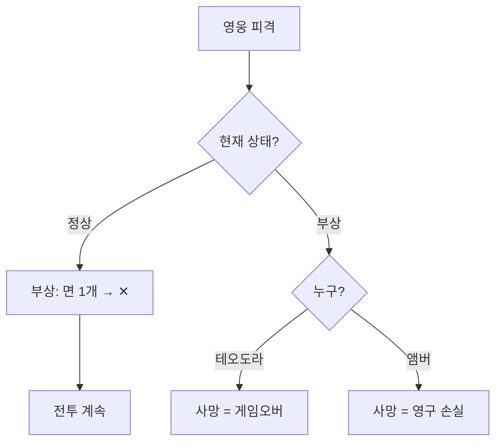
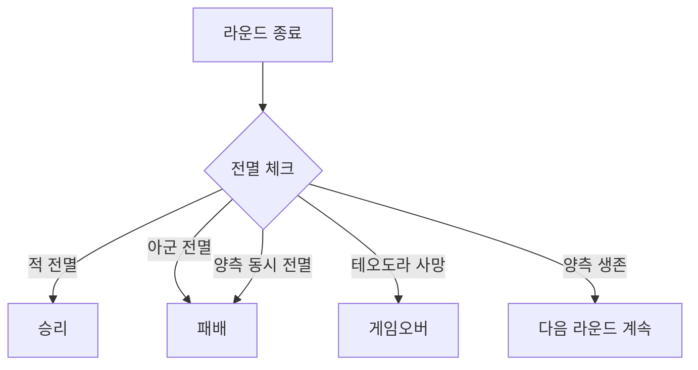

# COMBAT-JUDGE-001: 부상 / 사망 (Injury, Death)

> **상태:** 🔄 설계중 · **버전:** 0.5 · **ID:** COMBAT-JUDGE-001 · **수정일:** 2026-02-26

---

## ① 한 줄 요약

일반 유닛은 피해 시 주사위(=병사) 즉시 제거. 영웅은 2단계 부상. 모든 손실은 영구적(퍼마데스). 철수 없음 — 전투 진입 시 끝까지 싸운다.

---

## ② 규칙 정의

### 일반 사상자

| 필드 | 내용 |
|------|------|
| **판정** | 피해 = 상대 칼 - 내 방패. 뚫린 만큼 주사위(=병사) 제거 |
| **대상 선택** | 랜덤. 선택 불가. 영웅도 같은 풀에 포함 |
| **영속성** | 제거된 주사위는 영구 손실 (퍼마데스) |

### 영웅 부상 체계 (테오도라 / 앰버)

| 단계 | 테오도라 | 앰버 |
|------|---------|------|
| 정상 | 🛡🛡 유지 | ⚔⚔⚔⚔ 유지 |
| 부상 | 🛡 1개 → ✕ | ⚔ 1개 → ✕ |
| 사망 | 또 뚫리면 사망 = **게임오버** | 또 뚫리면 사망 = 영구 손실 |

> **선제 피격:** 낮 선제 페이즈에서 랜덤 히트 대상에 영웅 포함. 1히트=부상, 2히트=사망.
> **밤 전투:** 선제 자체가 스킵이므로 영웅 랜덤 피격 리스크 없음. 밤 공격의 전략적 이점.

### 전투 진입 / 종료

| 필드 | 내용 |
|------|------|
| **진입** | 미정 — 카드 덱 구조 확정 후 재정의. 카드 덱에서 전투 카드 선택 시 전투 시작 가능성 |
| **진입 시** | 전투 종료까지 이탈 불가 |
| **종료 — 적 전멸** | 승리. 전투 종료 |
| **종료 — 아군 전멸** | 패배. 전투 종료 |
| **종료 — 테오도라 사망** | 게임 오버 |
| **종료 — 양측 동시 전멸** | 패배 처리 (테오도라 대 소멸) |
| **철수** | **없음.** 전투 진입 = 끝까지 싸운다. 전투 회피는 맵 단계에서 한다 |

---

## ③ 시각 자료

### 영웅 부상 플로우

### 전투 종료 플로우

---

## ④~⑤

> TC 미작성. [06_TC/전투_TC.md](../../06_TC/전투_TC.md)에서 통합 관리 예정.

---

## ⑥ 설계 근거

| 질문 | 답변 | 분류 |
|------|------|------|
| 왜 사상자가 랜덤인가? | 선택제면 최하 유닛 우선 제거로 최적해 수렴. 랜덤이면 영웅 사망 가능 → 긴장 유지. | 퍼마데스 압박 |
| 왜 영웅이 2단계인가? | 1히트 즉사면 너무 억울. 부상 경고로 "다음엔 죽는다" 긴장 제공. | 감정 설계 |
| 왜 철수를 삭제했나? | 별도 철수 메카닉(철수 다이스, 도주/추격 판정)이 복잡도를 과도하게 야기. 아르멜로처럼 전투 회피는 맵 단계(시야, 소리, 정찰, 행군)에서 한다. 불리한 전장에 들어갔으면 끝까지 싸운다. | 복잡도 축소 |
| 왜 적은 도주 안 하는가? | 적 AI 도주 구현하면 복잡도 폭발. 적은 항상 싸운다는 단순 규칙으로 플레이어 판단에 집중. | 단순화 |

---

## ⑦ 의존성

| 방향 | ID | 이름 | 관계 |
|------|----|------|------|
| ← NEEDS | COMBAT-DICE-001 | 다이스 규칙 | 칼-방패 상쇄 |
| ← NEEDS | COMBAT-STRUCT-001 | 전투 구조 | 스텝 1(선제 사상자), 스텝 7(본 사상자) |
| ← NEEDS | COMBAT-UNIT-HERO | 영웅 | 2단계 부상 체계 |
---

## ⑧ 변경 이력

| 버전 | 날짜 | 변경 내용 | 사유 |
|------|------|-----------|------|
| 0.1 | 2026-02-25 | COMBAT_SYSTEM 정본에서 이관. 부상+철수+합류 통합. | 위키 구축 |
| 0.4 | 2026-02-25 | **철수 섹션 전체 삭제.** 파일명 부상사망철수→부상사망 변경. 철수 주사위, 철수 플로우차트, 철수 설계근거 제거. 영웅 선제 피격 규칙 추가. 전투 종료 플로우 추가. | 철수 삭제 결정 (전투구조 v0.3 연동) |
| 0.5 | 2026-02-26 | 전투 진입 조건 "미정 — 카드 덱 구조 확정 후". STAGE-MAP 의존성 제거. | 이동 시스템 삭제 |
