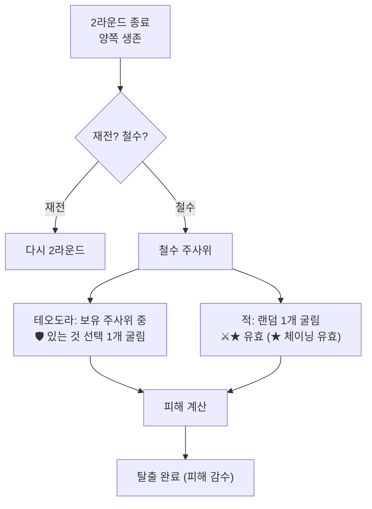

# COMBAT-JUDGE-001: 부상 / 사망 / 철수 (Injury, Death, Retreat)

> **상태:** 🔄 설계중 · **버전:** 0.1 · **ID:** COMBAT-JUDGE-001 · **수정일:** 2026-02-25

---

## ① 한 줄 요약

일반 유닛은 피해 시 주사위(=병사) 즉시 제거. 영웅은 2단계 부상. 전투 후 철수 시 추격 주사위로 추가 피해. 모든 손실은 영구적(퍼마데스).

---

## ② 규칙 정의

### 일반 사상자

| 필드 | 내용 |
|------|------|
| **판정** | 피해 = 상대 칼 - 내 방패. 뚫린 만큼 주사위(=병사) 제거 |
| **대상 선택** | 랜덤. 선택 불가. 영웅도 같은 풀에 포함 |
| **영속성** | 제거된 주사위는 영구 손실 (퍼마데스) |

### 영웅 부상 체계 (테오도라 / 앰버)

| 단계 | 테오도라 | 앰버 |
|------|---------|------|
| 정상 | 🛡🛡 유지 | ⚔⚔⚔⚔ 유지 |
| 부상 | 🛡 1개 → ✕ | ⚔ 1개 → ✕ |
| 사망 | 또 뚫리면 사망 = **게임오버** | 또 뚫리면 사망 = 영구 손실 |

### 전투 진입 / 종료

| 필드 | 내용 |
|------|------|
| **진입** | 테오도라 대가 적이 있는 타일에 진입 또는 적이 테오도라 타일로 이동 |
| **진입 시** | 이동력 즉시 소멸. 해당 타일에서 턴 종료 |
| **종료** | 2라운드(1턴) 끝나면 전투 일단 종료 |
| **양쪽 생존 시** | 재전 또는 철수 선택 |
| **철수 권한** | 테오도라 대만 선택 가능. 적은 도주 안 함 |

### 철수 주사위

| 필드 | 내용 |
|------|------|
| **도주 측 (테오도라)** | 보유 주사위 중 **플레이어가 선택** 1개 굴림. 🛡만 유효. ⚔/★/✕ = 효과 없음 |
| **추격 측 (적)** | 보유 주사위 중 **랜덤** 1개 굴림. ⚔, ★ 유효. 🛡/✕ = 효과 없음 |
| **★ 체이닝** | 추격 측 ★ 발동 시 ⚔ 확정 + 재굴림. 철수에서도 유효 |
| **결과** | 추격 ⚔ 합계 - 도주 🛡 = 뚫린 만큼 피해 |

### 합류 전투

| 필드 | 내용 |
|------|------|
| **조건** | 같은 타일에 여러 부대 |
| **행동** | 주사위 합산, 사상자 풀 공유 |
| **적용** | 테오도라 대 + 아군 징집병 합산. 적 별도 부대 + 적 징집병 합산 |
| **철수 시** | 테오도라 대 철수해도 징집병은 남음 |

---

## ③ 시각 자료

### 철수 판정

---

## ④~⑤

> TC 미작성.

---

## ⑥ 설계 근거

**Q. 왜 철수에 피해가 있는가?**
무료 철수면 불리하면 무조건 도망. 피해가 있어야 "버틸까 뺄까"가 진짜 판단이 된다.

**Q. 왜 적은 도주 안 하는가?**
적 AI 도주를 구현하면 복잡도가 폭발. 적은 항상 싸운다는 단순 규칙으로 플레이어 판단에 집중.

---

## ⑦ 의존성

| 방향 | ID | 이름 | 관계 |
|------|----|------|------|
| ← NEEDS | COMBAT-DICE-001 | 다이스 규칙 | 칼-방패 상쇄 |
| ← NEEDS | COMBAT-UNIT-HERO | 영웅 | 2단계 부상 체계 |
| → AFFECTS | STAGE-MAP | 맵 이동 | 전투 진입/철수 시 이동력 처리 |

---

## ⑧ 변경 이력

| 버전 | 날짜 | 변경 내용 | 사유 |
|------|------|-----------|------|
| 0.1 | 2026-02-25 | COMBAT_SYSTEM 정본에서 이관. 부상+철수+합류 통합. | 위키 구축 |
