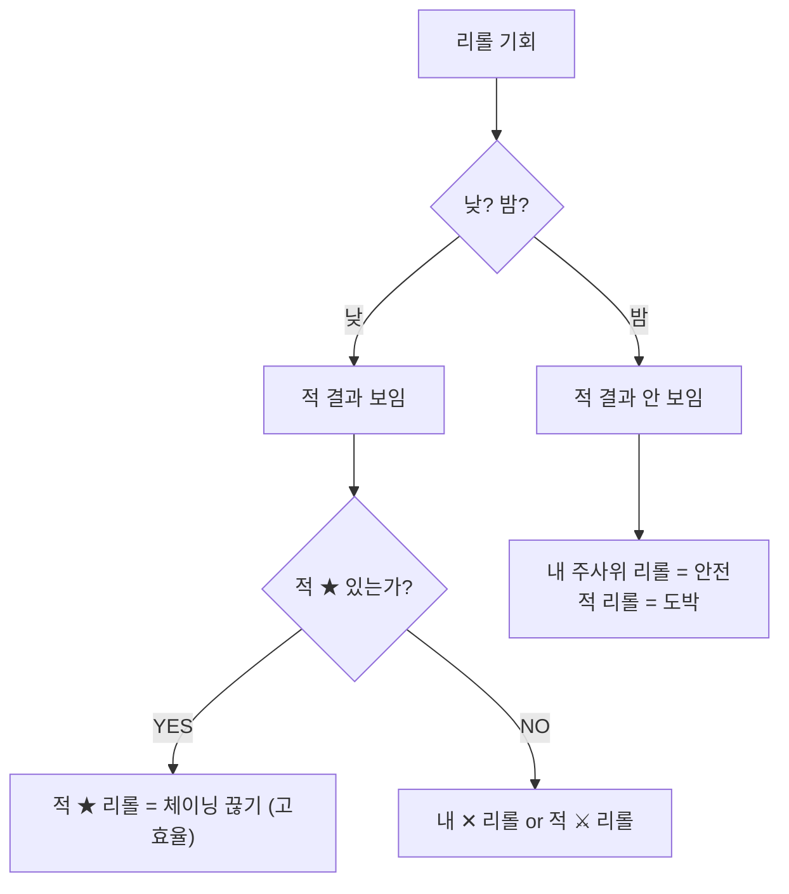

# COMBAT-ACT-002: 지휘 / 리롤 (Command / Reroll)

> **상태:** 🔄 설계중 · **버전:** 0.7 · **ID:** COMBAT-ACT-002 · **수정일:** 2026-03-08

---

## ① 한 줄 요약

지휘 = 플레이어 대면 명칭. 매 라운드 무료 1회. 내 주사위 또는 적 주사위 1개를 다시 굴려 결과를 뒤집는 핵심 개입 수단. 밀집(일제 굴림) 묶음 전체를 리롤 1회로 뒤집을 수 있다.

---

## ② 규칙 정의

| 필드 | 내용 |
|------|------|
| **조건** | 격돌 페이즈 스텝 4에서 기본 1회 (라운드당) |
| **대상** | A) 산개 유닛 1기의 d10 리롤 **또는** B) 밀집 묶음 1개의 d10 리롤(일제 리롤) |
| **행동** | A) 선택한 주사위 1개를 다시 굴림. B) 밀집 묶음 전체 결과를 다시 굴림 (초기면 기준) |
| **결과** | 새 결과로 교체. 적 ★도 리롤 대상 (체이닝 끊기 가능) |
| **제한** | 적은 리롤 없음. 플레이어 전용. 밤에는 적 결과가 안 보이므로 내 주사위 리롤이 안전한 선택 |
| **비용** | 없음 (무료) |
| **지휘 추가** | [현명한] 보유 시 +1 (기본 1회 → 총 2회). → [COMBAT-UNIT-HERO 영웅](../유닛/영웅.md) 참조 |

---

## ③ 시각 자료

### 지휘(리롤) 타이밍

```
7스텝:  [1.선제사격] → [2.버프] → [3.전체굴림] → [4.리롤★] → [5.쇄도] → [6.유닛전환] → [7.전과]
                                                    ↑ 여기서 1회
```

### 낮 vs 밤 리롤 판단



---

## ④ 설계 근거

**Q. 왜 무료인가?**
리롤은 매 라운드의 핵심 판단. 비용을 부과하면 "안 쓰는 게 최적"이 되어 개입 빈도가 급감한다.

**Q. 왜 적 주사위도 리롤 가능한가?**
적 ★ 체이닝을 끊는 것이 내 ✕를 리롤하는 것보다 가치가 높은 순간이 있다. 이 선택이 리롤의 깊이를 만든다.

**Q. 왜 밀집 묶음 전체가 리롤 1회인가?**
밀집의 핵심 리스크는 전원 ✕ 시 병종 전멸. 일제 리롤은 이 리스크에 대한 보험이자 밀집을 선택하는 유인. 리롤 1회로 N기를 동시에 복구할 수 있어 효율이 극대화되지만, 다른 유닛(특히 Named/테오도라)에 리롤을 못 쓰는 기회비용이 대가. → [COMBAT-STRUCT-001 전투 구조](../구조/전투구조.md) 대형 선택 참조

---

## ⑤ 변경 이력

| 버전 | 날짜 | 변경 내용 | 사유 |
|------|------|-----------|------|
| 0.1 | 2026-02-25 | COMBAT_SYSTEM 정본에서 이관. | 위키 구축 |
| 0.2 | 2026-02-25 | 라운드당 2회→1회(선제 리롤 삭제). 카드락 다이스 리롤 불가 명시. 타이밍 다이어그램 7스텝 반영. | 전투구조 v0.3 정합성 |
| 0.3 | 2026-02-28 | 리롤 추가 버프(카드 분기 효과, 기본 1회→총 2회) 반영. STAGE-CARD-002 의존성 추가. | 위키 정합성 감사 — STAGE-CARD-002 v0.4 반영 |
| 0.4 | 2026-02-28 | ④~⑤ 통합 섹션 → ④ UI/UX + ⑤ TC 분리. 플레이어 피드백 테이블 추가. | 운영규칙 템플릿 정합 |
| 0.5 | 2026-03-01 | 타이밍 다이어그램 스텝5: 지형→쇄도. 스텝2: 카드→버프 명칭 통일. | d10 전환 + 지형 폐기 기획 세션 |
| 0.6 | 2026-03-07 | (내용 미기록) | — |
| 0.7 | 2026-03-08 | **일제 리롤 추가.** 밀집 묶음 전체 = 리롤 1회 대상. 리롤 대상 선택지 명시 (산개 유닛 1기 OR 밀집 묶음 1개). 설계 근거 추가. | 대형 선택(COMBAT-FORMATION) 확정 세션 |
