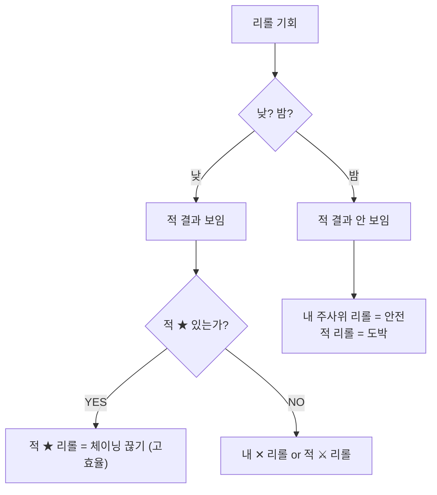

# COMBAT-ACT-002: 리롤 (Reroll)

> **상태:** 🔄 설계중 · **버전:** 0.3 · **ID:** COMBAT-ACT-002 · **수정일:** 2026-02-28

---

## ① 한 줄 요약

매 라운드 무료 1회. 내 주사위 또는 적 주사위 1개를 다시 굴려 결과를 뒤집는 핵심 개입 수단. 카드락 다이스는 대상에서 제외.

---

## ② 규칙 정의

| 필드 | 내용 |
|------|------|
| **조건** | 본전투 페이즈 스텝 4에서 기본 1회 (라운드당) |
| **대상** | 내 주사위 또는 적 주사위 1개 |
| **행동** | 선택한 주사위 1개를 다시 굴림 |
| **결과** | 새 결과로 교체. 적 ★도 리롤 대상 (체이닝 끊기 가능) |
| **제한** | 적은 리롤 없음. 플레이어 전용. 밤에는 적 결과가 안 보이므로 내 주사위 리롤이 안전한 선택 |
| **카드락 제외** | **카드로 확정된 다이스는 리롤 불가.** 카드 가치 보전을 위한 완전 잠금 |
| **비용** | 없음 (무료) |
| **리롤 추가 버프** | 카드 분기 효과로 획득 가능. 기본 1회 → 총 2회. 버프 슬롯 1개이므로 다른 버프와 경쟁. (STAGE-CARD-002 참조) |

---

## ③ 시각 자료

### 리롤 타이밍

```
7스텝:  [1.선제사격] → [2.카드] → [3.전체굴림] → [4.리롤★] → [5.지형] → [6.유닛전환] → [7.사상자]
                                                    ↑ 여기서 1회
        카드락 다이스는 리롤 대상에서 제외
```

### 낮 vs 밤 리롤 판단



---

## ④~⑤

> TC 미작성.

---

## ⑥ 설계 근거

**Q. 왜 무료인가?**
리롤은 매 라운드의 핵심 판단. 비용을 부과하면 "안 쓰는 게 최적"이 되어 개입 빈도가 급감한다.

**Q. 왜 적 주사위도 리롤 가능한가?**
적 ★ 체이닝을 끊는 것이 내 ✕를 리롤하는 것보다 가치가 높은 순간이 있다. 이 선택이 리롤의 깊이를 만든다.

---

## ⑦ 의존성

| 방향 | ID | 이름 | 관계 |
|------|----|------|------|
| ← NEEDS | COMBAT-STRUCT-001 | 전투 구조 | 스텝 4 타이밍 |
| ← NEEDS | COMBAT-DICE-001 | 다이스 규칙 | ★ 체이닝 끊기 |
| ← NEEDS | STAGE-CARD-002 | 스테이지카드규칙 | 리롤 추가 버프 공급원 |

---

## ⑧ 변경 이력

| 버전 | 날짜 | 변경 내용 | 사유 |
|------|------|-----------|------|
| 0.1 | 2026-02-25 | COMBAT_SYSTEM 정본에서 이관. | 위키 구축 |
| 0.2 | 2026-02-25 | 라운드당 2회→1회(선제 리롤 삭제). 카드락 다이스 리롤 불가 명시. 타이밍 다이어그램 7스텝 반영. | 전투구조 v0.3 정합성 |
| 0.3 | 2026-02-28 | 리롤 추가 버프(카드 분기 효과, 기본 1회→총 2회) 반영. STAGE-CARD-002 의존성 추가. | 위키 정합성 감사 — STAGE-CARD-002 v0.4 반영 |
