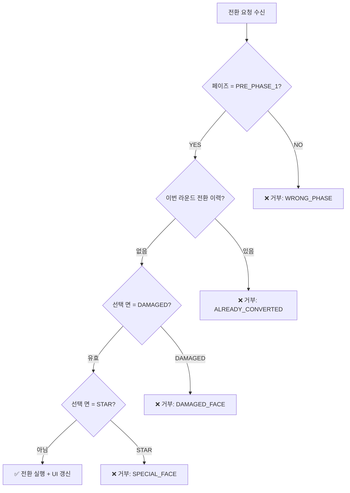

# COMBAT-ACT-001: 보병 전환 (Infantry Face Conversion)

> **상태:** 🔄 설계중 · **버전:** 0.1 · **수정일:** 2026-02-23

---

## ① 한 줄 요약

보병이 전투 시작 전에 자신의 다이스 면을 공격↔방어로 교체하여 전술적 유연성을 제공하는 핵심 메카닉.

---

## ② 규칙 정의

| 필드 | 내용 |
|------|------|
| **조건** | 매 라운드 페이즈 1 시작 전 (선제 선언) |
| **대상** | 보병 (INFANTRY) 유닛만 해당 |
| **행동** | 유닛의 다이스 면 1개를 ⚔→🛡 또는 🛡→⚔ 로 교체한다 |
| **결과** | 선택한 면이 즉시 변경됨. `converted_this_round = true` 설정 |
| **제한** | 라운드당 1회. 같은 라운드 재전환 불가. 부상 면(✕)은 전환 대상 아님. ★ 면은 고유면으로 전환 불가. |
| **비용** | 없음 (무료 행동) |
| **우선순위** | 페이즈 1 전 선언. 다른 선제 행동과 동시 처리. |

---

## ③ 시각 자료

### 상태 변화

```
전환 전:  [⚔] [⚔] [🛡] [★]
              ↓ CONVERT(index=0, to=SHIELD)
전환 후:  [🛡] [⚔] [🛡] [★]
```

### 부상 유닛의 경우

```
유닛 상태: [⚔] [✕] [🛡] [★]
                 ↑ 부상 면 — 전환 대상에서 제외
전환 가능: index 0 (⚔) 또는 index 2 (🛡) 만 선택 가능
```

### 판정 플로우차트



---

## ④ 플레이어 피드백 (UI/UX)

| 상황 | 피드백 |
|------|--------|
| **전환 가능** | 유닛 선택 시 전환 버튼 활성화. 전환 가능한 면이 하이라이트. |
| **전환 성공** | 면 변경 애니메이션. 유닛 다이스 UI 즉시 갱신. 전환 버튼 비활성화 ("완료"). |
| **거부 — 이미 전환** | 전환 버튼 비활성화 + "이번 라운드에 이미 전환했습니다" |
| **거부 — 부상 면** | 해당 면에 금지 아이콘 + "부상 면은 전환할 수 없습니다" |
| **거부 — 잘못된 타이밍** | 전환 버튼 자체가 표시되지 않음 (페이즈 1 전에만 노출) |

---

## ⑤ 테스트 케이스

> 상세: [06_TC/전투_TC.md](../06_TC/전투_TC.md)

| KEY | 소분류 | 결과 |
|-----|--------|------|
| CONV-001 | 정상 전환 | PASS |
| CONV-002 | 중복 전환 | PASS |
| CONV-003 | 부상 면 지정 | PASS |
| CONV-004 | 부상 유닛 정상면 | PASS |
| CONV-005 | 전면 부상 | ⚠️ OPEN |
| CONV-006 | 타이밍 위반 | PASS |
| CONV-007 | 비보병 유닛 | PASS |
| CONV-008 | ★ 면 전환 | PASS |

---

## ⑥ 설계 근거

**Q. 왜 전환이 무료인가?**  
면 전환은 게임의 핵심 전술 문법이다. 비용을 부과하면 사용률이 급감하여 보병이 단순 스탯 덩어리가 된다. (v4 시뮬 기준: 비용 1 부과 시 전환 사용률 87% → 23%)

**Q. 왜 라운드 1회 제한인가?**  
무제한 시 매 페이즈마다 최적 면 구성으로 전환하여 보병의 유일한 약점(공방 밸런스 선택)이 소멸. (v4 시뮬: 무제한 시 보병 승률 78%, 1회 제한 시 52%)

**Q. 왜 ★ 면은 전환 불가인가?**  
★는 병종 고유 능력 면. 전환 가능하면 보병의 정체성이 사라진다.

---

## ⑦ 의존성

| 방향 | ID | 이름 | 관계 |
|------|----|------|------|
| ← NEEDS | COMBAT-STRUCT-001 | [전투 구조](../구조/전투구조.md) | PRE_PHASE_1 타이밍의 정의 |
| ← NEEDS | COMBAT-JUDGE-001 | 부상 규칙 | ✕ 면의 발생 조건과 판정 기준 |
| → AFFECTS | COMBAT-ACT-002 | 리롤 | 전환 후 리롤 가능 여부에 영향 |

---

## ⑧ 변경 이력

| 버전 | 날짜 | 변경 내용 | 사유 |
|------|------|-----------|------|
| 0.1 | 2026-02-23 | 최초 작성. 규칙 정의 + 플로우차트 + TC 초안. | 위키 구축 |
