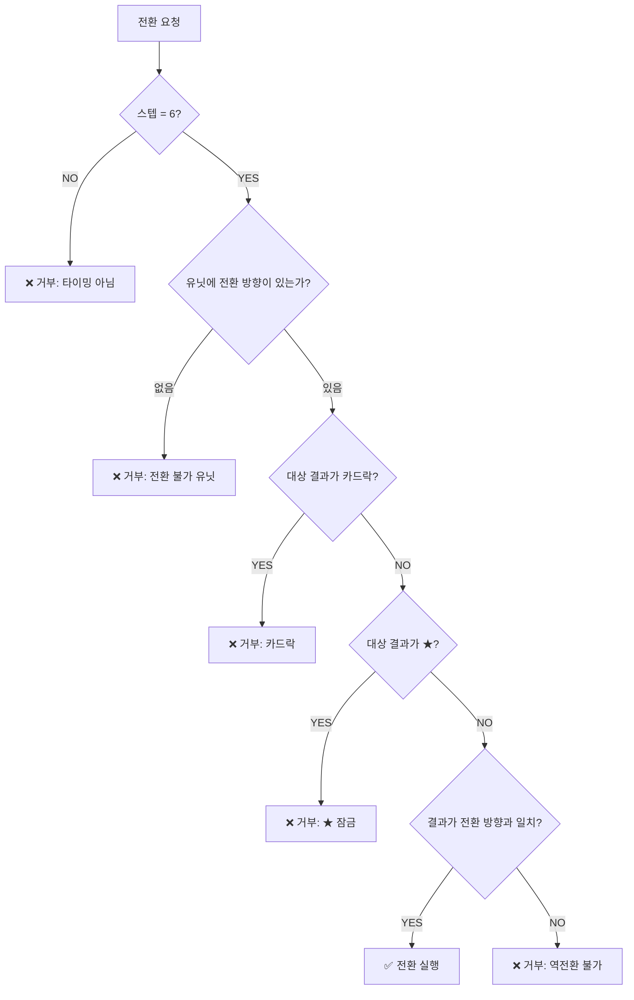

# COMBAT-ACT-001: 유닛 전환 (Unit Face Conversion)

> **상태:** 🔄 설계중 · **버전:** 0.2 · **ID:** COMBAT-ACT-001 · **수정일:** 2026-02-27

---

## ① 한 줄 요약

스텝 6(대응 페이즈)에서 굴림 결과를 일방향 전환한다. 보병/기병은 ⚔→🛡, 창병/기사는 🛡→⚔. 카드락 다이스는 전환 불가.

---

## ② 규칙 정의

| 필드 | 내용 |
|------|------|
| **타이밍** | 스텝 6 (대응 페이즈). 리롤(4)·지형(5) 이후, 사상자 계산(7) 이전 |
| **대상** | 해당 라운드의 **굴림 결과**를 전환. 면 자체를 바꾸는 것이 아님 |
| **방향** | 일방향. 아래 전환 테이블 참조 |
| **횟수** | 해당 유닛의 전환 가능 결과 전부 (1개가 아님) |
| **비용** | 없음 (무료 행동) |

### 전환 테이블

| 유닛 계열 | T1 | T2 | 전환 방향 | 설명 |
|-----------|----|----|-----------|------|
| 민병 | 민병 | 용병 | 없음 | 기본 유닛 |
| 보병 | 보병 | 기병 | ⚔→🛡 | 필요 시 거북이 가능 |
| 창병 | 창병 | 기사 | 🛡→⚔ | 필요 시 펀치 가능 |
| 궁병 | 궁병 | 석궁병 | 없음 | 원거리 전문 |
| 영웅 | 테오도라 | — | ⚔→🛡 (★ 잠금) | 보병 계열 |
| 영웅 | 앰버 | — | 없음 | 궁병 계열 |

### 제한사항

| 제한 | 내용 |
|------|------|
| **역전환 불가** | 보병은 🛡→⚔ 불가. 창병은 ⚔→🛡 불가 |
| **카드락 다이스** | 스텝2에서 토큰으로 확정된 다이스는 전환 불가 |
| **★ 결과 자체** | 전환 불가 (잠금). 단, ★ 체이닝으로 생성된 ⚔는 전환 가능 |
| **✕ 결과** | 전환할 것이 없음 (지형 전환은 스텝5에서 별도 처리) |

---

## ③ 시각 자료

### 전환 흐름도

```
스텝 6: 유닛 전환

  보병/기병:  굴림 결과 ⚔ ──→ 🛡로 전환 가능
  창병/기사:  굴림 결과 🛡 ──→ ⚔로 전환 가능
  테오도라:   굴림 결과 ⚔ ──→ 🛡로 전환 가능 (★ 잠금)
  민병/용병:  전환 없음
  궁병/석궁:  전환 없음
  앰버:       전환 없음

  제외 대상:
  ├── 카드락 다이스 → 전환 불가
  ├── ★ 결과 자체 → 전환 불가 (체이닝 결과물은 가능)
  └── ✕ 결과 → 전환할 것이 없음
```

### 판정 플로우차트



### 낮 vs 밤

```
낮: 적 결과 보임 → 정보 기반 전환 판단
    "적 칼이 3개다. 보병 칼을 방패로 돌리자."

밤: 적 결과 "?" → 감으로 전환 판단
    "적이 뭘 굴렸는지 모르지만... 방어로 간다."
```

---

## ④ 플레이어 피드백 (UI/UX)

| 상황 | 피드백 |
|------|--------|
| **전환 가능** | 전환 가능 결과에 전환 아이콘 표시. 탭하면 미리보기 |
| **전환 실행** | 결과 변경 애니메이션 (⚔→🛡 플립) |
| **전환 불가 (카드락)** | 잠금 아이콘. "카드로 확정된 결과입니다" |
| **전환 불가 (★)** | 잠금 아이콘. "고유 결과는 전환할 수 없습니다" |
| **전환 확정** | 확정 버튼 → 스텝 7(사상자 계산)으로 진행 |

---

## ⑤ 테스트 케이스

> [06_TC/전투_TC.md](../../06_TC/전투_TC.md)에서 통합 관리.

### TC 작성 시 검증 대상

| # | 항목 |
|---|------|
| 1 | 보병 ⚔→🛡 정상 전환 |
| 2 | 보병 🛡→⚔ 역전환 거부 |
| 3 | 창병 🛡→⚔ 정상 전환 |
| 4 | 창병 ⚔→🛡 역전환 거부 |
| 5 | 카드락 다이스 전환 거부 |
| 6 | ★ 결과 전환 거부 |
| 7 | ★ 체이닝 생성 ⚔ → 보병이 🛡로 전환 가능 |
| 8 | 민병/궁병/앰버 전환 시도 거부 |
| 9 | 스텝 6 외 타이밍에서 전환 시도 거부 |

---

## ⑥ 설계 근거

| 질문 | 답변 | 근거 |
|------|------|------|
| 왜 일방향인가? | 퍼마데스 환경에서 방패가 칼보다 귀함. 양방향이면 클래스 정체성 희석. 보병은 "수비로 전환 가능한 공격병", 창병은 "공격으로 전환 가능한 수비병". | 전투구조 v0.3 세션 |
| 왜 굴림 결과 전환이지 면 교체가 아닌가? | 면 교체(사전 선언)는 굴리기 전에 결정 → 예측 게임. 결과 전환(사후 대응)은 굴린 뒤 판단 → 대응 게임. Chronicle은 "닥친 상황에 대응"이 핵심 경험. | 핵심경험목표 CORE-001 |
| 왜 무료인가? | 비용 부과 시 사용률 급감(v4 시뮬: 87%→23%). 전환은 매 라운드 핵심 판단이어야 함. | v4 시뮬 데이터 |
| 왜 카드락이 전환도 차단하나? | 카드(토큰)로 확정한 결과를 뒤집으면 카드 비용이 무의미. 확정은 확정. | 카드 가치 보전 |

---

## ⑦ 의존성

| 방향 | ID | 이름 | 관계 |
|------|----|------|------|
| ← NEEDS | COMBAT-STRUCT-001 | 전투 구조 | 스텝 6 타이밍 정의 |
| ← NEEDS | COMBAT-DICE-001 | 다이스 규칙 | ⚔/🛡/★/✕ 면 종류 |
| ← NEEDS | STAGE-DECK-001 | 덱빌딩 | 카드락 규칙 (토큰→확정→잠금) |
| → AFFECTS | COMBAT-JUDGE-001 | 부상/사망 | 전환 후 최종 결과로 스텝7 사상자 계산 |

---

## ⑧ 변경 이력

| 버전 | 날짜 | 변경 내용 | 사유 |
|------|------|-----------|------|
| 0.1 | 2026-02-23 | 최초 작성. PRE_PHASE_1 타이밍, 양방향, 면 교체 방식. | 위키 구축 |
| 0.2 | 2026-02-27 | **전면 재작성.** 타이밍 스텝6으로 변경. 양방향→일방향. 면 교체→굴림 결과 전환. 카드락 제한 추가. 전투구조 v0.4 정합성 확보. | 전투구조 v0.3~v0.4 반영 누락 수정 |
