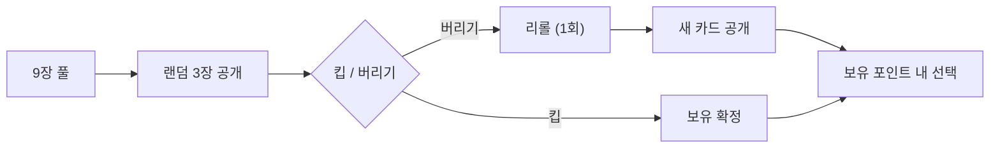

# COMBAT-ACT-003: 작전 카드 (Operation Cards)

> **상태:** 🔄 설계중 · **버전:** 0.2 · **ID:** COMBAT-ACT-003 · **수정일:** 2026-02-25

---

## ① 한 줄 요약

9장의 대칭 카드(행군/공격/수비 × 1/2/3pt). 스테이지마다 고정 포인트로 구매하며, 브리핑에서 멀리건으로 선택. 전투 밖(이동)과 전투 안(굴림 확정) 모두에 쓰이는 전략 자원.

---

## ② 규칙 정의

### 작전 포인트

| 필드 | 내용 |
|------|------|
| **지급** | 스테이지마다 고정 지급. 1스테이지 기준 3pt |
| **이월** | 불가. 해당 스테이지에서 소진 |
| **소모** | 카드 사용 시 |

### 행군 카드 (맵 — 이동 전 사용)

| 카드 | 코스트 | 효과 |
|------|--------|------|
| [전진] | 1pt | 이동 주사위 1회 리롤 |
| [강행군] | 2pt | 이동 주사위 결과 +2 |
| [전속 전진] | 3pt | 이동 주사위 2번 굴려서 둘 다 사용 (2~6칸) |

### 공격 카드 (선제 + 본 페이즈 — 굴림 전 사용)

| 카드 | 코스트 | 효과 |
|------|--------|------|
| [공격 태세] | 1pt | 내 주사위 1개를 ⚔로 확정 |
| [돌격] | 2pt | 내 주사위 1개를 ⚔⚔로 확정 (1개가 칼 2개 취급) |
| [전술의 대가] | 3pt | 내 주사위 1개를 ★⚔로 확정 (★ 체이닝 + 칼 1) |

### 수비 카드 (선제 + 본 페이즈 — 굴림 전 사용)

| 카드 | 코스트 | 효과 |
|------|--------|------|
| [방어 태세] | 1pt | 내 주사위 1개를 🛡로 확정 |
| [방벽] | 2pt | 내 주사위 1개를 🛡🛡로 확정 (1개가 방패 2개 취급) |
| [수성의 대가] | 3pt | 내 주사위 1개를 ★🛡로 확정 (★ 체이닝 + 방패 1) |

### 공통 규칙

| 필드 | 내용 |
|------|------|
| **대상** | 아무 주사위 |
| **중복** | 한 전투에서 여러 장 사용 가능 |
| **소멸** | 한 스테이지에서 쓰면 소멸. 같은 카드 중복 등장 없음 |
| **테오도라 특수** | 테오도라에 [전술의 대가] 사용 시 ★ + ⚔ 둘 다 돌파(관통) 적용 |

### 카드락 (Card Lock)

> 카드로 확정된 다이스 결과는 **완전 잠금**된다.

| 상황 | 처리 |
|------|------|
| 카드 확정 다이스 → 리롤 | **불가** |
| 카드 확정 다이스 → 유닛 전환 | **불가** |
| 카드 확정 다이스 → 지형 전환 | **불가** (✕가 아니므로 해당 없음) |

**예시:**
- [공격 태세] 1pt → 창병에 사용: ⚔ 확정 + 잠금. 창병은 보통 🛡만 나오므로 비효율적이나, 절박한 상황에서 공격력 확보 수단.
- [방어 태세] 1pt → 궁병에 사용: 🛡 확정 + 잠금. 궁병이 방어하는 유일한 방법.
- [돌격] 2pt → 보병에 사용: ⚔⚔ 확정 + 잠금. 보병의 ⚔→🛡 전환 불가. 카드 가치 보전.

**★ 체이닝 결과물 예외:** ★에서 생성된 ⚔ 1개는 카드락 적용 **안 됨**. 유닛 전환으로 🛡로 교환 가능.

### 멀리건

| 필드 | 내용 |
|------|------|
| **타이밍** | 브리핑 단계 |
| **행동** | 9장 풀에서 랜덤 3장 공개 → 킵/버리기 → 버린 카드 리롤 (1회만) |
| **선택** | 킵한 카드 + 리롤 결과에서 보유 포인트 내 선택 |
| **제한** | 포인트 소진되면 더 못 집음 (3pt 카드 1장 = 끝) |

---

## ③ 시각 자료

### 카드 대칭 구조

```
         1pt          2pt           3pt
행군:   [전진]       [강행군]      [전속 전진]
공격:   [공격 태세]  [돌격]        [전술의 대가]
수비:   [방어 태세]  [방벽]        [수성의 대가]
```

### 멀리건 흐름



---

## ④~⑤

> TC 미작성.

---

## ⑥ 설계 근거

**Q. 왜 9장 대칭인가?**
3카테고리 × 3코스트로 모든 상황에 선택지를 제공하면서 구조가 직관적. 비대칭이면 암기 부담.

**Q. 왜 이월 불가인가?**
이월 가능하면 "아끼는 게 최적"이 되어 사용률이 급감. 스테이지 내 소진 강제로 매 스테이지마다 판단을 만든다.

---

## ⑦ 의존성

| 방향 | ID | 이름 | 관계 |
|------|----|------|------|
| ← NEEDS | COMBAT-STRUCT-001 | 전투 구조 | ④ 카드 사용 타이밍 |
| ← NEEDS | STAGE-MAP | 맵 이동 | 행군 카드가 이동 주사위에 적용 |
| → AFFECTS | COMBAT-UNIT-HERO | 영웅 | 테오도라 돌파와 [전술의 대가] 시너지 |

---

## ⑧ 변경 이력

| 버전 | 날짜 | 변경 내용 | 사유 |
|------|------|-----------|------|
| 0.1 | 2026-02-25 | COMBAT_SYSTEM 정본에서 이관. | 위키 구축 |
| 0.2 | 2026-02-25 | 카드락(Card Lock) 규칙 섹션 추가. 카드 확정 다이스 = 리롤/전환/지형 전환 불가. 예시(창병·궁병·보병). ★ 체이닝 결과물 예외. | 전투구조 v0.3 정합성 |
