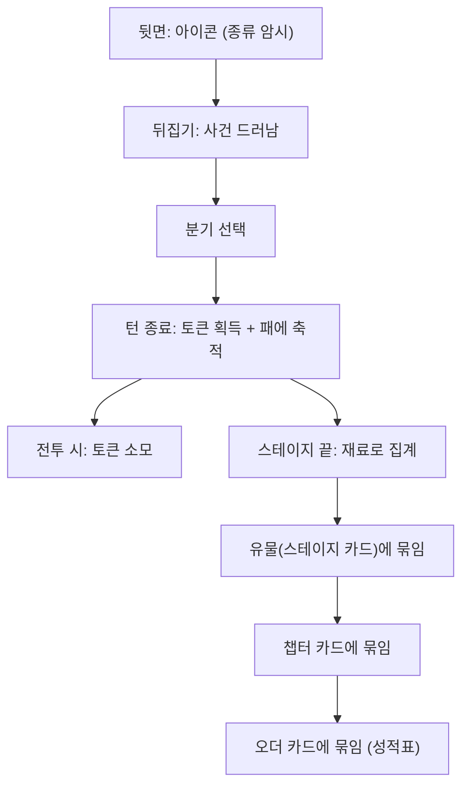
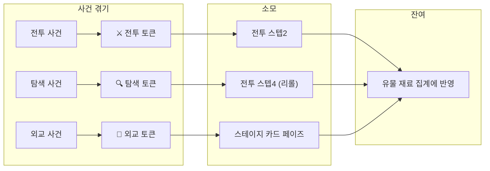

# STAGE-DECK-001: 덱빌딩 — "겪은 것이 덱이 된다"

> **상태:** 🔄 설계중 · **버전:** 0.1 · **ID:** STAGE-DECK-001 · **수정일:** 2026-02-27

---

## ① 한 줄 요약

스테이지에서 겪은 사건 카드가 소모 토큰과 유물 재료를 동시에 제공한다. 토큰은 전투에서 소모하고, 재료는 스테이지 끝에 묶여 유물(스테이지 카드)이 된다. 카드 한 장이 이야기이고, 단기 자원이고, 장기 재료이고, 기록이다.

---

## ② 핵심 원칙

| 원칙 | 내용 |
|------|------|
| **하나의 객체, 여러 얼굴** | 새 시스템이 필요하면 카드에 얼굴을 하나 더 붙인다. 시스템을 하나 더 만들지 않는다. |
| **서사-메카닉 일치** | 겪은 것이 나를 만든다. 플레이 이력이 곧 빌드. |
| **전투는 주사위** | 카드는 전투 조건과 자원을 세팅한다. 전투 안에서 주역은 주사위. |
| **밀도 높은 정합성** | 카드 1장 = 이야기 + 토큰 + 재료 + 기록. 분리된 시스템 없음. |

---

## ③ 카드의 네 얼굴

| 얼굴 | 역할 | 예시 |
|------|------|------|
| **이야기** | 사건 서술 + 분기 선택 | "부서진 다리에서 매복을 만났다" |
| **토큰** | 사건 타입에 따라 소모 토큰 지급 | 전투 사건 → ⚔ 토큰 +1 |
| **재료** | 스테이지 끝 유물 생성의 인풋 | 전투 사건 4장 → 공격 계열 유물 풀 |
| **기록** | 사서 로그에 기록. 스테이지 카드 안에 묶여 보존 | 📜 "테오도라 대, 매복을 뚫다." |

---

## ④ 토큰 시스템

### 토큰 3종

| 토큰 | 획득 조건 | 소모 타이밍 | 효과 |
|------|----------|------------|------|
| **전투 토큰** | 전투 계열 사건 겪기 | 전투 스텝2 (작전 카드 자리) | 미정 — ⚔/🛡 확정, 카드락 등 전투 직접 개입 계열 |
| **탐색 토큰** | 탐색 계열 사건 겪기 | 전투 스텝4 (리롤 자리) | 미정 — 리롤 추가, 적 주사위 리롤 등 정보/조작 계열 |
| **외교 토큰** | 외교 계열 사건 겪기 | 스테이지 카드 페이즈 | 미정 — 카드 새로고침, 우연 무효화 등 스테이지 진행 개입 계열 |

### 토큰 규칙

| 필드 | 내용 |
|------|------|
| **획득** | 사건 카드 겪기 완료(턴 종료) 시 타입에 따라 +1 |
| **우연 카드** | 우연도 토큰 지급. 타입은 우연 카드에 명시. |
| **이월** | 가능. 스테이지 내 전투 간 이월. |
| **소멸** | 스테이지 종료 시 잔여 토큰 소멸. 단, 유물 재료 집계에 반영. |
| **표시** | 화면에 토큰 보유량 표시. |

---

## ⑤ 유물 시스템 (스테이지 카드)

### 유물 생성

| 필드 | 내용 |
|------|------|
| **생성 시점** | 운명 달성 (스테이지 클리어) 시 |
| **인풋** | 겪은 사건 내역 (타입별 비율) + 잔여 토큰 + 전투 결과 |
| **방식** | 시스템이 인풋 기반으로 해당 성향 테이블에서 효과 결정 |
| **결과물** | 유물 1장 = 스테이지 카드. 칭호 + 영구 패시브. |
| **예시** | 전투 사건 우세 → 공격 테이블 → "부서진 다리의 테오도라 — [피의 진격]" |

### 유물 규칙

| 필드 | 내용 |
|------|------|
| **영구** | 획득 이후 모든 전투에 적용. |
| **패시브** | 플레이어가 능동 사용하지 않음. 조건 충족 시 자동 발동. |
| **묶임** | 스테이지 카드 안에 겪은 사건 카드들이 보존됨. 희생 아님. |
| **열기** | 유물을 열면 겪은 사건들이 다 보임 (사서 기록). |

### 칭호 — 헤라클레스 방식

| 필드 | 내용 |
|------|------|
| **명명** | 추상 덕목이 아니라 겪은 사건/장소가 이름이 됨. |
| **예시** | "부서진 다리의 테오도라", "검은 숲의 테오도라" |
| **서사** | 네메아의 사자 → 헤라클레스의 용맹. 군공이 곧 이름. |

---

## ⑥ 압축 구조 — 5층 카드 대응

| 게임 층위 | 카드 층위 | 내용 |
|----------|----------|------|
| Battle | 겪은 사건 카드 (낱장) | 이야기 + 토큰 + 재료 + 기록 |
| Stage | 스테이지 카드 (유물) | 사건들 묶음 → 칭호 + 영구 패시브 |
| Chapter | 챕터 카드 | 스테이지 카드들 묶음 → 더 강한 패시브 |
| Order | 오더 카드 (성적표) | 챕터 카드들 묶음 → 런 전체 기록. 게임 효과 없음. |

### 압축 흐름

```
겪은 사건들 ──묶임──→ [스테이지 카드]
                      "부서진 다리의 테오도라"
                       칭호 + 패시브

스테이지 카드들 ──묶임──→ [챕터 카드]
                         "오를레앙의 테오도라"
                          더 강한 패시브

챕터 카드들 ──묶임──→ [오더 카드]
                      "강철의 성녀 테오도라"
                       성적표 (효과 없음)
```

> 묶임이지 희생이 아니다. 상위 카드를 열면 하위 카드가 전부 보인다. 종이가 쌓여 역사가 된다.

---

## ⑦ 운명 달성 = 결산 (야영 대체)

| 항목 | 내용 |
|------|------|
| **부상 회복** | 기본. 달성하면 전원 자동 회복. |
| **유물 생성** | 겪은 내역 기반 스테이지 카드 탄생. |
| **면 교체** | ✕ 1개 → ⚔/🛡/✕ 랜덤 교체. 매 스테이지 클리어 시 1회. |
| **프로모션** | T1→T2 승급. 운명 보상 한정. 매우 귀함. |
| **서사** | 군공을 세웠다. 기록할 가치가 있는 사건. |

> 별도 야영 페이즈 없음. 운명 달성의 결산 과정이 야영.

---

## ⑧ 브리핑 (유지, 재정의)

| 필드 | 내용 |
|------|------|
| **느낌** | 막사 안 전술회의. 탁상에 모형. 맵 공개가 아님. |
| **역할** | 이번 스테이지 분위기 암시 + 운명 공개 + 경량 보급 |
| **경량 보급** | 미정 — 붕대 등 생존 소모품. 토큰과 역할 겹치지 않는 것. |
| **읽기 박자** | 핵심경험목표 세 박자 중 ① 읽기를 담당. |

---

## ⑨ 폐기된 시스템

| 시스템 | 대체 | 사유 |
|--------|------|------|
| **보급** (붕대/방패/검/깃발) | 토큰 3종 | 겪은 카드가 전투 자원 역할. 별도 보급 불필요. |
| **야영** | 운명 달성 결산 | 유물 생성 + 회복 + 면교체가 야영 역할. |
| **작전 카드** (9장 대칭) | 토큰 (스텝2) | 보급 → 토큰으로 2단계 대체. |

---

## ⑩ 뒷면 아이콘

| 필드 | 내용 |
|------|------|
| **역할** | 사건 종류 암시. 슬더스 노드 아이콘과 같은 수준. |
| **보여주는 것** | 이 카드가 어떤 종류의 사건인지 (전투/탐색/외교). |
| **안 보여주는 것** | 보상, 빌드 영향, 구체 효과. |
| **우연 카드** | 별도 아이콘 또는 ?. 사건 카드와 구분. |

---

## ⑪ 시각 자료

### 스테이지 전체 흐름

```
브리핑 (전술회의)
  ├─ 스테이지 분위기 암시
  ├─ 운명 공개
  └─ 경량 보급
    │
    ▼
스테이지 진행 (턴 반복)
  ├─ 카드 뒤집기 → 사건/우연
  ├─ 분기 선택 (사건) / 즉시 발동 (우연)
  ├─ 토큰 획득 (타입별 +1)
  ├─ 전투 발생 시 → 7스텝 (토큰 소모)
  └─ 겪은 카드 → 패에 축적 (재료)
    │
    ▼
운명 달성 (결산)
  ├─ 부상 전원 회복
  ├─ 재료 집계 → 유물 테이블 → 스테이지 카드 탄생
  ├─ 면 교체 1회
  └─ 다음 스테이지로
```

### 카드 1장의 생애



### 토큰 흐름



---

## ⑫ 미확정 사항

| 항목 | 현재 상태 | 결정에 필요한 것 |
|------|----------|----------------|
| **토큰 3종 구체 효과** | 방향만 있음 (전투=직접개입, 탐색=리롤, 외교=스테이지개입) | 전투 7스텝 기준 효과 목록 설계 + 시뮬 |
| **토큰 소모 스텝 매핑** | 전투→스텝2, 탐색→스텝4 방향. 확정 아님. | 전투 프로토타입에서 검증 |
| **사건 계열 분류** | 전투/탐색/외교 3종 방향. 구체 정의 미확정. | Order 1 이야기 뼈대에서 사건 유형 도출 |
| **턴 수** | 10→5턴 축소 방향. 미확정. | 덱 수학 재검증 + 프로토타입 |
| **유물 테이블 구조** | 성향별 테이블 방향. 구체 인풋/아웃풋 미정. | 사건 카드 실물 30장 + 효과 풀 설계 |
| **챕터 카드 합치기 규칙** | 스테이지 카드들이 묶이는 것만 확정. 효과 결정 방식 미정. | Order 1 챕터 구조 확정 후 |
| **경량 보급 내용** | 붕대 등 생존 소모품 방향. 구체 미정. | 토큰과 역할 분리 후 |
| **초기 패** | 편성 시 2~3장 방향. 미확정. | 첫 전투 밸런스 테스트 |
| **우연 카드 토큰 타입** | 우연도 토큰 지급. 타입 결정 방식 미정. | 우연 카드 목록 설계 시 |

---

## ⑬ 설계 근거

| 질문 | 답변 | 근거 |
|------|------|------|
| 왜 보급 시스템을 폐기했나? | 겪은 카드가 전투 자원(토큰)을 제공하므로 별도 보급이 이중 구조. 시스템 수 감소 = 솔로 개발 비용 감소. | 세션 내 논의 |
| 왜 야영을 폐기했나? | 운명 달성이 회복+유물+면교체를 제공. 군공을 세워 포상받는 서사와 일치. 별도 페이즈 불필요. | 세션 내 논의 |
| 왜 낱개 카드에 개별 전투 효과가 없나? | 10장 패시브 주렁주렁 → 관리 부담 + 주사위 정체성 희석. 토큰(단일 소모 자원)으로 영향을 주되, 패시브는 유물에서만. | 세션 내 반복 검증 |
| 왜 토큰이 3종인가? | 전투 7스텝 수동 개입(스텝2,4,5,6) 중 핵심 3개에 대응. 4종 이상은 관리 부담. | 전투구조 매핑 |
| 왜 유물 효과가 랜덤 테이블인가? | 확정 조합표 → 최적해 도출. 테이블 → 방향은 내 선택, 결과는 확정 아님. 주사위 게임 철학과 일치. | 로그라이크 장르 관례 |
| 왜 게이지/진척도를 안 보여주나? | 유저가 학습하면 메타 계산이 끼어 서사 몰입 방해. 사후 발견으로 자연스러운 인과. 반복 시 학습은 장르적 특성(허용). | 세션 내 논의 |
| 왜 헤라클레스 방식 칭호인가? | 추상 덕목(용맹 Lv3)보다 구체 사건(부서진 다리의 테오도라)이 기억에 남고, 사서 프레임과 정합. | 세션 내 논의 |
| 왜 압축이 희생이 아니라 묶임인가? | 카드 = 시간 = 기록. 역사는 사라지지 않고 쌓인다. | 핵심 상징 체계 |
| 왜 슬더스 유물 방식을 참고하나? | 유물이 고정이 아니라 내가 만든다는 점이 핵심 차이. 같은 스테이지도 다르게 겪으면 다른 유물. | 세션 내 논의 |

### 폐기된 접근

| 접근 | 폐기 이유 |
|------|----------|
| 낱개 카드마다 패시브 효과 | 10장 주렁주렁. 주사위 게임이 카드 게임이 됨. |
| 낱개 카드 효과 완전 없음 (순수 재료) | 스테이지 내 성장 체감 0. 스텝2 빔. 스테이지-전투 분리. |
| 임계점 (계열 N장 → 패시브 활성화) | 게이지 채우기 느낌. 사서 톤과 불일치. |
| 직전 1장만 전투 영향 | 검토했으나 재료+토큰 이중 구조가 더 깔끔. |
| 사건→전투 조건 직접 매핑 | 수작업 매핑 필요. 억지스러운 인과 발생. |
| 덕목 게이지 (용맹/지혜/인내/위엄) | 추상적. 길어지면 짜침. 헤라클레스 방식으로 대체. |

---

## ⑭ 의존성

| 방향 | ID | 이름 | 관계 |
|------|----|------|------|
| ← NEEDS | CORE-001 | 핵심 경험 목표 | 세 박자 중 ②적응 ③선택의 구현 |
| ← NEEDS | STAGE-CARD-001 | 카드 해상도 | 사건/우연 뒤집기 구조 위에서 동작 |
| ← NEEDS | COMBAT-STRUCT-001 | 전투 구조 | 토큰이 7스텝 내에서 소모 |
| → AFFECTS | COMBAT-STRUCT-001 | 전투 구조 | 스텝2에 토큰 소모 추가. |
| → REPLACES | STAGE-SUPPLY | 보급 | 토큰이 보급 역할 대체. |
| → REPLACES | COMBAT-ACT-003 | 작전 카드 | 토큰이 작전 카드 역할 대체 (2단계 대체). |
| → AFFECTS | META-* | 메타 시스템 | 야영 삭제. 유물 시스템 신설. |

---

## ⑮ 변경 이력

| 버전 | 날짜 | 변경 내용 | 사유 |
|------|------|-----------|------|
| 0.1 | 2026-02-27 | 최초 작성. "겪은 것이 덱이 된다" 구조 정의. 토큰 3종, 유물 압축, 칭호, 야영 대체. | 덱빌딩 구조 설계 세션 |
