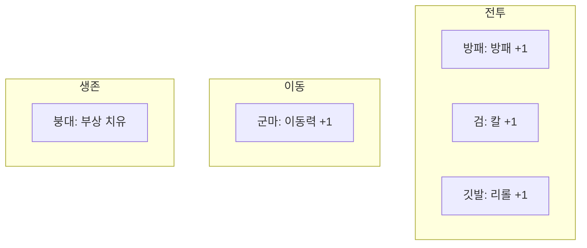

# STAGE-SUPPLY: 보급 (Supply)

> **상태:** 🔄 설계중 · **버전:** 0.1 · **ID:** STAGE-SUPPLY · **수정일:** 2026-02-25

---

## ① 한 줄 요약

브리핑에서 보급 카드 풀 중 공개된 카드에서 N장을 골라 스테이지에 가져간다. 전부 1회용, 동일 가치, 이월 불가. 기존 작전카드(COMBAT-ACT-003)를 대체.

---

## ② 규칙 정의

### 풀 구조

| 필드 | 내용 |
|------|------|
| **풀 구성** | 보급 카드 종류별 복수 장 포함. 총 장수 미정. |
| **공개 방식** | 조건에 따라 풀의 일부가 공개됨. 조건 기준 미정. |
| **선택** | 공개된 카드 중 N장 선택. N 미정. |
| **코스트** | 없음. 전부 동일 가치. 장수 제한이 유일한 비용. |
| **이월** | 불가. 해당 스테이지에서 소진. |

### 보급 카드 목록

| 카드 | 효과 | 사용 타이밍 |
|------|------|------------|
| 붕대 | 부상 1회 치유 | 미정 |
| 방패 | 전투 방패 +1 | 전투 |
| 검 | 전투 칼 +1 | 전투 |
| 군마 | 이동력 +1 | 이동 |
| 깃발 | 전투 리롤 +1 | 전투 |

### 카드 공통 규칙

| 필드 | 내용 |
|------|------|
| **사용** | 1회용. 사용 시 소멸. |
| **중복 보유** | 같은 종류 여러 장 보유 가능. |
| **확장** | 카드 종류는 향후 추가 가능. |

---

## ③ 시각 자료

### 브리핑 보급 선택 흐름

### 카드 효과 범위

---

## ④ 플레이어 피드백 (UI/UX)

> 미정. 보급 선택 UI 및 사용 피드백은 프로토타입 단계에서 설계.

---

## ⑤ 테스트 케이스

> 미작성.

---

## ⑥ 설계 근거

**Q. 왜 코스트를 없앴는가?**
기존 작전포인트(1/2/3pt) 구조는 "얼마짜리"를 계산하는 판단이었다. 전부 동일 가치로 바꾸면 판단이 순수하게 "뭘 가져갈 것인가"가 된다.

**Q. 왜 멀리건을 없앴는가?**
멀리건은 랜덤 구제 장치. 풀에서 공개된 카드를 직접 고르는 구조에서는 구제가 불필요. 플레이어가 조합을 직접 설계한다.

**Q. 왜 카테고리를 없앴는가?**
무기/약재/식량/도구로 나누면 직관적이지만, 카드 5종에서 카테고리 구분은 불필요한 복잡성. 카드 개별 효과가 명확하면 카테고리 없이도 판단 가능.

**Q. 기존 작전카드(COMBAT-ACT-003)와의 관계는?**
대체. 기존 9장 대칭 구조(행군/공격/수비 × 1/2/3pt)는 폐기.

**Q. 왜 리롤에 비용이 붙는가?**
리롤이 매 전투 무료면 전투 간 연결이 없다. 깃발(리롤 +1)을 보급으로 사야 하면, "이번 전투에 리롤을 쓸지 아낄지"가 스테이지 전체를 관통하는 자원 판단이 된다.

---

## ⑦ 의존성

| 방향 | ID | 이름 | 관계 |
|------|----|------|------|
| ← NEEDS | CORE-001 | 핵심 경험 목표 | 세 박자 중 ① 읽기의 핵심 메커니즘 |
| → AFFECTS | COMBAT-STRUCT-001 | 전투 구조 | 방패·검·깃발이 전투 중 사용됨 |
| → AFFECTS | STAGE-MAP | 맵/이동 | 군마가 이동에 영향 |
| ↔ RELATED | STAGE-FEAT | 위업 | 브리핑에서 동시에 판단하나 별도 시스템 |
| ← REPLACES | COMBAT-ACT-003 | 작전 카드 | 보급 시스템이 작전카드를 대체 |

---

## ⑧ 변경 이력

| 버전 | 날짜 | 변경 내용 | 사유 |
|------|------|-----------|------|
| 0.1 | 2026-02-25 | 보급 시스템 초안. 기존 작전카드 대체. | 코어 설계 세션 |
