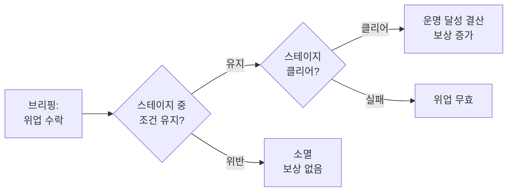

# STAGE-FEAT: 위업 (Feats)

> **상태:** 🗑️ 폐기 · **버전:** 0.3 · **ID:** STAGE-FEAT · **수정일:** 2026-03-08

> ⚠️ **폐기 확정.** 카드풀구조 v3 (2026-03-08)에서 위업 시스템 폐기. 추종자 시스템으로 통합.
> 참조: [카드풀구조_초안_v3 §9](../DOCS/DESIGN/카드풀구조_초안_v3.md) / [추종자](../04_메타/추종자.md)

---

## ① 한 줄 요약

브리핑에서 자발적으로 수락하는 추가 조건. 스테이지 내내 유지하고 클리어하면 운명 달성 결산 보상 증가. 조건 위반 시 소멸.

---

## ② 규칙 정의

### 위업 규칙

| 필드 | 내용 |
|------|------|
| **수락** | 브리핑 단계에서 선택. |
| **수락 수** | 미정. 복수 수락 가능 여부 미정. |
| **유지** | 스테이지 진행 중 조건을 계속 충족해야 함. |
| **실패** | 조건 위반 시 즉시 소멸. 복구 불가. |
| **보상** | 클리어 시 달성한 위업 수에 비례하여 운명 달성 결산 보상 증가. 보상 구체 내용 미정. |

### 위업 목록

| 위업 | 조건 | 위반 시 |
|------|------|---------|
| 전원 생존 | 유닛 사망 0으로 스테이지 클리어 | 소멸 |

### 미정 항목

| 항목 | 결정에 필요한 것 |
|------|-----------------|
| 수락 수 제한 | 위업 보상 규모 확정 후. 무제한이면 보상 인플레, 1장이면 판단 단순화. |
| 보상 구체 내용 | 업적 카드 시스템 및 패널티/패배 이원화 구조 확정 후. |
| 위업 추가 종류 | 코어 루프 플레이테스트 후 판단이 가벼운지 확인. |

---

## ③ 시각 자료

### 위업 수명 주기

---

## ④ 설계 근거

**Q. 서자부대 테마와의 연결은?**
서자부대가 인정받으려면 임무 완수만으로 부족하다. 더 어려운 조건을 자발적으로 걸고 해내야 존재를 증명한다.

---

## ⑤ 변경 이력

| 버전 | 날짜 | 변경 내용 | 사유 |
|------|------|-----------|------|
| 0.1 | 2026-02-25 | 위업 시스템 초안 | 코어 설계 세션 |
| 0.2 | 2026-02-28 | 보급/야영 잔재 제거. | 위키 정합성 감사 |
| 0.3 | 2026-03-07 | **부상 클리어 위업 삭제.** 부상이 전투당 자동 회복으로 변경되어 "부상 상태로 스테이지 클리어" 조건 성립 불가. 위업 간 관계 다이어그램 제거. 부상 관련 Q&A 제거. | 라벨-태그 재편 정합성 체크 |
