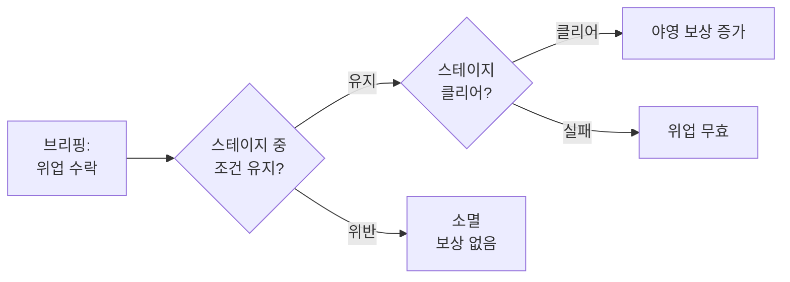
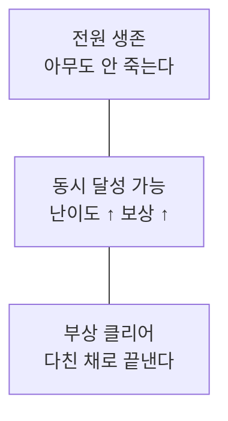

# STAGE-FEAT: 위업 (Feats)

> **상태:** 🔄 설계중 · **버전:** 0.1 · **ID:** STAGE-FEAT · **수정일:** 2026-02-25

---

## ① 한 줄 요약

브리핑에서 자발적으로 수락하는 추가 조건. 스테이지 내내 유지하고 클리어하면 야영 보상 증가. 조건 위반 시 소멸.

---

## ② 규칙 정의

### 위업 규칙

| 필드 | 내용 |
|------|------|
| **수락** | 브리핑 단계에서 선택. |
| **보급과의 관계** | 별도 시스템. 보급 슬롯과 경쟁하지 않음. |
| **수락 수** | 미정. 복수 수락 가능 여부 미정. |
| **유지** | 스테이지 진행 중 조건을 계속 충족해야 함. |
| **실패** | 조건 위반 시 즉시 소멸. 복구 불가. |
| **보상** | 클리어 시 달성한 위업 수에 비례하여 야영 보상 증가. 보상 구체 내용 미정. |

### 위업 목록

| 위업 | 조건 | 위반 시 |
|------|------|---------|
| 전원 생존 | 유닛 사망 0으로 스테이지 클리어 | 소멸 |
| 부상 클리어 | 부상 상태로 스테이지 클리어 | 소멸 |

### 미정 항목

| 항목 | 결정에 필요한 것 |
|------|-----------------|
| 수락 수 제한 | 위업 보상 규모 확정 후. 무제한이면 보상 인플레, 1장이면 판단 단순화. |
| 보상 구체 내용 | 야영/성장 시스템(META-*) 설계 필요. |
| 위업 추가 종류 | 코어 루프 플레이테스트 후 판단이 가벼운지 확인. |

---

## ③ 시각 자료

### 위업 수명 주기

### 위업 간 관계

---

## ④ 플레이어 피드백 (UI/UX)

> 미정. 위업 수락/소멸/달성 피드백은 프로토타입 단계에서 설계.

---

## ⑤ 테스트 케이스

> 미작성.

---

## ⑥ 설계 근거

**Q. 왜 보급과 별도인가?**
초기 설계에서는 같은 슬롯을 경쟁했으나, 위업은 "물건"이 아니라 "조건 수락"이므로 보급품과 성격이 다르다.

**Q. 전원 생존과 부상 클리어가 공존 가능한가?**
가능. 전원 생존은 "아무도 안 죽는다", 부상 클리어는 "다친 채로 끝낸다". 동시 달성 시 보상이 커지지만 난이도도 높다.

**Q. 부상 클리어와 붕대(보급)의 관계는?**
직접 충돌. 붕대를 들고 갔는데 부상 클리어 위업도 걸었으면 — 붕대를 쓸지 참을지가 판단. 보급과 위업이 서로 물고 뜯는 긴장.

**Q. 서자부대 테마와의 연결은?**
서자부대가 인정받으려면 임무 완수만으로 부족하다. 더 어려운 조건을 자발적으로 걸고 해내야 존재를 증명한다.

---

## ⑦ 의존성

| 방향 | ID | 이름 | 관계 |
|------|----|------|------|
| ← NEEDS | CORE-001 | 핵심 경험 목표 | 리스크-리워드 판단의 근거 |
| → AFFECTS | META-* | 야영/성장 | 위업 달성이 야영 보상에 영향 |
| ↔ RELATED | STAGE-SUPPLY | 보급 | 브리핑에서 동시에 판단하나 별도 시스템 |

---

## ⑧ 변경 이력

| 버전 | 날짜 | 변경 내용 | 사유 |
|------|------|-----------|------|
| 0.1 | 2026-02-25 | 위업 시스템 초안 | 코어 설계 세션 |
