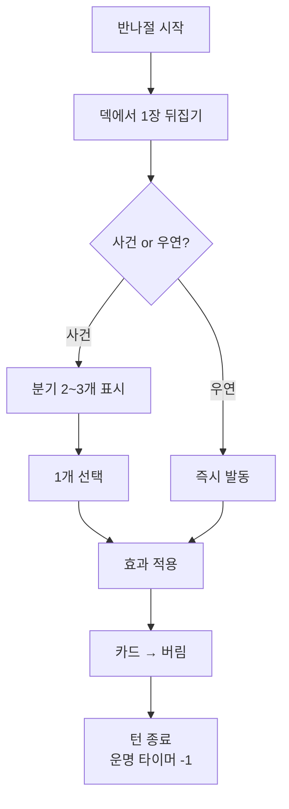

# STAGE-CARD-001: 카드 해상도 (Card Resolution)

> **상태:** 🔄 설계중 · **버전:** 1.0 · **ID:** STAGE-CARD-001 · **수정일:** 2026-02-26

---

## ① 한 줄 요약

매 턴(반나절) 덱에서 카드 1장을 뒤집는다. 사건 카드면 분기를 고르고, 우연 카드면 상황이 밀어닥친다. 카드 1장 = 반나절 = 테오도라 역사의 한 장면.

---

## ② 규칙 정의

### 덱 구성

| 필드 | 내용 |
|------|------|
| **덱 크기** | 스테이지당 30장 |
| **카드 종류** | 사건 카드 + 우연 카드 혼합 |
| **우연 비율** | 스테이지마다 다름. 챕터 트위스트가 비율을 변경할 수 있음. |
| **덱 생성** | 스테이지 시작 시 고유 덱 셔플 |
| **복원** | 비복원. 한 번 나온 카드는 버림으로 간다. |

### 카드 종류

| 종류 | 정의 | 플레이어 행동 |
|------|------|-------------|
| **사건 카드** | 반나절 동안 일어나는 사건. 분기 2~3개. | 분기 중 1개 선택. |
| **우연 카드** | 통제 밖의 사건. 밀어닥침. | 선택 없음. 즉시 발동. |

### 사건 카드

| 필드 | 내용 |
|------|------|
| **구성** | 상황 서술 + 분기 2~3개 |
| **분기 정보** | 방향은 보여준다. 정확한 수치는 안 보여준다. 테오도라가 현장에서 판단할 수 있는 수준. |
| **분기 결과** | 게임 상태 변경. 전투 진입, 부대 변화, 보급 획득/소모, 전투 조건 변경, 시간 소모 등. |
| **제한** | 1턴 1장. 분기 중 반드시 1개 선택. |

### 우연 카드

| 필드 | 내용 |
|------|------|
| **발동** | 뒤집는 즉시. 선택권 없음. |
| **내용** | 행운(좋은 사건) 또는 불운(나쁜 사건) |
| **행운 예시** | "탈주병 합류" (병력 +1), "보급 발견" (보급 +1) |
| **불운 예시** | "기습!" (강제 전투), "폭우" (다음 전투 밤 조건 강제) |

### 턴 구조

| 필드 | 내용 |
|------|------|
| **1턴** | 반나절 |
| **2턴** | 하루 |
| **홀수 턴** | 낮 |
| **짝수 턴** | 밤 |
| **턴 상한** | 스테이지마다 설정. 기본 10턴. |

### 턴 진행

| 필드 | 내용 |
|------|------|
| **조건** | 턴 시작 시 |
| **행동** | 덱에서 1장 뒤집는다 |
| **사건 시** | 분기 읽고 1개 선택. 효과 적용. |
| **우연 시** | 즉시 발동. 효과 적용. |
| **결과** | 카드 버림 더미로. 턴 종료. |
| **비용** | 턴 1 소모 (운명 타이머 -1) |

### 전투 진입

| 필드 | 내용 |
|------|------|
| **사건에서** | 전투 분기를 선택하면 전투 진입. 선택하지 않으면 전투 없음. |
| **우연에서** | 교전 우연(기습 등)이면 강제 전투. |
| **전투 조건** | 스테이지 턴의 낮/밤을 상속. 전투 내 낮/밤 교대 없음. |
| **전투 끝** | 전투 결과 적용 후 턴 종료. |

### 버림

| 필드 | 내용 |
|------|------|
| **대상** | 뒤집힌 카드 (사건/우연 무관) |
| **처리** | 버림 더미. 덱으로 돌아가지 않음. |
| **의미** | 비복원. 같은 카드 재등장 없음. |

### 운명

| 필드 | 내용 |
|------|------|
| **위치** | 상단 공개. 덱에 섞이지 않음. |
| **공개 시점** | 스테이지 시작 시 즉시. |
| **내용** | 목표 조건 + 턴 타이머 |
| **달성** | 조건 충족 시 스테이지 클리어. 조기 달성 가능. |
| **미달성** | 턴 소진 시 런 실패. 기록 없음. |
| **달성 방식** | 특정 카드 의존 아님. 일반 카드의 누적 결과로 달성. |

### 게임 상태 (카드가 건드리는 것)

| 상태 | 설명 |
|------|------|
| **부대** | 주사위 수(병력), 부상, 병종 구성, 부대 수 |
| **보급** | 보유 보급 카드 목록 (붕대, 방패, 검, 깃발) |
| **전투 조건** | 적 구성, 지형, 지물, 낮/밤, 날씨, 특수규칙 |
| **운명 진척** | 달성 조건 충족도 |
| **스테이지 상태** | 현재 턴, 덱 잔여량 |
| **서사** | 사서 로그 (누적 기록) |

### 덱 수학

| 항목 | 값 |
|------|-----|
| **덱 크기** | 30장 |
| **턴 상한** | 10턴 |
| **매 턴 소모** | 1장 |
| **최대 소모** | 10장 |
| **매 런 못 보는 카드** | 최소 20장 |
| **리플레이** | 셔플 순서 + 20장 미등장 → 매 런 다른 경험 |

### 우연 비율 가이드라인

| 스테이지 성격 | 우연 비율 | 30장 중 우연 | 체감 |
|-------------|----------|------------|------|
| 안정 | ~15% | 4~5장 | 대부분 사건. 판단에 집중. |
| 긴장 | ~20% | 6장 | 뒤집을 때마다 약간 쫄림. |
| 혼란 | ~30% | 9장 | 우연 빈출. 통제감 약화. |

> ⚠️ 30% 초과 비추천. 플레이어 선택 기회가 과도하게 줄어듦.

### 챕터 트위스트 연동

| 필드 | 내용 |
|------|------|
| **역할** | 우연 비율, 특정 카드 추가/제거 등 덱 구성을 변경 |
| **예시** | "소용돌이" — 우연 비율 상승. "기근" — 보급 관련 카드 제거. |
| **원칙** | 트위스트는 덱 구성만 건드림. 카드 해상도 규칙 자체는 불변. |

---

## ③ 시각 자료

### 턴 흐름

```
반나절 시작
    │
    ▼
덱에서 1장 뒤집는다
    │
    ├─ 사건 ──→ 분기 읽기 ──→ 1개 선택 ──→ 효과 적용 ──→ 버림
    │
    └─ 우연 ──→ 즉시 발동 ──→ 효과 적용 ──→ 버림
    │
    ▼
턴 종료 (운명 타이머 -1)
```

### 턴 흐름 (Mermaid)



### 스테이지 전체 구조

```
┌─────────────────────────────────────┐
│ 운명: "적 지휘관을 처치하라"  남은 7턴  │  ← 상단 고정
├─────────────────────────────────────┤
│                                     │
│         [ 카드 뒷면 ]               │  ← 뒤집기 전
│              ↓                      │
│   "부서진 다리에 도착했다.           │  ← 뒤집은 후
│    적의 그림자가 보인다."            │
│                                     │
│   → 따라간다 (⚔ 전투 예상)          │  ← 분기
│   → 무시한다 (휴식)                 │
│                                     │
├─────────────────────────────────────┤
│ 턴 4/10 (밤) │ 덱 26장 │ 버림 4장    │  ← 상태 바
└─────────────────────────────────────┘
```

### 사건 카드 예시

```
┌─────────────────────────────┐
│ 📜 사건                      │
│                             │
│ "부서진 다리에 도착했다.      │
│  적의 그림자가 건너편에       │
│  보인다."                    │
│                             │
│  → 따라간다 (⚔ 전투 예상)    │
│  → 무시한다 (휴식)           │
└─────────────────────────────┘
```

### 우연 카드 예시

```
┌─────────────────────────────┐
│ ⚡ 우연                      │
│                             │
│ "기습이다!"                  │
│                             │
│  → 강제 전투                 │
│    (선택 없음. 즉시 발동.)    │
└─────────────────────────────┘
```

### 덱 소모 다이어그램

```
턴  덱   버림  비고
1   29   1    사건. 분기 선택.
2   28   2    사건. 분기 선택.
3   27   3    우연! 기습. 강제 전투.
4   26   4    사건. 분기 선택.
5   25   5    사건. 분기 선택.
6   24   6    우연! 탈주병 합류. 행운.
7   23   7    사건. 교전 분기 선택 → 전투 승리 → 운명 진척.
8   22   8    사건. 분기 선택.
9   ---  ---  운명 달성! 스테이지 클리어. 1턴 남김.
     22장 못 봄 → 다음 런에 다른 카드가 나옴.
```

---

## ④ 플레이어 피드백 (UI/UX)

| 상황 | 피드백 |
|------|--------|
| **카드 뒤집기 전** | 카드 뒷면 표시. 뒤집기 대기. |
| **사건 카드 뒤집힘** | 상황 텍스트 + 분기 선택지 표시. 분기마다 방향 아이콘 (⚔/🛡/💊 등). |
| **분기 선택** | 선택한 분기 강조 → 효과 적용 연출 → 카드 버림 애니메이션. |
| **우연 카드 뒤집힘** | 즉시 발동 연출. 선택 UI 없음. 결과만 표시. |
| **전투 진입** | 사건 분기 선택 or 우연 발동 → 전투 전환 연출 → 7스텝 전투. |
| **턴 종료** | 운명 타이머 -1 연출. 덱 잔여 표시 갱신. |
| **낮/밤** | 턴 시작 시 낮/밤 오버레이 전환. |
| **운명 달성** | 클리어 오버레이 + 사서 기록 연출. |
| **턴 소진** | 실패 오버레이. "기록 없음." |

---

## ⑤ 테스트 케이스

> TC 미작성. 06_TC/에서 통합 관리 예정.

### TC 작성 시 검증 대상

| # | 항목 |
|---|------|
| 1 | 사건 카드 분기 선택 → 효과 정상 적용 |
| 2 | 우연 카드 즉시 발동 → 선택 UI 미표시 |
| 3 | 전투 진입 시 낮/밤 조건 상속 확인 |
| 4 | 비복원 확인 — 버림 카드 재등장 없음 |
| 5 | 덱 소진 전 운명 달성 시 스테이지 종료 |
| 6 | 턴 상한 도달 시 런 실패 처리 |
| 7 | 우연 비율별 선택 기회 분포 검증 |

---

## ⑥ 설계 근거

| 질문 | 답변 | 근거 |
|------|------|------|
| 왜 1장인가? | 2장(뒤집고 고르기), 3장(묶음) 모두 검토 후 도달. 1장이면 판단 1번. 군더더기 없음. 카드 자체가 분기를 가지므로 복수 장이 불필요. | 세션 내 반복 검증 |
| 왜 사건/우연 2종인가? | 사건 = 알고 고른다. 우연 = 모르고 당한다. 도착 방식이 다르면 같은 효과도 체감이 다르다. | 삼분법(선택/우연/운명) 원칙 유지 |
| 왜 운명이 덱 밖인가? | 운명은 대명령. 스테이지 시작부터 알고 있어야 할 것. 덱에 섞으면 "갑자기 목표 등장"이 되어 어색. | 서사 정합성 |
| 왜 30장인가? | 10턴 × 1장 = 10장 소모. 20장 못 봄. 리플레이 확보. 50장이면 카드 퀄리티 보장 불가. 20장이면 변동 부족. | 콘텐츠 품질 ↔ 리플레이 균형 |
| 왜 비복원인가? | 같은 카드 재등장은 서사적으로 어색. "어제 건넌 다리에 또 도착?" 비복원이면 매 턴 새로운 사건. | 서사 정합성 |
| 왜 사건 분기 정보를 제한하는가? | 정확한 수치를 보여주면 계산기 두드리기. 방향만 보여주면 테오도라의 현장 판단. | 핵심 경험 목표 (CORE-001) |
| 왜 우연에 선택이 없는가? | "어쩔 수 없었다"가 우연의 정체성. 선택을 주면 사건과 구분 불가. | 삼분법 정체성 유지 |
| 왜 전투 내 낮/밤 교대를 삭제했는가? | 전투는 반나절 안에 끝남. 스테이지 턴이 시간 단위. 전투 안에서 시간이 흐르면 정합성 깨짐. | 시간축 정합성 |
| 왜 운명 달성이 특정 카드에 의존하지 않는가? | 특정 카드 의존 → 안 나오면 달성 불가 → 이불공. 누적 상태 의존 → 여러 경로로 달성 가능. | 공정성 |

### 인물 모티프

| 모티프 | 출처 | Holy Orders 적용 |
|--------|------|-----------------|
| 서자의 전장 | 장 드 뒤누아 (오를레앙의 서자) | 전장에서 증명하는 것만이 유일한 신분 상승 경로 |
| 바닥에서 올라온 자의 시선 | 비잔틴 테오도라 | 명령 뒤에 숨은 의도를 읽을 줄 아는 눈 |
| 테오도라의 갈등 | 양자 종합 | 원하는 것: 증명과 명예. 부딪히는 것: 신분, 차별, 이용. 잃을 수 있는 것: 인간성. |

### 설계 과정에서 폐기된 구조

| 구조 | 이유 |
|------|------|
| 3장 중 1장 선택 (공개) | 비교 퍼즐이 됨. 뒤집는 긴장 없음. |
| 3장 엎고 뒤집기 (우연 포함) | 묶음 필요 → 리플레이 감소 → 복잡도 폭발. |
| 묶음 2장 + 우연 주사위 | 뒤집는 긴장 소멸. 빈 카드 필요 → 어색. |
| 묶음 3장 + 우연 카드 분리 풀 | 풀 관리 복잡. 빈 카드 문제 동일. |
| 우연 주사위 (미풍/소용돌이) | 주사위는 좋았으나 챕터 트위스트가 흡수. 별도 시스템 불필요. |
| 카드 안 분기 (B안) + 복수 장 선택 | 이중 판단 → 피로. |
| 잔류 시스템 | 1장 구조에서 불필요. 소멸. |

---

## ⑦ 의존성

| 방향 | ID | 이름 | 관계 |
|------|----|------|------|
| ← NEEDS | CORE-001 | 핵심 경험 목표 | 세 박자 중 ②적응 ③선택의 구현 |
| ← NEEDS | COMBAT-STRUCT-001 | 전투 구조 | 전투 진입 시 7스텝 엔진 사용 |
| → AFFECTS | COMBAT-STRUCT-001 | 전투 구조 | **전투 내 낮/밤 교대 삭제.** 스테이지 턴 낮/밤 상속. |
| ← NEEDS | STAGE-SUPPLY | 보급 | 보급 카드가 게임 상태에 포함 |
| → AFFECTS | STAGE-SUPPLY | 보급 | 군마 재정의 불필요. 이동 시스템 없음 확정. |
| ↔ RELATED | STAGE-WEATHER | 날씨 | 우연 카드로 날씨 변경 가능 |
| ↔ RELATED | STAGE-TERRAIN | 지형 | 사건 분기로 지형 변경 가능 |

---

## ⑧ 미확정 사항

| 항목 | 현재 상태 | 필요한 결정 |
|------|----------|------------|
| **사건 카드 구체 목록** | 없음 | Order 1 이야기 뼈대 → Stage별 사건 도출 |
| **우연 카드 구체 목록** | 예시만 있음 | 행운/불운 카드 목록 설계 |
| **운명 달성 조건 유형** | "교전 N회 승리" 등 예시만 | 조건 유형 목록 + 추적 방식 |
| **분기 결과 표기 수준** | "방향만, 수치는 안" 원칙만 | 아이콘 체계 + 정보 공개 가이드라인 |
| **카드 덱 스테이지 간 공유 여부** | 스테이지마다 고유 | 공용 카드 존재 여부 |
| **조기 달성 보상** | "남은 턴 = 미선택 구역 판정 횟수 감소" 방향 | 구체 수치 |

---

## ⑨ 변경 이력

| 버전 | 날짜 | 변경 내용 | 사유 |
|------|------|-----------|------|
| 1.0 | 2026-02-26 | 최초 작성. 매 턴 1장, 사건/우연 2종, 분기 선택, 운명 상단 공개, 전투 낮/밤 상속, 덱 30장/10턴 구조. | 카드 해상도 설계 세션 |
