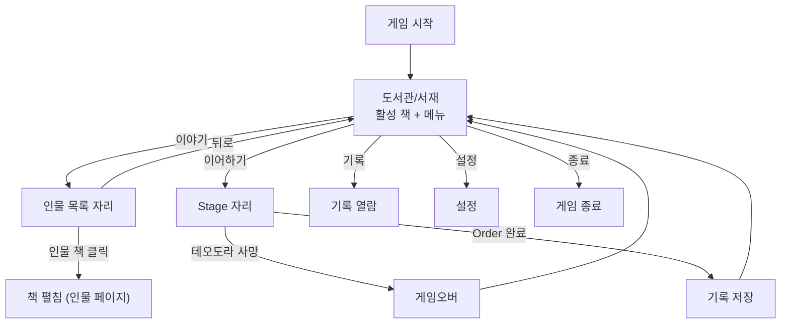

# META-LIBRARY-001: 도서관/서재

> 상태: 결정정합 (5-9 박힘) · 의존: @META-BOOK-001

> 5-9 정정: 게임 메타포 정정 — 한 책 (CHRONICLE) → 도서관/서재 (인물 = 책)
>   파일명 변경: 로비.md → 도서관.md
>   ID 변경: META-LOBBY-001 → META-LIBRARY-001
> 상세: `DOCS/DESIGN/LOG/2026-05-09_도서관결_UI동선.md`

## 정의

게임 진입 자리. 작가의 책상이 놓인 어둑한 도서관/서재. 활성 책이 책상 위에 박힘. 진척도가 어둠/램프 결로 시각화. UI/UX = Knight of the Full Moon 결 차용.

## 규칙

### 공간 결

```yaml
공간:        작가의 책상 (어둑한 도서관/서재)
중심:        책상 + 활성 책 (현재 진행 중 또는 디폴트 = 테오도라)
옆:          메뉴 (오른쪽 자리, 텍스트)
소품:        깃펜·잉크병·양피지·다른 자리들 (펜딩)
분위기:      어두움 + 따뜻한 책상 자리 + 램프 작은 불빛
```

### 진척도 결 (어둠/램프)

```yaml
시각화:      공간 자체. 게이지·% 표시 X
트리거:      Order 1개 클리어 = 1단계 박힘

단계:
  단계 0 (첫 진입):
    너무 어둡지 않은 어둑한 자리
    책상 + 활성 책 보임
    어둠 = 책상 너머 자리 (책꽂이 / 다른 책들 / 소품)
  
  단계 N (Order N개 클리어):
    램프 불 세짐
    어둠 물러남
    묻혀 있던 자리들 드러남
    
  단계 max (시리즈 클리어):
    환한 자리. 도서관 결 다 보임

미해금 인물:
  안 보임 (어둠에 묻힘)
  해금 시 = 빛이 닿음 = 책이 드러남
  진척도 결과 자연 정합

정합:
  - 카타스테리스모스: 별 박힘 → 빛 누적
  - 사서 프레임: 기록 쌓임 → 빛 누적
  - 미궁 = 어둠: 폭로 → 빛 박힘
```

### 메뉴

```yaml
항목:
  [이야기]:    인물 목록 자리로 진입 (= 책 고름)
  [이어하기]: 활성 시만. 마지막 저장 지점부터
  [기록]:     완료 책들 (정사). 읽기 전용
  [설정]:     볼륨, 언어 등
  [종료]:     게임 종료

상호작용:
  메뉴 호버:   해당 결 강조
  메뉴 클릭:   동작
  
KFM 결 정합:
  메뉴 = 텍스트 목록 (오른쪽 자리)
  중심 = 활성 책 (책상 위에 항상 박힘)
```

### 활성 책

```yaml
디폴트:      테오도라 (첫 회차)
진행 중:     마지막 본 인물 책
표시:        책상 위 중심 자리에 표지 노출

정합:
  [이어하기] 결 = 활성 책 = 진행 중 책
  메뉴와 분리되어 있지만 결로 묶임
```

### [이야기] 클릭 → 인물 목록 자리

```yaml
중심:        호버된 인물의 책 (표지)
옆:          해금된 인물 이름 목록 (텍스트)
호버:        중심 책이 그 인물의 책으로 전환
클릭:        책 펼침 → 인물 페이지 (자리 3)

KFM 결 (이미지 2):
  메뉴 항목 = 그 자체로 한 책
  호버 시 중심 책이 그 책으로 전환
  다른 책들은 텍스트 목록으로 옆에 박힘

미해금:
  텍스트 목록에 안 박힘
  첫 회차 = 테오도라 1명만
```

### 기록

```yaml
대상:        완료 인물 책 (정사)
표시:        책 목록 (책꽂이 결?)
순서:        완료 시간 역순
삭제:        불가 (영구 보존)
서사:        런 성공 = 역사. 실패 = 미기록 (사서 프레임)
빈 자리:     "아직 기록된 역사가 없다"
```

### 런 슬롯

```yaml
슬롯_수:     1
덮어쓰기:    [이야기]에서 새 인물 시작 + 활성 런 있음 → 경고
              "진행 중인 기록이 사라집니다. 계속하시겠습니까?"
확인:        명시적 (실수 방지)
종료:        게임오버 또는 Order 완료 → 비활성 복귀
```

## 시각



```
┌───────────────────────────────────────────────┐
│ (어둑한 책상 자리. 램프 작은 불빛)             │
│                                               │
│    ┌─────────┐                                │
│    │         │           [ 이 야 기 ]         │
│    │  활성   │           [이어하기]           │
│    │  책     │           [  기 록  ]          │
│    │ (테오도라)            [  설 정  ]          │
│    │         │           [  종 료  ]          │
│    └─────────┘                                │
│  깃펜·잉크병                                   │
│                                               │
│ (어둠 = 책꽂이 / 다른 책들 / 소품 — 진행 시 드러남) │
└───────────────────────────────────────────────┘
```

## TODO

- TODO(아트): 책상 소품 결 (양피지 / 깃펜 / 인장 / 별자리도? — 연대기 결)
- TODO(아트): 활성 책 표지 결 (테오도라 책의 표지 일러스트·색·재질)
- TODO(아트): 어둠/램프 단계별 결 (단계 0 / N / max 분위기 차이)
- TODO(시스템): 진척도 단계 = Order 1개 클리어 = 1단계. 단계 max 결정 (시리즈 N개 클리어 시?)
- TODO(구현): [이어하기] 마지막 저장 지점 정의 (Stage 단위? Phase 단위?)
- TODO(구현): 게임오버/Order 완료 → 도서관 복귀 연출
- TODO(구현): 설정 항목 구체 목록
