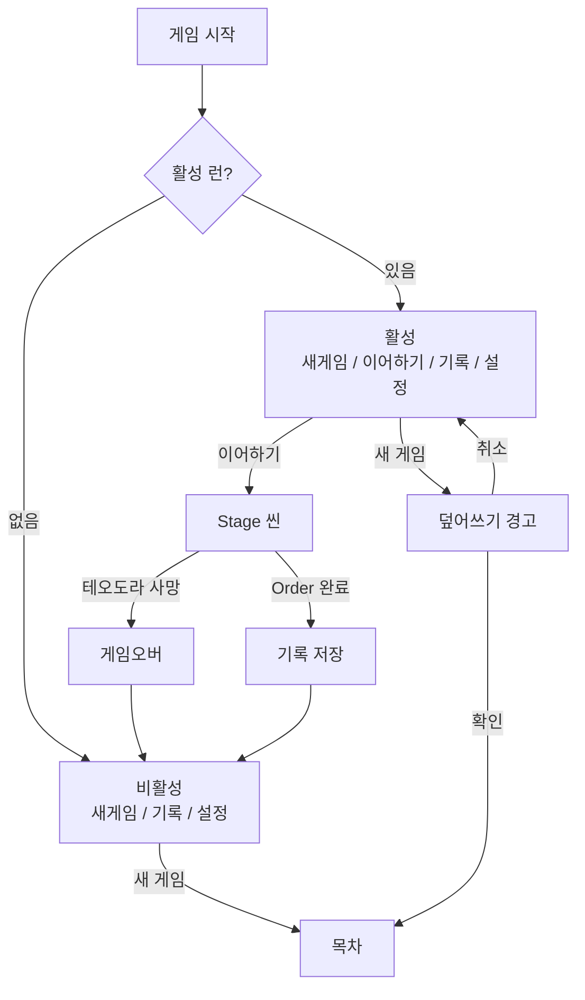

# META-LOBBY-001: 로비

> 상태: 결정정합 · 의존: @META-BOOK-001

## 정의

책의 표지. "CHRONICLE" 타이틀 = 책 제목 = 게임 타이틀. 활성 런 유무에 따라 메뉴가 바뀌고, 런 슬롯은 1개.

## 규칙

### 상태

```yaml
비활성: 활성 런 없음 (첫 실행 또는 종료 후)
  메뉴: [새 게임, 기록, 설정]
활성: 진행 중인 런 존재
  메뉴: [새 게임, 이어하기, 기록, 설정]
```

### 메뉴 동작

```yaml
새_게임:
  비활성: 목차로 이동 → 새 런
  활성: 덮어쓰기 경고 → 확인 시 기존 런 삭제 → 목차

이어하기: 활성만. 마지막 저장 지점부터 → Stage 씬

기록:
  완료_오더_있음: 오더 카드 목록 (읽기 전용)
  없음: "아직 기록된 역사가 없다"

설정: 볼륨, 언어 등
```

### 런 슬롯

```yaml
슬롯_수: 1
덮어쓰기: [새 게임] + 활성 → 경고 "진행 중인 기록이 사라집니다. 계속하시겠습니까?"
확인: 명시적 (실수 방지)
종료: 게임오버 또는 Order 완료 → 비활성 복귀
```

### 기록

```yaml
대상: 완료 오더 카드 (성적표)
표시: 오더 카드 목록. 탭하면 챕터/스테이지 카드 열람
순서: 완료 시간 역순
삭제: 불가 (영구 보존)
서사: 런 성공 = 역사. 실패 = 미기록 (사서 프레임)
```

## 시각



```
┌─────────────────────┐
│   C H R O N I C L E │
│                     │
│   [  새 게 임  ]    │
│   [ 이 어 하 기 ]   │  ← 활성 런 시
│   [   기  록  ]     │
│   [   설  정  ]     │
└─────────────────────┘
```

## TODO

- TODO(구현): 설정 항목 구체 목록
- TODO(아트): 책 UI 비주얼 채택 여부 (프로토 후)
- TODO(구현): 게임오버/Order 완료 → 로비 복귀 연출
