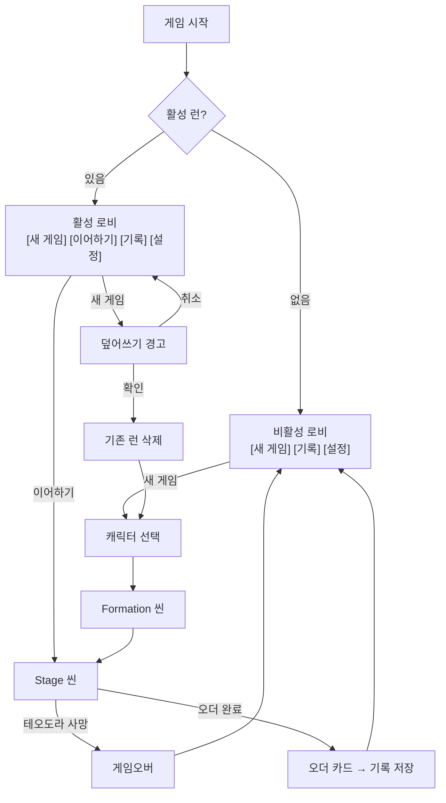

# META-LOBBY-001: 로비 (Lobby)

> **상태:** 🧪 TC작성 · **버전:** 0.1 · **ID:** META-LOBBY-001 · **수정일:** 2026-02-28

---

## ① 한 줄 요약

로비는 런 관리의 유일한 입구. 활성 런 유무에 따라 메뉴가 바뀌고, 런 슬롯은 1개뿐이다.

---

## ② 규칙 정의

### 로비 상태

| 상태 | 조건 | 메뉴 |
|------|------|------|
| **비활성** | 활성 런 없음 (첫 실행 또는 런 종료 후) | [새 게임] [기록] [설정] |
| **활성** | 진행 중인 런 존재 | [새 게임] [이어하기] [기록] [설정] |

### 메뉴 동작

| 메뉴 | 조건 | 행동 | 결과 |
|------|------|------|------|
| **[새 게임]** | 비활성 상태 | 캐릭터 선택 화면으로 이동 | 새 런 시작 |
| **[새 게임]** | 활성 상태 | 덮어쓰기 경고 팝업 표시 | 확인 시 기존 런 삭제 → 캐릭터 선택 |
| **[이어하기]** | 활성 상태만 | 마지막 저장 지점부터 재개 | Stage 씬 진입 |
| **[기록]** | 완료된 오더 카드 존재 | 오더 카드(성적표) 목록 열람 | 읽기 전용 |
| **[기록]** | 완료된 오더 카드 없음 | 빈 상태 표시 | "아직 기록된 역사가 없다" |
| **[설정]** | 항상 | 설정 화면 진입 | 볼륨, 언어 등 |

### 런 슬롯 규칙

| 필드 | 내용 |
|------|------|
| **슬롯 수** | 1개. 동시에 진행 가능한 런은 하나뿐 |
| **덮어쓰기** | [새 게임] + 활성 런 → "진행 중인 기록이 사라집니다. 계속하시겠습니까?" 경고 |
| **확인** | 명시적 확인 필요. 실수로 런을 잃지 않도록 |
| **런 종료** | 게임오버(테오도라 사망) 또는 오더 완료 시 런 소멸 → 비활성 상태 복귀 |

### [기록] 상세

| 필드 | 내용 |
|------|------|
| **대상** | 완료된 오더 카드(성적표) |
| **표시** | 오더 카드 목록. 탭하면 내부 챕터/스테이지 카드 열람 |
| **순서** | 완료 시간 역순 (최신이 위) |
| **삭제** | 불가. 기록은 영구 보존 |
| **서사** | 런 성공 = 역사로 기록됨. 실패 = 기록 없음 (사서 프레임) |

---

## ③ 시각 자료

### 로비 상태 흐름



### 화면 구성 (와이어프레임)

```
┌─────────────────────────────────────┐
│                                     │
│           C H R O N I C L E         │
│                                     │
│          ┌───────────────┐          │
│          │   새  게  임   │          │
│          └───────────────┘          │
│          ┌───────────────┐          │
│          │  이 어 하 기   │  ← 활성 런 시에만 표시
│          └───────────────┘          │
│          ┌───────────────┐          │
│          │    기   록     │          │
│          └───────────────┘          │
│          ┌───────────────┐          │
│          │    설   정     │          │
│          └───────────────┘          │
│                                     │
└─────────────────────────────────────┘
```

### 덮어쓰기 경고 팝업

```
┌────────────────────────────────┐
│                                │
│  진행 중인 기록이 사라집니다.    │
│  계속하시겠습니까?              │
│                                │
│    [취소]          [확인]       │
│                                │
└────────────────────────────────┘
```

---

## ④ 플레이어 피드백 (UI/UX)

| 상황 | 피드백 |
|------|--------|
| **비활성 로비 진입** | [이어하기] 버튼 미표시. 나머지 3개만 노출 |
| **활성 로비 진입** | [이어하기] 버튼 활성 표시 |
| **[새 게임] + 활성 런** | 경고 팝업. [확인] / [취소] 명확 구분 |
| **덮어쓰기 확인** | 기존 런 삭제 연출 후 캐릭터 선택으로 전환 |
| **[기록] 빈 상태** | "아직 기록된 역사가 없다" 문구 |
| **[기록] 오더 카드 열람** | 카드 탭 → 내부 챕터/스테이지 펼쳐짐 (사서 기록 열람) |

---

## ⑤ 테스트 케이스

> 요약. 상세 TC는 → [06_TC/로비_TC.md](../06_TC/로비_TC.md)

| ID | 시나리오 | 기대 결과 |
|----|----------|----------|
| LOBBY-001 | 첫 실행, 활성 런 없음 | [새 게임] [기록] [설정] 3개만 표시 |
| LOBBY-002 | 활성 런 존재 | [새 게임] [이어하기] [기록] [설정] 4개 표시 |
| LOBBY-003 | 활성 런 + [새 게임] 선택 | 덮어쓰기 경고 팝업 표시 |
| LOBBY-004 | 경고에서 [취소] | 로비로 복귀, 런 유지 |
| LOBBY-005 | 경고에서 [확인] | 기존 런 삭제, 캐릭터 선택으로 이동 |
| LOBBY-006 | [이어하기] 선택 | 마지막 저장 지점에서 Stage 씬 재개 |
| LOBBY-007 | [기록] + 완료 오더 0개 | 빈 상태 문구 표시 |
| LOBBY-008 | [기록] + 완료 오더 N개 | 오더 카드 목록 표시, 탭 시 내부 열람 |
| LOBBY-009 | 게임오버 후 로비 복귀 | 비활성 상태로 전환 |
| LOBBY-010 | 오더 완료 후 로비 복귀 | 비활성 상태 + [기록]에 새 오더 추가 |

---

## ⑥ 설계 근거

| 질문 | 답변 |
|------|------|
| 왜 런 슬롯이 1개인가? | 로그라이크 장르 관례. 복수 슬롯은 최적 경로 세이브 로딩을 유발. 1슬롯 = 매 런이 일회성 결정의 연속. |
| 왜 덮어쓰기 경고가 필요한가? | 1슬롯이므로 실수로 런을 잃으면 복구 불가. 명시적 확인으로 사고 방지. |
| 왜 실패 런은 기록에 안 남는가? | 사서 프레임: "기록할 가치가 있는 사건만 역사로 남는다." 실패 = 기록되지 않은 이야기. |
| [이어하기]가 비활성일 때 숨기는 이유? | 비활성 버튼보다 미표시가 인지 부하가 낮음. 3개/4개 차이로 활성 런 유무를 직관적으로 인지. |

### 아이디어 킵: 책 UI

> 미확정. 아이디어 단계.

- 로비 전체가 하나의 책. "CHRONICLE"이 책 제목 = 게임 타이틀.
- [새 게임] = 펜을 잡고 빈 페이지로 넘어감.
- [이어하기] = 책장을 넘겨서 써진 페이지로 넘어감.
- [기록] = 완성된 페이지 열람.
- 사서 프레임과 직결: 게임 = 책을 쓰는 행위.

---

## ⑦ 의존성

| 방향 | ID | 이름 | 관계 |
|------|----|------|------|
| → AFFECTS | META-* | 캐릭터 선택 | [새 게임] → 캐릭터 선택 화면으로 이동 |
| ← NEEDS | STAGE-DECK-001 | 덱빌딩 | 오더 카드(성적표) 구조 |
| ↔ RELATED | CORE-001 | 핵심 경험 목표 | 사서 프레임 (기록 = 역사) |

---

## ⑧ 미확정 사항

| 항목 | 현재 상태 | 결정에 필요한 것 |
|------|----------|----------------|
| **캐릭터 선택 화면** | 미정. [새 게임] 후 어떤 화면으로 가는지 | Formation 씬 설계 (P1 #5) |
| **설정 항목** | 볼륨, 언어 정도. 구체 목록 미정 | 구현 단계에서 확정 |
| **책 UI 비주얼** | 아이디어 킵. 채택 여부 미정 | 프로토타입에서 검증 |
| **런 종료 연출** | 게임오버/오더 완료 시 로비 복귀 연출 미정 | Stage 씬 종료 플로우 설계 |

---

## ⑨ 변경 이력

| 버전 | 날짜 | 변경 내용 | 사유 |
|------|------|-----------|------|
| 0.1 | 2026-02-28 | 최초 작성. 로비 상태, 메뉴 동작, 런 슬롯, 기록 열람, TC 10건. | NEXT_SESSION + 세션 로그(2026-02-27) 기반 독립 문서화 |
