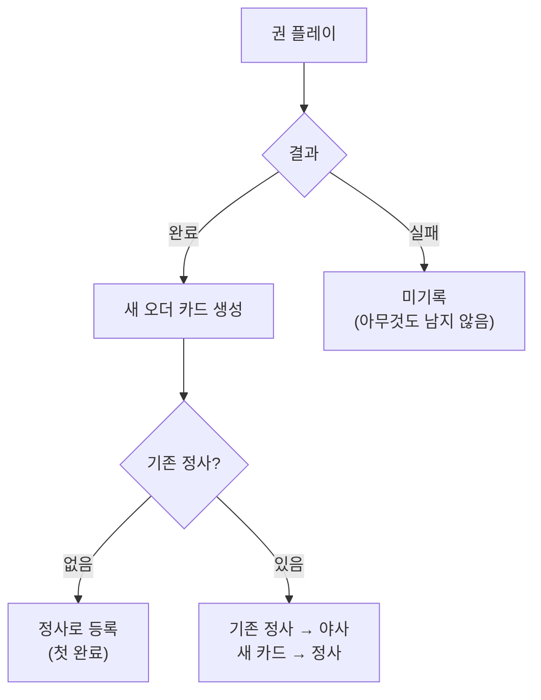

# META-RECORD-001: 정사/야사 시스템 (Official/Unofficial History)

> **상태:** 🔄 설계중 · **버전:** 0.4 · **ID:** META-RECORD-001 · **수정일:** 2026-03-08

---

## ① 한 줄 요약

완료한 런의 마지막 플레이가 정사(正史), 이전 플레이는 야사(野史)로 보관된다. 실패한 런은 기록되지 않는다.

---

## ② 규칙 정의

### 기록 4상태

| 상태 | 조건 | 의미 |
|------|------|------|
| **정사 (正史)** | 해당 권의 마지막 완료 런 | 공식 역사. 다음 권에 영향 |
| **야사 (野史)** | 이전 완료 런 (정사에서 밀려남) | 비공식 역사. 열람만 가능 |
| **미기록** | 실패한 런 (테오도라 사망) | 흔적 없음. "쓰여지지 않았다" |
| **전해지지 않은 이야기** | 페이즈에서 선택받지 못한 카드 | 있었지만 전해지지 않음. 뒷면 채 퇴장 |

### 기록 생성 규칙

| 필드 | 내용 |
|------|------|
| **생성 시점** | 권 완료 (운명 달성) 시 |
| **생성물** | 권 카드 (성적표) = 해당 런의 요약 기록 |
| **칭호** | "다리 위의 테오도라", "검은 숲의 테오도라" 등 — 겪은 사건 기반 |
| **자동 정사** | 새로 완료한 런 = 자동으로 정사 |
| **기존 정사** | 야사로 강등 |
| **야사 보존** | 야사는 삭제 안 됨. 영구 보관 |

### 정사 → 야사 전환

```
[1권 첫 완료]
  정사: "다리 위의 테오도라"

[1권 재플레이 완료]
  정사: "검은 숲의 테오도라"  ← 새 완료
  야사: "다리 위의 테오도라"  ← 기존 정사가 야사로

[1권 또 재플레이 완료]
  정사: "불타는 보루의 테오도라"  ← 새 완료
  야사: "검은 숲의 테오도라"
  야사: "다리 위의 테오도라"
```

### 정사의 게임플레이 영향

| 항목 | 영향 |
|------|------|
| **다음 권 소개** | 편성 화면의 인물 소개가 정사 기반으로 축적 |
| **오더 카드** | 정사의 오더 카드만 다음 권에 영향 (구체 메카닉 미정) |
| **야사** | 열람만 가능. 게임플레이 영향 없음 |

### 실패 = 미기록

| 필드 | 내용 |
|------|------|
| **실패 조건** | 테오도라 사망 = 게임오버 |
| **결과** | 아무것도 남지 않음. 기록 없음 |
| **인물 페이지** | 변화 없음. 빈 상태 그대로 |
| **서사 의미** | "그 이야기는 쓰여지지 않았다" |

### [다시 쓰기] 규칙

| 필드 | 내용 |
|------|------|
| **대상** | 완료된 권 |
| **경고** | "현재의 정사가 야사로 내려갑니다. 계속하시겠습니까?" |
| **성공** | 새 런 = 새 정사. 기존 정사 → 야사 |
| **실패** | 기존 정사 유지. 실패 런은 미기록 |

---

## ③ 시각 자료

### 인물 페이지에서의 기록 표시

```
[기사 테오도라]

  1권: 서자의 시련
    📜 정사 — "다리 위의 테오도라"   (최신)
    📝 야사 — "검은 숲의 테오도라"   (이전)
    📝 야사 — "불타는 보루의 테오도라" (이전)
    [다시 쓰기]

  2권: (빈 상태)
    [✒ 쓰기]     ← 정사의 권 카드가 여기에 영향
```

### 기록 흐름



---

## ④ 설계 근거

**Q. 왜 마지막이 정사인가?**
실제 역사학에서 정사는 "공인된 역사"이고 야사는 "민간 전승". 게임에서는 마지막 완료 런 = 플레이어가 가장 최근에 확정한 이야기 = 공식 역사로 취급. 이전 런은 "그런 이야기도 있었다"는 야사.

**Q. 왜 야사를 안 지우나?**
수집 동기. "더 좋은 정사를 쓰겠다" + "야사 목록을 채우겠다" 두 가지 재플레이 동기를 동시에 만든다. 야사가 쌓일수록 인물 페이지가 두꺼워지는 것 자체가 보상.

**Q. 왜 실패는 미기록인가?**
게임 타이틀이 "CHRONICLE" — 기록. 실패한 이야기는 기록할 가치가 없다. "기록되지 않은 자들의 영웅전"이라는 부제와 정확히 맞물린다. 대부분의 로그라이크는 실패에도 뭔가 남기지만(묘비, 메타 진행), Chronicle에서는 "없었던 일"이 된다. 이것이 퍼마데스의 무게를 극대화한다.

**Q. 정사의 게임플레이 영향이 구체적으로 뭔가?**
현재: 편성 화면의 인물 소개 텍스트 축적만 확정. 권 카드가 다음 권 게임플레이에 어떻게 영향을 주는지(초기 덱? 편성 옵션? 열람용?)는 2권 이후 설계 시 결정. 열람용만 되면 재플레이 동기가 약해지므로 메카닉적 영향을 주는 방향을 지향.

---

## ⑤ 미확정 사항

| 항목 | 현재 상태 | 결정에 필요한 것 |
|------|-----------|-----------------|
| **정사 → 다음 Order 게임플레이 영향** | "영향을 준다"만 확정. 구체 미정 | 2권 설계 시 |
| **권 카드 칭호 생성 로직** | "겪은 사건 기반"만 확정 | 사건 카드 풀 설계 |
| **야사 열람 UI** | 목록으로 표시한다만 확정 | UI 상세 설계 |

---

## ⑥ 변경 이력

| 버전 | 날짜 | 변경 내용 | 사유 |
|------|------|-----------|------|
| 0.1 | 2026-02-28 | 신규 생성. 정사/야사/미기록 3상태. 전환 규칙. [다시 쓰기] 경고. | 편성 설계 세션 — 플루타르크 구조 채택 |
| 0.2 | 2026-03-01 | "기사 테오도라" → "창병 테오도라" (구 Named 명칭 폐기). | d10 전환 + 병종 확장 기획 세션 |
| 0.3 | 2026-03-08 | 기록 3상태 → 4상태: 전해지지 않은 이야기 추가. Order → 권 용어 전환. | 카드풀구조 v3 문서화 세션 |
| 0.4 | 2026-03-08 | "창병 테오도라" → "기사 테오도라" (기사 병종 확정 반영). | 정합성 체크 |
