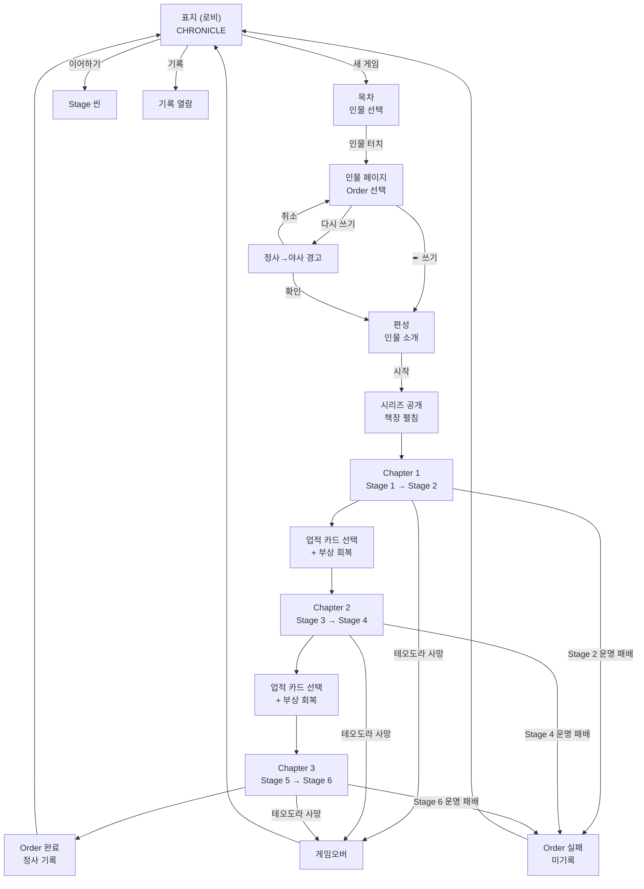

# META-BOOK-001: 책 구조 — 전체 동선 (Book Structure & Navigation)

> **상태:** 🔄 설계중 · **버전:** 0.3 · **ID:** META-BOOK-001 · **수정일:** 2026-03-01

---

## ① 한 줄 요약

게임 전체가 하나의 책(CHRONICLE). 표지(로비) → 목차(인물 선택) → 인물 페이지(Order 선택) → 편성(인물 소개) → 시리즈 공개 → Chapter → Stage. 책 메타포 = UI 구조 = 게임 구조.

---

## ② 규칙 정의

### 계층 구조

| 층 | 이름 | 책 메타포 | 게임 역할 |
|----|------|----------|----------|
| **1층** | 인물 | 목차의 한 항목 | 플레이어블 캐릭터 |
| **2층** | Order | 인물 아래 편(篇) | 확장팩 / 난이도 단위 |
| **3층** | 시리즈 | Order 안의 연작 묶음 | Chapter 3개의 서사 조합. Order당 3세트. 런마다 1세트 랜덤 선택 |
| **4층** | Chapter | 시리즈 안의 장(章) | 군사 작전. 서사 순차 연결. 시리즈당 3개 |
| **5층** | Stage | Chapter 안의 절(節) | 작전 국면. Chapter당 2개. 이벤트 카드 5장 + 운명 1장 |
| **6층** | Battle | Stage 안의 전투 | 7스텝 전투 |

> **시리즈는 레이어가 아니다.** Order 내부의 Chapter 조합 묶음이다. 플레이어는 시리즈를 선택하지 않는다 — 시스템이 랜덤으로 1세트를 선택한다.

### 런 수치

| 항목 | 값 |
|------|-----|
| 시리즈 / Order | 3세트 |
| Chapter / 런 | 3 |
| Stage / 런 | 6 |
| 카드 / Stage | 6장 (이벤트 5 + 운명 1) |
| 카드 / 런 | 36장 |
| 운명 전투 / 런 | 6회 |
| 패배 체크포인트 | 3회 (Stage 2, 4, 6의 운명 미달성 = 패배) |
| 업적 카드 획득 | 2회 (Chapter 1→2, Chapter 2→3 전환 시) |

### 전체 동선

```
표지 (로비)
  ↓ [새 게임]
목차 (인물 선택)
  ↓ 인물 터치
인물 페이지 (Order 선택)
  ↓ [✒ 쓰기] 또는 [다시 쓰기]
편성 (인물 소개 페이지)
  ↓ [시작]
시리즈 공개 (책장 펼침 + 삽화 + 시리즈 제목)
  ↓
Chapter 1 공개 (책장 펼침 + Chapter 제목)
  ↓
  Stage 1 → Stage 2
  ↓
업적 카드 선택 (3종 중 1개) + 부상 전원 회복
  ↓
Chapter 2 공개 (책장 펼침)
  ↓
  Stage 3 → Stage 4
  ↓
업적 카드 선택 (2회차) + 부상 전원 회복
  ↓
Chapter 3 공개 (책장 펼침)
  ↓
  Stage 5 → Stage 6
  ↓
Order 완료 → 정사 기록 → 로비 복귀
```

### 표지 — 로비 (META-LOBBY-001)

| 요소 | 표현 |
|------|------|
| **화면** | 책 표지. "CHRONICLE" |
| **메뉴** | [새 게임] [이어하기] [기록] [설정] |
| **상세** | → 로비.md 참조 |

### 목차 — 인물 선택

| 필드 | 내용 |
|------|------|
| **화면** | 책의 목차 페이지 |
| **표시 형식** | "창병 테오도라" 등 — 병종+이름 |
| **선택** | 인물 터치 → 해당 인물 페이지로 이동 |
| **미해금 인물** | 표시 안 함 (빈 공간도 없음) |
| **초기 상태** | 테오도라 1명만 표시 |

> **목차 표시 규칙:** "TABLE OF CONTENTS" 같은 영문 헤더 없음. "목차"만 표시하거나 헤더 없이 인물 목록만.

### 인물 페이지 — Order 선택

| 필드 | 내용 |
|------|------|
| **화면** | 해당 인물의 전용 페이지. Order 목록 + 기록 |
| **Order 표시** | 순차 나열. 이전 Order 완료해야 다음 해금 |
| **미해금 Order** | 빈 상태 표시 (제목 없음) |
| **[✒ 쓰기]** | 미완료 Order 시작. 편성 화면으로 이동 |
| **[다시 쓰기]** | 완료된 Order 재플레이. 정사→야사 경고 후 편성 이동 |
| **기록 열람** | 완료된 Order의 정사/야사 목록 확인 가능 |

### Order 순서 규칙

| 필드 | 내용 |
|------|------|
| **순차 강제** | Order 1 완료해야 Order 2 해금 |
| **재플레이** | 완료된 Order는 다시 쓸 수 있음 |
| **실패** | 빈 상태 복귀. 기록 안 남음 ("쓰여지지 않았다") |
| **진행 중** | 런 슬롯 1개. 동시에 1개 Order만 진행 가능 |

### [다시 쓰기] 경고

| 필드 | 내용 |
|------|------|
| **조건** | 완료된 Order에 [다시 쓰기] 선택 시 |
| **경고 문구** | "현재의 정사가 야사로 내려갑니다. 계속하시겠습니까?" |
| **확인** | 명시적 확인 필요 → 편성 진입 |
| **취소** | 인물 페이지로 복귀 |

---

## ③ 시각 자료

### 전체 동선 다이어그램



### 시리즈 구조 예시 (Order 1)

```
Order 1
├─ 시리즈 A
│   ├─ Chapter a → Stage 1, Stage 2
│   ├─ Chapter b → Stage 3, Stage 4
│   └─ Chapter c → Stage 5, Stage 6
│
├─ 시리즈 B
│   ├─ Chapter d → Stage 1, Stage 2
│   ├─ Chapter e → Stage 3, Stage 4
│   └─ Chapter f → Stage 5, Stage 6
│
└─ 시리즈 C
    ├─ Chapter g → Stage 1, Stage 2
    ├─ Chapter h → Stage 3, Stage 4
    └─ Chapter i → Stage 5, Stage 6
```

> 시리즈 내 Chapter는 서사적으로 순차 연결(a→b→c). 시리즈 자체가 런마다 랜덤이라 매 런 다른 경험.

---

## ④ 설계 근거

**Q. 왜 플루타르크 영웅전 구조인가?**
플루타르크 영웅전은 "인물별로 한 편씩" 구성된 고대 역사서. 이 구조가 Chronicle의 인물 → Order → Chapter 계층과 정확히 일치. 목차 = 인물 목록, 각 편 = Order, 인물 소개 = 편성. 책 메타포가 자연스럽게 게임 구조를 설명한다.

**Q. 왜 시리즈 구조인가?**
같은 Order도 시리즈에 따라 다른 서사를 겪는다. 시리즈 내 Chapter는 서사적으로 순차 연결(a→b→c)이라 기승전결이 유지되면서, 시리즈 자체가 랜덤이라 매 런이 다른 경험. 로그라이크의 "주어진 패로 최선"과 서사 일관성을 양립.

**Q. 왜 2단계 선택인가 (인물 → Order)?**
인물 선택과 Order 선택을 분리하면 확장이 쉽다. 새 인물 = 새 목차 항목, 새 Order = 기존 인물 아래 추가.

**Q. 왜 목차에 미해금 인물을 안 보여주나?**
"아직 쓰여지지 않은 이야기는 목차에도 없다." 빈 슬롯이나 잠금 아이콘 대신, 존재 자체를 숨김. 새 인물 해금 = 목차에 새 이름 등장 = 발견의 순간.

---

## ⑤ 미확정 사항

| 항목 | 현재 상태 | 결정에 필요한 것 |
|------|-----------|-----------------|
| **인물 해금 조건** | 미정. Order 1에서는 테오도라만 | 추가 인물 설계 시 |
| **시리즈 이름/서사** | 미정 | Order 1 서사 설계 |
| **데모 동선 압축** | Order 1 = 인물 1명이라 목차가 자동 | 데모 빌드 시 결정 |

---

## ⑥ 변경 이력

| 버전 | 날짜 | 변경 내용 | 사유 |
|------|------|-----------|------|
| 0.1 | 2026-02-28 | 신규 생성. 5층 구조, 전체 동선, 목차/인물 페이지 규칙 확정. | 편성 설계 세션 — 플루타르크 구조 채택 |
| 0.2 | 2026-02-28 | **대폭 변경.** ① 5층→6층 (시리즈 층 추가). ② 시리즈 = Order 내 Chapter 조합 묶음 (3세트, 런마다 랜덤 1세트). ③ Chapter 3개/런, Stage 6개/런, 카드 6장/스테이지. ④ 시리즈 공개 씬 추가 (편성 후 책장 펼침). ⑤ 업적 카드 획득 (Chapter 전환 시 2회). ⑥ 패배 체크포인트 = Stage 2,4,6 운명 미달성. ⑦ Chapter 전환 시 부상 전원 회복. | 시리즈-Chapter-Stage 구조 확정 세션 |
| 0.3 | 2026-03-01 | "기사 테오도라" → "창병 테오도라" (구 Named 명칭 폐기). | d10 전환 + 병종 확장 기획 세션 |
