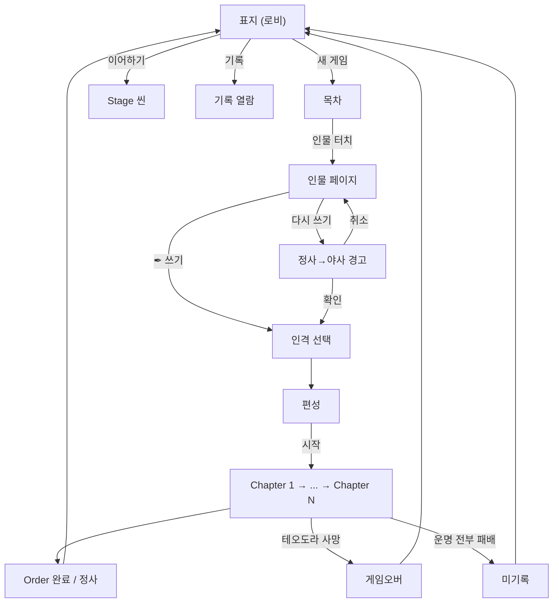

# META-BOOK-001: 책 구조

> 상태: 결정정합 · 의존: @META-LOBBY-001, @ORDER-001, @STAGE-CARD-002, @META-BACKDROP

## 정의

게임 = 책. 표지(로비) → 목차(인물 선택) → 인물 페이지(Order 선택) → 인격 선택 → 편성 → Chapter → Stage. 책 메타포 = UI 구조 = 게임 구조.

## 규칙

### 5층 구조

```yaml
1_인물:    목차 항목. 플레이어블 캐릭터. 신화 모티브 차용 (테세우스, 이아손 등). 인물·Order = DLC 입자
2_Order:   인물 아래 편(篇). 한 인물의 한 호(弧). 챕터 수 가변
3_Chapter: 군사 작전. 서사 순차 연결
4_Stage:   작전 국면. Chapter당 3개. 페이즈 4 (일반 3 + 운명 1)
5_Battle:  7스텝 전투
```

### 런 수치

```yaml
Stage_per_chapter: 3              # 불변
Phase_per_stage:   4              # 일반 3 + 운명 1
Cards_per_phase:   3              # 일반 페이즈. 운명 페이즈만 1
Cards_per_stage:   10             # 3+3+3+1
Chapter_per_run:   Order별        # Order 1 = 3 (@ORDER-001)
패배_체크포인트:   모든 운명 전투 패배 = 게임 오버
```

### 변주 시스템 (오더 단위 인격)

```yaml
변주: 같은 오더의 가능세계. 같은 자리에 다른 인격이 임함
단위: 오더 팩 (한 인격 한 회차 분량 = 90장)
회차_정체성: 오더 시작 시 인격 선택. 9 스테이지 통째로 같은 결
첫_회차:   작가 표준 회차 (튜토리얼 결로 1 인격 고정)
재플레이: 인격 선택 가능

명명:
  오더 팩:   "서자, 테오도라 — 용맹"
  스테이지: "라키아의 서자" (변주 라벨 안 붙음. 오더 팩에서 분리되었으므로)

상세: @STAGE-CARD-002, @ORDER-001-CH
```

### 페이즈 진행 (정찰-판단-감내)

```yaml
일반_페이즈:
  1: 카드 3장 뒷면 제시 (종류는 뒷면으로 구분: 전투 ⚔ / 사건 ✦ / 우연 ?)
  2: 정찰 — 1장 골라 뒤집음 (내용 공개)
  3: 판단 — 1장 버림 (전해지지 않은 이야기. 영구 미공개)
  4: 감내 — 남은 1장 자동 공개 → 즉발

운명_페이즈:
  - 일반 페이즈 3개 종료 후 자동 진입
  - 운명 카드 1장. 뒤집기 → 운명 전투
  - 승리: 다음 스테이지 / 패배: 게임 오버 (모든 운명 전투 패배 시)

상세: @STAGE-CARD-002
```

### 환경 레이어

```yaml
장소: 스테이지 단위 고정. 변주 무관. 특수 규칙 박힐 수 있음
날씨: 스테이지 시작 시 결정. 4종 (맑음/흐림/안개/악천후). 정찰에 영향
계절: 폐기 (날씨로 흡수)

상세: @META-BACKDROP
```

### 화면 동선

```yaml
표지: 로비 ("CHRONICLE")
  → [새 게임] → 목차

목차: 인물 선택
  → 인물 터치 → 인물 페이지

인물_페이지: Order + 인격 선택
  → [✒ 쓰기] (미완료) 또는 [다시 쓰기] (재플레이)
  → 인격 선택 (해금된 인격 풀에서)
  → 편성

편성: 인물 소개
  → [시작] → Chapter 1

Chapter: 책장 펼침 + 스테이지 진입
  → Stage 1 → Stage 2 → Stage 3
  → 다음 Chapter

Order_완료: 정사 기록 → 로비 복귀
```

### Order 순서

```yaml
순차_강제: Order N 완료 시 Order N+1 해금
재플레이: 완료 Order [다시 쓰기] 가능. 인격 풀 해금에 따라 다른 결 선택 가능
실패:    빈 상태 복귀. 미기록 ("쓰여지지 않았다")
런_슬롯: 1 (동시 진행 1 Order)
```

### [다시 쓰기] 경고

```yaml
조건: 완료 Order 재플레이
문구: "현재의 정사가 야사로 내려갑니다. 계속하시겠습니까?"
확인: 명시적 → 인격 선택 → 편성
취소: 인물 페이지 복귀
```

### 목차 표시

```yaml
형식: "이름" (예: "테오도라 — 서자")
미해금: 표시 안 함
초기:  테오도라 1명
헤더:  "TABLE OF CONTENTS" 같은 영문 헤더 없음. "목차"만 또는 헤더 없음
```

## 시각



## TODO

- TODO(콘텐츠): Order 1 외 인물 해금 조건. @ORDER-001 진행 후
- TODO(구현): Order별 Chapter 수 가변 처리
- TODO(시스템): 운명 전투 승리 시 보상 결 (옛 추종자 자리 비움 — 다른 세션)
