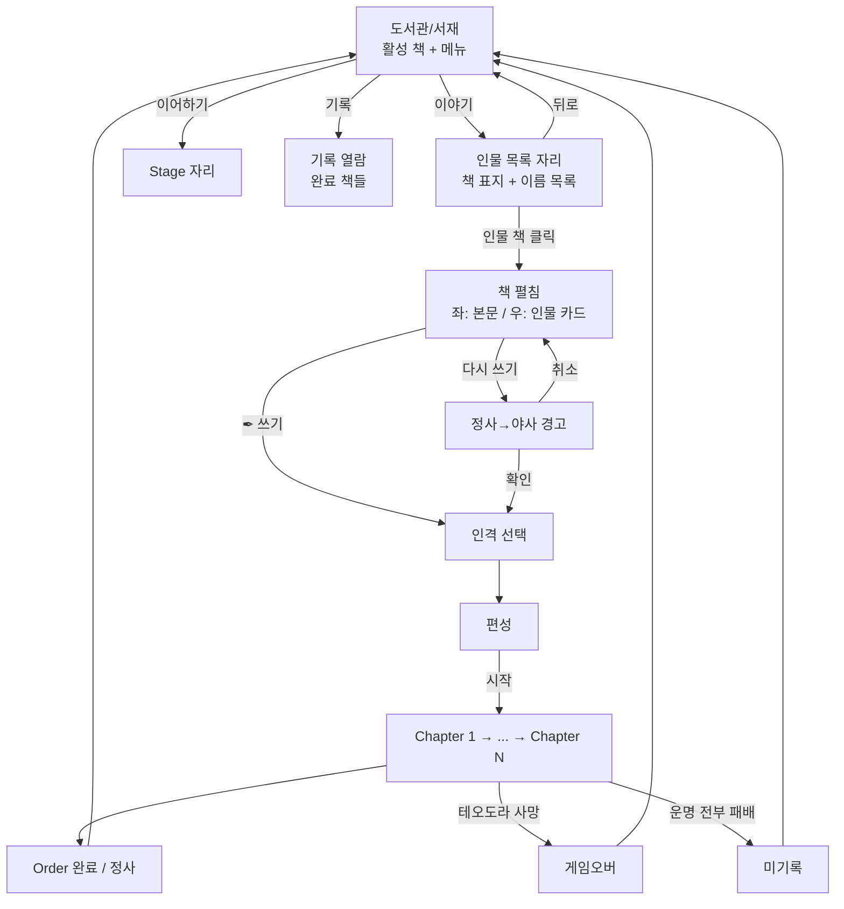

# META-BOOK-001: 책 구조

> 상태: 결정정합 (5-11 마디 박힘) · 의존: @META-LIBRARY-001, @ORDER-001, @STAGE-CARD-002, @META-BACKDROP

> 5-11 마디 정정:
> - 시간대 2종 → 3종 (낮/경계/밤)
> - 시간대 = 페이즈 단위 진행 → 페이즈 시작 R1 + 라운드별 변동
> - 운명 시간대 = 적의 자리 폐기 → 페이즈 흐름 결로 자연 따라감
> - 어휘: "신성 주사위" → "의지 주사위 수" (인도 폐기, 의지 1종으로 합침)
> 상세: `DOCS/DESIGN/LOG/2026-05-11_의지·시간대·직업_큰정리.md`

> 5-10 마디 박힘 (살림):
> - 덕목 결 큰 정정: 살아내는 결 (획득 X. 시작한 덕목대로 사는 결)
> - 챕터 클리어 = 신성 결 *획득 계기* (5-11 정정: 의지 주사위 수 박힘 결, 펜딩)
> - 변주 = 인격 = 덕목 결 (변주 표기 "용맹한/지혜로운/빛나는" 유지)
> - 운명 전투 승리 = 미리 정한 인물에 신성 결 박힘

> 5-9 큰 정정 (메타포):
> - 게임 = 한 책 (CHRONICLE) → 게임 = 도서관 / 인물 = 한 책
> - 동선 정정: 도서관 → [이야기] → 인물 책 → 책 펼침 → Order
> - 메타 구조 5층은 그대로 (인물-Order-Chapter-Stage-Battle)
> - 메뉴 자리 변동: 로비 → 도서관/서재 (KFM 결 차용)
> 상세: `DOCS/DESIGN/LOG/2026-05-09_도서관결_UI동선.md`

## 정의

게임 = 도서관/서재. 각 인물 = 한 책. 도서관에 책이 채워질수록 어둠 물러나고 빛 박힘. 도서관 → [이야기] (인물 목록) → 인물 책 → 책 펼침 → Order → Chapter → Stage → Phase → Battle. 책 메타포 + 도서관 메타포 = UI 구조 = 게임 구조.

## 규칙

### 5층 구조

```yaml
1_인물:    한 권의 책. 플레이어블 캐릭터. 신화 모티브 차용 (테세우스, 이아손 등). 인물·Order = DLC 입자
2_Order:   책의 한 부(部). 한 인물의 한 호(弧). 챕터 수 가변
3_Chapter: 책의 한 챕터. 군사 작전. 서사 순차 연결
4_Stage:   챕터의 한 절. 작전 국면. Chapter당 3개. 페이즈 4 (일반 3 + 운명 1)
5_Battle:  절의 한 장면. 전투 시스템 (5-9 코어 박힘. @COMBAT-STRUCT-001)

메타:
  시리즈 = 도서관 (책들이 모이는 자리)
  카타스테리스모스 결: 영웅 = 별 = 책으로 박힘. 도서관 채워지는 결 = 밤하늘 별자리 박히는 결
```

### 런 수치

```yaml
Stage_per_chapter: 3              # 불변
Phase_per_stage:   4              # 일반 3 + 운명 1
Cards_per_phase:   3              # 일반 페이즈. 운명 페이즈만 1
Cards_per_stage:   10             # 3+3+3+1
Chapter_per_run:   Order별        # Order 1 = 3 (@ORDER-001)
패배_체크포인트:   모든 운명 전투 패배 = 게임 오버
```

### 변주 시스템 (오더 단위 인격)

```yaml
변주: 같은 오더의 가능세계. 같은 자리에 다른 인격이 임함
단위: 오더 팩 (한 인격 한 회차 분량 = 90장)
회차_정체성: 오더 시작 시 인격 선택. 9 스테이지 통째로 같은 결
첫_회차:   작가 표준 회차 (튜토리얼 결로 1 인격 고정)
재플레이: 인격 선택 가능

명명:
  오더 팩:   "사생아, 테오도라 — 용맹"
  스테이지: "라키아의 들개" (변주 라벨 안 붙음. 오더 팩에서 분리되었으므로)

상세: @STAGE-CARD-002, @ORDER-001-CH
```

### 페이즈 진행 (선택-거부-감내)

```yaml
일반_페이즈:
  1: 카드 3장 Dark 상태 제시 (종류 안 보임)
  2: [선택] (비가역) — 1장 터치 → Type 노출 → 1번 자리
  3: [거부] (비가역) — 1장 터치 → Type 노출 → 영구 미공개 (전해지지 않은 이야기)
  4: [감내] — 마지막 1장 Dark 그대로 발화 → 2번 자리 (Type 모르고 받음)

운명_페이즈:
  - 일반 페이즈 3개 종료 후 자동 진입
  - 운명 카드 1장. 뒤집기 → 운명 전투
  - 승리: 다음 스테이지 / 패배: 게임 오버 (모든 운명 전투 패배 시)

상세: @STAGE-CARD-002
```

### 환경 레이어

```yaml
장소: 스테이지 단위 고정. 변주 무관. 특수 규칙 박힐 수 있음
날씨: 스테이지 시작 시 결정. 4종 (맑음/흐림/안개/악천후)
시간대 (5-11): 3종 (낮 / 경계 / 밤). 페이즈 시작 R1 시간대 + 라운드별 변동 (낮 → 경계 → 밤 → 경계 → ...). 출신별 페이즈 시작 결 다름. 운명 페이즈 시간대 = 페이즈 흐름 결로 자연 따라감 (5-11 박힘).
계절: 폐기 (날씨로 흡수)

상세: @META-BACKDROP
```

### 화면 동선

```yaml
도서관/서재: 진입 자리 ("작가의 책상")
  중심: 활성 책 (디폴트 = 테오도라)
  메뉴: [이야기] / [이어하기] / [기록] / [설정] / [종료]
  → [이야기] → 인물 목록 자리

인물 목록 자리: [이야기] 안의 자리
  중심: 호버된 인물의 책 (표지)
  옆: 인물 이름 목록 (해금된 인물만)
  미해금: 안 보임
  → 인물 책 클릭 → 책 펼침 (인물 페이지)

인물 페이지: 펼친 책
  좌측: 인물 본문 (배경 + 어머니 결 + 테오도라 결 등)
  우측: 인물 카드 (얼굴 + 부제)
  메뉴: Order 선택 + 인격 선택 + [✒ 쓰기] (미완료) 또는 [다시 쓰기] (재플레이) + 뒤로
  → 인격 선택 (해금된 인격 풀에서)
  → 편성

편성: 인물 소개
  → [시작] → Chapter 1

Chapter: 책장 펼침 + 스테이지 진입
  → Stage 1 → Stage 2 → Stage 3
  → 다음 Chapter

Order_완료: 정사 기록 → 도서관 복귀 (진척도 1단계 박힘)
```

### Order 순서

```yaml
순차_강제: Order N 완료 시 Order N+1 해금
재플레이: 완료 Order [다시 쓰기] 가능. 인격 풀 해금에 따라 다른 결 선택 가능
실패:    빈 상태 복귀. 미기록 ("쓰여지지 않았다")
런_슬롯: 1 (동시 진행 1 Order)
```

### [다시 쓰기] 경고

```yaml
조건: 완료 Order 재플레이
문구: "현재의 정사가 야사로 내려갑니다. 계속하시겠습니까?"
확인: 명시적 → 인격 선택 → 편성
취소: 인물 페이지 복귀
```

### 인물 목록 자리 표시

```yaml
형식: 책 표지 (중심) + 인물 이름 목록 (옆)
예: 표지에 "테오도라" / 옆 텍스트 "테오도라"
부제 (책 표지에 박힐 결): "사생아"
미해금: 표시 안 함 (책꽂이 자리도 어둠에 묻힘)
초기:  테오도라 1명
헤더: 없음 (KFM 결 — 책상 자리 자체가 자리)
```

## 시각



## TODO

- TODO(콘텐츠): Order 1 외 인물 해금 조건. @ORDER-001 진행 후
- TODO(구현): Order별 Chapter 수 가변 처리
- TODO(시스템): 운명 전투 승리 시 미리 정한 인물에 신성 결 박힘 디테일 (5-11: 의지 주사위 수 박힘 결로?)
- TODO(시스템): 챕터 클리어 = 의지 주사위 수 누적 결 디테일 (5-11 정정. 옛 5-10: 신성 주사위 누적)
- TODO(UI/자리 3): 인물 페이지 결 (좌측 본문 / 우측 인물 카드 / 메뉴 / 난이도 결?) — 다음 마디
