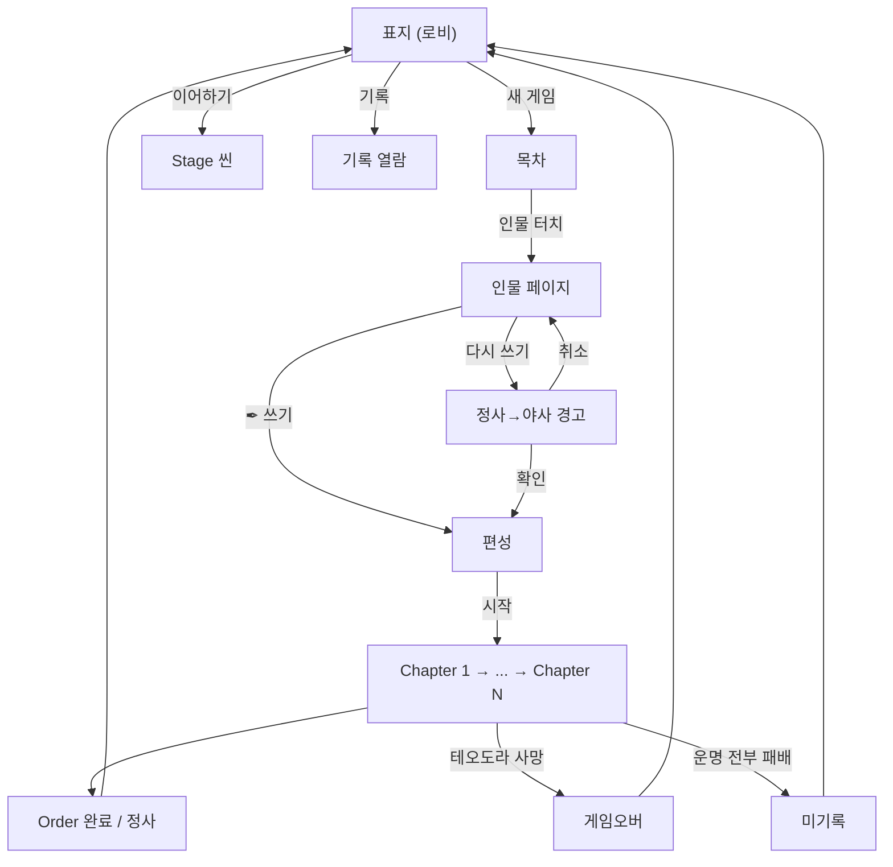

# META-BOOK-001: 책 구조

> 상태: 결정정합 · 의존: @META-LOBBY-001, @ORDER-001

## 정의

게임 = 책. 표지(로비) → 목차(인물 선택) → 인물 페이지(Order 선택) → 편성 → Chapter → Stage. 책 메타포 = UI 구조 = 게임 구조.

## 규칙

### 5층 구조

```yaml
1_인물:    목차 항목. 플레이어블 캐릭터. 신화 모티브 차용 (테세우스, 이아손 등). 인물·Order = DLC 입자
2_Order:   인물 아래 편(篇). 한 인물의 한 호(弧). 챕터 수 가변
3_Chapter: 군사 작전. 서사 순차 연결
4_Stage:   작전 국면. Chapter당 3개. 페이즈 3 + 운명 전투 1
5_Battle:  7스텝 전투
```

### 런 수치

```yaml
Stage_per_chapter: 3              # 불변
Phase_per_stage: 3                # 불변
Phase_종류: 우연 / 전투 / 사건    # 페이즈 = 카드 슬롯 (정찰 대상). 종류 모름의 자리
운명_전투_per_stage: 1            # 불변. 카테고리 다름. 고를 수 없음
Chapter_per_run: Order별          # Order 1 = 3 (@ORDER-001)
패배_체크포인트: 모든 운명 전투 패배 = 게임 오버
추종자_획득: 운명 전투 승리 시
```

### 화면 동선

```yaml
표지: 로비 ("CHRONICLE")
  → [새 게임] → 목차

목차: 인물 선택
  → 인물 터치 → 인물 페이지

인물_페이지: Order 선택
  → [✒ 쓰기] (미완료) 또는 [다시 쓰기] (재플레이)
  → 편성

편성: 인물 소개
  → [시작] → Chapter 1

Chapter: 책장 펼침 + 팩 뒷면 + 계절 + 동료 공개
  → Stage 1 → Stage 2 → Stage 3
  → 다음 Chapter

Order_완료: 정사 기록 → 로비 복귀
```

### Order 순서

```yaml
순차_강제: Order N 완료 시 Order N+1 해금
재플레이: 완료 Order [다시 쓰기] 가능
실패: 빈 상태 복귀. 미기록 ("쓰여지지 않았다")
런_슬롯: 1 (동시 진행 1 Order)
```

### [다시 쓰기] 경고

```yaml
조건: 완료 Order 재플레이
문구: "현재의 정사가 야사로 내려갑니다. 계속하시겠습니까?"
확인: 명시적 → 편성
취소: 인물 페이지 복귀
```

### 목차 표시

```yaml
형식: "병종+이름" (예: "용맹한 테오도라 / Named 보병")
미해금: 표시 안 함 (빈 슬롯 없음)
초기: 테오도라 1명
헤더: "TABLE OF CONTENTS" 같은 영문 헤더 없음. "목차"만 또는 헤더 없음
```

## 시각



## TODO

- TODO(콘텐츠): Order 1 외 인물 해금 조건. @ORDER-001 진행 후
- TODO(구현): Order별 Chapter 수 가변 처리
