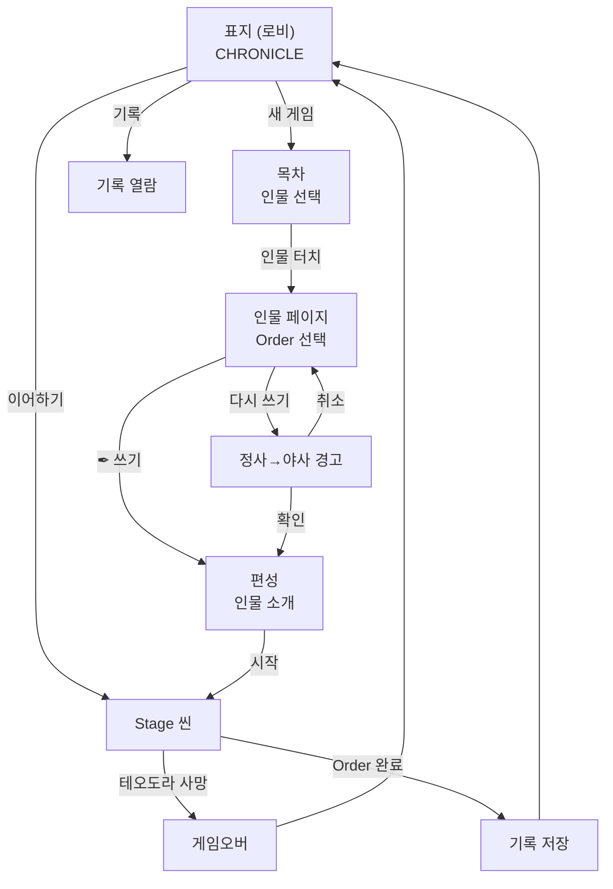

# META-BOOK-001: 책 구조 — 전체 동선 (Book Structure & Navigation)

> **상태:** 🔄 설계중 · **버전:** 0.1 · **ID:** META-BOOK-001 · **수정일:** 2026-02-28

---

## ① 한 줄 요약

게임 전체가 하나의 책(CHRONICLE). 표지(로비) → 목차(인물 선택) → 인물 페이지(Order 선택) → 편성(인물 소개) → Stage. 책 메타포 = UI 구조 = 게임 구조.

---

## ② 규칙 정의

### 5층 구조

| 층 | 이름 | 책 메타포 | 게임 역할 |
|----|------|----------|----------|
| **1층** | 인물 | 목차의 한 항목 | 플레이어블 캐릭터 |
| **2층** | Order | 인물 아래 편(篇) | 확장팩 / 난이도 단위 |
| **3층** | Chapter | Order 안의 장(章) | 군사 작전 |
| **4층** | Stage | Chapter 안의 절(節) | 작전 국면 (덱 9장+운명) |
| **5층** | Battle | Stage 안의 전투 | 7스텝 전투 |

### 전체 동선

```
표지 (로비)
  ↓ [새 게임]
목차 (인물 선택)
  ↓ 인물 터치
인물 페이지 (Order 선택)
  ↓ [✒ 쓰기] 또는 [다시 쓰기]
편성 (인물 소개 페이지)
  ↓ 선택 [확정] → 뒤집기 → [시작]
Stage 씬
  ↓ 전투/분기 진행
  ↓ 운명 달성 → Order 완료 → 기록 저장
로비 복귀
```

### 표지 — 로비 (META-LOBBY-001)

| 요소 | 표현 |
|------|------|
| **화면** | 책 표지. "CHRONICLE" |
| **메뉴** | [새 게임] [이어하기] [기록] [설정] |
| **상세** | → 로비.md 참조 |

### 목차 — 인물 선택

| 필드 | 내용 |
|------|------|
| **화면** | 책의 목차 페이지 |
| **표시 형식** | "기사 테오도라" 등 — 병종+이름 |
| **선택** | 인물 터치 → 해당 인물 페이지로 이동 |
| **미해금 인물** | 표시 안 함 (빈 공간도 없음) |
| **초기 상태** | 테오도라 1명만 표시 |

> **목차 표시 규칙:** "TABLE OF CONTENTS" 같은 영문 헤더 없음. "목차"만 표시하거나 헤더 없이 인물 목록만.

### 인물 페이지 — Order 선택

| 필드 | 내용 |
|------|------|
| **화면** | 해당 인물의 전용 페이지. Order 목록 + 기록 |
| **Order 표시** | 순차 나열. 이전 Order 완료해야 다음 해금 |
| **미해금 Order** | 빈 상태 표시 (제목 없음) |
| **[✒ 쓰기]** | 미완료 Order 시작. 편성 화면으로 이동 |
| **[다시 쓰기]** | 완료된 Order 재플레이. 정사→야사 경고 후 편성 이동 |
| **기록 열람** | 완료된 Order의 정사/야사 목록 확인 가능 |

### Order 순서 규칙

| 필드 | 내용 |
|------|------|
| **순차 강제** | Order 1 완료해야 Order 2 해금 |
| **재플레이** | 완료된 Order는 다시 쓸 수 있음 |
| **실패** | 빈 상태 복귀. 기록 안 남음 ("쓰여지지 않았다") |
| **진행 중** | 런 슬롯 1개. 동시에 1개 Order만 진행 가능 |

### [다시 쓰기] 경고

| 필드 | 내용 |
|------|------|
| **조건** | 완료된 Order에 [다시 쓰기] 선택 시 |
| **경고 문구** | "현재의 정사가 야사로 내려갑니다. 계속하시겠습니까?" |
| **확인** | 명시적 확인 필요 → 편성 진입 |
| **취소** | 인물 페이지로 복귀 |

---

## ③ 시각 자료

### 전체 동선 다이어그램



### 목차 와이어프레임

```
┌─────────────────────────────────┐
│                                   │
│              목 차                 │
│                                   │
│   ─────────────────────────────  │
│                                   │
│     기사 테오도라 ................. I │
│                                   │
│                                   │
│                                   │
│   ─────────────────────────────  │
│                                   │
│             ← 뒤로               │
└─────────────────────────────────┘
```

> 초기 상태: 테오도라 1명만 표시. 추가 인물 해금 시 목록에 추가.

### 인물 페이지 와이어프레임

```
┌─────────────────────────────────┐
│         기사 테오도라              │
│                                   │
│  Order 1: 서자의 시련              │
│    📜 정사 — "다리 위의 테오도라"   │
│    📝 야사 — "검은 숲의 테오도라"   │
│    [다시 쓰기]                     │
│                                   │
│  Order 2:                         │  ← 빈 상태 (해금됨)
│    [✒ 쓰기]                       │
│                                   │
│             ← 뒤로               │
└─────────────────────────────────┘
```

---

## ④ 플레이어 피드백 (UI/UX)

| 상황 | 피드백 |
|------|--------|
| **목차 진입** | 페이지 넘기는 연출 (표지→목차) |
| **인물 터치** | 페이지 넘기는 연출 (목차→인물 페이지) |
| **[✒ 쓰기]** | 펜을 잡는 연출 → 편성 진입 |
| **[다시 쓰기]** | 정사→야사 경고 팝업 |
| **← 뒤로** | 페이지 역방향 넘기기 |
| **미해금 Order** | 잠금 없음. 단순히 빈 상태. "아직 쓰여지지 않았다" |

---

## ⑤ 테스트 케이스

> TC는 철이 직접 작성. 아래는 검증 대상 목록.

| # | 검증 항목 |
|---|----------|
| 1 | 목차에 해금된 인물만 표시 |
| 2 | 초기 상태 테오도라 1명만 표시 |
| 3 | 인물 터치 → 인물 페이지 이동 |
| 4 | Order 순차 강제: Order 1 미완료 시 Order 2 [✒ 쓰기] 불가 |
| 5 | [✒ 쓰기] → 편성 화면 이동 |
| 6 | [다시 쓰기] → 정사→야사 경고 표시 |
| 7 | 경고 [확인] → 편성 이동, 기존 정사→야사 강등 |
| 8 | 경고 [취소] → 인물 페이지 복귀 |
| 9 | 실패(게임오버) 후 인물 페이지에 기록 안 남음 |
| 10 | Order 완료 후 정사로 기록됨 |

---

## ⑥ 설계 근거

**Q. 왜 플루타르크 영웅전 구조인가?**
플루타르크 영웅전은 "인물별로 한 편씩" 구성된 고대 역사서. 이 구조가 Chronicle의 인물 → Order → Chapter 계층과 정확히 일치. 목차 = 인물 목록, 각 편 = Order, 인물 소개 = 편성. 책 메타포가 자연스럽게 게임 구조를 설명한다.

**Q. 왜 2단계 선택인가 (인물 → Order)?**
인물 선택과 Order 선택을 분리하면 확장이 쉽다. 새 인물 = 새 목차 항목, 새 Order = 기존 인물 아래 추가. 하나의 선택 화면에 다 넣으면 인물 × Order 조합이 늘어날수록 화면이 복잡해진다.

**Q. 왜 목차에 미해금 인물을 안 보여주나?**
"아직 쓰여지지 않은 이야기는 목차에도 없다." 빈 슬롯이나 잠금 아이콘 대신, 존재 자체를 숨김. 새 인물 해금 = 목차에 새 이름 등장 = 발견의 순간.

**Q. 동선이 4클릭(표지→목차→인물→편성)인데 너무 긴 거 아닌가?**
각 단계가 하나의 결정만 요구. 목차=누구, 인물 페이지=어떤 Order, 편성=어떤 병종. 빈 방이 아니라 선택의 연속. Order 1 데모에서는 인물 1명뿐이라 목차가 사실상 자동이므로 스킵/압축 연출 검토 가능.

---

## ⑦ 의존성

| 방향 | ID | 이름 | 관계 |
|------|----|------|------|
| ← NEEDS | META-LOBBY-001 | 로비 | 표지 = 로비. [새 게임] → 목차 |
| → AFFECTS | META-FORMATION-001 | 편성 | 인물 페이지 → 편성 진입 |
| → AFFECTS | META-RECORD-001 | 정사/야사 | [다시 쓰기] 시 정사→야사 |
| ↔ RELATED | STAGE-DECK-001 | 덱빌딩 | Order 내 Stage 구조 |

---

## ⑧ 미확정 사항

| 항목 | 현재 상태 | 결정에 필요한 것 |
|------|-----------|-----------------|
| **인물 해금 조건** | 미정. Order 1에서는 테오도라만 | 추가 인물 설계 시 |
| **목차 비주얼** | 와이어프레임 수준 | 아트 디렉션 |
| **데모 동선 압축** | Order 1 = 인물 1명이라 목차가 자동 | 데모 빌드 시 결정 |
| **인물 페이지 소개 텍스트** | 규칙만 확정. 실물 미작성 | Order 1 서사 설계 |

---

## ⑨ 변경 이력

| 버전 | 날짜 | 변경 내용 | 사유 |
|------|------|-----------|------|
| 0.1 | 2026-02-28 | 신규 생성. 5층 구조, 전체 동선, 목차/인물 페이지 규칙 확정. | 편성 설계 세션 — 플루타르크 구조 채택 |
