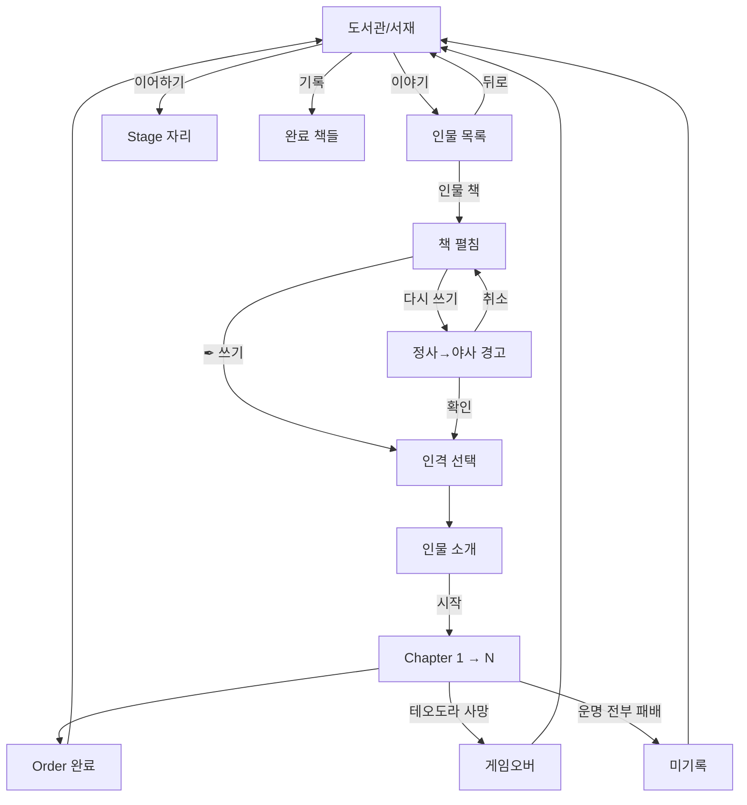

# 책 구조

## 5층

```yaml
Order > Chapter > Stage > Phase > Battle (Round)
```

## 카드 단위 (콘텐츠 그릇)

```yaml
Order (작품 그릇 = 확장팩 단위) = 270 스토리 카드
  예: "미궁의 테오도라 팩"
  └─ 3 인격 팩 × 90장

인격 팩 (한 회차 단위) = 90장 = 9 스테이지
  = 81 일반 + 9 운명

Stage (콘텐츠 + 진행 자연 일치) = 10장
  = 9 일반 + 1 운명

Phase 카드 = 3장 (일반) 또는 1장 (운명)

챕터 = 진행 단위로만 (카드 그릇 X)
인물 카드 = 카드 그릇 밖 (영구 컬렉션)
```

## 인격 (Order 단위)

```yaml
시스템: 그리스 4주덕 (지혜·용기·절제·정의)
인물 = 3 인격 보유. 빠진 1개 = 정체성

한 회차 = 1 인격 팩 (90장)
같은 자리, 다른 인격 = 다른 가능세계 (챕터·스테이지 명명도 다를 수 있음)

명명:
  Order:      "미궁의 테오도라" (인물 결, 인격 무관)
  인격 팩:    "용맹한 테오도라" (인격 + 인물)
  Stage:      "라키아의 들개" (인격 결로 자유 명명)

해금:
  Order 클리어 시 다른 인격 해금
  [구체 결 = 펜딩, 작가 결]
```

## 동선

```yaml
도서관/서재:
  사서 = 플레이어
  책 한 권 = 영웅 이야기 (Order 단위)
  책장 = Order 목록
  밤하늘 = 모든 별자리

진입:
  도서관 → 인물 책 클릭 → 책 펼침 (좌: 본문 / 우: 인물 카드)
  → 인격 선택 (해금 풀에서)
  → 인물 소개
  → Chapter 1 → Stage 1 → ...

Order 완료:
  정사 기록 → 도서관 복귀 (진척도 1단계 박힘)
  영웅 등극 = 카타스테리스모스 (별 박힘)

Order 실패:
  미기록 ("쓰여지지 않았다")
  빈 상태 복귀
```

## Order 순서

```yaml
순차 강제: Order N 완료 시 Order N+1 해금
재플레이: 완료 Order [다시 쓰기] 가능
런 슬롯:  1 (동시 진행 1 Order)
```

## 다시 쓰기

```yaml
조건: 완료 Order 재플레이
문구: "현재의 정사가 야사로 내려갑니다. 계속하시겠습니까?"
확인: 인격 선택 → 인물 소개
취소: 인물 페이지 복귀
```

## 인물 목록

```yaml
형식:    책 표지 + 인물 이름 (옆)
부제:    책 표지에 박힘 (예: 테오도라 "사생아")
미해금:  표시 X (책꽂이도 어둠)
초기:    테오도라 1명
헤더:    없음 (책상 자리 자체가 자리)
```

## 시각



## 편성 X

```yaml
파티 = Stage 시작 시 정해지면 그 Stage에서 쭉
유저 결단 = 매 라운드 배치 자유 변경 (인물 위치만)
누굴 빼고 넣고 X
```
