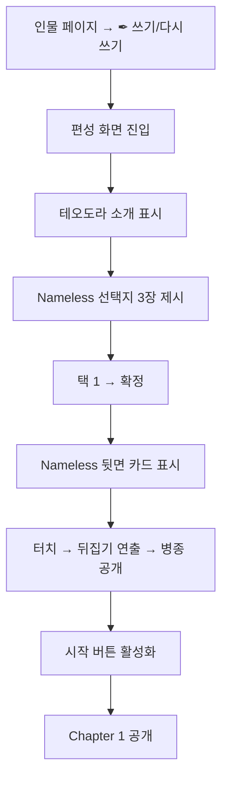

# META-FORMATION-001: 편성

> 상태: 설계중 · 의존: @COMBAT-UNIT-CARD, @COMBAT-UNIT-HERO, @META-BOOK-001

## 정의

Order 시작 시 1회 발생하는 부대 구성 화면. 플루타르크식 인물 소개 페이지로 표현. Named 1기(병종 선택) + Nameless 2기(선택 1 + 랜덤 1) = 3기 부대.

## 규칙

### 부대 구성

```yaml
formation:
  total: 3
  slots:
    - slot: 1
      type: named
      character: theodora
      class_options:
        order_1:
          first_run: 보병 (고정)
          chapter_1_clear: + 창병
          chapter_2_clear: + 궁병
        order_2: 기사 (전직)
      death: 게임 오버
    - slot: 2
      type: nameless
      selection: manual
      pool: [보병, 창병, 궁병]
    - slot: 3
      type: nameless
      selection: random
      pool: [보병, 창병, 궁병]
      reveal: tap_to_flip
  duplication: 허용  # 선택과 랜덤 중복 가능
```

### 편성 풀

```yaml
editable_pool: [보병, 창병, 궁병]
excluded:
  - 민병: ✕ 비율 높음. 의도된 편성 제외
  - 기병: 합류로만 (스테이지 / [회유] / 추종자)
exception_paths:
  - 민병: [징집] / [모집] / [회유] / 지원병 / 떠돌이 / 패잔병 등
  - 기병: [회유] / 기마병 추종자 등
reference: @COMBAT-UNIT-NAMELESS
```

### 진행 흐름



### 테오도라 — 특성 해금

```yaml
trait_unlock:
  base: 용맹한        # 첫 런 고정
  per_stage_clear:
    1: 신중한
    2: 예리한          # 궁병 선택 시에만 표시
    3: 현명한
    4: 고결한
    5: 은밀한
    6: 대담한
    7: 굳건한
selection_after_first_run: 해금된 풀에서 자유 선택
reference: @COMBAT-UNIT-HERO
```

### 테오도라 — 패시브

```yaml
passive:
  order_1: 병종 따라감 (TODO 시스템 정합)
  order_2: 4종 풀(방진/반격/쇄도/유격) 중 2택 1택 (TODO 정합)
note: 패시브 시스템 자체가 산개/밀집 폐기 영향 검토 중
```

### 카드 = 유닛

```yaml
card_unit_mapping: 1:1
  - 보병 3기 = 보병 카드 3장
  - 테오도라 1기 = Named 카드 1장
reference: @COMBAT-UNIT-CARD
```

### 초기 상태

```yaml
initial_state:
  passives: 병종별 기본 (민병 제외, TODO 정합)
  injuries: 없음
  buffs: 없음
  deck: Stage별 9장 + 운명 1장  # @STAGE-CARD-002
```

### Order별 소개 축적

```yaml
character_intro:
  order_1_first: 짧은 기본 소개
  order_1_replay: 동일 (정사 기록은 인물 페이지에서)
  order_2: 정사 내용 반영 ("다리 위의 전투를 거친 테오도라는...")
  order_n: 이전 정사들 누적
basis: 정사만 반영. 야사는 미반영.  # @META-RECORD-001
```

### 폐기 항목 (4-26)

```yaml
deprecated:
  - 산개/밀집 선택 (대형 폐기)
  - 면 변환 시 산개/밀집 차이
note: 편성 결과는 모든 카드가 동일한 방식으로 굴려진다 (개별 굴림)
```

## TODO

- TODO(엔진): O1 패시브 시스템 정합 (병종별 패시브 부활 여부)
- TODO(엔진): O2 패시브 풀 정합
- TODO(서사): Order별 소개 축적 구체 표현 (Order 2 이후 설계 시)
- TODO(밸런스): 랜덤 슬롯 가중치 (3종 균등 잠정)
- TODO(서사): 확장 시 Nameless 슬롯 수 (Order 2+)
