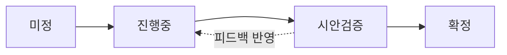

# 🎨 아트/UI 운영 규칙

> 05_UI/ 하위 문서가 따르는 규칙.  
> [00_운영/운영규칙.md](../00_운영/운영규칙.md)의 정신(구조화, 줄글 금지, 근거 필수)을 따르되, 필드 구조는 아트에 맞춘다.

---

## Part 1. 의사결정 문서 템플릿

05_UI/결정/ 안의 모든 문서는 아래 구조를 따른다.

### ① 한 줄 요약 `필수`

이 결정이 뭔지, 왜 필요한지를 1~2문장으로.

### ② 제약 조건 `필수`

이 결정에서 비타협인 것. 예: WCAG 대비비, 유채색 단일 원칙.

| 필드 | 설명 |
|------|------|
| **비타협** | 어떤 시안에서든 깨지면 안 되는 기준 |
| **목표 분위기** | 키워드 형태. 예: 기록관, 촛불, 재 위의 글자 |
| **반드시 아닌 것** | 피해야 할 방향. 예: 왕궁, 골드, 하이 판타지 |

### ③ 시안 이력 `필수`

| 시안 | 방향 | 결과 | 원인 분석 |
|------|------|------|-----------|
| 시안 N | 어떤 시도 | ✅/❌/🔄 | 성공/실패 원인 |

> 실패한 시안도 반드시 기록. "왜 안 됐는가"가 가장 중요한 설계 자산.

### ④ 확정 결과 `확정 시`

합의된 최종 값. 확정 시 05_UI/토큰/에도 반영.

### ⑤ 설계 근거 `필수`

왜 이 값인가. "느낌이 안 맞아"를 채도/밝기/톤 중 뭐가 문제인지 분석한 결과 포함.

### ⑥ 변경 이력 `필수`

| 버전 | 날짜 | 변경 내용 | 사유 |
|------|------|-----------|------|

---

## Part 2. 상태 흐름

| 상태 | 의미 | 전이 조건 |
|------|------|-----------|
| **미정** | 필요성은 알지만 작업 시작 전 | 왜 미정인지, 뭐가 필요한지 명시 |
| **진행중** | 시안 제작/수정 중 | 시안 + 대비비 검증 완료 |
| **시안검증** | 시안 완성. 합의 대기. | 합의 완료 |
| **확정** | 최종 합의. 토큰 반영 완료. | 이후 변경 시 새 버전 |

---

## Part 3. 디렉토리 역할

| 디렉토리 | 내용 | 비고 |
|----------|------|------|
| 05_UI/토큰/ | 확정된 디자인 값 (색상, 타이포, 간격, 대비비) | 확정된 것만. 시안 단계 값 넣지 말 것. |
| 05_UI/시안/ | HTML 시안, 스크린샷 | 작업중 산출물 |
| 05_UI/결정/ | 의사결정 기록 | ART-001, ART-002 ... |
| 05_UI/컴포넌트/ | 컴포넌트별 스펙 (카드, 버튼, 패널 등) | 토큰 확정 + 메카닉 확정 후 작성 |

---

## Part 4. 품질 게이트

> 아트 디렉터(Claude)가 지키는 기준. 클라이언트 요청이라도 이걸 깨면 거절한다.

| # | 기준 |
|---|------|
| 1 | **가독성 우선** — 본문 4.5:1, 제목 3:1 WCAG 대비비 미충족 시 자동 기각 |
| 2 | **채도 천장** — "골드" 또는 "왕궁"을 연상시키면 채도 과다. 밝기로 위계를 만든다. |
| 3 | **유채색 단일 원칙** — #5C2A2A (피색) 하나만. 나머지는 무채색~극저채도. |
| 4 | **분위기 검증** — "촛불이 켜진 어두운 서재"에서 벗어나면 방향 수정. |

---

## Part 5. 세션 규칙

- 아트 세션 시작 시: `DOCS/ART/NEXT_SESSION.md` 확인
- 아트 세션 로그: `DOCS/ART/LOG/` 에 기록
- 커밋 메시지: `[UI/아트] 내용 (상태)` 또는 `[UI/컴포넌트] 내용 (상태)`
- wiki 메카닉 참조 필요 시: 해당 문서를 읽기 전용으로 참조. 수정은 메카닉 세션에서.

---

## Part 6. wiki ↔ 아트 경계

| "뭘 보여줄지" → wiki | "어떻게 보여줄지" → 05_UI/ |
|---------------------|--------------------------|
| 선택 카드 3장이 보인다 | 카드 너비, 간격, 배경색 |
| 잔류는 시각적으로 구분 | 잔류 카드 opacity 0.7, 테두리 #2a2520 |
| 운명은 상단에 표시 | 운명 바 높이, 폰트, 색상 |

---

*문서 버전: 1.0 · 2026-02-26 · 합의 후 확정*
