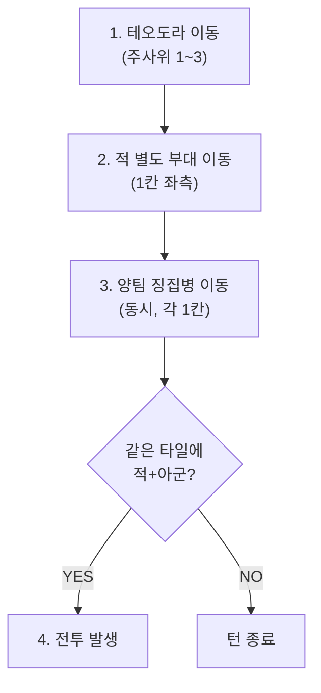

> **⛔ 폐기 (2026-02-26):** 이동 시스템 삭제. 중앙 카드 덱 기반 스테이지 진행으로 대체. 이동이 담당하던 변수(배분, 우선순위, 조우, 시간)를 카드 덱이 흡수.
>
> **아카이브 사유:** 이동 주사위, 그리드 이동, 턴 순서 등 설계 레퍼런스로 보존.

# STAGE-MAP: 맵 / 이동 (Map & Movement)

> **상태:** 🔄 설계중 · **버전:** 0.1 · **ID:** STAGE-MAP · **수정일:** 2026-02-25

---

## ① 한 줄 요약

n×m 직사각형 그리드. 테오도라 대는 이동 주사위(1~3)로 기동하고, 징집병과 적은 매 턴 1칸씩 자동 전진. 이동 주사위의 불확실성이 전략적 이동 판단을 만든다.

---

## ② 규칙 정의

### 맵 구조

| 필드 | 내용 |
|------|------|
| **형태** | n×m 직사각형 그리드 |
| **진영** | 좌측 = 아군, 우측 = 적 |
| **패배 조건** | 적이 좌측 끝 타일 도달 시 |
| **승리 조건** | 적 웨이브 전부 소진 시 |
| **크기** | 미정. 4×4 시뮬에서 실패 → 6×4 이상 필요 |

### 이동

| 유닛 | 이동 방식 |
|------|----------|
| 테오도라 대 | 이동 주사위 (1,1,2,2,3,3). 평균 2, 범위 1~3 |
| 아군 징집병 | 매 턴 1칸. 우측으로 |
| 적 징집병 | 매 턴 1칸. 좌측으로 |
| 적 별도 부대 | 매 턴 1칸. 좌측으로 |

### 이동 규칙

| 필드 | 내용 |
|------|------|
| **방향** | 상하좌우만. 대각선 불가. 꺾기 가능 |
| **분리** | 테오도라 대는 분리 불가. 3명(테오도라+앰버+부대) 한 유닛 |
| **산** | 이동 불가 |

### 턴 순서

| # | 행동 |
|---|------|
| 1 | 테오도라 대 이동 (주사위) |
| 2 | 적 별도 부대 이동 (1칸) |
| 3 | 양팀 징집병 이동 (동시, 각 1칸) |
| 4 | 같은 타일에 있으면 전투 |

---

## ③ 시각 자료

### 이동 주사위 분포

```
면: [1] [1] [2] [2] [3] [3]
확률: 1칸 33% | 2칸 33% | 3칸 33%
평균: 2칸
```

### 턴 순서 흐름



---

## ④~⑤

> TC 미작성.

---

## ⑥ 설계 근거

**Q. 왜 이동도 주사위인가?**
확정 이동이면 최적 경로가 하나로 수렴. 주사위면 "1 나오면 어쩌지?"를 항상 고민해야 한다. 행군 카드가 이 불확실성을 줄이는 보험.

**Q. 4×4가 왜 실패했는가?**
시뮬 결과 징집병이 턴 3에 충돌, 테오도라가 커버할 수 없었음. 6×4 이상이면 충돌 전 2~3턴의 판단 여유 확보.

---

## ⑦ 의존성

| 방향 | ID | 이름 | 관계 |
|------|----|------|------|
| → AFFECTS | COMBAT-JUDGE-001 | 전투 진입 | 같은 타일 시 전투 |
| → AFFECTS | COMBAT-ACT-003 | 작전 카드 | 행군 카드가 이동에 적용 |
| → AFFECTS | STAGE-TERRAIN | 지형 | 산 이동 불가 |

---

## ⑧ 변경 이력

| 버전 | 날짜 | 변경 내용 | 사유 |
|------|------|-----------|------|
| 0.1 | 2026-02-25 | COMBAT_SYSTEM 정본에서 이관. | 위키 구축 |
