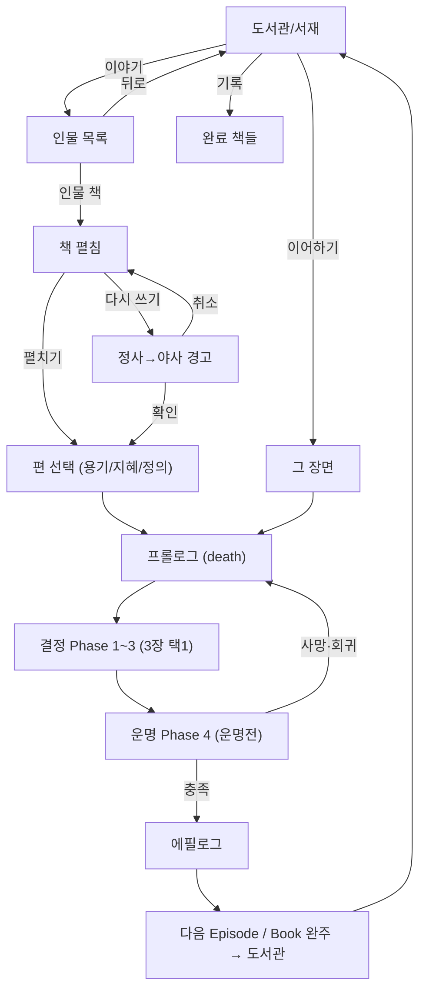

# UI·UX

> UI·UX 단일 정본 — 도서관·책 펼침·게임 진입·Episode 플레이 화면.
> 진행 구조(6층·Phase) = `specs/structure.md` / 플레이 작동 = `design/core_loop.md` / 판정·카드 = `specs/dice.md`·`specs/cards.md`. 여기선 화면·동선만 쥔다.

## 도서관 (게임 진입)

```yaml
공간: 어둑한 도서관/서재
중심: 책상 + 활성 책 (디폴트 = 미궁의 테오도라)
진척도 시각화: 어둠/램프 (화로의 온기)
UI 참고: Knight of the Full Moon

요소:
  책상:    활성 책 (진행 중이면 이어하기 / 없으면 처음)
  책꽂이:  해금된 책 = 밝게 / 미해금 = 어둠 속 실루엣(자물쇠) 힌트
  램프:    진척도 (Character 누적마다 +1 — 별자리로 밝아짐)
```

## 동선

```yaml
도서관 → 활성 책:
  진행 중 O → 이어하기 → 그 장면(프롤로그부터)
  진행 중 X → 처음     → 편 선택 → 프롤로그
도서관 → 책꽂이 → 인물 책 → 책 펼침
도서관 → 기록 → 완료한 책 열람
```

## 책 펼침

```yaml
좌측: 인물 본문 (배경·결·서사)
우측: 인물 카드 (얼굴 + 부제)
메뉴:
  - [펼치기] → 편 선택
  - [다시 쓰기] (완료한 책만)
  - 뒤로
```

## 편 선택 (첫 진입만)

```yaml
# 덱빌딩 없음. 편(Book)을 고르고 시작 결을 확인한 뒤 곧장 프롤로그로.
화면: 한 인물의 세 편을 나란히 (structure §인물·덕목)
  용기 = 전사 / 지혜 = 사냥꾼 / 정의 = 사제
  각 편: 시작 능력치(힘·민첩·지혜·행운·건강 — dice §시작값), 주 능력치 강조
선택 → 그 편의 프롤로그로 직행.
# 이어하기는 편이 이미 정해져 있어 이 화면을 건너뛴다.
```

## Episode 플레이 화면 (핵심)

```yaml
# 한 Episode = 프롤로그 → 결정 Phase 1~3 → 운명 Phase 4. 작동 정본 = core_loop.
상단 캐릭터 바 (상시): 인물·편 / 능력치 / 건강 / 주사위 예산 / 보급품 / 동료

프롤로그:        그 장면의 죽음(death)을 보여준다 — 선택 X (cards §death · structure §죽음 모델).
                 최초 = 원형 / 재진입 = 직전에 죽은 모습.
결정 Phase 1~3:  각 Phase 카드 3장 중 1택. 변동형 = 주사위 걸고 굴림 / 확정형 = 안전 (dice §베팅).
                 고른 카드는 도감에 수집된다 (core_loop §수집).
  # Situation과 Phase의 정확한 대응은 미정.
  #   Decision 선택 장면에서는 Situation을 먼저 제시한 뒤 Decision을 제시한다 (등장 순서만).
운명 Phase 4:    운명전 — 3갈래(episode)/전체(chapter) 택1 굴림 (dice §운명전).
  충족       → death가 생존으로 flip → 도감 수집 → 에필로그 → 다음 Episode
  미달·소진  → 사망 → 회귀 (그 장면 프롤로그로, death 교체)
에필로그:        운명전 클리어 후 그 장면을 닫는 서술 — 굴림 X.

정보 공개: 카드 정보는 판에 상시 공개 (운명전 require 내역만 가림 — dice §운명전).
```

## 도감 (수집)

```yaml
# 로직 정본 = core_loop §수집. 여기선 화면.
접근: 도서관 → 기록 (완료·진행 중인 책 열람).
구조: Book = 9 Episode(장면) 갤러리 → 각 장면 = 10칸 (결정 9 + death 1).

장면 상세:
  death 칸:      프롤로그 죽음 → 운명전 생존 시 생존 flip (특별한 칸, 골드).
  Phase 1~3:     각 3칸 = 결정 카드.
  노출된 카드:   이름·type 보임 / 세부(성공·실패·확정형 보상)는 골라 경험해야.
  미경험 갈래:   🔒 결과 ? (노출은 됐으나 세부 가림).
  진척:          세부 채움 X / 10.
완성: 그 장면 10칸 세부를 다 채우면 페이지 완성 → Book·Character 누적 (core_loop §수집).
```

## 시각

```yaml
초기:        테오도라 1명 (책 표지에 "사생아")
첫 별 클리어: 테오도라 → 영웅 (책 표지 변경 + 별자리 등장)
시리즈 누적: 별자리 모음 = 밤하늘 (배경 어둠 점차 풀림)
```

## 다시 쓰기

```yaml
조건: 완료한 책(Character) 재플레이
문구: "현재의 정사가 야사로 내려갑니다. 계속하시겠습니까?"
확인: 편 선택
취소: 인물 페이지 복귀
```

## 인물 목록 시각

```yaml
형식:    책 표지 + 인물 이름 (옆)
부제:    책 표지에 표기 (예: 테오도라 "사생아")
미해금:  어둠 속 실루엣(자물쇠) 힌트
초기:    테오도라 1명
헤더:    없음 (책상 자체가 진입점)
```

## Mermaid 흐름


