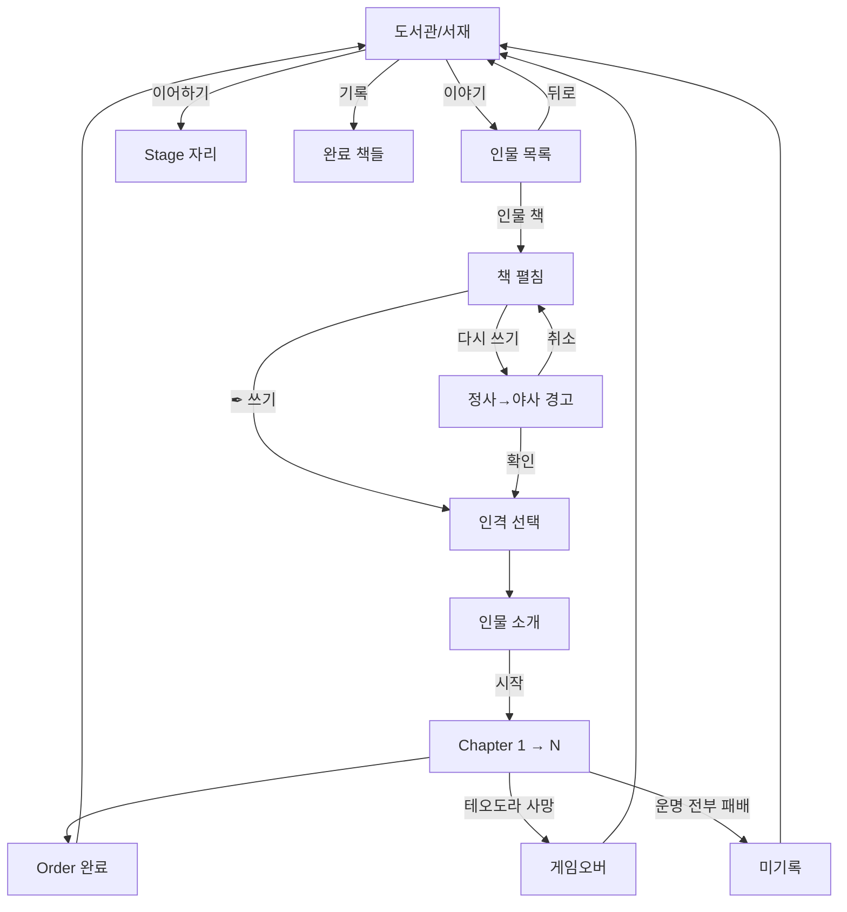

# UI·UX 결

> 도서관·책 펼침·게임 진입 결. specs/structure.md의 진행과 정합.

## 도서관 (게임 진입 자리)

```yaml
공간: 어둑한 도서관/서재
중심: 책상 + 활성 책 (디폴트 = 테오도라)
진척도 시각화: 어둠/램프 결
UI 참고: Knight of the Full Moon

요소:
  책상:    활성 책 (현재 진행 또는 디폴트)
  책꽂이:  인물 목록 (해금된 책들)
  미해금:  어둠에 묻힘 (표시 X)
  램프:    진척도 자리 (Order 누적마다 +1)
```

## 동선

```yaml
도서관 → 활성 책 (이어하기) → Stage 자리
도서관 → 책꽂이 → 인물 책 클릭 → 책 펼침 → 인격 선택 → 시작
도서관 → 기록 → 완료 책들 열람
```

## 책 펼침

```yaml
좌측: 인물 본문 (배경·결·서사)
우측: 인물 카드 (얼굴 + 부제)
메뉴:
  - Order 선택 + 인격 선택
  - [✒ 쓰기] / [다시 쓰기]
  - 뒤로
```

## 시각

```yaml
초기:        테오도라 1명 (책 표지에 "사생아")
첫 별 클리어: 테오도라 → 영웅 (책 표지 변경 + 별자리 박힘)
시리즈 누적: 별자리 모음 = 밤하늘 (배경 어둠 점차 풀림)
```

## 다시 쓰기

```yaml
조건: 완료 Order 재플레이
문구: "현재의 정사가 야사로 내려갑니다. 계속하시겠습니까?"
확인: 인격 선택 → 인물 소개
취소: 인물 페이지 복귀
```

## 인물 목록 시각

```yaml
형식:    책 표지 + 인물 이름 (옆)
부제:    책 표지에 박힘 (예: 테오도라 "사생아")
미해금:  표시 X (책꽂이도 어둠)
초기:    테오도라 1명
헤더:    없음 (책상 자리 자체가 자리)
```

## Mermaid 흐름



## 전투 화면 정보 결

```yaml
적 유닛 모형 위:
  공개:
    - 위계 아이콘 (인간/영웅/무리/재앙)
    - 시간대 아이콘
    - hp 바
    - 보호막 개수
    - 방어도 수치
    - 직업 아이콘
  비공개:
    - 등급 (가호 수로 유추)
    - 공격력
    - 가호 상세

아군:
  - hp + 보호막 + 방어도 (정확한 숫자)
```
