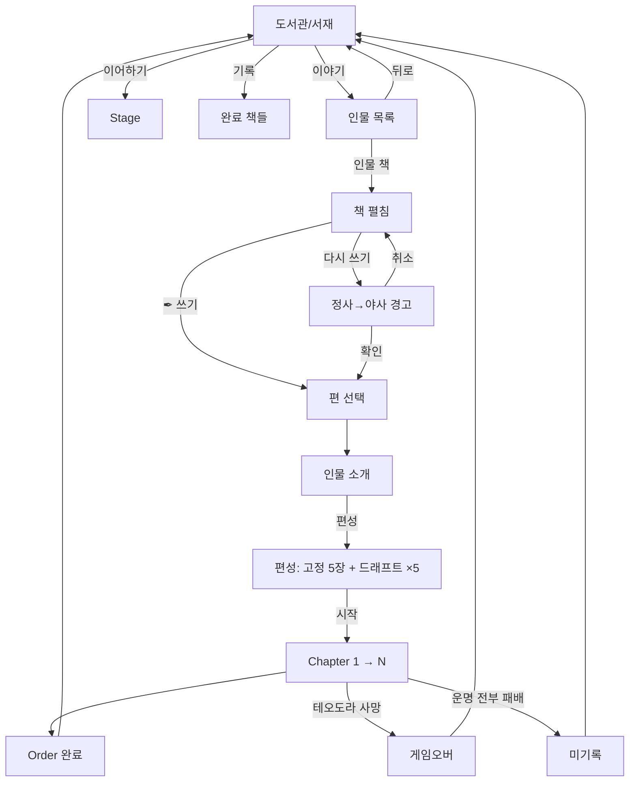

# UI·UX

> 도서관·책 펼침·게임 진입. specs/structure.md의 진행과 정합.

## 도서관 (게임 진입)

```yaml
공간: 어둑한 도서관/서재
중심: 책상 + 활성 책 (디폴트 = 테오도라)
진척도 시각화: 어둠/램프
UI 참고: Knight of the Full Moon

요소:
  책상:    활성 책 (현재 진행 또는 디폴트)
  책꽂이:  인물 목록 (해금된 책들)
  미해금:  어둠에 묻힘 (표시 X)
  램프:    진척도 (Order 누적마다 +1)
```

## 동선

```yaml
도서관 → 활성 책 (이어하기) → Stage
도서관 → 책꽂이 → 인물 책 클릭 → 책 펼침 → 편 선택 → 편성 → Stage1
도서관 → 기록 → 완료 책들 열람
```

## 책 펼침

```yaml
좌측: 인물 본문 (배경·결·서사)
우측: 인물 카드 (얼굴 + 부제)
메뉴:
  - Order 선택 + 편 선택
  - [✒ 쓰기] / [다시 쓰기]
  - 뒤로
```

## 편성 (드래프트)

```yaml
진입: 편 선택 → 인물 소개 후

화면: 고정 5장 + 드래프트를 한 화면에 (덱 단일 표시 — 고정/드래프트 칸막이 X)
  - 고정 5장: 펼쳐진 상태로 노출 (전 오더 공통, 직업별 동일)
  - 의지 커브: 현재 덱의 코스트 분포 그래프 표시
  - 카드 효과·능력치: 카드마다 읽히게 (효과 텍스트·공방체)

드래프트 (하스스톤 동일 UI):
  3장 제시 → 1택, ×5 연속 (최초 = 스킵 불가)
  → 고정 5 + 드래프트 5 = 시작 덱 10장 (한 덱으로 누적 표시)

완료 → Stage1 Phase1
(드래프트 규칙·등급·풀은 specs/structure.md "드래프트 & 강화" SSOT)
```

## 시각

```yaml
초기:        테오도라 1명 (책 표지에 "사생아")
첫 별 클리어: 테오도라 → 영웅 (책 표지 변경 + 별자리 등장)
시리즈 누적: 별자리 모음 = 밤하늘 (배경 어둠 점차 풀림)
```

## 다시 쓰기

```yaml
조건: 완료 Order 재플레이
문구: "현재의 정사가 야사로 내려갑니다. 계속하시겠습니까?"
확인: 편 선택 → 인물 소개
취소: 인물 페이지 복귀
```

## 인물 목록 시각

```yaml
형식:    책 표지 + 인물 이름 (옆)
부제:    책 표지에 표기 (예: 테오도라 "사생아")
미해금:  표시 X (책꽂이도 어둠)
초기:    테오도라 1명
헤더:    없음 (책상 자체가 진입점)
```

## Mermaid 흐름



## 전투 화면 정보

```yaml
적 유닛: 시야 안 = 카드 정보 전부 공개 (능력치·등급·효과·키워드, 대적자는 직업도)
         시야 밖 = 안개 (정보 X) / 잔여 시야 = 실루엣
아군:   항상 정확한 숫자 전부 (hp·보호막·방어도)

(자세한 결은 specs/structure.md "## 정보 공개" SSOT)
```
