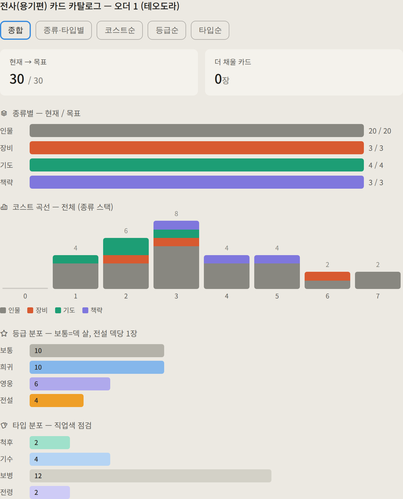
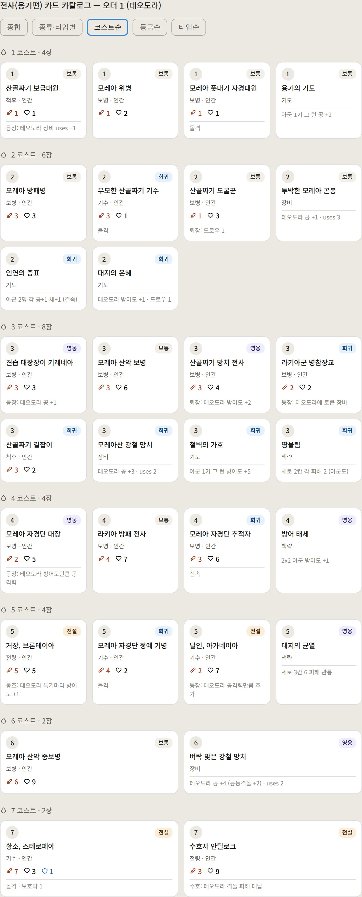
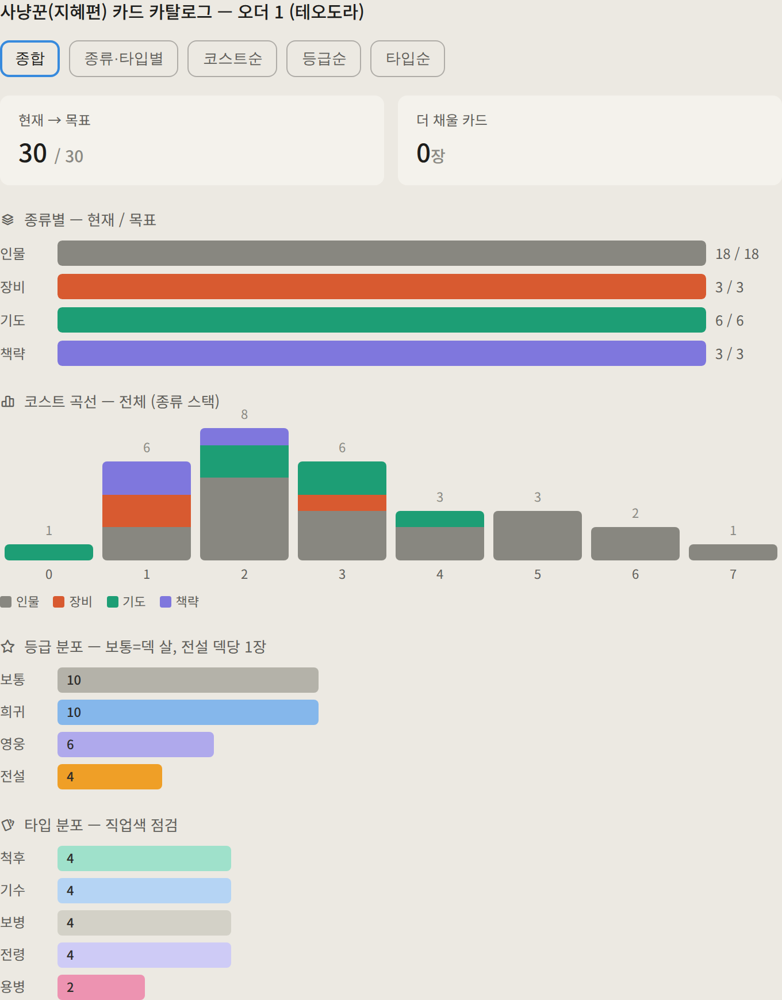
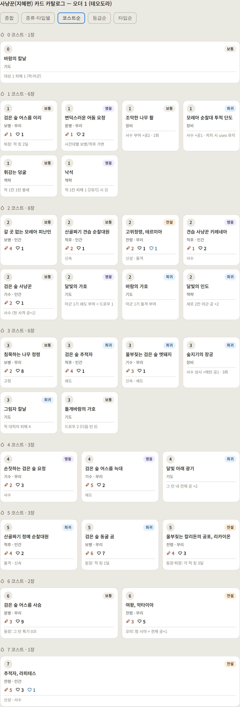

# 카드 뷰어 (Card Viewer) — 펼침 스냅샷

> 카드 펼침 **규약 정본 = design/card_catalog_view.md** (분류·색·셀·필드·템플릿).
> 이 폴더 = 그 규약대로 렌더한 직업별 카탈로그 스냅샷(PNG) 보관소.
> ※ 스냅샷이다 — content 카드 yaml이 정본. 카드 변경 시 해당 PNG 재생성해야 최신.
>   인터랙티브(정렬 토글)로 보려면 claude.ai에서 "카드 펼쳐줘".

## 전사 (용기편) — 30장 (인물20·장비3·기도4·권능3)

### 종합

### 코스트순

## 사냥꾼 (지혜편) — 30장 (인물18·기도6·장비3·권능3)

### 종합

### 코스트순

## 늘리기

규약대로 직업별 PNG 추가 (사제·예언자·군주 등). 일감 = BACKLOG. 카드 변경 시 해당 직업 PNG 재생성.
